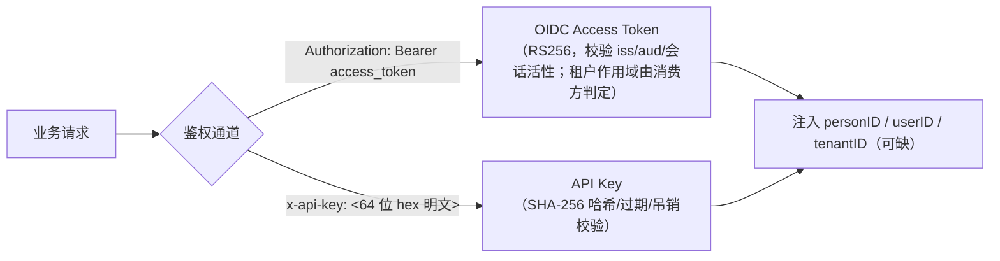

# API 参考（API Reference）

> 本文给出 Ark IAM 的 API 总览：**初始化引导端点**（`/install/*`）、**OIDC 协议端点**（`/oidc/*`）、**认证端点**（`/v1/auth/*`）、**平台管理端点**（`/v1/platform/*`）、**租户自服务端点**（`/v1/tenant/*`）、**应用目录端点**（`/v1/rp/directory/*`），以及认证方式、通用响应信封、路由规范摘要。
>
> 开发环境 Swagger（redoc）：`http://localhost:{port}/{appName}/redocs`（如 `http://localhost:8081/auth/redocs`）。

---

## 目录

1. [通用约定](#1-通用约定)
2. [认证与鉴权方式](#2-认证与鉴权方式)
3. [OIDC 协议端点](#3-oidc-协议端点oidc)
4. [认证端点（/v1/auth/*）](#4-认证端点v1auth)
5. [平台管理端点（/v1/platform/*）](#5-平台管理端点v1platform)
6. [租户自服务端点（/v1/tenant/*）](#6-租户自服务端点v1tenant)
7. [路由规范摘要](#7-路由规范摘要)
8. [应用目录端点（/v1/rp/directory/*）](#8-应用目录端点v1rpdirectory)
9. [初始化引导端点（/install/*）](#9-初始化引导端点install)

---

## 1. 通用约定

### 1.1 服务标识与端口

| 应用 | 服务标识 | 独立端口 | gateway 聚合端口 |
|---|---|---|---|
| auth | `auth` | 8081 | 8100 |
| platformadmin | `platform` | 8082 | 8100 |
| tenantadmin | `tenant` | 8083 | 8100 |
| rpapi | `rp` | 8084 | 8100 |

> `rpapi` 是面向**外部应用（RP）**的只读目录服务（`/v1/rp/directory/*`），独立进程 :8084；gateway 单体部署时按 `rp` 前缀挂到 :8100（见 §8）。

### 1.2 响应信封

所有业务接口统一返回 `{code, requestID, msg, data}`：

```json
{
  "code": 0,
  "requestID": "a1b2c3d4e5f6",
  "msg": "success",
  "data": {}
}
```

- `code=0` 表示成功；非 0 为业务错误码（`pkg/code` 统一维护）；
- **业务错误仍以 HTTP 200 返回**（`gincontext.Fail/Abort`），调用方必须以 `code` 判定成败，不能依赖 HTTP 状态码；
- `requestID` 为链路追踪 ID，便于按请求排查日志；
- 仅鉴权中间件短路时返回 HTTP 401：`{"code": 401, "msg": "invalid token"}`；
- **例外：`/install/*` 的失败响应使用真实 HTTP 状态码**（`gincontext.FailWithStatus` 按 `InstallErrorHTTPStatus` 映射，如已初始化 409 / 令牌不匹配 401 / 未配置令牌 503），成功仍是标准信封；未初始化时业务端点还会被守卫短路成 HTTP 409（`107004`）。详见 §9；
- **例外：`/v1/rp/directory/*` 成功响应返回裸 DTO，不套本信封**（原因见 §8.3）。

### 1.3 路径参数命名

路径参数一律 `{xxxID}` 全大写（`{userID}`、`{roleID}`、`{appID}`、`{connectorID}`…），与 DTO JSON tag 及 Swagger 注解同步；**path 是 ID 的唯一来源**，不可被 body/query 覆盖。

### 1.4 列表时间字段

所有前后端交互的时间字段统一为**秒级 int64 Unix 时间戳**；列表项出参统一回传 `createdAt`/`updatedAt`：

- 记录可被编辑/状态流转的业务主体（租户、应用、OAuth 客户端、域名、租户应用、菜单、角色、成员、服务账号、部门、API Key）**两者都回传**，前端列表对应展示「创建时间」「更新时间」两列；
- 纯追加型 / 不可变记录（审计日志、登录日志、OAuth Secret、第三方身份绑定）的 `updatedAt` 恒等于 `createdAt`，仅作字段兼容回传，前端不展示「更新时间」列；
- 出参可空时间用指针 `*int64`（无值返回 `null`），入参可空时间用 `int64`（无值传 `0`）。

---

## 2. 认证与鉴权方式



| 通道 | 使用方 | 说明 |
|---|---|---|
| `Authorization: Bearer <access_token>` | 登录用户（前端）/ M2M 应用 | OIDC JWT，`sub=person:<id>`，私有声明 `tenant_id`/`user_id`/`person_id`/`sid`/`client_id`/`token_usage`/`scope`/`act`（口径见 §2.1） |
| `x-api-key: <64 位 hex 明文>` | 机器/服务 | 明文为 32 字节随机数的 64 位小写 hex，**无 `ak_` 之类前缀**；列表展示用 `keyPrefix`（前 7 位）。也可放进 `Authorization: Bearer`，与 `x-api-key` 二选一，任一通过即可 |

免鉴权路径（跳过业务鉴权中间件）：`/v1/auth/connectors/callback`（Connector 回调）。**全部 `/oidc/*` 端点直接挂在 engine 上、不经业务鉴权**（鉴权中间件只作用于 `/v1/*`），由协议自身校验（token 端点校验 client 凭据，bc-logout 校验 `logout_token` JWT）。**`/install/*` 同样不经业务鉴权**：`GET /install/status` 公开只读，`POST /install/initialize` 只认请求头 `X-Bootstrap-Token`（与环境变量 `BOOTSTRAP_TOKEN` 比对，见 §9）。
> 说明：`/v1/auth/register` 端点已下线，自助注册收口到 `/oidc/registerPerson` + `/oidc/createTenant`（见 §3.2）。

### 2.1 Access Token 私有声明

声明契约的**双端单一事实源**是 `backend/sdk/contract`（签发侧 OP 与校验侧 RP 共享同一份定义），字段口径如下：

| 声明 | 含义 |
|---|---|
| `sub` | 人令牌为 `person:<personID>`；机器凭证令牌（`token_usage=machine`）的 `sub` 不是自然人 |
| `user_id` | **审计操作者的唯一口径**。人令牌 = `tenant_user.id`（与 IAM 自身 `created_by`/`updated_by` 同口径）；API Key / client_credentials 机器令牌 = 机器主体（`api_key.owner_user_id`），创建者另在 `act.sub` |
| `person_id` | 自然人 ID（与 `sub` 的 `person:` 前缀同源，便于下游无库访问识别主体） |
| `sid` | SSO 中心会话标识，用于按会话作废与 back-channel 登出匹配 |
| `tenant_id` | 租户作用域。**不是令牌有效性条件**：签发侧在「自然人 → 租户映射不唯一」时**不写**该 claim，验签照常通过、身份里的租户为空。需要租户的接口必须自行判定并返回 **403**，不得让 `dbclient.ErrTenantScopeMissing` 冒成 500 |
| `client_id` | 令牌所属客户端 |
| `token_usage` | `machine` 表示机器凭证（API Key / client_credentials）；缺省为自然人令牌 |
| `scope` | 标准 OAuth scope（空格分隔，RFC 6749 §3.3）；目录 API 等 M2M 权限据此判定 |
| `act` | 代操作声明，wire 形态 `{"act":{"sub":"<tenant_user.id>"}}`（机器凭证代表某人操作时承载原操作者） |

---

## 3. OIDC 协议端点（/oidc/*）

> 部署于 auth 应用（:8081）与 gateway（:8100）。issuer 随部署形态切换：auth 独立部署为 `http://localhost:8081/oidc`，gateway 聚合部署为 `http://localhost:8100/oidc`。
>
> 下表路径均相对 `/oidc`（即 `/.well-known/openid-configuration` 的完整路径是 `/oidc/.well-known/openid-configuration`）。
>
> 同为 R3 专用前缀的 `/install/*`（系统首次引导）**不属于 OIDC 协议**，单独见 §9。

### 3.1 标准端点（zitadel/oidc 提供）

| 端点 | 方法 | 说明 |
|---|---|---|
| `/.well-known/openid-configuration` | GET | 服务发现元数据 |
| `/authorize` | GET | 认证与授权端点（返回授权码）；按 OIDC Core §3.1.2.1 **仅 GET**，POST 会 404 |
| `/authorize/callback` | GET/POST | 授权回调 |
| `/oauth/token` | POST | 令牌端点（授权码/刷新/客户端凭证） |
| `/oauth/introspect` | POST | Access Token 检查（RFC 7662） |
| `/userinfo` | GET | 用户信息（按 scope 裁剪） |
| `/revoke` | POST | 吊销 Refresh Token |
| `/end_session` | GET/POST | RP-Initiated Logout |
| `/keys` | GET | JWKS 公钥集 |
| `/healthz`、`/ready` | GET | 健康检查 |

> `/authorize/callback`、`/oauth/token`、`/oauth/introspect`、`/userinfo`、`/revoke`、`/end_session`、`/keys`、`/healthz`、`/ready` 在实现中注册为 `Any`（接受任意方法），上表列的是协议约定方法。

### 3.2 本系统扩展端点（OIDC 规范外，用于登录 UI 与 SSO）

| 端点 | 方法 | 说明 |
|---|---|---|
| `/oidc/login` | POST | 登录页提交凭证（identifier + password + authRequestID） |
| `/oidc/login/selectTenant` | POST | 多租户用户选择租户（authRequestID + tenantID）；SSO 会话在此步建立 |
| `/oidc/login-config` | POST | 登录页前置策略查询（authRequestID）：返回该应用是否允许自助注册 / 自助建租户 |
| `/oidc/registerPerson` | POST | **自助注册自然人**（用户名/邮箱/手机号、密码、姓名）：person find-or-create，返回 `personID` |
| `/oidc/createTenant` | POST | **自助开通租户**（租户名）：按 `application.allow_person_create_tenant`（枚举 `enable`/`disable`，NULL≡`disable`）门禁，事务创建租户 + 根部门 + 内置管理员，返回 `{tenantID, personID}` |
| `/oidc/login/changePassword` | POST | **首次登录强制改密**（authRequestID + currentPassword + newPassword）：`/oidc/login` 对持临时密码的账号返回 `requiresPasswordChange=true` 且不完成授权，改密成功后需重新登录（会话已全局撤销） |
| `/oidc/sso-login` | GET | SSO 免密续登（携带 `iam_sso_session` Cookie，`?authRequestID=`） |
| `/oidc/logged-out` | GET | 登出落地页（清除 SSO Cookie 后跳前端登录页） |
| `/bc-logout/platform`、`/bc-logout/tenant` | POST | **反向通道登出接收端**（RP 侧接收端，实现在 `pkg/oidckit`）：仅 platformadmin 挂 `/oidc/bc-logout/platform`、tenantadmin 挂 `/oidc/bc-logout/tenant`，**auth 不挂载**；gateway 聚合时两者都在 `:8100` |
| `/bc-logout/platform/recent`、`/bc-logout/tenant/recent` | GET | 最近接收记录（调试 / e2e 断言用） |

### 3.3 令牌端点示例

内置客户端 `platform_admin_web` / `tenant_admin_web` 是 **public + PKCE**（`token_endpoint_auth_method=none`），不带 client secret，请求里用 `client_id` 标识：

```bash
# 授权码换令牌（public client + PKCE）
curl -X POST http://localhost:8081/oidc/oauth/token \
  -d "grant_type=authorization_code&client_id=platform_admin_web&code=xxx" \
  -d "redirect_uri=http://localhost:4001/auth/callback&code_verifier=xxx"

# 刷新令牌
curl -X POST http://localhost:8081/oidc/oauth/token \
  -d "grant_type=refresh_token&client_id=platform_admin_web&refresh_token=xxx"
```

自建的 confidential 客户端（`token_endpoint_auth_method=client_secret_basic`）才用 HTTP Basic：`-u "<client_id>:<client_secret>"`。

---

## 4. 认证端点（/v1/auth/*）

> 前缀 `auth`：`/v1/auth/...`。除标注外均需 Bearer 令牌。

### 4.1 当前用户

| 方法 | 路径 | 说明 |
|---|---|---|
| GET | `/v1/auth/me` | 当前自然人详情 |
| POST | `/v1/auth/me/changePassword` | 修改密码 |
| GET | `/v1/auth/me/tenants` | 我的租户列表 |
| GET | `/v1/auth/me/sessions` | 我的会话列表 |
| DELETE | `/v1/auth/me/sessions` | 撤销全部会话 |
| DELETE | `/v1/auth/me/sessions/{sessionID}` | 撤销指定会话 |

### 4.2 认证操作

| 方法 | 路径 | 说明 |
|---|---|---|
| POST | `/v1/auth/joinTenant` | 凭邀请码加入已有租户（通道 B）。门禁：① 应用级 `application.allow_join_by_invite`（枚举 `enable`/`disable`，NULL≡`disable`）——按 access token 的 `client_id` 解析应用后判定，解析不出应用或未配置一律拒绝（fail-closed）；② 邀请本身有效、未过期、未使用。入参只有 `inviteCode`，**不接受 `tenantID`**（落哪个租户由邀请码决定） |
| POST | `/v1/auth/logout` | 登出（撤销全部 Refresh Token + SSO 会话 + 触发 SLO） |
| POST | `/v1/auth/logoutAll` | 全端登出（同 logout） |
| GET | `/v1/auth/userinfo` | 当前用户信息（personInfo + userInfo） |

### 4.3 Connector（外部身份源）

| 方法 | 路径 | 说明 |
|---|---|---|
| POST | `/v1/auth/connectors` | 创建连接器 |
| GET | `/v1/auth/connectors` | 连接器分页列表 |
| GET | `/v1/auth/connector-factories` | 连接器工厂列表（支持的协议/提供商） |
| GET | `/v1/auth/connectors/{connectorID}` | 连接器详情 |
| PUT | `/v1/auth/connectors/{connectorID}` | 更新连接器 |
| DELETE | `/v1/auth/connectors/{connectorID}` | 删除连接器 |
| POST | `/v1/auth/connectors/{connectorID}/test` | 测试连接器 |
| POST | `/v1/auth/connectors/{connectorID}/authorize` | 发起连接器授权 |
| GET | `/v1/auth/connectors/callback` | 连接器回调（免鉴权） |

---

## 5. 平台管理端点（/v1/platform/*）

> 前缀 `platform`：`/v1/platform/...`。全部需 Bearer 令牌（平台管理员）。

### 5.1 用户与身份

> **平台端不提供用户接口**：用户按租户归属，列表/详情/挂起恢复/重置密码/第三方身份/登录日志全部在 `/v1/tenant/users/*`（见 §6）。
> 平台端只保留租户级"监督/干预"能力：租户状态（挂起/恢复）见 §5.3。

### 5.2 角色与权限

> **平台端不提供角色接口**：角色按租户归属，CRUD 与授权（成员/菜单）全部在 `/v1/tenant/roles/*`（见 §6）。
> 原 `GET /v1/platform/roles/{roleID}/users` 缺少租户校验、返回跨租户成员，已随平台角色路由一并删除。
> 平台端保留平台级权限字典**菜单**：

| 方法 | 路径 | 说明 |
|---|---|---|
| POST | `/v1/platform/menus` | 创建菜单 |
| GET | `/v1/platform/menus` | 菜单分页 |
| GET | `/v1/platform/menus/my` | 当前用户可见菜单树（控制台侧边栏） |
| GET | `/v1/platform/menus/tree` | 菜单树 |
| GET/PUT/DELETE | `/v1/platform/menus/{menuID}` | 菜单详情/更新/删除（**删除级联整棵子树**并在同事务内解绑 `role_menu`；控制台可增删任意应用的菜单，含内置应用——删除是软删，等价于"人工下线"。首次引导只在库未初始化时按 `seed_key` 创建、之后永久自锁，因此删除后不会有任何东西把它建回来，见 `system-design.md` §4.5） |

> 权限点 / 资源字典（`/v1/platform/scopes`、`/v1/platform/resources`）随资源级授权一并下线（见 `system-design.md` §4.3），平台端不提供接口。

### 5.3 租户与部门

| 方法 | 路径 | 说明 |
|---|---|---|
| POST | `/v1/platform/tenants` | 创建租户（**必带 `admin`**：同事务建根部门 + 内置管理员 user + 租户管理员角色授权；响应 `adminInitialPassword` 为一次性临时密码） |
| GET | `/v1/platform/tenants` | 租户分页 |
| GET/PUT/DELETE | `/v1/platform/tenants/{tenantID}` | 租户详情/更新/删除（**平台自运营租户 `t_platform` 禁删**，删除报 `100212`：它是平台控制台自身所在租户，删除即整栈失联且无恢复路径；判定按首次引导写入的固定编码 `t_platform`（`model.SeedPlatformTenantCode`）而非 `type`——控制台可建 `type=platform` 的普通租户） |
| POST | `/v1/platform/tenants/{tenantID}/builtin-admin/reset-password` | 重置租户内置管理员密码（仅 `source=builtin`，即建租户时由平台创建的管理员；返回一次性临时密码并撤销其会话） |
| POST | `/v1/platform/tenant-applications` | 开通租户-应用（**必带 `tenantID`** 指定归属租户；同租户同应用重复订阅报 `100747`，租户不存在报 `100205`，应用不存在报 `100735`） |
| GET | `/v1/platform/tenant-applications` | 租户应用分页（`tenantID` 按归属租户筛选、留空＝全部租户；`status` 筛选状态；返回 `tenantName`/`appName`/`appSource` 便于回显与判定内置订阅） |
| GET/PUT/DELETE | `/v1/platform/tenant-applications/{tenantAppID}` | 详情/更新/删除（平台侧跨租户运维：归属租户来自 `tenantID`/资源本身，不校验 ctx 租户，与 `/v1/platform/tenants` 同一信任模型；订阅不存在报 `100745`；**订阅的是内置应用（`appSource=builtin`）时禁删报 `100756`**——首次引导与 `ProvisionTenantAdmin` 系统开通的订阅删除后对应控制台会失去菜单，下线请改 `status=disable`） |

> 租户编码 `code` 由服务端自动生成（规则 `t_<12 位随机 hex>`，如 `t_3f7a9c1d2e4b`，平台租户固定 `t_platform`），创建/更新入参无需传 `code`，创建后不可修改；列表支持 `GET /v1/platform/tenants?name=<关键词>&status=<active|suspended>`（`name` 按租户名模糊搜索，`status` 按状态精确筛选、留空不筛选、非法值报 `100209`），并返回 `createdAt`/`updatedAt`（秒级时间戳）。
>
> 租户状态 `status`（`active` 正常 / `suspended` 已挂起）：非法值/缺省归一为 `active`；`suspended` 会撤销该租户成员的 refresh token 与 SSO 会话，非 active 租户的成员无法登录、令牌不签发；`PUT /v1/platform/tenants/{tenantID}` 拒绝挂起操作者自己所在的租户（`100208`）；重置内置管理员密码失败报 `100210`。
>
> **建租户的管理员约定**（D2/D3/D6）：`admin` 必填且邮箱/手机至少一个（缺联系方式报 `100521`）；管理员在同事务内创建为 `tenant_user.source=builtin`、`owner_type=owner`，并绑定根部门与内置「租户管理员」角色（`source=builtin`、`admin_type=admin`，该角色随租户开通 `tenant-admin` 应用订阅；应用/菜单缺失会整体回滚并报 `100200`）。`adminInitialPassword` 只在**新建自然人**时非空——命中已存在自然人时沿用其原密码、不回显凭据（可改用重置内置管理员密码接口兜底）。该管理员首次登录强制改密：`/oidc/login` 返回 `requiresPasswordChange=true`，改完（`/oidc/login/changePassword`）须重新登录。详见 `system-design.md` §5.8。

### 5.4 应用与客户端（OIDC 配置）

| 方法 | 路径 | 说明 |
|---|---|---|
| POST | `/v1/platform/applications` | 创建应用（`code` 为下划线连接：小写字母开头，仅含小写字母/数字/下划线，如 `my_app`；非法编码报 `100748`。可选 `roleTemplate`：**应用角色模板** `[{code,name}]`，即本应用对外的跨系统授权契约值（下游策略名取值），开通本应用的租户会自动获得这些角色；`code` 形状非法/模板内重复/名称为空或超长/占用产品锚点编码报 `100765`） |
| GET | `/v1/platform/applications` | 应用分页 |
| GET/PUT/DELETE | `/v1/platform/applications/{appID}` | 应用详情/更新/删除（内置应用 `source=builtin` 禁删报 `100746`：平台管理后台 / 租户管理后台由平台版本交付；其编码不可改报 `100749`：控制台菜单入口按它定位，改名即失去侧边栏。自建应用可改编码，非法值报 `100748`。`roleTemplate` 传 `null` 不修改、传 `[]` 清空、传值全量替换（全量语义见下）；形状非法报 `100765`） |
| POST | `/v1/platform/application-clients` | 创建 OAuth 客户端 |
| GET | `/v1/platform/application-clients` | 客户端分页 |
| GET/PUT/DELETE | `/v1/platform/application-clients/{applicationClientID}` | 详情/更新/删除（内置客户端 `source=builtin` 禁删报 `100820`，其编码不可改报 `100823`：`client_id` 是网关 aud 白名单与前端构建期默认值的来源） |
| GET/POST | `/v1/platform/application-clients/{applicationClientID}/secrets` | 密钥列表/创建 |
| DELETE | `/v1/platform/application-clients/{applicationClientID}/secrets/{secretID}` | 删除密钥 |

> **`roleTemplate` 的全量语义（撤权操作）**：模板是应用契约角色的**单一事实源**，更新即全量替换——
> 新增的编码会在**所有已开通该应用的租户**里物化出新角色（`source=builtin`、`admin_type=normal`，租户侧只读）；
> 名称变化会同步回写；**从模板移除的编码会连同该角色在各租户的成员授权（`user_role`）与菜单授权（`role_menu`）
> 一并删除**，且不可从控制台恢复（只能重新加回模板并要求租户重新授权）——平台控制台提交前二次确认，
> 直接调 API 的一方需自行确认。若某租户存在同码的**自建**存量角色（历史数据），同步只告警跳过、不接管。
> 约束：≤64 项、`code` 形状同角色编码（`^[a-z][a-z0-9_]*$`）且模板内唯一、`name` 非空且 ≤128 字符、
> 不得使用产品锚点编码（`platform_admin`/`tenant_admin`），违反报 `100765`。

### 5.5 域名

> 平台端不提供 API Key 接口（原跨租户只读监督 `/v1/platform/api-keys/supervision` 已下线）；密钥的创建/吊销/删除等生命周期管理统一在租户自服务 `/v1/tenant/api-keys`。

| 方法 | 路径 | 说明 |
|---|---|---|
| POST | `/v1/platform/domains` | 创建域名 |
| GET | `/v1/platform/domains` | 域名分页 |
| GET/PUT/DELETE | `/v1/platform/domains/{domainID}` | 域名详情/更新/删除 |

### 5.6 日志（审计）

| 方法 | 路径 | 说明 |
|---|---|---|

---

## 6. 租户自服务端点（/v1/tenant/*）

> 前缀 `tenant`：`/v1/tenant/...`。全部需 Bearer 令牌（租户成员视角，tenant_id 取自令牌）。

| 方法 | 路径 | 说明 |
|---|---|---|
| GET | `/v1/tenant/users` | 租户**真实用户**（member）分页（?keyword= 姓名/用户名/邮箱/手机，?status=active/suspended 枚举筛选，含主部门/角色数） |
| POST | `/v1/tenant/users` | 创建租户真实用户（姓名/主部门 primaryDepartmentID/邮箱/手机；**不含密码**：服务端生成临时密码，响应 `initialPassword` 仅此一次返回；**姓名即自然人信息**：无匹配 person 则按姓名创建，命中 email/phone 复用——复用时密码不变、`initialPassword` 为空；部门归属同事务建立：primaryDepartmentID 单值主部门 + secondaryDepartmentIDs/leaderDepartmentIDs 可选） |
| GET | `/v1/tenant/users/{userID}` | 用户详情（基础信息 + 部门归属 + 角色） |
| PATCH | `/v1/tenant/users/{userID}` | 局部更新（姓名/头像/状态 + primaryDepartmentID 换主部门不可清空 + secondaryDepartmentIDs/leaderDepartmentIDs 全量替换，nil=不变） |
| POST | `/v1/tenant/users/{userID}/reset-password` | 重置密码（无入参，仅 `user_type=member`）：服务端生成临时密码写入关联 person，响应 `initialPassword` 仅此一次返回，并撤销该成员全部会话 |
| GET | `/v1/tenant/users/{userID}/roles` | 用户已分配角色（用户侧授权入口；服务账号走 `/machine-users`） |
| PUT | `/v1/tenant/users/{userID}/roles` | 全量替换用户角色 |
| GET | `/v1/tenant/users/{userID}/identities` | 用户已绑定的第三方身份列表（身份按 person 归属，借道"该 person 在本租户有 user"做可见性校验） |
| POST | `/v1/tenant/users/{userID}/identities` | 绑定第三方身份 {issuer, identityID, detail?}（租户取自登录上下文，不传 tenantID；同 issuer+identityID 全局唯一） |
| DELETE | `/v1/tenant/users/{userID}/identities/{identityID}` | 解绑第三方身份 |
| GET | `/v1/tenant/users/{userID}/login-logs` | 用户登录日志（只读，租户 + 用户双重过滤） |
| GET | `/v1/tenant/machine-users` | 服务账号分页（?name=&status=active/suspended 枚举筛选，含 primaryDepartmentID/primaryDepartmentName；服务账号=租户内机器主体 user_type=machine，不可登录/无自然人/不可任部门负责人，作为角色主体与 API Key 归属） |
| POST | `/v1/tenant/machine-users` | 创建服务账号 {name,description,primaryDepartmentID(主部门,单值,必传),secondaryDepartmentIDs?(参与部门)}（需系统管理能力 super） |
| GET | `/v1/tenant/machine-users/{machineUserID}` | 服务账号详情（部门归属 departments + 已授权角色） |
| PUT | `/v1/tenant/machine-users/{machineUserID}` | 更新服务账号（名称/描述 + primaryDepartmentID? 换主部门不可清空 + secondaryDepartmentIDs? 参与部门全量替换,nil=不变） |
| PATCH | `/v1/tenant/machine-users/{machineUserID}` | 挂起/启用（{status}：active/suspended，挂起后其密钥鉴权失效） |
| DELETE | `/v1/tenant/machine-users/{machineUserID}` | 删除服务账号（须先删除其全部 API Key；级联清理角色与部门关系） |
| GET | `/v1/tenant/machine-users/{machineUserID}/roles` | 服务账号已分配角色 |
| PUT | `/v1/tenant/machine-users/{machineUserID}/roles` | 全量替换服务账号角色（**禁止授予 admin_type=admin 的管理员类型角色**） |
| GET | `/v1/tenant/api-keys` | 服务账号密钥分页（?name=&machineUserID= 指定服务账号，空=租户全部；需 super；含归属 ownerType/ownerName） |
| POST | `/v1/tenant/api-keys` | 创建 API Key {name,machineUserID(必填:归属服务账号),expiredAt?}（需 super；明文仅此一次返回；个人密钥能力已下线） |
| POST | `/v1/tenant/api-keys/{apiKeyID}/revoke` | 吊销（需 super） |
| DELETE | `/v1/tenant/api-keys/{apiKeyID}` | 删除（需 super） |
| POST | `/v1/tenant/invites` | 生成租户加入邀请（返回邀请码，供通道 B 使用） |
| GET | `/v1/tenant/invites` | 邀请分页 |
| DELETE | `/v1/tenant/invites/{inviteID}` | 撤销邀请 |
| GET | `/v1/tenant/apps` | 租户订阅的启用应用列表（角色归属/菜单授权的应用选项，含系统内置应用） |
| POST | `/v1/tenant/roles` | 创建角色（**appID 必选**，角色从属于已订阅应用，名称应用内唯一；**请求体不含 `code`**——跨系统授权契约值只能由应用角色模板下发，自建角色编码恒为空串、不进入 OIDC `groups` 声明，见 `system-design.md` §5.4。重名报 `100700`） |
| GET | `/v1/tenant/roles` | 角色分页（?appID=&keyword=&unassigned=，含成员数/菜单数/所属应用名/编码；`keyword` 同时模糊匹配名称与编码；`unassigned=true` 只查未归属应用的系统角色，供角色授权下拉按名称服务端搜索） |
| GET | `/v1/tenant/roles/{roleID}` | 角色详情（含 `code`：模板角色/产品锚点非空，自建角色为空串） |
| PUT | `/v1/tenant/roles/{roleID}` | 更新角色（**仅自建角色，且只改名称/描述**：重名报 `100702`；请求体同样不含 `code`。**内置角色（应用角色模板物化 + 产品锚点）整体只读**，报 `100709`——其名称与编码均由应用方定义） |
| DELETE | `/v1/tenant/roles/{roleID}` | 删除角色（级联清理成员/菜单关联；**内置角色禁止删除**，报 `100706`） |
| GET | `/v1/tenant/roles/{roleID}/menus` | 角色菜单授权回显（**所属应用的菜单树** + 已授权ID，角色侧授权入口） |
| PUT | `/v1/tenant/roles/{roleID}/menus` | 全量替换角色菜单授权 |
| POST | `/v1/tenant/departments` | 创建部门节点 |
| GET | `/v1/tenant/departments/tree` | 部门树（全量，前端自行组树） |
| GET | `/v1/tenant/departments/{departmentID}/children` | 子节点分页（懒加载；含 each 节点 hasChildren） |
| PUT | `/v1/tenant/departments/{departmentID}` | 更新节点（改 parentID 即移动，含面包屑祖先链校验） |
| PATCH | `/v1/tenant/departments/{departmentID}` | 更新状态（启停用） |
| DELETE | `/v1/tenant/departments/{departmentID}` | 删除节点（有子/成员需 ?cascade=1） |
| GET | `/v1/tenant/departments/{departmentID}/users` | 节点成员分页（?relationType=&keyword=，含用户基础信息；relationType: primary/secondary/leader） |
| POST | `/v1/tenant/departments/{departmentID}/users` | 添加成员关系 {userID, relationType}（primary 每用户至多 1 行） |
| PUT | `/v1/tenant/departments/{departmentID}/users/{userID}` | 更新成员关系（relationType） |
| DELETE | `/v1/tenant/departments/{departmentID}/users/{userID}` | 移除成员关系 |
| GET | `/v1/tenant/menus/tree` | 租户动态菜单树 |

---

## 7. 路由规范摘要

规则化混合风格（REST 资源式为主 + 显式动作式补充），三条硬规则：

1. **R1 资源 CRUD → REST**：`/{版本}/{服务标识}/{资源}[/{id}[/{子资源}]]`；
2. **R2 业务动作 → 动作子路径**：`POST /资源/{id}/动作`（如 `/api-keys/{apiKeyID}/revoke`）；认证/会话类动作挂 `/v1/auth` 动作段（`joinTenant`/`logout`/`logoutAll`/`userinfo`；自助注册不在业务路由，收口在 `/oidc/registerPerson` + `/oidc/createTenant`）；
3. **R3 标准协议 → 专用前缀**：`/oidc/*`、back-channel logout、**初始化引导 `/install/*`**（自举入口，见 §9）不走业务路由规范。

| 规范 | 说明 |
|---|---|
| 资源命名 | 复数 + kebab-case（`application-clients`、`api-keys`），禁驼峰 |
| 方法语义 | GET 查询 / POST 创建与动作 / PUT 全量更新与批量授权 / PATCH 局部更新 / DELETE 删除 |
| 关联建模 | 从属资源用子资源（`/users/{userID}/identities`）；多对多用双端视角 + `PUT` 全量替换（`/users/{userID}/roles` ↔ `/roles/{roleID}/menus`） |
| 层级限制 | 集合层级 ≤ 3（路径段 ≤ 6） |
| 当前用户 | `/v1/auth/me`、`/v1/auth/me/tenants`、`/v1/auth/me/sessions` |

---

## 8. 应用目录端点（/v1/rp/directory/*）

> 部署于 rpapi 应用（:8084）与 gateway（:8100）；服务标识段为 `rp`，完整前缀 `/v1/rp`。
> 这是给**外部应用（RP）**用的只读目录接口（后台展示取姓名/部门/角色），**不提供任何写操作**。
> 客户端实现见 `backend/sdk/rp/directory`（TTL 缓存 / ETag 304 / 批量 / single-flight），接入说明见 `backend/sdk/README.md` §4。

### 8.1 鉴权与状态码契约

鉴权链是 rpapi **自己的一条**，刻意不复用 auth 的宽松链（目录 API 的鉴权缺失会直接变成越权读）：

1. `OIDCAuth`：校验 issuer；并在配置了 `oidc.audiences` 时把 `aud` 收紧到 **rpapi 自身的 client_id**（`rpapi/config/config.yaml` 声明 `audiences: ["rpapi"]`）；
2. `RequireDirectoryRead`：要求令牌携带 scope `directory.read` **且** `tenant_id` 非空。

**租户作用域一律来自令牌的 `tenant_id`，不接受任何请求参数指定租户**；中间件据此显式声明 ctx 租户作用域，后续实体查询由租户隔离插件按此注入。

| 状态码 | 触发条件 | 响应体 |
|---|---|---|
| 200 | 正常 | 裸 DTO（见 §8.3） |
| 304 | `If-None-Match` 命中当前 `ETag` | 空 |
| 400 | 批量 `ids` 超过 100 | `{code,requestID,msg,data:null}` |
| 401 | 无令牌 / 令牌不可用 / 会话已撤销 | `OIDCAuth` 短路返回 `{"code":401,"msg":"..."}`；`RequireDirectoryRead` 的兜底（未经过 `OIDCAuth`）返回 `{code,requestID,msg,data:null}` |
| 403 | 缺 `directory.read`，或令牌无 `tenant_id` | `{code,requestID,msg,data:null}` |
| 404 | 成员跨租户或不存在 | `{code,requestID,msg,data:null}` |
| 503 | 目录数据不可用（系统错误统一归此档） | `{code,requestID,msg,data:null}` |

> 与 §1.2 的常规业务接口不同：**目录 API 的错误路径以 HTTP 状态码承载语义**（不套"HTTP 200 + 非 0 code"），调用方按 HTTP 状态码分支即可。错误码属 `pkg/code` 的 `1060xx` 段（106003 不存在 / 106004 未认证 / 106005 无权 / 106006 入参非法 / 106007 目录不可用）。

### 8.2 端点总览

| 方法 | 路径 | 说明 |
|---|---|---|
| GET | `/v1/rp/directory/members/{userID}` | 单个成员摘要；跨租户与不存在都是 404 |
| GET | `/v1/rp/directory/members?ids=a,b,c` | 批量成员摘要；`ids` 逗号分隔（去空白、去空项、去重、保序），**≤100**，超出显式 400 |
| GET | `/v1/rp/directory/departments/tree` | 本租户部门树（**仅 `enable` 节点**） |
| GET | `/v1/rp/directory/roles` | 本租户角色清单；**≤500**，超出置 `truncated:true` |

### 8.3 响应形态：裸 DTO 与 ETag 协商

**成功响应是裸 DTO，不是 `{code,requestID,msg,data}` 信封**。原因是服务端把 `ETag` 算作**序列化后响应体的 sha256**（`"` + `base64url(sha256(body)[:16])` + `"`，用稳定的 `gutil.ToJsonString` 序列化，保证"算哈希的字节"与"发出去的字节"严格同一份）；套信封会让 `requestID` 每次不同、ETag 永不命中，304 也就无从谈起。

每个 200 响应都带：

| 响应头 | 值 | 说明 |
|---|---|---|
| `ETag` | `"<base64url(sha256(body)[:16])>"` | 序列化后响应体的哈希 |
| `Cache-Control` | `private, no-cache` | 带 `Authorization` 的响应显式声明不进共享缓存 |
| `Vary` | `Authorization` | 按令牌维度区分缓存 |

请求带 `If-None-Match` 且与当前 ETag 匹配（支持逗号分隔候选列表与 `W/` 弱前缀，`*` 恒命中）时返回 **304 + 空响应体**——省带宽与反序列化，**不省 DB 查询**（服务端要算哈希必先取数）。

### 8.4 响应结构

**`GET /directory/members/{userID}`** → `Member`：

| 字段 | 类型 | 含义 |
|---|---|---|
| `userID` | string | 租户成员主键（与令牌 `user_id` 同口径） |
| `name` | string | 姓名 |
| `avatar` | string | 头像 |
| `status` | string | `active` / `suspended`。**仅服务展示**：绝不用它做放行/拒绝判定，挂起与否由令牌侧决定 |
| `userType` | string | `member` / `machine` |
| `departmentNames` | []string | 部门名列表（有序；无部门时为空数组，不是 `null`） |

**`GET /directory/members?ids=...`** → `{list:[Member],missing:[id]}`：命中进 `list`，未命中进 `missing`，个别缺项不影响整体成功（200）。**跨租户 id 与不存在的 id 在 `missing` 中不可区分**（刻意防枚举），调用方不得据此推断某 id 是否存在于其它租户。

**`GET /directory/departments/tree`** → `Department[]`：节点 `{id,parentID,name,children?}`，`children` 仅在非空时出现；父节点不可见的节点按根节点处理（不会静默丢掉整棵子树）。

**`GET /directory/roles`** → `{list:[{code,name,appID}],truncated:bool}`：补齐 ID token `groups` 只含编码的缺口；按 `appID` → `code` 排序；列表超过 500 时截断并置 `truncated=true`。

### 8.5 客户端接入

外部应用用 `backend/sdk` 的目录客户端（缓存/批量/降级已内置，缓存 TTL 等旋钮见 `configuration-reference.md` §11）：

```go
client, err := directory.New(directory.Config{
    BaseURL: "https://iam.example.com/v1/rp", // 不带尾斜杠
    Tokens:  tc,                              // rp.TokenClient，scope 含 directory.read
})
member, err := client.Member(ctx, userID)
members, err := client.Members(ctx, []string{id1, id2}) // ≤100
tree, err := client.DepartmentTree(ctx)
roles, err := client.Roles(ctx)                          // client.RolesTruncated() 查截断
```

> 按 `sdk/README.md`：目录客户端**不得**进入鉴权中间件或审计写入的关键路径；401/403/404 一律透传、绝不降级（仅连接失败/超时/5xx 可用 stale 缓存）。

---

## 9. 初始化引导端点（/install/*）

> **R3 专用前缀**：与 `/oidc/*` 一样是标准自举入口，不走业务路由规范（不是 REST 资源，也不挂在 `{服务标识}` 段下）；固定注册在 auth（:8081）与 gateway（:8100）上，实现在 `apps/auth` 的 `ctrinstall`/`svcinstall` 与 `pkg/seed.Bootstrap`。这三条硬规则见 §7。
>
> 这是**全新库的首次引导写入口**，与常规业务接口有两点关键差异：
>
> 1. **未初始化时业务端点整体不可用**：`pkg/middleware.BootstrapGuard` 把业务端点短路成 **HTTP 409 + 错误码 `107004`**，只放行 `/install` 与 `/oidc` 的健康检查 / 服务发现 / 登出端点（`BootstrapGuardAllowPrefixes`）。这是引导态的预期行为，不是服务故障。
> 2. **失败响应使用真实 HTTP 状态码**（与 §1.2「HTTP 200 + 非 0 code」不同）：`gincontext.FailWithStatus` 按 `pkg/code.InstallErrorHTTPStatus` 映射——`107000`→409、`107001`→401、`107002`→503、`107003`→500、`107005`→400、`107006`→400。成功仍返回标准信封。

| 方法 | 路径 | 鉴权 | 说明 |
|---|---|---|---|
| GET | `/install/status` | **公开只读** | 返回 `{initialized, tokenRequired, schemaReady, consoles}`：`initialized` 以库内平台租户行为准（不是进程内缓存）；`tokenRequired` 表示服务端是否配置了 `BOOTSTRAP_TOKEN`；`schemaReady` 表示 `AutoMigrate` 是否已建出核心表（`seed.SchemaReady`）；`consoles` 回显内置控制台入口。未初始化时 login-web 的 `InstallGuard` 靠它决定是否把登录入口改道到 `/install` |
| POST | `/install/initialize` | 请求头 `X-Bootstrap-Token` | **全系统唯一的内置数据写入口**：在**单个事务**内写入平台租户、根部门、内置应用与 OAuth 客户端、内置菜单与角色、内置管理员（person + tenant_user + 部门关系 + 角色授权）以及租户应用开通，并返回 `{report, adminUsername, loginURL, consoles}`；挂 `middleware.BootstrapRateLimit()` 限流 |

**状态码与错误码**：成功 200；已初始化 409（`107000`，永久自锁，重启/换副本都不解除）；令牌缺失或不匹配 401（`107001`）；服务端未配置 `BOOTSTRAP_TOKEN` 时端点整体不可用、返回 503（`107002`，**fail-closed**）；初始化失败 500（`107003`）；入参非法 400（`107005`）；口令强度不足 400（`107006`）。

**请求体 `InstallationInitializeReq`**：

| 字段 | 约束 |
|---|---|
| `adminUsername` | 必填，长度 ≤128 |
| `adminPassword` | 必填，**8–128 位且同时包含大写字母、小写字母与数字**（`credential.ValidateStrength`）；明文不落日志（`LogSafeReq` 已剥离），库中只存 bcrypt 摘要。后端**不预置任何默认口令**（历史常量 `credential.BootstrapAdminPassword` 已删除） |
| `adminEmail` / `adminPhone` | **至少填一个** |
| `adminName` / `tenantName` / `issuer` | 可空，留空回落内置默认值（平台租户「平台运营中心」、issuer `http://localhost:8100/oidc` 等，见 `pkg/seed.definition.go`） |

> 安装页（login-web 的 `/install`，开发端口 4000）把上述入参拆成 3 步（租户 / 管理员 / 内置数据确认），但**只有第 3 步发这一次写请求**——后端没有分步端点，因此不会出现"第一步成功、第二步失败"的半成品库。`BOOTSTRAP_TOKEN` 是**部署期一次性机密**，初始化完成后应从运行环境移除；`/install` 只应在受信网络内可达（部署时建议用 SSH 端口转发打开，见 `run-and-deploy.md` §2.4）。e2e 通过 `global-setup` 调这两个端点完成引导（令牌 `e2e-bootstrap-token`，管理员口令 `Admin123`，见 `e2e/README.md`）；另有 `pnpm test:fresh` 在**全新库**上用浏览器真走一遍三步向导，并断言完成页回显了本次写入的 `seed.Report`（这是唯一一次内置数据写入，此后种子永久自锁，页面必须把它交代清楚——条数 + 可展开的 entity/key/action 明细）。
