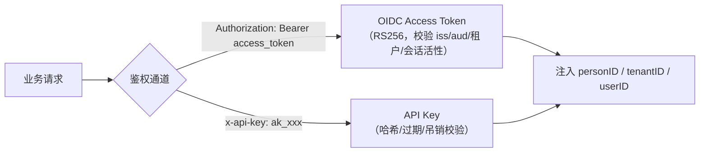

# API 参考（API Reference）

> 本文给出 Ark IAM 的 API 总览：**OIDC 协议端点**（`/oidc/*`）、**认证端点**（`/v1/auth/*`）、**平台管理端点**（`/v1/platform/*`）、**租户自服务端点**（`/v1/tenant/*`），以及认证方式、通用响应信封、路由规范摘要。
>
> 开发环境 Swagger（redoc）：`http://localhost:{port}/{appName}/redocs`（如 `http://localhost:8081/auth/redocs`）。

---

## 目录

1. [通用约定](#1-通用约定)
2. [认证与鉴权方式](#2-认证与鉴权方式)
3. [OIDC 协议端点](#3-oidc-协议端点oidc)
4. [认证端点（/v1/auth/*）](#4-认证端点v1auth)
5. [平台管理端点（/v1/platform/*）](#5-平台管理端点v1platform)
6. [租户自服务端点（/v1/tenant/*）](#6-租户自服务端点v1tenant)
7. [路由规范摘要](#7-路由规范摘要)

---

## 1. 通用约定

### 1.1 服务标识与端口

| 应用 | 服务标识 | 独立端口 | gateway 聚合端口 |
|---|---|---|---|
| auth | `auth` | 8081 | 8100 |
| platformadmin | `platform` | 8082 | 8100 |
| tenantadmin | `tenant` | 8083 | 8100 |

### 1.2 响应信封

所有业务接口统一返回 `{code, msg, data}`：

```json
{
  "code": 0,
  "msg": "success",
  "data": {}
}
```

- `code=0` 表示成功；非 0 为业务错误码（`pkg/code` 统一维护）；
- 鉴权失败返回 HTTP 401：`{"code": 401, "msg": "invalid token"}` 等。

### 1.3 路径参数命名

路径参数一律 `{xxxID}` 全大写（`{userID}`、`{roleID}`、`{appID}`、`{connectorID}`…），与 DTO JSON tag 及 Swagger 注解同步；**path 是 ID 的唯一来源**，不可被 body/query 覆盖。

---

## 2. 认证与鉴权方式



| 通道 | 使用方 | 说明 |
|---|---|---|
| `Authorization: Bearer <access_token>` | 登录用户（前端） | OIDC JWT，`sub=person:<id>`，私有声明 `tenant_id`/`user_id`/`client_id`/`token_usage` |
| `x-api-key: ak_xxx` | 机器/服务 | 与 Bearer 通道二选一，任一通过即可（`oidcauth` 中间件逻辑） |

免鉴权路径（跳过校验）：`/v1/auth/register`、`/v1/auth/connector/callback`、OIDC 协议端点 `/oidc/*` 中除授权回调外的端点。

---

## 3. OIDC 协议端点（/oidc/*）

> 部署于 auth 应用（:8081）与 gateway（:8100）。issuer 默认 `http://localhost:8081/oidc`。

### 3.1 标准端点（zitadel/oidc 提供）

| 端点 | 方法 | 说明 |
|---|---|---|
| `/.well-known/openid-configuration` | GET | 服务发现元数据 |
| `/authorize` | GET/POST | 认证与授权端点（返回授权码） |
| `/authorize/callback` | GET/POST | 授权回调 |
| `/oauth/token` | POST | 令牌端点（授权码/刷新/客户端凭证） |
| `/oauth/introspect` | POST | Access Token 检查（RFC 7662） |
| `/userinfo` | GET | 用户信息（按 scope 裁剪） |
| `/revoke` | POST | 吊销 Refresh Token |
| `/end_session` | GET/POST | RP-Initiated Logout |
| `/keys` | GET | JWKS 公钥集 |
| `/healthz`、`/ready` | GET | 健康检查 |

### 3.2 本系统扩展端点（OIDC 规范外，用于登录 UI 与 SSO）

| 端点 | 方法 | 说明 |
|---|---|---|
| `/oidc/login` | POST | 登录页提交凭证（identifier + password + authRequestID） |
| `/oidc/login/selectTenant` | POST | 多租户用户选择租户（authRequestID + tenantID） |
| `/oidc/sso-login` | GET | SSO 免密续登（携带 `iam_sso_session` Cookie，`?authRequestID=`） |
| `/oidc/logged-out` | GET | 登出落地页（清除 SSO Cookie 后跳前端登录页） |
| `/oidc/bc-logout` | POST | **反向通道登出接收端**（各 RP 应用也挂载此路径族，如 `/oidc/bc-logout/platform`） |

### 3.3 令牌端点示例

```bash
# 授权码换令牌（client_secret_basic）
curl -X POST http://localhost:8081/oidc/oauth/token \
  -u "platform-admin-web:客户端密钥" \
  -d "grant_type=authorization_code&code=xxx&redirect_uri=http://localhost:3001/callback&code_verifier=xxx"

# 刷新令牌
curl -X POST http://localhost:8081/oidc/oauth/token \
  -u "platform-admin-web:客户端密钥" \
  -d "grant_type=refresh_token&refresh_token=xxx"
```

---

## 4. 认证端点（/v1/auth/*）

> 前缀 `auth`：`/v1/auth/...`。除标注外均需 Bearer 令牌。

### 4.1 当前用户

| 方法 | 路径 | 说明 |
|---|---|---|
| GET | `/v1/auth/me` | 当前自然人详情 |
| POST | `/v1/auth/me/changePassword` | 修改密码 |
| GET | `/v1/auth/me/tenants` | 我的租户列表 |
| GET | `/v1/auth/me/sessions` | 我的会话列表 |
| DELETE | `/v1/auth/me/sessions` | 撤销全部会话 |
| DELETE | `/v1/auth/me/sessions/:sessionID` | 撤销指定会话 |

### 4.2 认证操作

| 方法 | 路径 | 说明 |
|---|---|---|
| POST | `/v1/auth/register` | 注册（免鉴权；创建 person + 租户拥有者 user） |
| POST | `/v1/auth/joinTenant` | 加入租户（当前 person 加入指定租户） |
| POST | `/v1/auth/logout` | 登出（撤销全部 Refresh Token + SSO 会话 + 触发 SLO） |
| POST | `/v1/auth/logoutAll` | 全端登出（同 logout） |
| GET | `/v1/auth/userinfo` | 当前用户信息（personInfo + userInfo） |

### 4.3 Connector（外部身份源）

| 方法 | 路径 | 说明 |
|---|---|---|
| POST | `/v1/auth/connectors` | 创建连接器 |
| GET | `/v1/auth/connectors` | 连接器分页列表 |
| GET | `/v1/auth/connector-factories` | 连接器工厂列表（支持的协议/提供商） |
| GET | `/v1/auth/connectors/:connectorID` | 连接器详情 |
| PUT | `/v1/auth/connectors/:connectorID` | 更新连接器 |
| DELETE | `/v1/auth/connectors/:connectorID` | 删除连接器 |
| POST | `/v1/auth/connectors/:connectorID/test` | 测试连接器 |
| POST | `/v1/auth/connectors/:connectorID/authorize` | 发起连接器授权 |
| GET | `/v1/auth/connectors/callback` | 连接器回调（免鉴权） |

---

## 5. 平台管理端点（/v1/platform/*）

> 前缀 `platform`：`/v1/platform/...`。全部需 Bearer 令牌（平台管理员）。

### 5.1 用户与身份

| 方法 | 路径 | 说明 |
|---|---|---|
| POST | `/v1/platform/users` | 创建用户 |
| GET | `/v1/platform/users` | 用户分页列表 |
| GET | `/v1/platform/users/:userID` | 用户详情 |
| PUT | `/v1/platform/users/:userID` | 更新用户 |
| PATCH | `/v1/platform/users/:userID` | 更新状态（启用/停用） |
| DELETE | `/v1/platform/users/:userID` | 删除用户 |
| POST | `/v1/platform/users/:userID/changePassword` | 重置/修改密码 |
| GET | `/v1/platform/users/:userID/roles` | 用户角色列表 |
| POST | `/v1/platform/users/:userID/roles` | 授予角色 |
| DELETE | `/v1/platform/users/:userID/roles/:roleID` | 移除角色 |
| GET | `/v1/platform/users/:userID/departments` | 用户部门 |
| PUT | `/v1/platform/users/:userID/departments` | 分配部门（全量替换） |
| GET | `/v1/platform/users/:userID/identities` | 用户外部身份列表 |
| POST | `/v1/platform/users/:userID/identities` | 关联外部身份 |
| GET/PUT/DELETE | `/v1/platform/users/:userID/identities/:identityID` | 外部身份详情/更新/删除 |
| GET | `/v1/platform/user-identities` | 外部身份跨用户检索（顶层只读） |
| GET | `/v1/platform/login-logs` | 登录日志分页 |
| GET | `/v1/platform/login-logs/:loginLogID` | 登录日志详情 |
| GET | `/v1/platform/users/:userID/login-logs` | 某用户登录日志 |

### 5.2 角色与权限

| 方法 | 路径 | 说明 |
|---|---|---|
| POST | `/v1/platform/roles` | 创建角色 |
| GET | `/v1/platform/roles` | 角色分页 |
| GET | `/v1/platform/roles/:roleID` | 角色详情 |
| PUT | `/v1/platform/roles/:roleID` | 更新角色 |
| DELETE | `/v1/platform/roles/:roleID` | 删除角色 |
| GET | `/v1/platform/roles/:roleID/users` | 角色成员 |
| PUT | `/v1/platform/roles/:roleID/users` | 分配成员（全量替换） |
| DELETE | `/v1/platform/roles/:roleID/users/:userID` | 移除成员 |
| GET/POST | `/v1/platform/roles/:roleID/menus` | 角色菜单查询/授权 |
| DELETE | `/v1/platform/roles/:roleID/menus/:menuID` | 移除角色菜单 |
| GET/POST | `/v1/platform/roles/:roleID/scopes` | 角色权限点查询/授权 |
| DELETE | `/v1/platform/roles/:roleID/scopes/:scopeID` | 移除角色权限点 |
| POST | `/v1/platform/menus` | 创建菜单 |
| GET | `/v1/platform/menus` | 菜单分页 |
| GET | `/v1/platform/menus/tree` | 菜单树 |
| GET/PUT/DELETE | `/v1/platform/menus/:menuID` | 菜单详情/更新/删除 |
| POST | `/v1/platform/scopes` | 创建权限点 |
| GET | `/v1/platform/scopes` | 权限点分页 |
| GET/PUT/DELETE | `/v1/platform/scopes/:scopeID` | 权限点详情/更新/删除 |
| POST | `/v1/platform/resources` | 创建资源 |
| GET | `/v1/platform/resources` | 资源分页 |
| GET/PUT/DELETE | `/v1/platform/resources/:resourceID` | 资源详情/更新/删除 |

### 5.3 租户与组织

| 方法 | 路径 | 说明 |
|---|---|---|
| POST | `/v1/platform/tenants` | 创建租户 |
| GET | `/v1/platform/tenants` | 租户分页 |
| GET/PUT/DELETE | `/v1/platform/tenants/:tenantID` | 租户详情/更新/删除 |
| POST | `/v1/platform/tenants/createAsOwner` | 以拥有者身份创建租户 |
| POST | `/v1/platform/departments` | 创建部门 |
| GET | `/v1/platform/departments` | 部门分页 |
| GET | `/v1/platform/departments/tree` | 部门树 |
| GET/PUT/DELETE | `/v1/platform/departments/:departmentID` | 部门详情/更新/删除 |
| POST | `/v1/platform/tenant-applications` | 开通租户-应用 |
| GET | `/v1/platform/tenant-applications` | 租户应用分页 |
| GET/PUT/DELETE | `/v1/platform/tenant-applications/:tenantAppID` | 详情/更新/删除 |

### 5.4 应用与客户端（OIDC 配置）

| 方法 | 路径 | 说明 |
|---|---|---|
| POST | `/v1/platform/applications` | 创建应用 |
| GET | `/v1/platform/applications` | 应用分页 |
| GET/PUT/DELETE | `/v1/platform/applications/:appID` | 应用详情/更新/删除 |
| POST | `/v1/platform/application-clients` | 创建 OAuth 客户端 |
| GET | `/v1/platform/application-clients` | 客户端分页 |
| GET/PUT/DELETE | `/v1/platform/application-clients/:applicationClientID` | 详情/更新/删除 |
| GET/POST | `/v1/platform/application-clients/:applicationClientID/secrets` | 密钥列表/创建 |
| DELETE | `/v1/platform/application-clients/:applicationClientID/secrets/:secretID` | 删除密钥 |

### 5.5 API Key 与域名

| 方法 | 路径 | 说明 |
|---|---|---|
| POST | `/v1/platform/api-keys` | 创建 API Key |
| GET | `/v1/platform/api-keys` | API Key 分页 |
| POST | `/v1/platform/api-keys/:apiKeyID/revoke` | 吊销（动作） |
| DELETE | `/v1/platform/api-keys/:apiKeyID` | 删除 |
| POST | `/v1/platform/domains` | 创建域名 |
| GET | `/v1/platform/domains` | 域名分页 |
| GET/PUT/DELETE | `/v1/platform/domains/:domainID` | 域名详情/更新/删除 |

### 5.6 系统与日志

| 方法 | 路径 | 说明 |
|---|---|---|
| POST | `/v1/platform/systems` | 创建系统配置 |
| GET | `/v1/platform/systems` | 配置分页 |
| GET/PUT/DELETE | `/v1/platform/systems/:systemID` | 配置详情/更新/删除 |
| GET | `/v1/platform/logs` | 租户日志分页 |
| GET | `/v1/platform/logs/:logID` | 日志详情 |

---

## 6. 租户自服务端点（/v1/tenant/*）

> 前缀 `tenant`：`/v1/tenant/...`。全部需 Bearer 令牌（租户成员视角，tenant_id 取自令牌）。

| 方法 | 路径 | 说明 |
|---|---|---|
| GET | `/v1/tenant/users` | 租户用户分页 |
| POST | `/v1/tenant/organizations` | 创建组织 |
| GET | `/v1/tenant/organizations` | 组织分页 |
| GET/PUT/DELETE | `/v1/tenant/organizations/:organizationID` | 组织详情/更新/删除 |
| POST | `/v1/tenant/organization-roles` | 创建组织角色 |
| GET | `/v1/tenant/organization-roles` | 组织角色分页 |
| GET/PUT/DELETE | `/v1/tenant/organization-roles/:organizationRoleID` | 详情/更新/删除 |
| GET/POST | `/v1/tenant/organization-users` | 组织成员查询/添加 |
| DELETE | `/v1/tenant/organization-users/:organizationID/:userID` | 移除组织成员 |
| GET/POST | `/v1/tenant/organization-role-users` | 组织角色成员查询/添加 |
| DELETE | `/v1/tenant/organization-role-users/:organizationRoleID/:userID` | 移除组织角色成员 |
| GET | `/v1/tenant/menus/tree` | 租户动态菜单树 |

---

## 7. 路由规范摘要

规则化混合风格（REST 资源式为主 + 显式动作式补充），三条硬规则：

1. **R1 资源 CRUD → REST**：`/{版本}/{服务标识}/{资源}[/{id}[/{子资源}]]`；
2. **R2 业务动作 → 动作子路径**：`POST /资源/{id}/动作`（如 `/api-keys/:apiKeyID/revoke`）；认证/会话类动作挂 `/v1/auth` 动作段（`register`/`joinTenant`/`logout`/`logoutAll`/`userinfo`）；
3. **R3 标准协议 → 专用前缀**：`/oidc/*`、back-channel logout 不走业务路由规范。

| 规范 | 说明 |
|---|---|
| 资源命名 | 复数 + kebab-case（`application-clients`、`api-keys`），禁驼峰 |
| 方法语义 | GET 查询 / POST 创建与动作 / PUT 全量更新与批量授权 / PATCH 局部更新 / DELETE 删除 |
| 关联建模 | 从属资源用子资源（`/users/:userID/identities`）；多对多用双端视角 + `PUT` 全量替换（`/roles/:roleID/users`） |
| 层级限制 | 集合层级 ≤ 3（路径段 ≤ 6） |
| 当前用户 | `/v1/auth/me`、`/v1/auth/me/tenants`、`/v1/auth/me/sessions` |
