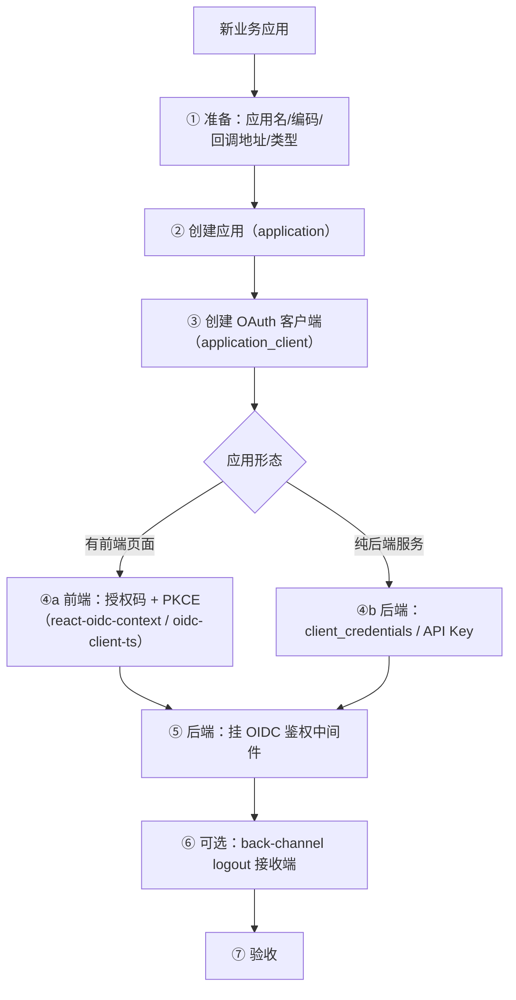
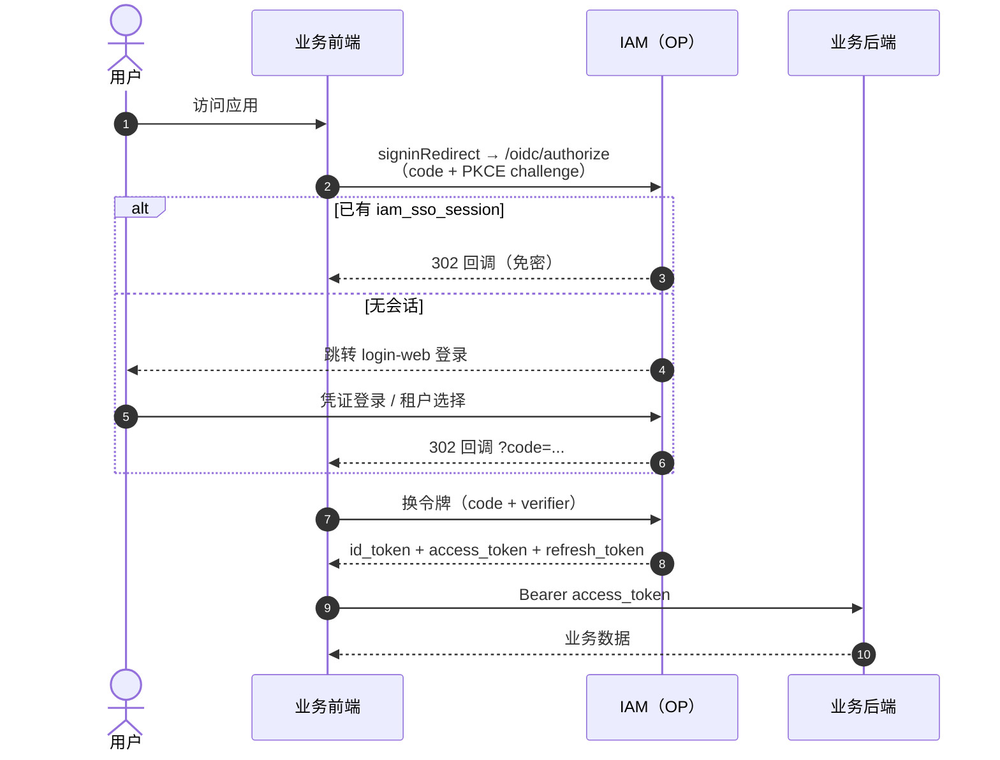
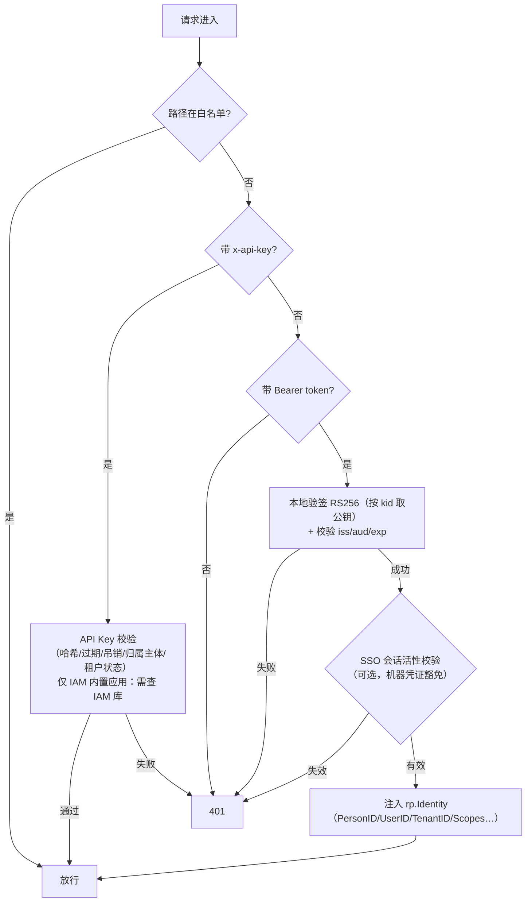
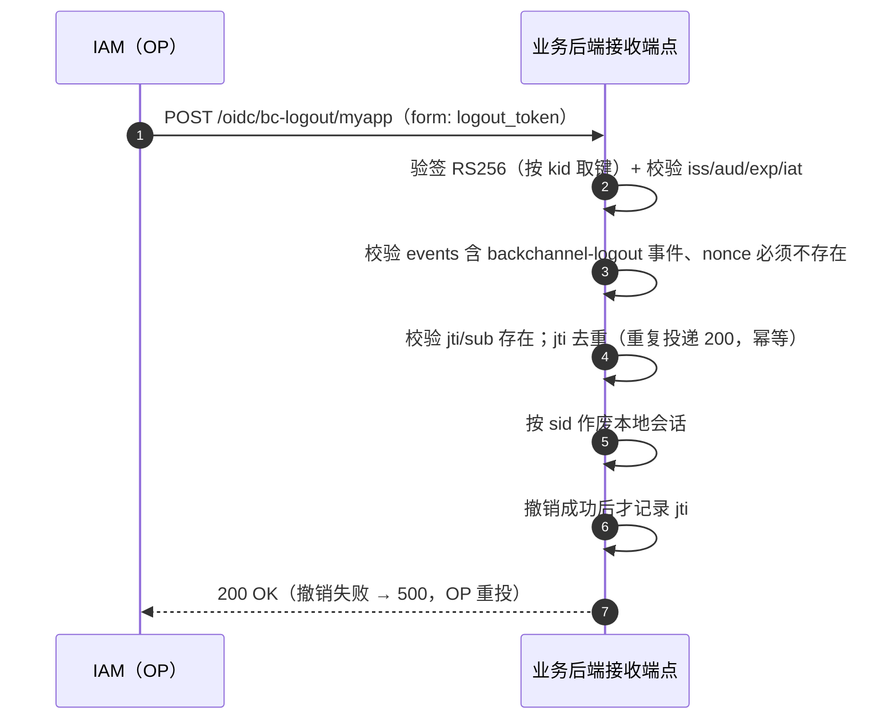
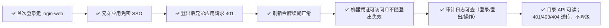

# 新应用接入指南（Application Integration Guide）

> 本文指导**业务应用（RP）**如何接入 Ark IAM，实现：OIDC 登录（SSO）、令牌校验、单点登出（SLO）、机器凭证（API Key / client_credentials）、只读目录查询五种能力。
>
> 前置阅读：[sso-oidc-concepts.md](sso-oidc-concepts.md)（协议概念）、[system-design.md](system-design.md) §6（接入流程概览）、[`backend/sdk/README.md`](../../backend/sdk/README.md)（RP 侧 OIDC SDK，本文的参考实现）。
>
> RP 侧 OIDC 能力的**唯一事实源**是独立 module `backend/sdk`（`sdk/contract` 契约 + `sdk/rp` 验签/M2M/登出/目录客户端）；它框架无关，只依赖标准库与 `jwt/v5`，本仓内置应用与外部应用用的是同一份实现。
>
> 实战案例：[rustfs-integration-case.md](rustfs-integration-case.md) —— 接入一个**代码不可改、自带权限模型、只支持单向 SLO** 的存量第三方应用（RustFS）时的完整走查与踩坑记录。本文给通用步骤，该文给案例特有的判断与实测值。

---

## 目录

1. [接入总览](#1-接入总览)
2. [前置准备](#2-前置准备)
3. [创建应用与 OAuth 客户端](#3-创建应用与-oauth-客户端)
4. [前端接入：授权码 + PKCE](#4-前端接入授权码--pkce)
5. [后端接入：令牌校验中间件](#5-后端接入令牌校验中间件)
6. [机器凭证接入：client_credentials 与 API Key](#6-机器凭证接入client_credentials-与-api-key)
7. [只读目录 API 接入（M2M）](#7-只读目录-api-接入m2m)
8. [单点登出（SLO）接入](#8-单点登出slo接入)
9. [验收清单](#9-验收清单)
10. [常见问题（FAQ）](#10-常见问题faq)

---

## 1. 接入总览



> 需要展示成员姓名/头像/部门/角色等**实体信息**时，另走只读目录 API（§7）：它是**独立的一跳**，凭证是 M2M 机器令牌（`directory.read`），不要复用用户 access_token。

**接入前需明确的问题**：

| 问题 | 影响 |
|---|---|
| 应用有前端页面吗？ | 前端用授权码 + PKCE；无前端用 client_credentials |
| 是自有应用还是第三方应用？ | 来源（`application.source`）：控制台创建恒为 `third_party`；`builtin`/`first_party` 仅由种子与运维产生 |
| 回调地址是什么？ | `redirect_uri` 必须**精确白名单**（HTTPS 生产必填） |
| 需要免登录串访吗？ | 需要 → 确保与 IAM 同浏览器环境（SSO Cookie 生效） |
| 需要服务端到服务端调用吗？ | 需要 → 额外申请 API Key 或 client_credentials |
| 需要展示成员姓名/部门/角色吗？ | 需要 → M2M 机器令牌 + `/v1/rp/directory/*`（§7），**不**复用用户令牌 |

---

## 2. 前置准备

1. **IAM 环境可访问**：确定 issuer，例如开发环境 `http://localhost:8081/oidc`（生产为正式域名）。访问 `GET {issuer}/.well-known/openid-configuration` 应返回元数据。
2. **账号**：一个可登录平台管理台（platform-admin-web）的账号，用于创建应用与客户端。
3. **密钥可获取**：创建客户端后生成的 `client_secret`（只显示一次，库中只存哈希）。
4. **共享 Redis（可选但推荐）**：需要"登出即失效"的请求粒度校验时，业务后端与 auth 共享同一认证 Redis。

> 提示：平台管理台已提供可视化创建入口；下文同时给出 API 调用方式，便于脚本化/自动化。

---

## 3. 创建应用与 OAuth 客户端

### 3.1 创建应用（Application）

```bash
curl -X POST http://localhost:8082/v1/platform/applications \
  -H "Authorization: Bearer <平台管理员 access_token>" \
  -H "Content-Type: application/json" \
  -d '{
    "code": "my_app",
    "name": "我的业务应用",
    "homepageUrl": "https://my-app.example.com",
    "logoUrl": "https://my-app.example.com/logo.png"
  }'
```

> `code` 即应用编码：**下划线连接**，以小写字母开头，仅含小写字母、数字与下划线（如 `my_app`、`platform_admin`；`AppCodePattern`），连字符/大写会被服务端拒绝。创建入参**不含 `status`**：控制台创建的应用来源固定为 `third_party`、状态固定 `enable`，之后用 `PUT /v1/platform/applications/{appID}` 改状态。

### 3.2 创建 OAuth 客户端（Application Client）

```bash
curl -X POST http://localhost:8082/v1/platform/application-clients \
  -H "Authorization: Bearer <平台管理员 access_token>" \
  -H "Content-Type: application/json" \
  -d '{
    "appID": <上一步返回的 appID>,
    "code": "my_app_web",
    "name": "我的业务应用 Web 端",
    "redirectURIs": ["https://my-app.example.com/callback"],
    "postLogoutRedirectURIs": ["https://my-app.example.com/logged-out"],
    "backChannelLogoutURI": "https://my-app.example.com/oidc/bc-logout",
    "grantTypes": ["authorization_code", "refresh_token"],
    "responseTypes": ["code"],
    "tokenEndpointAuthMethod": "client_secret_basic",
    "requirePKCE": true,
    "defaultScopes": ["openid", "profile"],
    "accessTokenTTL": 900,
    "refreshTokenTTL": 2592000
  }'
# 响应：{"applicationClientID": "<控制台内部主键>", "code": "<OIDC client_id>"}
```

> **客户端编码（`code`，即 OIDC `client_id`）是创建时的必填入参**：小写字母开头，**仅含小写字母与下划线**
> （`model.ClientCodePattern`，`^[a-z][a-z_]*$`——不允许数字，禁连字符），前端表单与后端 service 各校验一份，
> 非法值由 service 拒绝并返回业务错误码 `100822`（HTTP 200，错误码在响应体 `code` 字段）。**自建客户端创建后可改**（`ApplicationClientUpdateReq.code`，改名后该 RP 需同步自己的
> `client_id`，其旧令牌按新 aud 失效）；**内置客户端只读**（报 `100823`）。把它填到 RP 配置的 `client_id`（§4.1）。
> 注意两套「编码」规则刻意不同：**应用编码**（`application.code`）受 `AppCodePattern` 约束（允许数字，
> 如 `my_app_2`；自建应用可改、内置应用只读报 `100749`）；**客户端编码**受 `ClientCodePattern` 约束
> （内置客户端为 `platform_admin_web` / `tenant_admin_web`）。
> 由于 `client_id` 同时是令牌 audience，内置客户端编码必须与网关 aud 白名单、前端默认值保持一致
> （前两者已统一引用 `pkg/model` 的 `SeedBuiltinClient*` 常量）。

| 参数 | 建议值 | 说明 |
|---|---|---|
| `grantTypes` | `["authorization_code","refresh_token"]` | 前端应用标准组合 |
| `responseTypes` | `["code"]` | 授权码模式 |
| `tokenEndpointAuthMethod` | `client_secret_basic` | 机密客户端；纯前端可 `none` + 强制 PKCE |
| `requirePKCE` | `true` | 生产建议强制 PKCE |
| `redirectURIs` | 精确到路径 | 白名单校验，**多一个字符都不匹配** |
| `backChannelLogoutURI` | 指向自己的接收端点 | 用于 SLO（见 §8） |

### 3.3 创建客户端密钥（可选，机密客户端）

```bash
curl -X POST http://localhost:8082/v1/platform/application-clients/{applicationClientID}/secrets \
  -H "Authorization: Bearer <token>" -H "Content-Type: application/json" \
  -d '{"name": "prod-key"}'
# 响应字段 secret（明文）只显示一次，妥善保存；列表仅回显 valuePrefix，库中仅存哈希
```

### 3.4 授权声明契约：`groups`（角色编码）

IAM 通过 **ID token 的 `groups` 声明**把"用户在本租户内拥有哪些角色"交给下游系统自己翻译成权限。这是一份**按应用隔离**的契约，对接时必须先理解三件事：

1. **作用域 = 应用**：`groups` 只包含"**本次登录所用客户端所属应用**"下的角色编码（`application_client.app_id`）。
   同一租户里其它应用的角色**不会**出现在声明里——否则任何应用里造一个同码角色都会命中你的策略命名空间。
2. **值是角色编码（`role.code`）**：小写字母开头，仅含小写字母/数字/下划线（`^[a-z][a-z0-9_]*$`）。
   编码是**契约值**，且**由你在应用角色模板里定义一次**（见下）：租户只能把角色授权给成员，不能改编码，
   也不能自建一个带编码的角色——所以声明里出现的值集合，等价于你在模板里声明过的那份清单。
3. **逐条解析，缺一条即拒绝**：多数下游（对象存储这类）按 `策略名 = claim_prefix + 编码` 纯拼接解析。
   **你的模板里有几个编码，就必须在下游有对应几条策略**——本地实测 RustFS：只要选中集合为空、或其中
   任一条策略名在下游不存在，登录直接以 `InvalidRequest: OIDC policy mapping did not resolve to
   current policies` 被拒（不是"忽略认不出的值"、也不是静默降权）。所以**供给策略必须先于声明模板**：
   模板一保存就物化到各租户，此时若策略还没备好，该应用的**所有已授权用户都会立刻登录失败**。

对接步骤：

```text
① 设计你的策略名与编码的对应关系（建议策略名 = 前缀 + 编码，前缀用于跨产品隔离命名空间）
② 在下游为每个编码供给同名策略（策略名 = 前缀 + 编码）——必须先于 ③
③ 在 IAM 侧为「你这个应用」声明角色模板 roleTemplate（编码 + 展示名），开通该应用的租户会自动获得这些角色
④ 在租户控制台把角色授权给成员；用该应用的客户端登录，检查 ID token 的 groups 与下游实际命中的策略集
```

> **`roleTemplate`（应用角色模板）**：下游策略是**全局命名实体**（策略名 = `claim_prefix` + 编码，一条策略
> 全租户共用，下游没有"角色 ↔ 策略"的映射表可回查），所以"某个编码会在下游存在一条策略"这件事只能由
> **应用方**说了算。据此 IAM 把契约值的定义权收归应用：创建/更新应用时声明模板（详见
> [api-reference.md](api-reference.md)），租户侧只能授权成员、不能造值
> （存储层为 `application.role_template` 列，`serializer:json` + 具名类型 `model.RoleTemplateItemList`）——
> 如果允许租户写编码，任何租户管理员都能创建一个同码角色直接拿到你那条策略（跨租户提权）。
>
> ```bash
> curl -X PUT http://localhost:8082/v1/platform/applications/{appID} \
>   -H "Authorization: Bearer <token>" -H "Content-Type: application/json" \
>   -d '{"roleTemplate": [{"code": "console_admin", "name": "控制台管理员"},
>                         {"code": "readonly", "name": "只读用户"}]}'   # null 不修改；[] 清空
> ```
>
> **全量语义与撤权**：模板是单一事实源，更新即全量替换——新增的编码会在**所有已开通该应用的租户**里物化
> 出新角色；改名会同步回写；**从模板移除的编码会连同该角色在各租户的成员授权与菜单授权一并删除**。
> 因此平台控制台在提交前会二次确认，你更新模板时也要按"这是撤权操作"对待。
>
> **供给顺序是硬要求**：先在下游供给同名策略 → 再声明模板 → 再给用户授权。下游逐条解析策略名，只要
> 有一条解析不到就**整次登录被拒**（RustFS 实测报 `OIDC policy mapping did not resolve to current
> policies`），所以反过来的顺序会让该应用的所有已授权用户当场登录失败。
> 产品锚点编码（`platform_admin`/`tenant_admin`）属平台自身的策略命名空间，不得写进你的模板（服务端报 `100765`）。

---

## 4. 前端接入：授权码 + PKCE

### 4.1 使用 react-oidc-context（React 应用，与平台管理台同方案）

```tsx
// oidcConfig.ts
import { WebStorageStateStore } from 'oidc-client-ts';

export const oidcConfig = {
  authority: 'http://localhost:8081/oidc',          // issuer
  client_id: '<创建 OAuth 客户端时响应返回的 code>',
  redirect_uri: 'https://my-app.example.com/callback',
  post_logout_redirect_uri: 'https://my-app.example.com/logged-out',
  response_type: 'code',                            // 授权码
  scope: 'openid profile email offline_access',     // openid 必须；offline_access 才会下发 refresh_token
  automaticSilentRenew: true,
  userStore: new WebStorageStateStore({ store: sessionStorage }), // 与平台管理台一致，缩小 XSS 暴露窗口
};

// 说明：refresh_token 仅在 scope 含 `offline_access` 且客户端 grantTypes 含 refresh_token 时才签发（zitadel OP 行为）。

// main.tsx
import { AuthProvider } from 'react-oidc-context';
<AuthProvider {...oidcConfig}>
  <App />
</AuthProvider>

// 组件内
import { useAuth } from 'react-oidc-context';
const auth = useAuth();
if (auth.isLoading) return <div>加载中...</div>;
if (!auth.isAuthenticated) { auth.signinRedirect(); return null; }
// 请求业务 API 时附带 access_token
axios.get('/api/me', { headers: { Authorization: `Bearer ${auth.user?.access_token}` } });
```

### 4.2 流程回顾



---

## 5. 后端接入：令牌校验中间件

令牌校验在本应用内**本地完成**：启动时预取一次 OP 的 JWKS，之后请求路径只按令牌头的 `kid` 查内存公钥、**绝不访问 OP**。参考实现是 RP 侧 SDK [`backend/sdk`](../../backend/sdk/README.md)（`sdk/rp`），框架无关；gin 绑定由消费方自己写约 20 行。校验流程：



> 外部应用**校验不了 `x-api-key`**（那需要查 IAM 的 `api_key` 表），请改用「API Key 换 token」后走同一 Bearer 通道（§6.2）。

**参考实现**（`rp.NewKeys` + `rp.NewVerifier` + 约 20 行 gin 中间件）：

```go
import (
    "context"
    "errors"
    "log"
    "net/http"
    "strings"

    "github.com/gin-gonic/gin"

    "github.com/morehao/ark-iam/sdk/contract"
    "github.com/morehao/ark-iam/sdk/rp"
)

// 启动期构造一次；Verifier 可并发复用。Verify 全程本地验签：JWKS 预取 + 内存 kid 查表。
keys, err := rp.NewKeys(context.Background(),
    "http://localhost:8081/oidc", // 传 issuer：SDK 先取 discovery 的 jwks_uri（本仓 OP 为 {issuer}/keys）
)
if err != nil {
    log.Fatalf("init OIDC keys: %v", err) // fail-closed：起不来就别把服务放出去
}
defer keys.Close()

verifier := rp.NewVerifier(keys,
    // iss 精确匹配；aud 收紧到本应用 client_id（创建客户端响应里的 code），拒绝其它 client 的令牌
    rp.WithIssuer("http://localhost:8081/oidc"),
    rp.WithAudiences("<本应用 client_id>"),
)
// 默认：仅 RS256、时钟容差 30s；可用 rp.WithAlgorithms / rp.WithLeeway 覆盖。

// 约 20 行的 gin 中间件（SDK 不含 gin 依赖，绑定由消费方自写）。
func OIDCAuth(verifier *rp.Verifier) gin.HandlerFunc {
    return func(c *gin.Context) {
        raw := strings.TrimPrefix(c.GetHeader("Authorization"), "Bearer ")
        if raw == "" {
            c.AbortWithStatusJSON(http.StatusUnauthorized, gin.H{"code": 401})
            return
        }
        identity, err := verifier.Verify(c.Request.Context(), raw)
        if err != nil {
            status := http.StatusUnauthorized
            if errors.Is(err, contract.ErrKeySourceUnavailable) {
                status = http.StatusServiceUnavailable // 密钥集不可用，别伪装成 401
            }
            c.AbortWithStatusJSON(status, gin.H{"code": status})
            return
        }
        // 注入身份：gin 用 c.Set；非 gin 用 rp.WithIdentity(ctx, identity) + rp.IdentityFrom(ctx)。
        c.Set("identity", identity)
        c.Next()
    }
}
```

> **本仓内置应用**的参考实现是 `pkg/middleware/oidc_auth.go`（`NewKeySourceFromConfig` + `OIDCAuth`）：除本地验签外，它还做 SSO 会话活性校验、`x-api-key` 直连通道，并把 `Identity` 投影到 gin context（`gcontext.KeyPersonID` / `KeyUserID` / `KeyTenantID` / `KeyAuthToken`）供既有处理器读取，完整身份用 `OIDCIdentityFromContext` 取回。`middleware.OIDCCompatibleAuth` + `middleware.LoadSigningPublicKey` 是**过渡 API**（只在启动时钉死一把公钥、感知不到轮换），新代码请用 `WithOIDCKeySource` / `NewKeySourceFromConfig`，或直接按上面的 SDK 写法。

**`rp.Identity` 字段**（`verifier.Verify` 的返回值）：

| 字段 | 含义 |
|---|---|
| `PersonID` | 自然人 ID（人令牌的 `sub=person:<id>` 或 `person_id` 声明；机器令牌为空） |
| `UserID` | **租户成员主键 `tenant_user.id`**（人令牌）/ 机器主体（机器令牌）。写审计 `created_by`/`updated_by` 的唯一口径 |
| `TenantID` | 租户作用域，**一律来自令牌**，不接受入参指定 |
| `ClientID` | 令牌的 `client_id` |
| `IsMachine` | 是否机器凭证（`token_usage=machine`） |
| `SessionID` | SSO 会话标识（`sid`），用于会话粒度登出 |
| `Scopes` | 标准 `scope` 声明（空格分隔），`HasScope("...")` |
| `ActorID` | 代操作主体（`act.sub`），机器凭证代表某人操作时承载原操作者 |

**access token 私有 claim**（契约单一事实源：`sdk/contract`）：

| claim | 人令牌 | 机器令牌 | 说明 |
|---|---|---|---|
| `sub` | `person:<person_id>` | `<key_prefix>`（或 client_id） | 用 `contract.ParsePersonSubject` 解析 |
| `person_id` | ✅ | — | 自然人 ID 的显式声明 |
| `user_id` | ✅ = `tenant_user.id` | ✅ = 机器主体（`api_key.owner_user_id`） | 审计操作者列取值 |
| `tenant_id` | 映射唯一时 ✅ | ✅（API Key 归属租户） | 租户作用域 |
| `sid` | 有中心会话时 ✅ | — | 会话标识 |
| `token_usage` | — | `machine` | 机器凭证标记 |
| `scope` | ✅ | ✅ | 空格分隔（目录 API 据此判定） |
| `act` | — | 创建人 ≠ 机器主体时 `{"sub":"<tenant_user.id>"}` | 代操作主体 |

> **`tenant_id` 不是令牌有效性条件**：签发侧在「自然人 → 租户映射不唯一」时**不写**该 claim，验签照常通过、`Identity.TenantID` 为空。因此**需要租户的接口必须自行判定并返回 403**，绝不依赖 `dbclient.ErrTenantScopeMissing` 冒成 500（目录 API 就是这么做的，见 §7.3）。

> **签名密钥轮换**：客户端按令牌头的 `kid` 定位公钥（`kid` 必填；`jwk`/`jku`/`x5u` 头一律拒绝）。例行轮换 = 追加新 key → 切 `active` → 等 ≥2×JWKS TTL → 摘除旧 key；紧急轮换 = 删除旧 key，立即生效。`rp.NewKeys` 遇未知 `kid` 会限速刷新一次 JWKS，**无需重启 RP**。

> **非 Gin 技术栈**（Java/Node/Python）：自行实现等价的本地校验——从 discovery 文档（`{issuer}/.well-known/openid-configuration`）的 `jwks_uri` 取公钥（本仓 OP 为 `{issuer}/keys`，**不是** `{issuer}/.well-known/jwks.json`）、按 `kid` 选键、验 RS256 签名、校验 `iss`/`aud`/`exp`；私有 claim 见上表。业务侧的资源级鉴权自行实现：IAM 只在目录 API 上用 `directory.read` 做 M2M 策略判定，不承载业务 `resource`。

---

## 6. 机器凭证接入：client_credentials 与 API Key

### 6.1 client_credentials（服务端到服务端）

前提：客户端 `grantTypes` 需包含 `client_credentials`。

```bash
curl -X POST http://localhost:8081/oidc/oauth/token \
  -u "my-app-backend:客户端密钥" \
  -d "grant_type=client_credentials&scope=openid"
# 返回 access_token，sub=client_id（标准 client_credentials 的私有声明仅此一项，无 token_usage）
```

> ⚠️ **标准 `client_credentials` 令牌不能直接访问本系统的业务 API**：它既不是人令牌（无 `sub=person:<id>` / `tenant_id`），也不是机器令牌（无 `token_usage=machine`），本地验签按「既非人亦非机器」直接拒绝（`contract.ErrMissingClaim` → 401）。业务场景的机器凭证请用 **API Key**（见 §6.2）——包括「把 API Key 当 client credential 换 token」的用法，那条路径才会签发 `sub=<keyPrefix>` + `token_usage=machine` 的令牌。`client_credentials` 仅用于 OIDC 端点自身的交互。

**SDK 客户端（自动续期）**：`rp.NewTokenClient` 封装了 `grant_type=client_credentials` 的取令牌与缓存（并发安全），距 `exp` 不足 60s 自动换新；`rp/directory` 等子客户端把它作为 `TokenProvider` 注入（§7.1）。

```go
tc, err := rp.NewTokenClient(rp.ClientCredentialsConfig{
    TokenURL:     "http://localhost:8081/oidc/oauth/token",
    ClientID:     "<client_id>",
    ClientSecret: "<client_secret>",
    Scopes:       []string{"directory.read"}, // 按需；目录 API 对应 directory.ScopeRead
    Resource:     "<接收方 client_id>",        // RFC 8707：决定令牌 aud，不填则 aud = 自己
}, nil)
if err != nil {
    log.Fatalf("init token client: %v", err)
}
```

> 接收方本地验签要求令牌是「人令牌或机器令牌」，即必须携带 `token_usage=machine`。普通 OIDC 客户端的纯 `client_credentials` 只有 `client_id` 声明（见上方 ⚠️）；**外部应用取机器令牌的可靠路径是「API Key 换 token」（§6.2）**——把原始 API Key 同时填入 `ClientID` 与 `ClientSecret`、`Resource` 填接收方 `client_id`，即可复用 `rp.NewTokenClient` 的自动续期。

### 6.2 API Key（推荐，可审计可吊销）

1. 在**租户控制台「API密钥」模块**为服务账号创建 API Key（或 `POST /v1/tenant/api-keys`，body `machineUserID` 指定归属服务账号），得到明文（仅展示一次）；
2. 服务请求时携带 `x-api-key: <64 位 hex 明文>` 头（明文为 32 字节随机数的 64 位小写 hex，无 `ak_` 前缀；也可放进 `Authorization: Bearer`）；
3. 中间件校验：哈希定位 → 未过期/未吊销 → 解析归属服务账号注入身份上下文 → 通过。

```bash
curl https://my-api.example.com/v1/... -H "x-api-key: 8f3ab2c9d0e1..."
```

**差异对比**：

| 维度 | client_credentials | API Key |
|---|---|---|
| 凭证形态 | client_id + client_secret | 单串 API Key |
| 交互方式 | token 端点换令牌 | 直接请求头携带 |
| 生命周期 | 随客户端配置 | 可独立过期/吊销 |
| 适用 | 标准 OAuth 客户端 | 轻量服务/脚本/集成 |

> **API Key 签发的 token**（`token_usage=machine`）**不依赖浏览器 SSO 会话活性**，登出不会使其失效，需通过吊销/过期管理。（普通 `client_credentials` 令牌没有该标记，也过不了业务中间件，见 §6.1。）

**路径 B：API Key 换短期 JWT（外部应用用这条）**

外部应用无法本地校验 `x-api-key`（那需要查 IAM 的 `api_key` 表）。替代做法是把 API Key 换成短期 JWT，再用与用户令牌同一套 JWKS 本地验签：

```bash
# client_id 与 client_secret 都填同一个原始 API Key；resource 决定 aud（填接收方 client_id）
curl -u "$API_KEY:$API_KEY" -X POST http://localhost:8081/oidc/oauth/token \
  -d "grant_type=client_credentials&resource=<接收方 client_id>"
```

| claim | 取值 | 说明 |
|---|---|---|
| `sub` | `<api_key.key_prefix>` | 公开前缀；**原始密钥绝不进 claim** |
| `token_usage` | `machine` | 接收方据此识别机器凭证 |
| `tenant_id` | API Key 归属租户 | 租户作用域的来源 |
| `user_id` | `api_key.owner_user_id`（机器主体/归属服务账号） | 审计操作者口径，与 `x-api-key` 直连通道一致 |
| `act.sub` | `api_key.created_by`（仅当它 ≠ 机器主体时下发） | 代操作主体：创建密钥的人 |

> 审计口径：两条通道的「操作者」都是**机器主体**（`user_id`）；**创建密钥的人在 `act.sub`**。密钥轮换零中断：新增 Secret/API Key → 调用方切换 → 撤销旧的。

---

## 7. 只读目录 API 接入（M2M）

需要展示成员姓名/头像/部门/角色等**实体信息**时，走只读目录 API。它由独立应用 `apps/rpapi` 提供（端口 **8084**，`gateway` 聚合部署时经网关访问），与业务 API 的鉴权模型不同：只接受 **M2M 机器令牌**，租户作用域**只来自令牌的 `tenant_id`**，不接受任何请求参数指定租户。

> ⚠️ **`/v1/auth/*` 不是 RP 契约**：它是 OP 自身的业务 API（服务登录前端），不是给 RP 的正式接口。实体类查询请一律用 `/v1/rp/directory/*`。

### 7.1 取令牌与建客户端

前提：令牌 `aud` 命中 **rpapi 自己的 client_id**，且携带 `directory.read`。取令牌用 API Key 换 token（§6.2），再交给目录客户端自动续期：

```go
tc, err := rp.NewTokenClient(rp.ClientCredentialsConfig{
    TokenURL:     "http://localhost:8081/oidc/oauth/token",
    ClientID:     "<原始 API Key>",   // 形式：client_id == client_secret == rawKey
    ClientSecret: "<同一原始 API Key>",
    Scopes:       []string{directory.ScopeRead}, // "directory.read"
    Resource:     "<rpapi 的 client_id>",        // RFC 8707：aud 必须命中 rpapi
}, nil)
if err != nil {
    log.Fatalf("init token client: %v", err)
}

client, err := directory.New(directory.Config{
    BaseURL:      "http://localhost:8084/v1/rp",
    Tokens:       tc,              // 距 exp 60s 自动换新
    StaleOnError: 5 * time.Minute, // 仅连接失败/超时/5xx 时降级；建议上限 5 分钟
})
if err != nil {
    log.Fatalf("init directory client: %v", err)
}
```

### 7.2 端点

| 端点 | 说明 | 响应 |
|---|---|---|
| `GET /v1/rp/directory/members/{userID}` | 成员摘要 | `{userID,name,avatar,status,userType,departmentNames}` |
| `GET /v1/rp/directory/members?ids=a,b,c` | 批量（≤100，去重保序） | `{"list":[...],"missing":[...]}` |
| `GET /v1/rp/directory/departments/tree` | 本租户部门树（仅启用节点） | `[{id,name,parentID,children?}]` |
| `GET /v1/rp/directory/roles` | 本租户角色清单（≤500） | `{"list":[{code,name,appID}],"truncated":bool}` |

```go
member, err := client.Member(ctx, userID)               // 不存在/跨租户 → directory.ErrNotFound
members, err := client.Members(ctx, []string{id1, id2}) // 结果 map[id]*Member，未命中的 id 不在其中
tree, err := client.DepartmentTree(ctx)
roles, err := client.Roles(ctx)                         // client.RolesTruncated() 报告是否被截断
```

**批量语义**：`missing` 同时包含「不存在」与「跨租户」的 id，**二者刻意不可区分**（防枚举）；id 超过 100 个**显式 400**（SDK 侧提前返回 `directory.ErrTooManyIDs`），**绝不静默截断**——否则调用方会把「没返回」误读成「不存在」。

### 7.3 状态码契约

| 状态码 | 含义 | SDK 错误 |
|---|---|---|
| 401 | 无令牌/令牌无效（验签、`iss`、`aud` 任一不过） | `directory.ErrUnauthorized` |
| 403 | 缺 `directory.read`，或令牌**没有 `tenant_id`** | `directory.ErrForbidden` |
| 404 | 跨租户或不存在（不可区分） | `directory.ErrNotFound` |
| 400 | 批量 id 超过 100 | 带 400 信息的普通 error |
| 503 | 目录暂不可用（连接失败/超时/5xx） | `directory.ErrUnavailable` |

> **4xx 绝不重试、绝不降级**：401/403/404 是授权与可见性结论，用旧缓存「继续放行」会在客户端被撤销或 scope 被收紧后造成越权。**只有**连接失败/超时/5xx 才允许返回过期副本（`StaleOnError`，上限 5 分钟）；无可用缓存时返回 `directory.ErrUnavailable`。

### 7.4 缓存与 ETag

- TTL：成员 **60s**、部门树与角色 **300s**、404 负缓存 **30s**；同 key 并发请求 single-flight。
- 成功响应是**裸 DTO**（不是业务 API 的 `{code,msg,data}` 信封；错误响应仍是 `{code,requestID,msg}`）。服务端按**序列化后的响应体**算 `ETag`，下发 `Cache-Control: private, no-cache` + `Vary: Authorization`，并支持 `If-None-Match` → **304**（省带宽与反序列化，**不省 DB 查询**）。
- 缓存只在**进程内**：多实例各持一份；本进程写后可用 `InvalidateMember(userID)` 主动失效。

> ⚠️ **绝不用缓存里的 `Member.Status` 做放行/拒绝判定**：成员是否可登录由令牌侧决定（挂起租户/成员在签发侧已被拦），目录只服务展示。

### 7.5 不要放进关键路径

目录客户端**不得**出现在鉴权中间件或审计写入的关键路径上（它引入了对 IAM 的可用性依赖）。鉴权只用本地验签的 `rp.Identity`（§5），目录结果只用于展示；审计写 `tenant_id` + `user_id`，姓名等部门字段在写入时快照，避免跨库 JOIN。

---

## 8. 单点登出（SLO）接入

### 8.1 前端登出

```tsx
// react-oidc-context
auth.signoutRedirect({ post_logout_redirect_uri: 'https://my-app.example.com/logged-out' });
// 或直接调用 OP 端点
// window.location = 'http://localhost:8081/oidc/end_session?client_id=<client_id>&post_logout_redirect_uri=...'
```

OP 收到登出请求后：清除 `iam_sso_session` Cookie → 撤销该 person 全部 SSO 会话与 Refresh Token → 入队反向通道登出通知。

> ⚠️ **前置条件：`post_logout_redirect_uri` 必须在客户端白名单里**（`application_client.post_logout_redirect_uris`，控制台字段「登出回调地址」）。`/oidc/end_session` 对该参数做**精确匹配**（含末尾斜杠是否一致），不匹配时返回 `400 {"error":"invalid_request","error_description":"post_logout_redirect_uri invalid"}`——**它不会跳回你的应用**，用户只会看到这段 JSON 错误。实践中最容易漏配的形态是「客户端建好了、登出回调地址留空」：登录/令牌一切正常，一点退出就报这个错（Gitea 接入时即如此，补 `["http://localhost:3009/"]` 后恢复 302）。RP 发起登出时建议同时带上 `client_id`（Gitea 的做法：`end_session?client_id=…&post_logout_redirect_uri=<AppURL>/`）。

### 8.2 反向通道登出接收端

反向通道登出的**唯一实现**在 SDK：`sdk/rp/logout`（`logout.Receiver.Handle`，框架无关、基于 `net/http`）；本仓 Gin 应用用 `pkg/goidc` 薄壳挂载（只做参数搬运与观测，**不再有第二套验签规则**）。外部应用自行实现 `POST <backChannelLogoutURI>` 即可：

```go
receiver := logout.NewReceiver(
    logout.WithKeySource(keys), // 与 §5 同一个 rp.KeySource
    logout.WithIssuer("http://localhost:8081/oidc"),
    logout.WithClientID("<本应用 client_id>"),
    logout.WithSessionRevoker(func(ctx context.Context, claims *contract.LogoutTokenClaims) error {
        return revokeSessions(ctx, claims.SessionID) // 先撤销，成功了再记录 jti
    }),
)
http.Handle("/oidc/bc-logout", receiver) // 正确状态码：200/400/500
```

**处理顺序是硬要求**（`Handle` 已按此实现，自己实现时务必照抄）：验签与声明校验 → jti 去重（重复投递直接 200，幂等）→ **撤销本地会话** → **撤销成功后才记录 jti**。撤销失败返回 500 且**不记 jti**，OP 的重投才会真正生效；反过来先记 jti 再撤销，会把「撤销失败」误判为「已处理」，这次登出就被永久丢掉。jti 表默认进程内（`MemoryJTIStore`），多实例部署请注入落表实现（存 `logout.HashJTI(jti)` 摘要 + 过期时间）。

本仓 Gin 应用挂载方式：

```go
import "github.com/morehao/ark-iam/pkg/goidc"

// 挂载接收端点（路径与客户端注册的 backChannelLogoutURI 一致）
group := engine.Group("/oidc")
basePath := Conf.OIDC.BackChannelLogoutPath // 本仓约定 /bc-logout/<app>（如 /bc-logout/platform）；pkg/goidc 通用兜底为 /oidc/bc-logout
goidc.RegisterReceiverRoutes(group, basePath, keys, Conf.OIDC.Issuer, "<本应用 client_id>",
    func(ctx *gin.Context, claims *goidc.LogoutTokenClaims) error {
        // 验签通过后作废本地会话：传 nil 只会验签、不会登出
        return localSessionStore.RevokeBySessionID(ctx.Request.Context(), claims.SessionID)
    })
```

**接收端职责**（`sdk/rp/logout` 已实现）：



> **重要**：logout_token 的校验项必须完整实现，不可仅验签名——`Parse` / `ParseLogoutToken` 的校验项为 `events`、`sub`、`jti`、`aud`、`exp`、`iat` 缺一不可，且 `nonce` 必须不存在。`SessionRevoker` 回调传 `nil` 表示「只验签、不作废本地会话」。

### 8.3 不接入 SLO 的降级行为

即使不配置 `back_channel_logout_uri`，业务 API 在启用 `EnableSSOSessionValidation` 且共享 Redis 时，仍会在**下一次请求**因 SSO 会话已撤销而返回 401（请求粒度登出失效）。反向通道登出接入只是让**已打开页面**也能即时登出。

---

## 9. 验收清单



| # | 验收项 | 验证方式 |
|---|---|---|
| 1 | 授权码 + PKCE 登录成功 | 浏览器访问应用 → 跳登录 → 回跳成功 |
| 2 | 回调地址校验 | 篡改 `redirect_uri` 应被拒绝 |
| 3 | SSO 免密 | 先登录平台管理台，再访问本应用（同浏览器）应免密 |
| 4 | 登出即失效 | 任一应用登出 → 本应用刷新 → 跳登录 |
| 5 | 令牌续期 | 等 access_token 过期（默认 15min）自动静默续期 |
| 6 | 机器凭证 | 服务间调用带 `x-api-key` 成功；吊销后立即 401 |
| 7 | 审计 | 平台管理台可见本应用相关登录/操作审计 |
| 8 | 生产安全 | issuer 为正式域名、HTTPS、`cookieSecure: true`、密钥非默认 |
| 9 | 目录 API 鉴权 | 用 `aud`=rpapi client_id + `directory.read` 的机器令牌调 `GET /v1/rp/directory/members/{userID}` → 200 |
| 10 | 目录 scope/租户缺失 | 去掉 `directory.read`、或用无 `tenant_id` 的令牌 → **403**（不是 500） |
| 11 | 目录防枚举 | 查其它租户用户与查不存在用户都返回 404，响应不可区分 |
| 12 | 目录批量与缓存 | >100 个 id → 400；重复请求命中 TTL/ETag → SDK 不再发请求或收到 304 |

---

## 10. 常见问题（FAQ）

**Q1：登录成功后一直 401？**
依次排查：issuer 是否与签发一致（`iss` 必须精确匹配）；`aud` 是否包含本应用 client_id；公钥是否与 auth 签名密钥一致（`/oidc/keys` 与配置的 `SigningPrivateKeyPath`）；SSO 会话校验是否误开启（未共享 Redis 时应关闭 `EnableSSOSessionValidation`）。

**Q2：回调被拒绝（invalid redirect_uri）？**
`redirectURIs` 白名单必须与请求**逐字符一致**（含协议、端口、路径）。检查 trailing slash、大小写、`http/https`。

**Q3：refresh_token 换新后旧 token 还能用吗？**
轮换：每次刷新签发新 refresh_token，旧令牌在**同一次事务**里被撤销。但有一个 **10 秒宽限窗口**处理真实世界的并发：
- 窗口内用**同一把**旧 token 再刷一次（两个标签页同时刷新、响应丢失后客户端重试），不会判为"令牌复用"，而是**幂等返回第一次轮换签发的那把新 refresh_token**——access_token 每次都是新签发的（`jti` 唯一）；
- 窗口外再用旧 token，按 RFC 9706 判为**复用攻击**，该用户**全部** refresh_token 被撤销（token 家族作废），需要重新登录。

所以正常行为是：并发/重试安全，真正的人工重放会被拦下。排查"用户莫名被登出"时，先确认客户端是否在收到新 token 前就丢弃了响应、或是否存在超过 10s 的重复刷新。

**Q4：第三方应用想接入但不想共享 Redis？**
可以：不开启 `EnableSSOSessionValidation`，仅做 JWT 验签 + iss/aud 校验；登出即时性退化为"access_token 过期后失效"。

**Q5：token 里能拿到什么身份信息？**
标准声明：`sub`（人登录为 `person:<id>`）、`client_id`、`scope`、`iss`/`aud`/`exp` 等。私有声明：**人登录令牌**含 `tenant_id`、`user_id`（= `tenant_user.id`，审计口径）、`person_id`，有中心会话时另含 `sid`；**机器令牌**含 `token_usage=machine` 与 `user_id`（机器主体），API Key 代操作时另含 `act.sub`（创建人）。以上全部映射到 SDK 的 `rp.Identity`（§5），校验后直接读字段即可。`/oidc/userinfo` 按 scope 返回 `name`/`preferred_username`/`email`/`phone`（**不含头像**）。

**Q6：前端如何获取用户资料？**
`GET /v1/auth/userinfo`（`Authorization: Bearer <access_token>`）返回 `personInfo` + `userInfo`（租户内信息）。⚠️ **`/v1/auth/*` 是 OP 自身的业务 API（服务登录前端），不是 RP 的长期契约**——字段与状态码随登录前端演进；RP 的实体类查询请一律用 `/v1/rp/directory/*`（§7）。

**Q7：令牌验签通过，为什么还是 403？**
两种原因（§5、§7.3）：① 令牌缺 `directory.read`（M2M 路径）；② 令牌没有 `tenant_id`——签发侧在「自然人 → 租户映射不唯一」时本就不下发该 claim，验签仍会成功。需要租户的接口必须自行判定并返回 **403**，不能让它变成 500（目录 API 就是这么做的）。

**Q8：查另一个租户的用户为什么返回 404 而不是 403？**
刻意的**防枚举**设计：跨租户 id 与不存在的 id 在响应上完全不可区分（批量的 `missing` 里也混在一起），否则调用方可以逐个探测「某 id 是否存在于其它租户」。所以不要用 403/404 的差异去判断实体归属。

**Q9：目录 API 返回 503 或 stale 数据，能拿旧数据继续鉴权吗？**
不能。目录客户端**只在连接失败/超时/5xx** 且缓存未超过 `StaleOnError`（建议 ≤5 分钟）时返回过期副本；**401/403/404 一律透传、绝不降级**。`Member.Status` 也**不得**用于放行/拒绝——成员是否可登录由令牌侧决定。鉴权路径请只用本地验签的 `rp.Identity`，目录结果只服务展示。

**Q10：OP 轮换签名密钥后，RP 需要重启或重新下发 JWKS 吗？**
不需要。客户端按令牌头的 `kid` 定位公钥（`kid` 必填；`jwk`/`jku`/`x5u` 头一律拒绝），未知 `kid` 会限速触发一次 JWKS 刷新。例行轮换「追加 → 切 `active` → 等 ≥2×JWKS TTL → 摘除」零中断；紧急轮换删除旧 key 后立即生效。别再使用 `middleware.LoadSigningPublicKey` 这类「启动时钉死一把公钥」的过渡 API。
