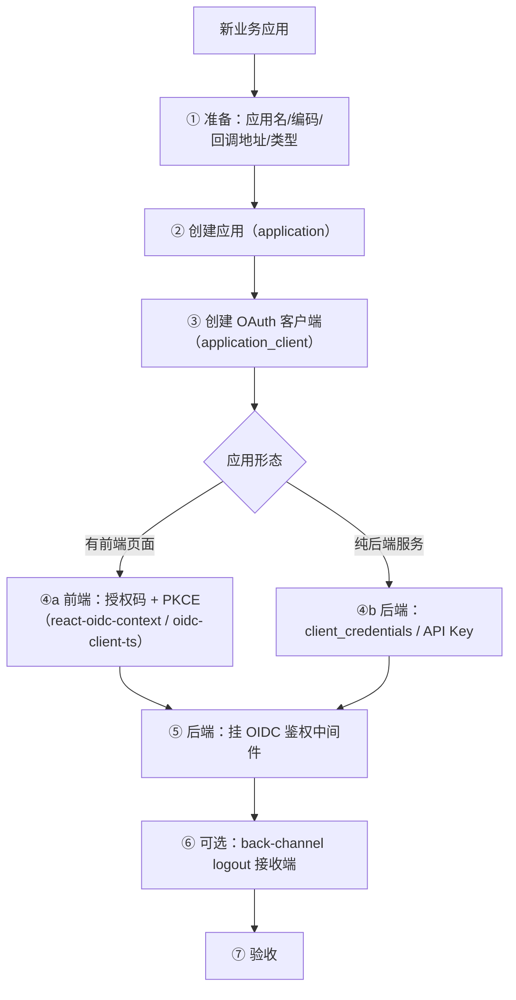
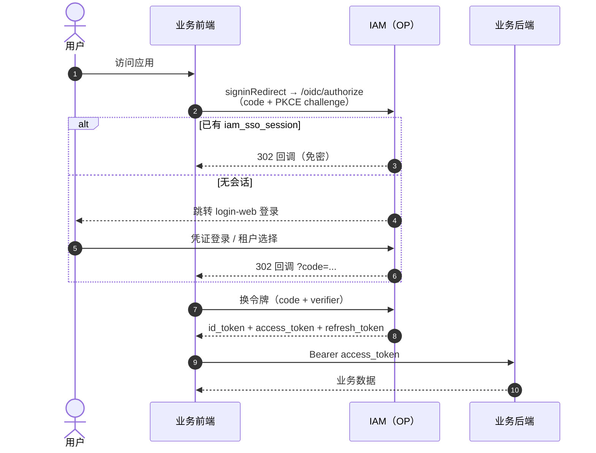
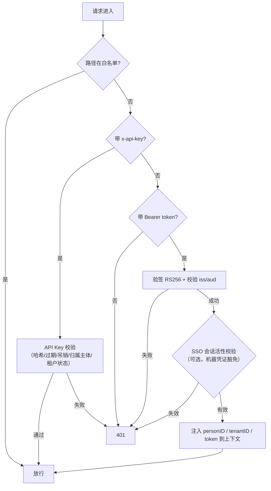
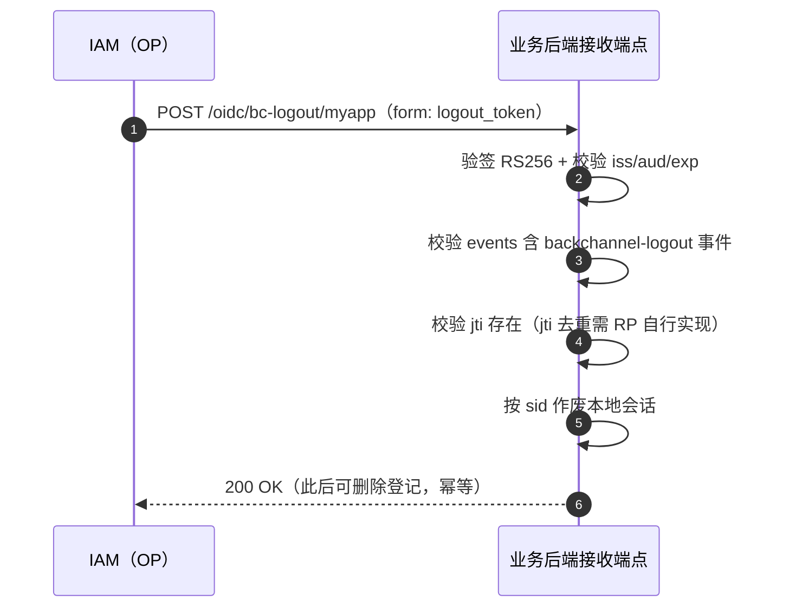
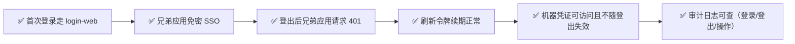

# 新应用接入指南（Application Integration Guide）

> 本文指导**业务应用（RP）**如何接入 Ark IAM，实现：OIDC 登录（SSO）、令牌校验、单点登出（SLO）、机器凭证（API Key / client_credentials）四种能力。
>
> 前置阅读：[sso-oidc-concepts.md](sso-oidc-concepts.md)（协议概念）、[system-design.md](system-design.md) §6（接入流程概览）。

---

## 目录

1. [接入总览](#1-接入总览)
2. [前置准备](#2-前置准备)
3. [创建应用与 OAuth 客户端](#3-创建应用与-oauth-客户端)
4. [前端接入：授权码 + PKCE](#4-前端接入授权码--pkce)
5. [后端接入：令牌校验中间件](#5-后端接入令牌校验中间件)
6. [机器凭证接入：client_credentials 与 API Key](#6-机器凭证接入client_credentials-与-api-key)
7. [单点登出（SLO）接入](#7-单点登出slo接入)
8. [验收清单](#8-验收清单)
9. [常见问题（FAQ）](#9-常见问题faq)

---

## 1. 接入总览



**接入前需明确的问题**：

| 问题 | 影响 |
|---|---|
| 应用有前端页面吗？ | 前端用授权码 + PKCE；无前端用 client_credentials |
| 是自有应用还是第三方应用？ | 来源（`application.source`）：控制台创建恒为 `third_party`；`builtin`/`first_party` 仅由种子与运维产生 |
| 回调地址是什么？ | `redirect_uri` 必须**精确白名单**（HTTPS 生产必填） |
| 需要免登录串访吗？ | 需要 → 确保与 IAM 同浏览器环境（SSO Cookie 生效） |
| 需要服务端到服务端调用吗？ | 需要 → 额外申请 API Key 或 client_credentials |

---

## 2. 前置准备

1. **IAM 环境可访问**：确定 issuer，例如开发环境 `http://localhost:8081/oidc`（生产为正式域名）。访问 `GET {issuer}/.well-known/openid-configuration` 应返回元数据。
2. **账号**：一个可登录平台管理台（platform-admin-web）的账号，用于创建应用与客户端。
3. **密钥可获取**：创建客户端后生成的 `client_secret`（只显示一次，库中只存哈希）。
4. **共享 Redis（可选但推荐）**：需要"登出即失效"的请求粒度校验时，业务后端与 auth 共享同一认证 Redis。

> 提示：平台管理台已提供可视化创建入口；下文同时给出 API 调用方式，便于脚本化/自动化。

---

## 3. 创建应用与 OAuth 客户端

### 3.1 创建应用（Application）

```bash
curl -X POST http://localhost:8082/v1/platform/applications \
  -H "Authorization: Bearer <平台管理员 access_token>" \
  -H "Content-Type: application/json" \
  -d '{
    "code": "my_app",
    "name": "我的业务应用",
    "homepageUrl": "https://my-app.example.com",
    "logoUrl": "https://my-app.example.com/logo.png"
  }'
```

> `code` 即应用编码：**下划线连接**，以小写字母开头，仅含小写字母、数字与下划线（如 `my_app`、`platform_admin`；`AppCodePattern`），连字符/大写会被服务端拒绝。创建入参**不含 `status`**：控制台创建的应用来源固定为 `third_party`、状态固定 `enable`，之后用 `PUT /v1/platform/applications/{appID}` 改状态。

### 3.2 创建 OAuth 客户端（Application Client）

```bash
curl -X POST http://localhost:8082/v1/platform/application-clients \
  -H "Authorization: Bearer <平台管理员 access_token>" \
  -H "Content-Type: application/json" \
  -d '{
    "appID": <上一步返回的 appID>,
    "code": "my_app_web",
    "name": "我的业务应用 Web 端",
    "redirectURIs": ["https://my-app.example.com/callback"],
    "postLogoutRedirectURIs": ["https://my-app.example.com/logged-out"],
    "backChannelLogoutURI": "https://my-app.example.com/oidc/bc-logout",
    "grantTypes": ["authorization_code", "refresh_token"],
    "responseTypes": ["code"],
    "tokenEndpointAuthMethod": "client_secret_basic",
    "requirePKCE": true,
    "defaultScopes": ["openid", "profile"],
    "accessTokenTTL": 900,
    "refreshTokenTTL": 2592000
  }'
# 响应：{"applicationClientID": "<控制台内部主键>", "code": "<OIDC client_id>"}
```

> **客户端编码（`code`，即 OIDC `client_id`）是创建时的必填入参**：小写字母开头，**仅含小写字母与下划线**
> （`model.ClientCodePattern`，`^[a-z][a-z_]*$`——不允许数字，禁连字符），前端表单与后端 service 各校验一份，
> 非法值由 service 拒绝并返回业务错误码 `100822`（HTTP 200，错误码在响应体 `code` 字段）。**自建客户端创建后可改**（`ApplicationClientUpdateReq.code`，改名后该 RP 需同步自己的
> `client_id`，其旧令牌按新 aud 失效）；**内置客户端只读**（报 `100823`）。把它填到 RP 配置的 `client_id`（§4.1）。
> 注意两套「编码」规则刻意不同：**应用编码**（`application.code`）受 `AppCodePattern` 约束（允许数字，
> 如 `my_app_2`；自建应用可改、内置应用只读报 `100749`）；**客户端编码**受 `ClientCodePattern` 约束
> （内置客户端为 `platform_admin_web` / `tenant_admin_web`）。
> 由于 `client_id` 同时是令牌 audience，内置客户端编码必须与网关 aud 白名单、前端默认值保持一致
> （前两者已统一引用 `pkg/model` 的 `SeedBuiltinClient*` 常量）。

| 参数 | 建议值 | 说明 |
|---|---|---|
| `grantTypes` | `["authorization_code","refresh_token"]` | 前端应用标准组合 |
| `responseTypes` | `["code"]` | 授权码模式 |
| `tokenEndpointAuthMethod` | `client_secret_basic` | 机密客户端；纯前端可 `none` + 强制 PKCE |
| `requirePKCE` | `true` | 生产建议强制 PKCE |
| `redirectURIs` | 精确到路径 | 白名单校验，**多一个字符都不匹配** |
| `backChannelLogoutURI` | 指向自己的接收端点 | 用于 SLO（见 §7） |

### 3.3 创建客户端密钥（可选，机密客户端）

```bash
curl -X POST http://localhost:8082/v1/platform/application-clients/{applicationClientID}/secrets \
  -H "Authorization: Bearer <token>" -H "Content-Type: application/json" \
  -d '{"name": "prod-key"}'
# 响应字段 secret（明文）只显示一次，妥善保存；列表仅回显 valuePrefix，库中仅存哈希
```

### 3.4 授权声明契约：`groups`（角色编码）

IAM 通过 **ID token 的 `groups` 声明**把"用户在本租户内拥有哪些角色"交给下游系统自己翻译成权限。这是一份**按应用隔离**的契约，对接时必须先理解三件事：

1. **作用域 = 应用**：`groups` 只包含"**本次登录所用客户端所属应用**"下的角色编码（`application_client.app_id`）。
   同一租户里其它应用的角色**不会**出现在声明里——否则任何应用里造一个同码角色都会命中你的策略命名空间。
2. **值是角色编码（`role.code`）**：小写字母开头，仅含小写字母/数字/下划线（`^[a-z][a-z0-9_]*$`）。
   编码是**契约值**，且**由你在应用角色模板里定义一次**（见下）：租户只能把角色授权给成员，不能改编码，
   也不能自建一个带编码的角色——所以声明里出现的值集合，等价于你在模板里声明过的那份清单。
3. **逐条解析，缺一条即拒绝**：多数下游（对象存储这类）按 `策略名 = claim_prefix + 编码` 纯拼接解析。
   **你的模板里有几个编码，就必须在下游有对应几条策略**——本地实测 RustFS：只要选中集合为空、或其中
   任一条策略名在下游不存在，登录直接以 `InvalidRequest: OIDC policy mapping did not resolve to
   current policies` 被拒（不是"忽略认不出的值"、也不是静默降权）。所以**供给策略必须先于声明模板**：
   模板一保存就物化到各租户，此时若策略还没备好，该应用的**所有已授权用户都会立刻登录失败**。

对接步骤：

```text
① 设计你的策略名与编码的对应关系（建议策略名 = 前缀 + 编码，前缀用于跨产品隔离命名空间）
② 在下游为每个编码供给同名策略（策略名 = 前缀 + 编码）——必须先于 ③
③ 在 IAM 侧为「你这个应用」声明角色模板 roleTemplate（编码 + 展示名），开通该应用的租户会自动获得这些角色
④ 在租户控制台把角色授权给成员；用该应用的客户端登录，检查 ID token 的 groups 与下游实际命中的策略集
```

> **`roleTemplate`（应用角色模板）**：下游策略是**全局命名实体**（策略名 = `claim_prefix` + 编码，一条策略
> 全租户共用，下游没有"角色 ↔ 策略"的映射表可回查），所以"某个编码会在下游存在一条策略"这件事只能由
> **应用方**说了算。据此 IAM 把契约值的定义权收归应用：创建/更新应用时声明模板（详见
> [api-reference.md](api-reference.md)），租户侧只能授权成员、不能造值
> （存储层为 `application.role_template` 列，`serializer:json` + 具名类型 `model.RoleTemplateItemList`）——
> 如果允许租户写编码，任何租户管理员都能创建一个同码角色直接拿到你那条策略（跨租户提权）。
>
> ```bash
> curl -X PUT http://localhost:8082/v1/platform/applications/{appID} \
>   -H "Authorization: Bearer <token>" -H "Content-Type: application/json" \
>   -d '{"roleTemplate": [{"code": "console_admin", "name": "控制台管理员"},
>                         {"code": "readonly", "name": "只读用户"}]}'   # null 不修改；[] 清空
> ```
>
> **全量语义与撤权**：模板是单一事实源，更新即全量替换——新增的编码会在**所有已开通该应用的租户**里物化
> 出新角色；改名会同步回写；**从模板移除的编码会连同该角色在各租户的成员授权与菜单授权一并删除**。
> 因此平台控制台在提交前会二次确认，你更新模板时也要按"这是撤权操作"对待。
>
> **供给顺序是硬要求**：先在下游供给同名策略 → 再声明模板 → 再给用户授权。下游逐条解析策略名，只要
> 有一条解析不到就**整次登录被拒**（RustFS 实测报 `OIDC policy mapping did not resolve to current
> policies`），所以反过来的顺序会让该应用的所有已授权用户当场登录失败。
> 产品锚点编码（`platform_admin`/`tenant_admin`）属平台自身的策略命名空间，不得写进你的模板（服务端报 `100765`）。

---

## 4. 前端接入：授权码 + PKCE

### 4.1 使用 react-oidc-context（React 应用，与平台管理台同方案）

```tsx
// oidcConfig.ts
import { WebStorageStateStore } from 'oidc-client-ts';

export const oidcConfig = {
  authority: 'http://localhost:8081/oidc',          // issuer
  client_id: '<创建 OAuth 客户端时响应返回的 code>',
  redirect_uri: 'https://my-app.example.com/callback',
  post_logout_redirect_uri: 'https://my-app.example.com/logged-out',
  response_type: 'code',                            // 授权码
  scope: 'openid profile email offline_access',     // openid 必须；offline_access 才会下发 refresh_token
  automaticSilentRenew: true,
  userStore: new WebStorageStateStore({ store: sessionStorage }), // 与平台管理台一致，缩小 XSS 暴露窗口
};

// 说明：refresh_token 仅在 scope 含 `offline_access` 且客户端 grantTypes 含 refresh_token 时才签发（zitadel OP 行为）。

// main.tsx
import { AuthProvider } from 'react-oidc-context';
<AuthProvider {...oidcConfig}>
  <App />
</AuthProvider>

// 组件内
import { useAuth } from 'react-oidc-context';
const auth = useAuth();
if (auth.isLoading) return <div>加载中...</div>;
if (!auth.isAuthenticated) { auth.signinRedirect(); return null; }
// 请求业务 API 时附带 access_token
axios.get('/api/me', { headers: { Authorization: `Bearer ${auth.user?.access_token}` } });
```

### 4.2 流程回顾



---

## 5. 后端接入：令牌校验中间件

业务后端（Gin）挂载 `pkg/middleware` 的 `OIDCCompatibleAuth` 中间件，校验流程：



```go
// 应用入口（仿照 platformadmin/app.go）
import (
    "github.com/morehao/ark-iam/pkg/middleware"
    "github.com/morehao/golib/biz/gserver/ginserver"
)

getOIDCPublicKey := middleware.LoadSigningPublicKey(Conf) // 从配置加载 OP 签名公钥

oidcAuthOpts := []middleware.AuthOption{
    middleware.WithOIDCIssuer(Conf.OIDC.Issuer),            // 必须：校验 iss
    middleware.WithOIDCAudiences("<本应用 client_id，即创建客户端响应里的 code>"), // 必须：校验 aud = 本应用 client_id
    middleware.WithAuthSkipPaths("/v1/myapp/register"),     // 可选：免鉴权路径
}
if Conf.OIDC.EnableSSOSessionValidation {
    oidcAuthOpts = append(oidcAuthOpts,
        middleware.WithOIDCSSOValidation(func(ctx *gin.Context, personID string, isMachineToken bool) bool {
            if isMachineToken { return true } // 机器凭证不依赖浏览器会话
            active, err := ssoStore.HasActiveSession(ctx.Request.Context(), personID)
            return err == nil && active
        }))
}

routerGroups := ginserver.NewRouterGroups(engine, "myapp", []ginserver.VersionGroup{{
    Version: ginserver.ApiVersionV1,
    Middlewares: []gin.HandlerFunc{
        middleware.OIDCCompatibleAuth(getOIDCPublicKey, oidcAuthOpts...),
    },
}})
```

**令牌声明读取**（校验通过后注入 gin context）：

| Context Key | 内容 |
|---|---|
| `gcontext.KeyPersonID` | 自然人 ID（`sub=person:<id>` 解析） |
| `gcontext.KeyTenantID` | 租户 ID |
| `gcontext.KeyUserID` | 该 person 在当前租户的成员 ID（由 (tenantID, personID) 反查得到；API Key 通道为归属服务账号 ID） |
| `gcontext.KeyAuthToken` | 原始 access_token |

> 非 Gin 技术栈（Java/Node/Python）：自行实现等价的 JWT 校验——从 `/oidc/keys`（JWKS）取公钥，验 RS256 签名，校验 `iss`/`aud`/`exp`；人登录令牌的私有声明是 `tenant_id`（有中心会话时另含 `sid`），API Key 机器令牌另含 `token_usage=machine` 与 `user_id`。业务侧的资源级鉴权请自行基于这些身份声明实现（IAM 不承载 `resource`/`scope`）。

---

## 6. 机器凭证接入：client_credentials 与 API Key

### 6.1 client_credentials（服务端到服务端）

前提：客户端 `grantTypes` 需包含 `client_credentials`。

```bash
curl -X POST http://localhost:8081/oidc/oauth/token \
  -u "my-app-backend:客户端密钥" \
  -d "grant_type=client_credentials&scope=openid"
# 返回 access_token，sub=client_id（标准 client_credentials 的私有声明仅此一项，无 token_usage）
```

> ⚠️ **标准 `client_credentials` 令牌不能直接访问本系统的业务 API**：它既不是人令牌（无 `sub=person:<id>` / `tenant_id`），也不是机器令牌（无 `token_usage=machine`），会被 `OIDCCompatibleAuth` 直接拒绝（401）。业务场景的机器凭证请用 **API Key**（见 §6.2）——包括「把 API Key 当 client credential 换 token」的用法，那条路径才会签发 `sub=<keyPrefix>` + `token_usage=machine` 的令牌。`client_credentials` 仅用于 OIDC 端点自身的交互。

### 6.2 API Key（推荐，可审计可吊销）

1. 在**租户控制台「API密钥」模块**为服务账号创建 API Key（或 `POST /v1/tenant/api-keys`，body `machineUserID` 指定归属服务账号），得到明文（仅展示一次）；
2. 服务请求时携带 `x-api-key: <64 位 hex 明文>` 头（明文为 32 字节随机数的 64 位小写 hex，无 `ak_` 前缀；也可放进 `Authorization: Bearer`）；
3. 中间件校验：哈希定位 → 未过期/未吊销 → 解析归属服务账号注入身份上下文 → 通过。

```bash
curl https://my-api.example.com/v1/... -H "x-api-key: 8f3ab2c9d0e1..."
```

**差异对比**：

| 维度 | client_credentials | API Key |
|---|---|---|
| 凭证形态 | client_id + client_secret | 单串 API Key |
| 交互方式 | token 端点换令牌 | 直接请求头携带 |
| 生命周期 | 随客户端配置 | 可独立过期/吊销 |
| 适用 | 标准 OAuth 客户端 | 轻量服务/脚本/集成 |

> **API Key 签发的 token**（`token_usage=machine`）**不依赖浏览器 SSO 会话活性**，登出不会使其失效，需通过吊销/过期管理。（普通 `client_credentials` 令牌没有该标记，也过不了业务中间件，见 §6.1。）

---

## 7. 单点登出（SLO）接入

### 7.1 前端登出

```tsx
// react-oidc-context
auth.signoutRedirect({ post_logout_redirect_uri: 'https://my-app.example.com/logged-out' });
// 或直接调用 OP 端点
// window.location = 'http://localhost:8081/oidc/end_session?client_id=<client_id>&post_logout_redirect_uri=...'
```

OP 收到登出请求后：清除 `iam_sso_session` Cookie → 撤销该 person 全部 SSO 会话与 Refresh Token → 入队反向通道登出通知。

> ⚠️ **前置条件：`post_logout_redirect_uri` 必须在客户端白名单里**（`application_client.post_logout_redirect_uris`，控制台字段「登出回调地址」）。`/oidc/end_session` 对该参数做**精确匹配**（含末尾斜杠是否一致），不匹配时返回 `400 {"error":"invalid_request","error_description":"post_logout_redirect_uri invalid"}`——**它不会跳回你的应用**，用户只会看到这段 JSON 错误。实践中最容易漏配的形态是「客户端建好了、登出回调地址留空」：登录/令牌一切正常，一点退出就报这个错（Gitea 接入时即如此，补 `["http://localhost:3009/"]` 后恢复 302）。RP 发起登出时建议同时带上 `client_id`（Gitea 的做法：`end_session?client_id=…&post_logout_redirect_uri=<AppURL>/`）。

### 7.2 反向通道登出接收端（Gin 示例）

```go
import "github.com/morehao/ark-iam/pkg/goidc"

// 挂载接收端点（路径与客户端注册的 backChannelLogoutURI 一致）
group := engine.Group("/oidc")
basePath := Conf.OIDC.BackChannelLogoutPath // 本仓约定 /bc-logout/<app>（如 /bc-logout/platform）；pkg/goidc 通用兜底为 /oidc/bc-logout
goidc.RegisterReceiverRoutes(group, basePath, getOIDCPublicKey, Conf.OIDC.Issuer, "<本应用 client_id>",
    func(ctx *gin.Context, claims *goidc.LogoutTokenClaims) error {
        // 验签通过后作废本地会话：传 nil 只会验签、不会登出
        return localSessionStore.RevokeBySessionID(ctx.Request.Context(), claims.SessionID)
    })
```

**接收端职责**（`pkg/goidc` 已实现）：



> **重要**：logout_token 的校验项必须完整实现，不可仅验签名——详见 `ParseLogoutToken` 的注释（`events`、`sub`、`jti`、`aud` 缺一不可；其中 **jti 去重由 RP 自行实现**，接收端只校验其存在）。`RegisterReceiverRoutes` 的最后一个参数是 `SessionRevoker` 回调，传 `nil` 表示「只验签、不作废本地会话」。

### 7.3 不接入 SLO 的降级行为

即使不配置 `back_channel_logout_uri`，业务 API 在启用 `EnableSSOSessionValidation` 且共享 Redis 时，仍会在**下一次请求**因 SSO 会话已撤销而返回 401（请求粒度登出失效）。反向通道登出接入只是让**已打开页面**也能即时登出。

---

## 8. 验收清单



| # | 验收项 | 验证方式 |
|---|---|---|
| 1 | 授权码 + PKCE 登录成功 | 浏览器访问应用 → 跳登录 → 回跳成功 |
| 2 | 回调地址校验 | 篡改 `redirect_uri` 应被拒绝 |
| 3 | SSO 免密 | 先登录平台管理台，再访问本应用（同浏览器）应免密 |
| 4 | 登出即失效 | 任一应用登出 → 本应用刷新 → 跳登录 |
| 5 | 令牌续期 | 等 access_token 过期（默认 15min）自动静默续期 |
| 6 | 机器凭证 | 服务间调用带 `x-api-key` 成功；吊销后立即 401 |
| 7 | 审计 | 平台管理台可见本应用相关登录/操作审计 |
| 8 | 生产安全 | issuer 为正式域名、HTTPS、`cookieSecure: true`、密钥非默认 |

---

## 9. 常见问题（FAQ）

**Q1：登录成功后一直 401？**
依次排查：issuer 是否与签发一致（`iss` 必须精确匹配）；`aud` 是否包含本应用 client_id；公钥是否与 auth 签名密钥一致（`/oidc/keys` 与配置的 `SigningPrivateKeyPath`）；SSO 会话校验是否误开启（未共享 Redis 时应关闭 `EnableSSOSessionValidation`）。

**Q2：回调被拒绝（invalid redirect_uri）？**
`redirectURIs` 白名单必须与请求**逐字符一致**（含协议、端口、路径）。检查 trailing slash、大小写、`http/https`。

**Q3：refresh_token 换新后旧 token 还能用吗？**
不能。本系统刷新令牌**轮换**：每次刷新签发新 refresh_token，旧令牌作废。

**Q4：第三方应用想接入但不想共享 Redis？**
可以：不开启 `EnableSSOSessionValidation`，仅做 JWT 验签 + iss/aud 校验；登出即时性退化为"access_token 过期后失效"。

**Q5：token 里能拿到什么身份信息？**
标准声明：`sub`（人登录为 `person:<id>`）、`client_id`、`iss`/`aud`/`exp` 等。私有声明：**人登录令牌**只有 `tenant_id`（有中心会话时另含 `sid`）；**API Key 机器令牌**另有 `token_usage=machine` 与 `user_id`。更多资料：`/oidc/userinfo` 按 scope 返回 `name`/`preferred_username`/`email`/`phone`（**不含头像**）；头像与租户内资料走本系统 `GET /v1/auth/userinfo`。

**Q6：前端如何获取用户资料？**
`GET /v1/auth/userinfo`（`Authorization: Bearer <access_token>`）返回 `personInfo` + `userInfo`（租户内信息）。
