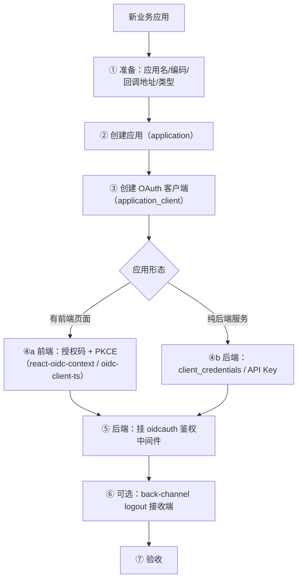
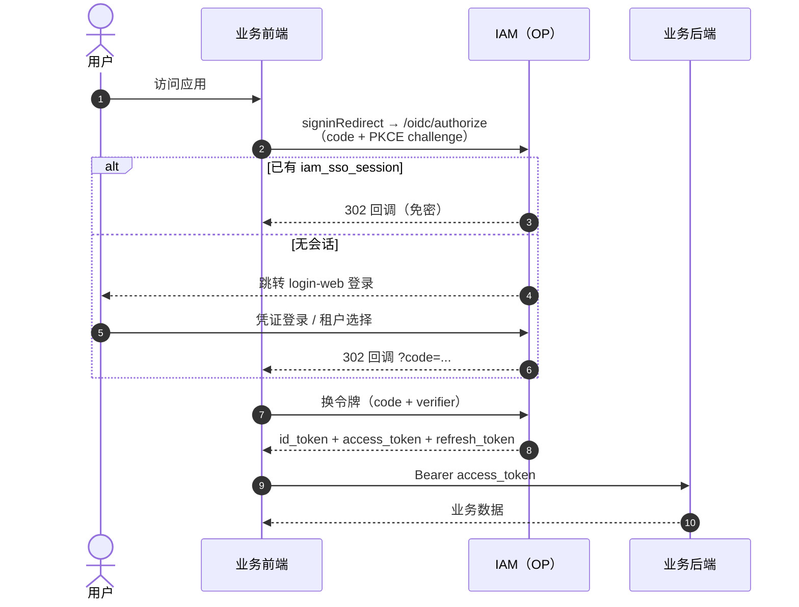
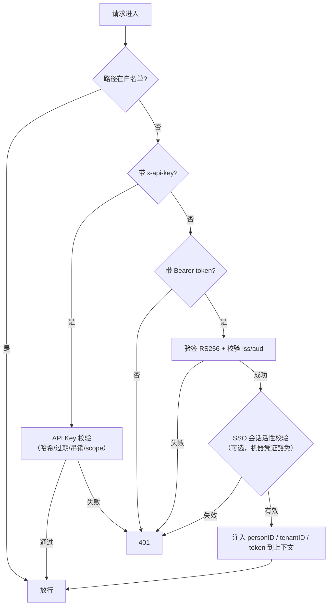
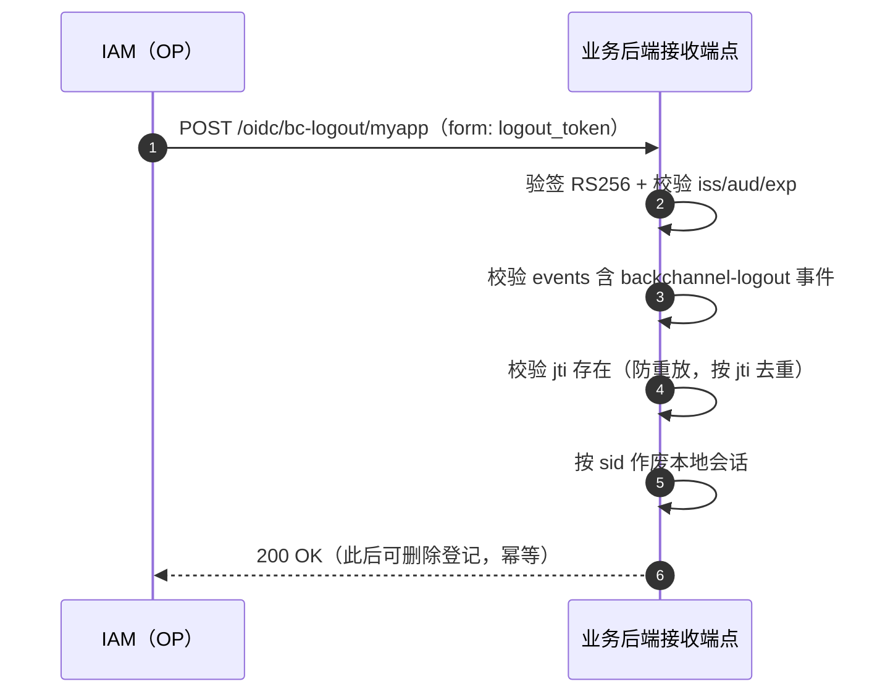
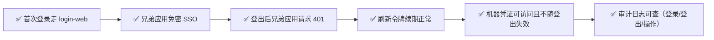

# 新应用接入指南（Application Integration Guide）

> 本文指导**业务应用（RP）**如何接入 Ark IAM，实现：OIDC 登录（SSO）、令牌校验、单点登出（SLO）、机器凭证（API Key / client_credentials）四种能力。
>
> 前置阅读：[sso-oidc-concepts.md](sso-oidc-concepts.md)（协议概念）、[system-design.md](system-design.md) §6（接入流程概览）。

---

## 目录

1. [接入总览](#1-接入总览)
2. [前置准备](#2-前置准备)
3. [创建应用与 OAuth 客户端](#3-创建应用与-oauth-客户端)
4. [前端接入：授权码 + PKCE](#4-前端接入授权码--pkce)
5. [后端接入：令牌校验中间件](#5-后端接入令牌校验中间件)
6. [机器凭证接入：client_credentials 与 API Key](#6-机器凭证接入client_credentials-与-api-key)
7. [单点登出（SLO）接入](#7-单点登出slo接入)
8. [验收清单](#8-验收清单)
9. [常见问题（FAQ）](#9-常见问题faq)

---

## 1. 接入总览



**接入前需明确的问题**：

| 问题 | 影响 |
|---|---|
| 应用有前端页面吗？ | 前端用授权码 + PKCE；无前端用 client_credentials |
| 是自有应用还是第三方应用？ | `first_party` / `third_party`（`application.type`） |
| 回调地址是什么？ | `redirect_uri` 必须**精确白名单**（HTTPS 生产必填） |
| 需要免登录串访吗？ | 需要 → 确保与 IAM 同浏览器环境（SSO Cookie 生效） |
| 需要服务端到服务端调用吗？ | 需要 → 额外申请 API Key 或 client_credentials |

---

## 2. 前置准备

1. **IAM 环境可访问**：确定 issuer，例如开发环境 `http://localhost:8081/oidc`（生产为正式域名）。访问 `GET {issuer}/.well-known/openid-configuration` 应返回元数据。
2. **账号**：一个可登录平台管理台（platform-admin-web）的账号，用于创建应用与客户端。
3. **密钥可获取**：创建客户端后生成的 `client_secret`（只显示一次，库中只存哈希）。
4. **共享 Redis（可选但推荐）**：需要"登出即失效"的请求粒度校验时，业务后端与 auth 共享同一认证 Redis。

> 提示：平台管理台已提供可视化创建入口；下文同时给出 API 调用方式，便于脚本化/自动化。

---

## 3. 创建应用与 OAuth 客户端

### 3.1 创建应用（Application）

```bash
curl -X POST http://localhost:8082/v1/platform/applications \
  -H "Authorization: Bearer <平台管理员 access_token>" \
  -H "Content-Type: application/json" \
  -d '{
    "code": "my-app",
    "name": "我的业务应用",
    "type": "first_party",
    "status": "enable",
    "visibility": "public",
    "homepageURL": "https://my-app.example.com",
    "logoURL": "https://my-app.example.com/logo.png"
  }'
```

### 3.2 创建 OAuth 客户端（Application Client）

```bash
curl -X POST http://localhost:8082/v1/platform/application-clients \
  -H "Authorization: Bearer <平台管理员 access_token>" \
  -H "Content-Type: application/json" \
  -d '{
    "appID": <上一步返回的 appID>,
    "name": "my-app-web",
    "clientID": "my-app-web",
    "redirectURIs": ["https://my-app.example.com/callback"],
    "postLogoutRedirectURIs": ["https://my-app.example.com/logged-out"],
    "backChannelLogoutURI": "https://my-app.example.com/oidc/bc-logout",
    "grantTypes": ["authorization_code", "refresh_token"],
    "responseTypes": ["code"],
    "tokenEndpointAuthMethod": "client_secret_basic",
    "requirePKCE": true,
    "defaultScopes": ["openid", "profile"],
    "accessTokenTTL": 900,
    "refreshTokenTTL": 2592000
  }'
```

| 参数 | 建议值 | 说明 |
|---|---|---|
| `grantTypes` | `["authorization_code","refresh_token"]` | 前端应用标准组合 |
| `responseTypes` | `["code"]` | 授权码模式 |
| `tokenEndpointAuthMethod` | `client_secret_basic` | 机密客户端；纯前端可 `none` + 强制 PKCE |
| `requirePKCE` | `true` | 生产建议强制 PKCE |
| `redirectURIs` | 精确到路径 | 白名单校验，**多一个字符都不匹配** |
| `backChannelLogoutURI` | 指向自己的接收端点 | 用于 SLO（见 §7） |

### 3.3 创建客户端密钥（可选，机密客户端）

```bash
curl -X POST http://localhost:8082/v1/platform/application-clients/{applicationClientID}/secrets \
  -H "Authorization: Bearer <token>" -H "Content-Type: application/json" \
  -d '{"name": "prod-key"}'
# 返回的 value 只显示一次，妥善保存；库中仅存哈希
```

---

## 4. 前端接入：授权码 + PKCE

### 4.1 使用 react-oidc-context（React 应用，与平台管理台同方案）

```tsx
// oidcConfig.ts
import { WebStorageStateStore } from 'oidc-client-ts';

export const oidcConfig = {
  authority: 'http://localhost:8081/oidc',          // issuer
  client_id: 'my-app-web',
  redirect_uri: 'https://my-app.example.com/callback',
  post_logout_redirect_uri: 'https://my-app.example.com/logged-out',
  response_type: 'code',                            // 授权码
  scope: 'openid profile',                          // openid 必须
  automaticSilentRenew: true,
  userStore: new WebStorageStateStore({ store: window.localStorage }),
};

// main.tsx
import { AuthProvider } from 'react-oidc-context';
<AuthProvider {...oidcConfig}>
  <App />
</AuthProvider>

// 组件内
import { useAuth } from 'react-oidc-context';
const auth = useAuth();
if (auth.isLoading) return <div>加载中...</div>;
if (!auth.isAuthenticated) { auth.signinRedirect(); return null; }
// 请求业务 API 时附带 access_token
axios.get('/api/me', { headers: { Authorization: `Bearer ${auth.user?.access_token}` } });
```

### 4.2 流程回顾



---

## 5. 后端接入：令牌校验中间件

业务后端（Gin）挂载 `pkg/middleware/oidcauth` 的 `OIDCCompatibleAuth` 中间件，校验流程：



```go
// 应用入口（仿照 platformadmin/app.go）
import (
    "github.com/morehao/ark-iam/pkg/middleware/oidcauth"
    "github.com/morehao/golib/biz/gserver/ginserver"
)

getOIDCPublicKey := oidcauth.LoadSigningPublicKey(Conf) // 从配置加载 OP 签名公钥

oidcAuthOpts := []oidcauth.AuthOption{
    oidcauth.WithOIDCIssuer(Conf.OIDC.Issuer),            // 必须：校验 iss
    oidcauth.WithOIDCAudiences("my-app-web"),             // 必须：校验 aud = 本应用 client_id
    oidcauth.WithAuthSkipPaths("/v1/myapp/register"),     // 可选：免鉴权路径
}
if Conf.OIDC.EnableSSOSessionValidation {
    oidcAuthOpts = append(oidcAuthOpts,
        oidcauth.WithOIDCSSOValidation(func(ctx *gin.Context, personID uint, isMachineToken bool) bool {
            if isMachineToken { return true } // 机器凭证不依赖浏览器会话
            active, err := ssoStore.HasActiveSession(ctx.Request.Context(), personID)
            return err == nil && active
        }))
}

routerGroups := ginserver.NewRouterGroups(engine, "myapp", ginserver.VersionGroup{
    Version: ginserver.ApiVersionV1,
    Middlewares: []gin.HandlerFunc{
        oidcauth.OIDCCompatibleAuth(getOIDCPublicKey, oidcAuthOpts...),
    },
})
```

**令牌声明读取**（校验通过后注入 gin context）：

| Context Key | 内容 |
|---|---|
| `gcontext.KeyPersonID` | 自然人 ID（`sub=person:<id>` 解析） |
| `gcontext.KeyTenantID` | 租户 ID |
| `gcontext.KeyAuthToken` | 原始 access_token |

> 非 Gin 技术栈（Java/Node/Python）：自行实现等价的 JWT 校验——从 `/oidc/keys`（JWKS）取公钥，验 RS256 签名，校验 `iss`/`aud`/`exp`，解析 `tenant_id`/`user_id`。`resource`/`scope` 可按业务需要进一步鉴权。

---

## 6. 机器凭证接入：client_credentials 与 API Key

### 6.1 client_credentials（服务端到服务端）

前提：客户端 `grantTypes` 需包含 `client_credentials`。

```bash
curl -X POST http://localhost:8081/oidc/oauth/token \
  -u "my-app-backend:客户端密钥" \
  -d "grant_type=client_credentials&scope=openid"
# 返回 access_token，sub=client_id，token_usage=machine
```

### 6.2 API Key（推荐，可审计可吊销）

1. 平台管理台创建 API Key（或 `POST /v1/platform/api-keys`），得到 `ak_<前缀>` 明文；
2. 服务请求时携带 `x-api-key: ak_xxx` 头；
3. 中间件校验：前缀定位 → 哈希比对 → 未过期/未吊销 → 通过。

```bash
curl https://my-api.example.com/v1/... -H "x-api-key: ak_8f3ab2c9..."
```

**差异对比**：

| 维度 | client_credentials | API Key |
|---|---|---|
| 凭证形态 | client_id + client_secret | 单串 API Key |
| 交互方式 | token 端点换令牌 | 直接请求头携带 |
| 生命周期 | 随客户端配置 | 可独立过期/吊销 |
| 适用 | 标准 OAuth 客户端 | 轻量服务/脚本/集成 |

> 机器凭证签发的 token（`token_usage=machine`）**不依赖浏览器 SSO 会话活性**，登出不会使其失效，需通过吊销/过期管理。

---

## 7. 单点登出（SLO）接入

### 7.1 前端登出

```tsx
// react-oidc-context
auth.signoutRedirect({ post_logout_redirect_uri: 'https://my-app.example.com/logged-out' });
// 或直接调用 OP 端点
// window.location = 'http://localhost:8081/oidc/end_session?post_logout_redirect_uri=...'
```

OP 收到登出请求后：清除 `iam_sso_session` Cookie → 撤销该 person 全部 SSO 会话与 Refresh Token → 入队反向通道登出通知。

### 7.2 反向通道登出接收端（Gin 示例）

```go
import "github.com/morehao/ark-iam/pkg/oidc/logout"

// 挂载接收端点（路径与客户端注册的 backChannelLogoutURI 一致）
group := engine.Group("/oidc")
basePath := Conf.OIDC.BackChannelLogoutPath // 默认 /bc-logout/myapp
logout.RegisterReceiverRoutes(group, basePath, getOIDCPublicKey, Conf.OIDC.Issuer, "my-app-web", nil)
```

**接收端职责**（`pkg/oidc/logout` 已实现）：



> **重要**：logout_token 的校验项必须完整实现，不可仅验签名——详见 `ParseLogoutToken` 的注释（事件、jti、aud 缺一不可）。

### 7.3 不接入 SLO 的降级行为

即使不配置 `back_channel_logout_uri`，业务 API 在启用 `EnableSSOSessionValidation` 且共享 Redis 时，仍会在**下一次请求**因 SSO 会话已撤销而返回 401（请求粒度登出失效）。反向通道登出接入只是让**已打开页面**也能即时登出。

---

## 8. 验收清单



| # | 验收项 | 验证方式 |
|---|---|---|
| 1 | 授权码 + PKCE 登录成功 | 浏览器访问应用 → 跳登录 → 回跳成功 |
| 2 | 回调地址校验 | 篡改 `redirect_uri` 应被拒绝 |
| 3 | SSO 免密 | 先登录平台管理台，再访问本应用（同浏览器）应免密 |
| 4 | 登出即失效 | 任一应用登出 → 本应用刷新 → 跳登录 |
| 5 | 令牌续期 | 等 access_token 过期（默认 15min）自动静默续期 |
| 6 | 机器凭证 | 服务间调用带 `x-api-key` 成功；吊销后立即 401 |
| 7 | 审计 | 平台管理台可见本应用相关登录/操作审计 |
| 8 | 生产安全 | issuer 为正式域名、HTTPS、`cookieSecure: true`、密钥非默认 |

---

## 9. 常见问题（FAQ）

**Q1：登录成功后一直 401？**
依次排查：issuer 是否与签发一致（`iss` 必须精确匹配）；`aud` 是否包含本应用 client_id；公钥是否与 auth 签名密钥一致（`/oidc/keys` 与配置的 `SigningPrivateKeyPath`）；SSO 会话校验是否误开启（未共享 Redis 时应关闭 `EnableSSOSessionValidation`）。

**Q2：回调被拒绝（invalid redirect_uri）？**
`redirectURIs` 白名单必须与请求**逐字符一致**（含协议、端口、路径）。检查 trailing slash、大小写、`http/https`。

**Q3：refresh_token 换新后旧 token 还能用吗？**
不能。本系统刷新令牌**轮换**：每次刷新签发新 refresh_token，旧令牌作废。

**Q4：第三方应用想接入但不想共享 Redis？**
可以：不开启 `EnableSSOSessionValidation`，仅做 JWT 验签 + iss/aud 校验；登出即时性退化为"access_token 过期后失效"。

**Q5：token 里能拿到什么身份信息？**
access_token 私有声明：`tenant_id`、`user_id`、`client_id`、`token_usage`；`sub=person:<id>`。更多资料（姓名/头像/邮箱）走 `/oidc/userinfo` 或本系统 `GET /v1/auth/userinfo`。

**Q6：前端如何获取用户资料？**
`GET /v1/auth/userinfo`（`Authorization: Bearer <access_token>`）返回 `personInfo` + `userInfo`（租户内信息）。
