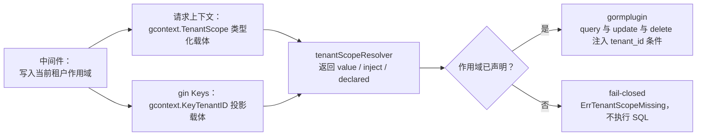

# 上下文传递与租户作用域（约定 + 实施记录）

> **状态：已落地（2026-09-16）**。本文是「ctx 怎么传、租户隔离怎么生效、跨租户查询怎么写」的唯一权威文档；结论同步维护在 `AGENTS.md`「上下文传递与租户作用域（must）」与 `system-design.md` §7.1。
> **外部契约不变**：不改 HTTP 接口、不改表结构、不改前端。唯一的对外行为变化是——缺少租户作用域的 query/update/delete 从**静默返回全量**变为**明确报错**（`dbclient.ErrTenantScopeMissing`）。
> 本文合并了原「治理技术方案（待实施）」与 2026-09-16 的评审稿（`context-and-tenant-scope-review-20260916.md`，已并入本文后删除）；评审中对原方案的修订、被否掉的设计与依据一并保留在第 3 节。

---

## 目录

1. [规范（写代码看这里）](#1-规范写代码看这里)
2. [机制：作用域如何驱动隔离](#2-机制作用域如何驱动隔离)
3. [为什么这样设计（评审结论）](#3-为什么这样设计评审结论)
4. [验收结果](#4-验收结果)
5. [实施记录：改动清单与真实缺陷](#5-实施记录改动清单与真实缺陷)
6. [遗留与后续](#6-遗留与后续)
7. [附录](#7-附录)

---

## 1. 规范（写代码看这里）

含 `tenant_id` 列的表，其 SELECT/UPDATE/DELETE 由租户隔离插件（`pkg/dbclient/tenant_scope.go`）自动注入 `tenant_id = ?`；**ctx 未声明作用域时 fail-closed 报错**（`dbclient.ErrTenantScopeMissing`），绝不静默放行成跨租户读。

### 规则 1：ctx 一路直传 `*gin.Context`

controller → service → dao → 第三方（OIDC provider、glog、限流器）都传同一个 gin ctx。4 个 `cmd/main.go` 已开 `engine.ContextWithFallback = true`，gin 上下文本身即合法 `context.Context`（`Value/Done/Err/Deadline` 转发到请求的 context）。

| 场景 | 写法 |
|---|---|
| 业务代码任意位置 | `ctx`（gin 上下文直传），**禁止** `ctx.Request.Context()` |
| 异步/后台续跑 | `gincontext.AsyncContext(ctx)`（保留取值与作用域、去掉取消，且不持有会被 gin 复用的上下文） |
| 必须跨 `http.Handler` 边界搬运值（zitadel `op.Provider` 只能看到 `*http.Request`） | `gincontext.WithRequestValue(ctx, key, value)`（全仓唯一的请求上下文写入口） |

### 规则 2：作用域只能显式声明

禁止用「ctx 恰好没有作用域」表达跨租户可见——那会让上游一旦带上租户就变成静默误过滤（少读不报错、UPDATE 命中 0 行不报错）。

| 语义 | 声明方式 | 典型位置 |
|---|---|---|
| 当前租户（默认） | `gincontext.SetTenantScope(ctx, gcontext.CurrentScope(tenantID))` | 认证中间件写一次：`pkg/middleware/oidc_auth.go`（OIDC claims）、`pkg/middleware/apikey_auth.go`（API Key 归属租户） |
| 指定它租户 | `dbclient.ExplicitTenantContext(ctx, tenantID)` | 加入租户、平台侧运维他人租户、新建租户的根部门/成员/权限 |
| 跨全部租户 | `dbclient.CrossTenantContext(ctx)` | 按全局唯一键（client_id、API Key 摘要、refresh token 摘要、行 ID）反查、自然人级全局登出 |
| 非请求入口 | `gcontext.WithTenantScope(ctx, gcontext.AllScope()/CurrentScope(tenantID))` | 启动期 AutoMigrate + Seed、审计写入、后台 worker |

### 规则 3：新增全局表必须登记

不含 `tenant_id` 的新表要同步登记到 `pkg/dbclient/gorm.go` 的 `tenantScopeSkipTables`（当前：`person`、`tenant`、`application`、`menu`、`user_identity`、`application_client_secret`），否则带租户上下文的查询会报 `no such column`。

### 规则 4：测试同样受约束

`testutil.SetupSQLite` → `dbclient.RegisterDBForTest` 挂载**与生产同一份**插件，测试里对租户表的断言查询也必须带作用域：优先复用被测服务同一个 gin ctx；确需跨租户时显式 `dbclient.CrossTenantContext(...)` 并写一行理由。**禁止**用 `SetMissingTenantScopeMode(Warn)`、禁止跳过/弱化断言来"修绿"。

### 规则 5：灰度回退只有一个开关

`dbclient.SetMissingTenantScopeMode(dbclient.MissingTenantScopeWarn)`（只告警不拦截，可随时切回），仅用于灰度期与紧急回退，**不得**作为长期方案。

反例（评审前的主要错误形态）：

```go
// ✗ 用 ctx 类型表达作用域：同一个方法，传哪种 ctx 决定要不要隔离
userDao.GetListByCond(ctx, cond)                   // 注入 tenant_id = 当前租户
userDao.GetListByCond(ctx.Request.Context(), cond) // 不过滤，全租户 —— 且不报错

// ✓ 作用域由调用点显式声明，ctx 只有一种传法
userDao.GetListByCond(ctx, cond)                                              // 当前租户（中间件已写）
dao.NewUserDao().GetByCond(dbclient.CrossTenantContext(ctx), &dao.UserCond{…}) // 全局唯一键反查
dao.NewUserDao().GetByCond(dbclient.ExplicitTenantContext(ctx, tid), &dao.UserCond{…}) // 指定租户
```

---

## 2. 机制：作用域如何驱动隔离



| 组件 | 位置 | 说明 |
|---|---|---|
| 作用域值 | golib `biz/gcontext/scope.go` | `TenantScope{Kind,TenantID}`，`Kind ∈ {Current, Explicit, All}`；`TenantScopeFilter(ctx) (value, inject, declared)` 是「三类作用域 → 是否注入」的唯一翻译点 |
| 写入/异步/搬运 | golib `biz/gcontext/gincontext/scope.go` | `SetTenantScope`（写请求上下文，**仅对 Current** 投影 gin Keys）、`AsyncContext`/`AsyncContextWithTimeout`、`WithRequestValue` |
| 数据层 | ark-iam `pkg/dbclient/tenant_scope.go` | 三元 resolver（类型化优先，gin Keys 兜底）+ `handleMissingTenantScope`（默认报错，可切告警）+ `CrossTenantContext`/`ExplicitTenantContext`/`CurrentTenantContext` |
| 插件实现 | golib `dbaccess/gormplugin/scope.go` | `ScopeConfig{FieldName, Resolver, MissingScope, SkipTables}`；条件用 `clause.Column`（PG 生成 `"table"."tenant_id"`，方言安全）；**不覆盖 INSERT**（`tenant_id` 由实体显式赋值） |
| 挂载 | ark-iam `pkg/dbclient/gorm.go` | `UseTenantScopePlugin(db)` 服务与测试共用；`RegisterDBForTest` 同配置挂载（测试库与生产同隔离） |

**两层载体的取舍**：规范声明是请求上下文里的类型化作用域——跨 `http.Handler` 的协议层（zitadel `op.Storage`）、异步任务、第三方库同样可见，因此 OIDC 协议层不需要任何桥接代码。`SetTenantScope` 同时对 Current 投影 gin Keys，让 `gincontext.Get*String` 的 135 处读取点与历史写法继续可用；代价是当类型化作用域缺失、只剩投影时，隔离结果由投影决定——已通过「唯一写入点 + fail-closed + 守卫测试 + 两类载体一致性测试」兜底。

---

## 3. 为什么这样设计（评审结论）

### 3.1 改造前的四个痛点（P1–P4）

| 编号 | 痛点 | 证据 |
|---|---|---|
| **P1** | 同一查询因 ctx 类型而语义不同 | 实测（双租户 `audit_log` 夹具）：传 gin ctx 返回 1 行，传 `ctx.Request.Context()` 返回 2 行——不是文档约定，而是隐式行为 |
| **P2** | 失败是静默的，且现有测试测不出 | `GET /v1/auth/me/tenants` 依赖跨租户查询；被注入当前租户过滤后列表从 N 塌缩为 1，**不报错**；回归测试 `TestMyTenants` 只有单租户夹具、断言 `Len==1`，与破坏后结果相同；更根本的是 `SetupSQLite` 当时注册的是**未挂插件**的库，app 层测试从不执行租户过滤 |
| **P3** | 同类风险不止一处 | 非测试代码 55 处 `ctx.Request.Context()`，27 处是 dao 调用，其中 6 处是跨租户/指定它租户查询（如 `JoinTenant` 用当前租户去查目标租户成员 → 假阴性 → 重复建成员；`RevokeByPersonID` 从"全部会话"退化为"仅当前租户"） |
| **P4** | 其余 28 处与租户无关，纯粹是"gin ctx 当 context 用有残缺" | `Value` 对非 string key、`Done/Err/Deadline` 只在 `ContextWithFallback == true` 时转发（gin v1.12 `context.go:1434-1438,1467-1483`），而当时 4 处 `gin.New()` 从未开该开关 |

核心承诺是多租户隔离，P2 类缺陷一次发生就是**跨租户可见性错误或越权**；改造前既无编译期约束、无 lint 规则、也无能覆盖它的测试——三项守卫全缺。

### 3.2 两条硬约束的探针验证

评审新增约束：① 业务侧**只传 handler 的 `*gin.Context`**，不出现 `.Request.Context()`；② 底层实现**不做载体类型断言**。用可运行探针（SQLite + golib 插件 + DryRun）验证：

| `ContextWithFallback` | `db.WithContext(ginCtx)` | `db.WithContext(ginCtx.Request.Context())` | `tenantScopeFrom(ginCtx)` | `ginCtx` 作为 `context.Context` |
|---|---|---|---|---|
| **true** | `… AND "tenant_user"."tenant_id" = ?` | **逐字节相同** | 命中 | `Done()` 非 nil；`cancel()` 后 `Err() == Canceled` |
| **false** | **无 tenant 条件（静默不过滤！）** | 仍带 tenant 条件 | miss | `Done() == nil`（不透传） |

> 测量口径：request ctx 必须是**可取消**的（`req.WithContext(cancelCtx)`）；沿用 `http.NewRequest` 默认的 `context.Background()` 会让 `Done()` 恒为 nil，把"未透传"误判为"透传"。
> 另两项实测：PG 方言下 golib 插件与自研插件 SQL 逐字节相同；事务内 Skip 传播（打在事务外或 tx 句柄上都生效）。

两条结论：约束①②在开关打开时同时成立（`pkg/dbclient` 断言数为 0）；**开关是承重件，且漏配的失败模式是"静默跨租户读"而非报错**——因此"缺失即报错"从"待补能力"升级为不可省的保险。

### 3.3 原方案被否掉的部分（F1–F9）

原方案把作用域从 ctx 类型里拿出来是对的，但它把身份**只**留在 gin Keys 的字符串 key 上，于是等于用"约定 + 字符串"替换"动态类型"，`ctx` 与 `ctx.Request.Context()` 的语义分裂依旧存在。评审逐条给出：

| 编号 | 严重度 | 结论与最终处置 |
|---|---|---|
| F1 | P0 | 原方案 G2（两种 ctx 解析一致）在"身份只在 gin Keys"下**不成立**：请求上下文里从未写过 tenantID，`c.Keys` 也不会反向同步。→ 最终把类型化作用域写进请求上下文，G2 成为可测断言（§4） |
| F2 | P0 | golib `gormplugin` 没有"缺失即报错"能力，`ExtractFunc` 取不到值即静默放行。→ 新增 `MissingScope` 钩子；`declared=false` 时调用，返回 error 即 `AddError` 且不执行 SQL |
| F3 | P0 | 用「`.Request.Context()` 出现次数」当"无作用域路径"的代理指标**不等价**：真实口径是「对租户表做 query/update/delete 时作用域是否缺省」，漏掉了 seed、协议层（`oidcop`）、平台侧跨租户运维等一等路径。→ 改口径后重盘，失败面从预估 6 处变成 55 个失败测试 + 若干无测试覆盖的生产缺陷（§5.2） |
| F4 | P0 | 原方案 M3「告警清零」是空判据（测试不到即告警为 0）。→ 直接 fail-closed 并以测试为判据，不靠告警计数 |
| F5 | P1 | 用 `Skip`（夹具关闭作用域）表达"指定它租户"是过度授权（一次性关掉整串查询）。→ 用 `ExplicitScope(tenantID)`，`Explicit` 带空 tenantID 时 `Declared()=false` ⇒ fail-closed，不会退化成"匹配空串" |
| F6 | P1 | 插件不覆盖 INSERT。→ 明确边界：`tenant_id` 由实体显式赋值；子表归属校验靠外键/应用层，不指望插件 |
| F7 | P1 | `WithCrossTenant()` 作 `DaoOption` 会与测试注入互相覆盖。→ 不做该 API，改为 `ctx` 上的显式声明（可组合、无状态） |
| F8 | P2 | 「Skip 必须打在事务句柄上」与实测矛盾。→ 实测证明事务内外都生效，文档据此改写 |
| F9 | P2 | 量化与文档卫生（引用的行号/次数与实际不符）。→ 本次实现全部以实测替换估计值 |

### 3.4 最终形态与让渡的安全属性

最终形态 = **类型化作用域（一等值）+ 两层等价载体 + 显式声明 + 缺失即报错**；`pkg/dbclient` 零断言、零 gin 依赖，业务侧零 `.Request.Context()`。相比原方案多出三处自觉的取舍：

1. **`RequireScope bool + ExtractFunc` → `Resolver 三元组 + MissingScope 钩子`**：布尔返回值无法区分「未声明作用域」（缺陷）与「All 作用域」（显式放行）——All 也会走 `ok=false` 分支，会把显式跨租户误判成缺陷。语义因此精确为"**没有声明**就报错"，而不是"没有值就报错"。
2. **保留 gin Keys 投影**（兼容 135 处读取点与历史写法），代价是"只剩投影时投影决定隔离"。缓解：唯一写入点、fail-closed、两类载体一致性测试、`ContextWithFallback=false` 下仍过滤的兜底测试。
3. **`.Request.Context()` 白名单为空**：跨 `http.Handler` 的那一处搬运改由 `gincontext.WithRequestValue` 承担，并配两条可执行守卫（§4 A1/A2）。

---

## 4. 验收结果

| 编号 | 验收项 | 阈值 | 结果与证据 |
|---|---|---|---|
| G1/A1 | 非测试代码 `.Request.Context()` | 白名单 ≤2 条 | **0 处**；`pkg/dbclient/design_guard_test.go::TestNoRequestContextInProductionCode`（扫描 `backend/{pkg,apps}` 非测试 `.go`），注入探针可复现失败 |
| G2 | 两种 ctx 解析一致、底层无载体断言 | 断言数 0；SQL 相同 | `TestTenantScopeGinCtxEqualsRequestContext`：同请求下两种载体生成的 SQL 与 Vars **逐字节相同**；`TestTenantScopeLayerDoesNotDependOnGin`：`pkg/dbclient` 不 import gin、零载体断言 |
| G3 | 作用域可枚举 | 跨租户点全部显式 | 27 处 `CrossTenantContext` + 12 处 `ExplicitTenantContext`，全部带理由注释；协议层策略写在文件头 |
| G4/A3/A4 | 隔离进入测试 | 双租户用例 ≥3 | 测试库挂载生产同款插件；`TestProtocolStoreDeclaresTenantScope` 以零作用域纯 ctx 覆盖协议层三类查询；各 app 双租户用例随迁移补齐（20 个测试文件） |
| A2 | 插件无类型断言 | 0 | 见 G2；全仓唯一值断言在 golib `TenantScopeFrom` 内部 |
| A5 | 链路不退化 | SpanID 相同 | `ContextWithFallback=true` 后 gin ctx 与 request ctx 取到同一 span（探针断言） |
| A6 | fail-closed 生效 | 报错且 SQL 未执行 | `TestTenantScopeMissingFailsClosed`：`ErrorIs(ErrTenantScopeMissing)` 且 `Statement.SQL` 为空；`TestTenantScopeMissingWarnModeIsReversible` 覆盖告警模式 |
| A7 | 全量测试 | 全绿、无新增 skip | 5 模块 `go test -count=1 ./...` **全部 ok、零 FAIL**；`go vet` 全模块通过；`gofmt` 干净；golib `biz/gcontext/...`、`dbaccess/gormplugin/...` 全绿 |

---

## 5. 实施记录：改动清单与真实缺陷

### 5.1 改动清单

**golib（破坏性调整）**

| 文件 | 变更 |
|---|---|
| `biz/gcontext/scope.go`（新） | 作用域类型与唯一翻译点：`TenantScope*`、`CurrentScope/ExplicitScope/AllScope`、`WithTenantScope/TenantScopeFrom/TenantScopeFilter` |
| `biz/gcontext/gincontext/scope.go`（新） | `SetTenantScope`（写请求上下文 + Current 投影 gin Keys）、`AsyncContext`/`AsyncContextWithTimeout`、`WithRequestValue` |
| `dbaccess/gormplugin/scope.go`（改） | `ScopeConfig.Resolver`（三元）取代布尔 `ExtractFunc`（保留兼容包装）；新增 `ScopeConfig.MissingScope` 钩子（fail-closed） |
| `biz/gcontext/*_test.go`、`dbaccess/gormplugin/scope_resolver_test.go`（新） | 作用域语义、写入投影、异步、搬运、fail-closed/告警/Skip/兼容 共 20+ 条 |

**ark-iam**

| 层 | 变更 |
|---|---|
| 写入点 | `pkg/middleware/oidc_auth.go`、`pkg/middleware/apikey_auth.go`：各写一次 `CurrentScope`（API Key 路径同时用 `CrossTenantContext` 反查摘要、`ExplicitTenantContext` 反查归属） |
| 数据层 | `pkg/dbclient/tenant_scope.go` 重写；`gorm.go` 新增 `UseTenantScopePlugin`，`RegisterDBForTest` 同配置挂载并 panic on error |
| 非请求入口 | 4 × `cmd/init.go`（AllScope 供 AutoMigrate + Seed）、`pkg/audit`（AllScope 写入）、API Key 异步 `gincontext.AsyncContext` |
| 业务/协议层 | `svcauth`、`svcoidc`、`svcsession`、`svcperson`、`oidcop`（协议层 18 处）、`platformadmin`（`svctenant`、`svctenantapplication`）、`pkg/core/{tenant,application}`：逐点显式声明作用域 |
| 引擎开关 | 4 × `cmd/main.go`：`engine.ContextWithFallback = true` |
| 脚手架 | `pkg/testsetup/init.go`、各 app `testutil`：测试 gin 上下文与生产中间件同构（类型化作用域 + fallback） |
| 守卫测试 | `pkg/dbclient/design_guard_test.go`（两条红线）、`pkg/dbclient/tenant_scope_enforcement_test.go`（G2/fail-closed/三类语义/投影兜底/AsyncContext）、`apps/auth/internal/core/oidcop/protocol_scope_test.go`（协议层声明不退化） |
| 文档 | 本文、`system-design.md` §7.1、`AGENTS.md`「上下文传递与租户作用域（must）」 |

### 5.2 本次 fail-closed 暴露并修复的真实缺陷

把口径换成「对租户表做 query/update/delete 时作用域是否缺省」后，失败面从预估的 6 处变成 **55 个失败测试 + 若干无测试覆盖的生产路径**。下表前 6 项在改造前**都是静默错误**（不报错、只给出错数据），第 7 项是**测试完全测不出**的生产路径：

| # | 位置 | 保持原样的后果 | 修法 |
|---|---|---|---|
| 1 | `pkg/core/tenant.CreateWithRootDept` | 根部门 `UpdateMap(dept_path/dept_depth)`：协议层建租户（无作用域）⇒ fail-closed 500；平台侧建租户（平台租户作用域）⇒ **命中 0 行且不报错**，部门路径永久缺失 | 租户 ID 生成后 `ExplicitTenantContext(ctx, tenantEntity.ID)` |
| 2 | `pkg/core/tenant.ProvisionTenantAdmin` | `tenant_application`/`role`/`role_menu`/`user_role` 查重与写入被调用方租户过滤 ⇒ 重复行或静默不生效 | 入口按 `req.TenantID` 显式声明 |
| 3 | `pkg/core/tenant.CreateTenantWithBuiltinAdmin` | 内置管理员的 `tenant_user` 查重/写入被调用方租户过滤 | 派生 `newTenantCtx` 传给 `user.Create` |
| 4 | `platformadmin/svctenantapplication`（Create/Update/Delete/Detail/PageList/loadRefs） | 平台侧跨租户运维订阅：重复订阅检测**永远为空**（表无唯一索引 ⇒ 只能靠 UNIQUE 报错）；列表只看得到平台租户；改/删他租户订阅报"不存在" | 全部 DAO 调用 `CrossTenantContext`；`loadRefs` 改收 `context.Context` |
| 5 | `platformadmin/svctenant.ResetAdminPassword` | 按目标租户查内置管理员被平台租户过滤 ⇒ 永远"内置管理员不存在" | `ExplicitTenantContext(ctx, tenantEntity.ID)` |
| 6 | `pkg/core/tenant.RevokeMemberSessions` / `RevokePersonSessions` | 平台侧挂起他租户：成员列表被平台租户过滤（撤不掉会话）；自然人级全局登出被限成单租户 | 成员列表 `Explicit(tenantID)`；自然人级 `Cross` |
| 7 | `oidcop`（`persistent_store.go`/`storage.go` 共 18 处） | `/oidc/authorize`、`/oidc/token`、`/oidc/userinfo`、撤销端点在**生产**会 fail-closed；而既有测试不挂插件，**完全测不出** | 逐方法显式声明（策略写在文件头）+ 新增挂插件的正向回归测试（删声明即失败，已反向验证） |
| 8 | `svcauth`/`svcperson`/`svcsession`/`pkg/core/application`/`pkg/middleware` | 同类：邀请码反查、自然人登出、`client_id` 反查、API Key 摘要反查 | 逐点显式声明 |

测试侧同时偿还的债务：**20 个测试文件**把「裸 `db` 断言租户表」改为带被测服务同一个作用域 ctx，把「只写 gin Keys 的测试 ctx」改为生产写法（类型化作用域 + fallback）。迁移期间**未**使用 `SetMissingTenantScopeMode`，**未**跳过/删除任何测试，**未**在测试里塞 `AllScope` 去掩盖生产缺陷。

### 5.3 曾评估但明确不做

| 不做的事 | 原因 |
|---|---|
| PostgreSQL RLS 作为第二道防线 | 应用以超级用户 `postgres` 连接，RLS 默认被 bypass；需受限角色 + `FORCE ROW LEVEL SECURITY` + 连接/事务级 `SET`；sqlite 测试覆盖不到。另期评估 |
| 新增 context 值容器包（如 `reqctx`） | 身份留在 gin Keys，135 处 `gincontext.Get*String` 零改动；作用域已由 golib `gcontext` 承载 |
| 全部 dao 调用显式传 `tenantID`（约 250 处） | 收益与风险不成比例；新代码的方向是"具名方法 + 显式声明"（规则 2） |
| 改 HTTP 契约 / 表结构 / 前端 | 本次不涉及；令牌与 claims 结构未变 |
| 为跨租户查询单开 `pkg/dao/global` 包 | 当前跨租户点收敛在明确位置，暂不需要包级隔离；点位数增长到 10+ 个文件再评估 |

---

## 6. 遗留与后续

1. **依赖已切换为发布版（已完成）**：golib 本次新增 `biz/gcontext`、`biz/gcontext/gincontext`，并修改 `dbaccess/gormplugin`（`Resolver`/`MissingScope`），已提交并发布为 **v1.32.17**。ark-iam 侧同步完成：5 个模块 `go.mod` 的 `github.com/morehao/golib` 提升到 `v1.32.17`（`apps/gateway` 补上原本缺失的显式 require）、对应 `go.sum` 更新、**`backend/go.work` 中的本地 `use ../../golib` 已移除**（`go.work` 与 `go.work.sum` 回到与提交基线逐字节一致）。已实测依赖解析来源为模块缓存 `github.com/morehao/golib@v1.32.17`，即不再需要同级 golib 检出。
2. **灰度开关的生命周期**：`SetMissingTenantScopeMode(MissingTenantScopeWarn)` 只用于上线窗口的紧急回退；观察到 `dbclient.tenantScope` 告警为零后应确认默认 fail-closed，并把它从"可选开关"降级为"仅测试可用"。
3. **协议层的测试覆盖**：`oidcop` 既有测试大多自建未挂插件的 sqlite，本次已补一条挂插件的正向回归；后续新增协议层 DAO 访问时应在该测试里补断言，而不是依赖人工 review。
4. **第二道防线（RLS）**：见 §5.3，属另期立项。
5. **开放问题（Q1–Q3）的最终答案**：作用域声明位置选「中间件写默认值 + 调用点具名声明」（非"全量显式 tenantID"）；不新增 context 容器包；不单开 `pkg/dao/global` 包。

---

## 7. 附录

### 7.1 术语

| 术语 | 释义 |
|---|---|
| tenant scope / 租户作用域 | 一次数据访问"是否被限定在某租户内"的语义；由 ctx 携带、在调用点显式声明 |
| 类型化载体 | 请求上下文里的 `gcontext.TenantScope` 值（规范声明，跨 `http.Handler` 可见） |
| 投影载体 | 同一 helper 写入 gin Keys 的 `gcontext.KeyTenantID`（兼容 135 处 `gincontext.Get*String`） |
| fail-closed | 未声明作用域时拒绝执行 SQL 并返回 `ErrTenantScopeMissing`，而非静默放行 |
| 载体断言 | 对 ctx 做 `ctx.(*gin.Context)` 之类的动态类型断言——本设计全仓为 0 |

### 7.2 关键代码索引

| 能力 | 位置 |
|---|---|
| 作用域类型与翻译 | golib `biz/gcontext/scope.go` |
| gin 写入 / 异步 / 跨 handler 搬运 | golib `biz/gcontext/gincontext/scope.go` |
| 插件与 fail-closed 钩子 | golib `dbaccess/gormplugin/scope.go` |
| resolver、显式声明原语、测试库挂载 | `backend/pkg/dbclient/tenant_scope.go`、`gorm.go` |
| 写入点（认证中间件） | `backend/pkg/middleware/oidc_auth.go`、`apikey_auth.go` |
| 接入规则（must） | `AGENTS.md`「上下文传递与租户作用域（must）」 |
| 安全设计定位 | `docs/design/system-design.md` §7.1 |
| 红线守卫与机制测试 | `backend/pkg/dbclient/design_guard_test.go`、`tenant_scope_enforcement_test.go` |
| 协议层声明回归 | `backend/apps/auth/internal/core/oidcop/protocol_scope_test.go` |
