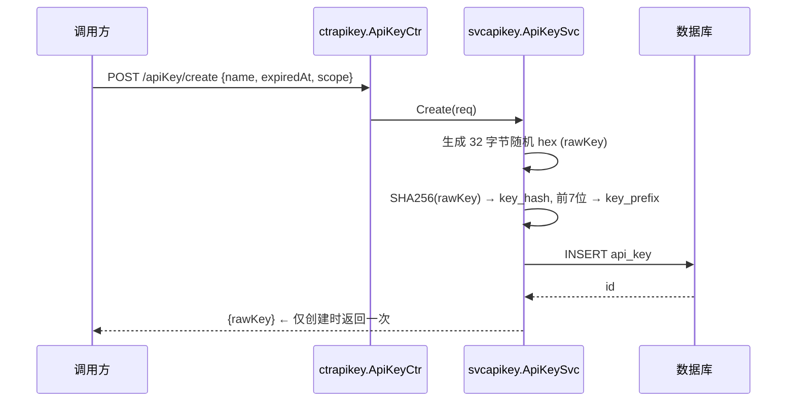

# IAM 登录流程说明（落地实现）

IAM 支持多种认证/登录方式：浏览器用户密码登录（OIDC Authorization Code Flow + PKCE）、SSO 自动登录、租户选择/切换、API Key 机器认证、Connector 外部 IdP 登录。所有浏览器登录统一走 **OIDC Provider**，不再有独立的 `/auth/login` + PersonToken 流程。

## 流程总览（由简到繁）

| # | 认证方式 | 角色 | 协议/标准 | 路由 | 返回结果 |
|---|----------|------|-----------|------|----------|
| 1 | **OIDC 密码登录** | 用户 → IAM(OP) | OIDC AuthCode + PKCE | `/oidc/authorize` → `/oidc/login` → `/oidc/authorize/callback` → `/oidc/oauth/token` | access_token + id_token + refresh_token |
| 2 | **SSO 自动登录** | 已有会话 → IAM(OP) | cookie + Redis | `/oidc/sso-login` | 跳过密码，直接发 code |
| 3 | **选/切租户** | 用户 → IAM(OP) | — | `/oidc/login/selectTenant`、`/oidc/authorize?tenant=` | token 携带新租户上下文 |
| 4 | **自助注册** | 用户 → IAM | bcrypt | `POST /v1/iam/auth/register` | UserID |
| 5 | **加入租户** | Person → 租户 | — | `POST /v1/iam/auth/joinTenant` | UserID |
| 6 | **API Key 认证** | 服务 → IAM | SHA-256 | `x-api-key` 头 / OIDC client_credentials | 直接通过 / `token_usage=machine` |
| 7 | **Connector SSO 登录** | 外部 IdP → IAM（IAM 作为 RP）| OAuth2/OIDC | `/v1/iam/connector/:id/authorize`、`/v1/iam/connector/callback` | 进入 OIDC 主流程 |
| 8 | **令牌刷新** | RP → IAM | refresh_token 轮换 | `POST /oidc/oauth/token` (grant_type=refresh_token) | 新 access + refresh |

### 令牌体系总览（当前为 OIDC 标准令牌）

```
OIDC Authorization Code Flow 完成认证
        │
        ▼
┌───────────────────────────────────┐
│   ID Token (JWT, RS256)           │  ← sub=person:{id}, aud=client_id, tenant_id, token_usage
│   身份证明，仅声明                 │
├───────────────────────────────────┤
│   Access Token (JWT, RS256)       │  ← sub=person:{id}, tenant_id, user_id, client_id, token_usage
│   访问业务 API 的凭证              │     内网 /v1/iam/* 另校验 SSO 会话活性
├───────────────────────────────────┤
│   Refresh Token (不透明串, DB哈希) │  ← 单次使用轮换，可吊销，30d
│   静默续期令牌                     │
└───────────────────────────────────┘
```

私密 claim（见 `object/objauth/claims.go`）：`sub=person:{person_id}`、`tenant_id`、`user_id`、`client_id`、`token_usage`（`machine` 表示机器凭证）。

---

## 一、OIDC 密码登录（Authorization Code Flow + PKCE）

### 角色定位

- IAM 作为 **OIDC Provider (IdP)**，对外提供标准 OIDC 认证。
- **RP**（业务应用）如 `platform-admin-web`/`sso-test-app`，通过 OIDC 库（oidc-client-ts）接入。
- 用户的账号密码由 IAM 认证，token 全部由 IAM 签发。

### 时序图

```mermaid
sequenceDiagram
    participant User as 用户(浏览器)
    participant RP as 业务应用 (RP, 如管理台)
    participant LP as 登录页 (login-web)
    participant IAM as IAM OP (/oidc)
    participant AuthSvc as svcauth.AuthSvc
    participant Svc as svcoidc.AuthSvc
    participant SSO as SSO Session (Redis)
    participant DB as 数据库

    rect rgb(20, 40, 80)
        Note over User,DB: Step 1: RP 触发授权
        User->>RP: 访问受保护页面/点击"IAM登录"
        RP->>IAM: GET /oidc/authorize<br/>?client_id&redirect_uri&response_type=code&scope&state&nonce(&code_challenge)
        IAM->>IAM: tenantHintMiddleware 解析 ?tenant
        IAM-->>User: 302 → /oidc/sso-login?authRequestID=ar-xxx
        IAM->>User: (无有效 iam_sso_session cookie 时)<br/>302 → 前端登录页 login-web?authRequestID=ar-xxx
    end

    rect rgb(20, 60, 40)
        Note over User,DB: Step 2: 提交账号密码
        User->>LP: 输入 identifier + password
        LP->>IAM: POST /oidc/login {authRequestID, identifier, password}
        IAM->>AuthSvc: AuthenticatePassword(identifier, password)
        Note over AuthSvc: 限流锁定→挂起→密码未设→bcrypt 比对<br/>recordLoginLog + audit
        AuthSvc-->>IAM: person + user + tenantList
        alt 多租户(>1) 且无合法 tenant hint
            IAM-->>LP: {requiresTenantSelection:true, tenants:[...]}
            LP->>IAM: POST /oidc/login/selectTenant {authRequestID, tenantID}
        end
        IAM->>IAM: CompleteAuthRequest(subject=person:{id}, tenantID, done=true)
        IAM->>SSO: CreateSession(personID) → 写 iam_sso_session cookie
        IAM-->>LP: {continueURL: /oidc/authorize/callback?id=ar-xxx}
    end

    rect rgb(40, 20, 60)
        Note over User,DB: Step 3: 授权码颁发
        LP->>IAM: window.location.href = continueURL
        IAM->>IAM: AuthRequest.Done()==true 且 subject 已设
        IAM-->>User: 302 → rep redirect_uri?code=xxx&state=yyy
    end

    rect rgb(60, 40, 40)
        Note over User,DB: Step 4: code 换 token
        RP->>IAM: POST /oidc/oauth/token (grant_type=authorization_code + PKCE)
        IAM->>DB: 验证 client_id + redirect_uri + client_secret(code_verifier)
        IAM->>IAM: CreateAccessAndRefreshTokens() → access + refresh (+id_token)
        IAM-->>RP: {access_token, id_token, refresh_token, expires_in}
    end
```



### 关键代码路径

| 步骤 | 代码位置 | 备注 |
|------|----------|------|
| 授权入口 | `router/oidc.go:authorize` + `svcoidc/routes.go:tenantHintMiddleware` | 注入 tenant hint |
| 密码认证 | `svcauth/auth.go:AuthenticatePassword/authenticateResolvedPerson` | 登录标识自动识别 |
| 完成登录 | `svcoidc/oidc.go:CompleteLogin` | 单/多租户分支 + 建 SSO 会话 |
| SSO 自动登录 | `svcoidc/oidc.go:CompleteLoginBySession` | 校验中心会话 |
| 选租户 | `svcoidc/oidc.go:SelectTenant` | 校验成员租户 |
| code 换 token | `svcoidc/persistent_store.go:CreateAccessAndRefreshTokens` | 签发 + refresh 落库 |

### identifier 自动识别（`svcauth/auth.go:resolvePersonLogin`）

```
含 @ → primary_email
1 开头且 ≥11 位 → primary_phone
其余 → username
```

### 租户选择流程

- **单租户**：`CompleteLogin` 自动选该租户并 `done=true`，直接发 code。
- **多租户且无合法 hint**：`done=false`，返回 `requiresTenantSelection:true`，前端展示租户列表，用户 POST `/oidc/login/selectTenant`。
- **tenant hint**（`?tenant=`）：优先尊重，但**失败关闭校验**——hint 必须是该 person 的成员租户，否则回退，杜绝跨租户逃逸（见 `svcoidc/oidc.go`）。

### 登出（全局登出语义）

```
用户 → RP → GET /oidc/end_session (或 POST /v1/iam/auth/logout)
① 清中心会话: RevokeSessionsByPersonID + 清 iam_sso_session cookie
② 吊销该 person 全部 refresh token: RevokeByPersonID (DB revoked_at)
③ 内网 /v1/iam/*: OIDCCompatibleAuth 校验 SSO 活性 → 立即 401
④ 302 → post_logout_redirect_uri / /oidc/logged-out
```

---

## 二、注册与加入租户

### 自助注册

- `POST /v1/iam/auth/register`：校验密码强度（≥6 位 + 大小写 + 数字），校验 username/email/phone 唯一，插入 `person` + `user`(is_owner=1)。
- 注册即成为指定租户的拥有者。
- 代码：`svcauth/auth.go:Register` + `validatePasswordStrength`。

### 加入租户

- `POST /v1/iam/auth/joinTenant`：已认证 person 加入另一租户，插入 `user`(is_owner=0)。
- 已在租户中返回 `already joined`。
- 代码：`svcauth/auth.go:JoinTenant`。

---

## 三、API Key 机器认证

API Key 用于**机器对机器**（M2M）场景。两种鉴权通道：

### 通道 A：`x-api-key` 头（不依赖浏览器 SSO）

```
请求 → API 中间件 (middleware/apikey_auth.go)
   x-api-key = rawKey
   keyHash = SHA256(rawKey)  → 查 api_key 表
   校验: revoked_at 为空 + expired_at > now
   通过 → 设置 ctx tenant_id/user_id → 放行
```

### 通道 B：OIDC client_credentials

```
POST /oidc/oauth/token (grant_type=client_credentials, client_id==client_secret==rawKey)
  → 若命中 api_key 表: 签发 token_usage=machine 的 access token
  → 注: 机器凭证不依赖浏览器 SSO 会话活性
代码: svcoidc/storage.go:ClientCredentials / ClientCredentialsTokenRequest
```

创建时序（`svcapikey`）：



---

## 四、Connector 外部 IdP 登录（IAM 作为 RP）

### 角色定位

- IAM **Connector** 作为 Relying Party，对接外部 IdP（OIDC: Google/Microsoft Entra；OAuth2: GitHub）。
- 结果：用户通过第三方账号登录后，**复用 OIDC 主流程**获取 token。

### 主流程

```
1. 前端 POST /v1/iam/connector/:connectorId/authorize
   → 驱动按 protocol 构建授权 URL, state + nonce 存 Redis (TTL 10min)
   → 302/?authorizationUrl 跳外部 IdP
2. 用户在外部门户授权 → 302 回调 /v1/iam/connector/callback?code&state
   → GetDel(state) 原子消费 → 驱动 exchange token → 验证 id_token(nonce) / userinfo
3. 身份解析 (svcauth/connector_identity.go):
   - 已有 user_identity(iss+sub) → 更新 last_used_at
   - 无 + allowAutoCreateUser → 事务创建 person + user + user_identity
   - 无 + allowAccountLink → 账号关联流程
   - 域策略(domain_policy)校验 email 域名
4. 进入 OIDC 主流程 → 建/复用 IAM 会话 → 签发 token
```

### 预置工厂

| Factory | 协议 | 驱动 |
|---------|------|------|
| `oidc-google` | OIDC | `connector_driver_oidc.go`（coreos/go-oidc/v3） |
| `oauth2-github` | OAuth2 | `connector_driver_oauth2.go`（GitHub 身份规范化） |
| `oidc-microsoft-entra` | OIDC | OIDC 驱动 + claim 映射 |

---

## 五、与旧登录流的差异（迁移说明）

早期实现存在一套非标准 `/auth/login` + PersonToken + selectTenant/switchTenant + refreshToken 流程，以及 `oauth_client`/`oauth_client_secret` 表。**当前实现已废弃该传统流程**，统一收敛到：

- 认证：OIDC Provider（`/oidc/*`），zitadel/oidc 标准实现。
- Client 模型：`application_client` + `application_client_secret`（多密钥轮换）。
- 令牌：OIDC 标准 ID/Access/Refresh token，私密 claim 见 `object/objauth/claims.go`。
- 表名：以 `backend/scripts/sql/iam_schema.sql` 为准（30 张表，无 `oauth_client`）。
