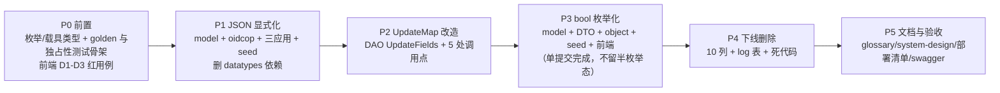

# 模型层类型强化方案：JSON 列显式化 · bool → 具名枚举 · 原生时间类型

> 状态：**待实施**（标准档 · 结构重构 + 下线废弃 双场景）
> 范围：`backend/pkg`（model / dao / object / core / seed / testsetup）+ `auth` / `platformadmin` / `tenantadmin` 三个应用 + `frontend` 受影响页面 + `docs/design`
> 本文只给方案，不动代码。所有 GORM 行为结论均已在本仓实测（见 §4；实测脚本已删除，未留改动）
>
> **评审已定策略（2026-09-17）**
> 1. **接受破坏性调整**：按新项目做数据初始化——升级＝删库重建，**不写回填 SQL、不写兼容旧库的分支**。
> 2. **不使用共享枚举类型**（不引入 `Toggle`）：每个「是否 X」列各自一个具名类型 + 一组常量，换取编译期字段身份。
> 3. **禁止 `map[string]string` 这类"半显式"载体**：自由 JSON 一律落成显式结构体（外部数据走白名单收窄）。
> 4. **状态类型不共用**：`person.status` 与 `tenant_user.status` 各自具名，即使取值集合相同。

---

## 1. 结论速览

| 议题 | 结论 | 关键代价 |
|---|---|---|
| JSON 列（20 个 / 9 表） | **12 列**改为每列一个具名 Go 类型 + `gorm:"serializer:json"`；**8 列**无消费者，删除；移除 `gorm.io/datatypes` 依赖 | 5 处 `UpdateMap` 必须改结构化更新，否则**静默脏写**（实测，见 §4.2） |
| bool 列（16 个 / 7 表） | 全部改**字段级具名字符串枚举**（11 个开关类型 + 5 个语义类型，互不共用） | 同名列 `boolean → varchar` 变更；本项目以**删库重建**消除该风险（§8.1） |
| `sql.NullTime`（2 处） | `api_key.last_used_at` → `*time.Time`；`domain.verified_at` **删除**（无写入方） | 无 |
| 无消费者列/表 | 删除 **8 个 JSON 列 + 2 个死时间列 + `log` 表** | 删库重建后无残留 |
| 自由 JSON | `user_identity.detail` → **显式白名单结构体**（非白名单 claim 丢弃）；`connector.config` → 显式字段（删 `Raw`/`Extra` 双逃生舱） | 控制台不再能看到外部 IdP 的非标准 claim（行为收窄，§6.4） |
| 顺带修复 | 3 个已存在的**前后端契约缺陷**（bool ↔ 0/1 漂移）在本方案中自然消解 | 前端 3 个页面必须同步改，先补回归用例 |

**开放问题已全部关闭**（§12 决策记录）：`tenant_application.config/granted_scope` **删除**；`connector.claim_mapping/domain_policy` **保留并显式建模**；`user_identity.detail` 采用**标准声明白名单**（非白名单 claim 丢弃）；`connector.config.scopes` 单独具名。

---

## 2. 背景、目标与非目标

### 2.1 起因（三条诉求）

1. `pkg/model` 用 `datatypes.JSON` / `json.RawMessage` 承载 JSON 列 → 结构不可见、每个消费方各自 `json.Unmarshal`、错误分支散落；`json.RawMessage` 还是 `[]byte`（GORM 默认按 blob 处理，靠显式 `type:json` 兜底）。
2. `pkg/model` 的 bool 列存在默认值陷阱与三态表达失效（§3.4 已证实 3 个在制缺陷）。
3. `sql.NullTime` 引入 `database/sql` 依赖与 `Valid/Time` 双字段拆包，违背"原生类型优先"。

### 2.2 目标

- **G1 类型即文档**：JSON 列在 Go 侧是具名结构体/具名切片，`serializer:json` 由 GORM 统一编解码，业务代码不再手工 `Marshal/Unmarshal`。
- **G2 枚举全链路强类型**：字典值一律具名类型 + 常量，且**每字段独立类型**（编译期即可拦住跨字段误赋值）。
- **G3 时间列原生化**：可空时间统一 `*time.Time`；不可空统一 `time.Time`。
- **G4 契约单一**：前后端对同一字段的类型口径唯一，不再出现"后端 bool、前端按 0/1 判"。
- **G5 清理**：无消费者的列与表彻底下线（model/DAO/DTO/service/前端/docs/swagger 同步）。

### 2.3 非目标（超出范畴的用例）

| 不做 | 原因 |
|---|---|
| 为 JSON 列引入 JSONB / GIN 索引 / JSON 路径查询 | 当前全部 JSON 列都是"整体读写"（无 `WHERE col->>'k'` 查询），换 JSONB 只增迁移风险无收益 |
| 把 `connector.config` 拆成独立表做完全规范化 | 连接器配置是"一行一配置"的 1:1 强绑定，拆表只增加 join 与事务成本 |
| 把 `user_identity.detail` 的 claim 拆 `identity_claim` 子表 | 当前无按 claim 检索的需求；待出现"按 claim 查身份"时再规范化（§6.4 备选 B） |
| 数据迁移脚本 / 兼容旧库的代码分支 | 评审已定：按新项目初始化，删库重建（§8） |
| 引入 `null.String` 等第三方可空类型替代 `*string` | 与 G3 反向；`*string` 已是仓库现状（person.username 等） |
| 内部运行时结构体（`ConnectorRuntime`、`StandardIdentity`）改枚举 | 它们是领域内的**计算结果**不是存储契约；在 DTO/model 边界做一次映射即可（§5.6 边界规则） |

---

## 3. 现状勘察（量化）

计数口径统一为：`grep -rn` 于 `backend/`，非测试文件（除特别注明）。

### 3.1 JSON 列：20 个字段 / 9 张表

| 表 | 列 | 现值类型 | 消费者 |
|---|---|---|---|
| `application_client` | redirect_uris / post_logout_redirect_uris / allowed_origins / default_scopes | `datatypes.JSON` | OIDC 客户端适配器（真实消费） |
| `application_client` | grant_types / response_types | `datatypes.JSON` | OIDC 客户端适配器（映射到 zitadel 枚举） |
| `connector` | config | `json.RawMessage` | 驱动工厂（`buildConnectorConfig`） |
| `connector` | claim_mapping / domain_policy | `json.RawMessage` | **仅存取，无消费方** |
| `refresh_token` | scopes / amr | `datatypes.JSON` | 刷新链路还原（H2 契约） |
| `user_identity` | detail | `json.RawMessage` | 控制台身份列表展示 |
| `tenant_application` | config / granted_scope | `datatypes.JSON` | **仅存取，无消费方** |
| `api_key` | scope | `json.RawMessage` | **只写 `{}`，无读方**（glossary 自述"当前不参与鉴权"） |
| `person` / `tenant_user` | profile / custom_data | `json.RawMessage` | **只写 `{}`，无读方** |
| `log` | payload | `json.RawMessage` | 读方存在（platformadmin `/logs`），**但全仓无任何写入方** |

- **69 处**非测试代码直接操作上述列或为其写 `{}`/`[]` 占位值（口径：`json.Marshal|json.Unmarshal|datatypes.JSON|json.RawMessage` 命中 109 行，剔除 oidcop/sso 协议态 Redis 序列化 20 行与 model 字段声明 20 行）。
- 其中 **5 处 `UpdateMap` 携带 JSON 值 / 13 个键**：`svcapplicationclient`（6）、`svctenantapplication`（2）、`svcauth/connector.go`（3）、`pkg/dao/user_identity.go`（1）、`svcauth/connector_identity.go`（1）。
- 占位写入 `json.RawMessage("{}")`：`auth.go`、`connector_identity.go`×4、`machine_user.go`×2、`api_key.go`、`find_or_create.go`×2、`user.go`×2、`testsetup/testdata.go`×4、`seed.go`×2。

### 3.2 bool 列：16 个字段 / 7 张表

| 表 | 列 | 现类型 |
|---|---|---|
| `person` | is_suspended / must_change_password | `bool` |
| `tenant_user` | is_suspended / is_owner | `bool` |
| `application` | allow_person_create_tenant / allow_join_by_invite | `*bool`（可空） |
| `application_client` | require_pkce / require_auth_time | `bool` |
| `connector` | allow_auto_create_user / allow_account_link / sync_profile / enable_token_storage | `bool` |
| `domain` | is_verified | `bool` |
| `menu` | hidden / external_link / keep_alive | `bool` |

引用面：**52 个非测试文件 + 21 个测试文件**（含 DTO/object 层同名字段）。

### 3.3 `sql.NullTime`：2 处

| 位置 | 写入方 | 处置 |
|---|---|---|
| `api_key.last_used_at` | `pkg/middleware/apikey_auth.go:157`、`oidcop/persistent_store.go:116`（降频 1 分钟） | → `*time.Time` |
| `domain.verified_at` | **无**（`svcdomain.Update` 只写 `is_verified`） | **删除** |

附带同源发现：`user_identity.last_used_at`（`*time.Time`）**同样无写入方**，已定一并删除。

### 3.4 已确认的在制缺陷（本方案的直接动因）

| # | 缺陷 | 证据 | 影响 |
|---|---|---|---|
| D1 | **菜单创建/编辑恒失败** | 前端以数字提交 `hidden/externalLink/keepAlive`（`menu/index.tsx:221-223`，`getValueFromEvent={(c) => c ? 1 : 0}`——`c` 是事件对象恒真，永远得 `1`）；后端 `objpermission.MenuBaseInfo.Hidden bool` | `encoding/json` 拒绝 number→bool，菜单增改全量报错 |
| D2 | **域名验证状态恒显示"未验证"** | 后端 `isVerified` 序列化为 `true/false`；前端 `VerifiedTag` 判 `value === 1`（`packages/ui/src/status.tsx:35`） | 列表恒误导；编辑弹窗又以 `0/1` 提交（`domain/index.tsx:168-176`）→ `DomainUpdateReq.IsVerified *bool` 绑定失败，改不动 |
| D3 | **OAuth 客户端详情"强制 PKCE / 需要 auth_time"恒显示"否"** | `oauthClient/Detail.tsx:155-156` 判 `=== 1` | 误判安全配置 |
| D4 | **`*bool` 无法表达"未配置"** | 实测：插入 nil 指针时字段为零值被 GORM 跳过、落列默认值，读回**必为非 nil** | `boolPtrValue` 的 nil 分支永不触发（当前 NULL≡false 故未越权，但模型谎报能力） |
| D5 | **bool 默认值陷阱** | 实测：`default:true` 的列在 Go 侧显式传 `false`，GORM 跳过该列 → DB 存 `true` | 当前 16 列默认均为 false 故未踩中；将来新增"默认开启"开关即静默失效 |
| D6 | **`UpdateMap` 传原始 Go 值到 JSON 列＝静默脏写** | 实测：`Updates(map{"list": []string{"x"}})` 无报错，读出 `invalid character 'x'` | 现有代码靠手工 `datatypes.JSON(...)`/`json.RawMessage(...)` 包一层 `driver.Valuer` 才没炸；`serializer:json` 不覆盖 map 路径 |

---

## 4. 关键机制实测（GORM v1.30.1 / mattn-sqlite3，内存库）

> 实测脚本为临时文件，已删除（`git status` 干净）。SQLite 与 PG 的差异已在 §9 AC-6 列为必做验证。

### 4.1 `serializer:json` 行为验证（`type:json;not null;default:'[]'`）

```go
List []string          `gorm:"column:list;type:json;serializer:json;not null;default:'[]'"`
Obj  map[string]string `gorm:"column:obj;type:json;serializer:json;not null;default:'{}'"`
Raw  []byte            `gorm:"column:raw;type:json;not null;default:'[]'"`
```

| 场景 | 结果 |
|---|---|
| `Create` 且字段为 nil | ✅ 成功；列被跳过、DB 默认值生效；读回 `[]string{}`（非 nil） |
| `Create` 且字段为 `[]string{}` | ✅ 成功，写 `[]` |
| `Model().Select("list","obj").Updates(&struct{...})` | ✅ 序列化生效，读回 `["a","b"]` / `{"k":"v"}` |
| 结构化 `Updates` 传 `[]string{}` | ✅ 写入 `[]`（`reflect.IsZero()` 对非 nil 空切片为 false） |
| `Updates(map{"list": []string{"x"}})` | ❌ **无报错但写入 `x`**，读回报 `invalid character 'x'` |
| `Updates(map{"list": []byte("[\"y\"]")})` | ✅ 正常（`[]byte` 走驱动原生路径） |

**推论**：
- `serializer:json` 让**测试播种的 `Profile: json.RawMessage("{}")` 全部可以删除**（nil → 列跳过 → DB 默认值），这是附带收益而非负担。
- `gormdao.UpdateMap` 必须停用于所有 serialized 列（§6.6）。GORM 源码依据：`callbacks/update.go` 的 map 分支直接 `clause.Assignment{Value: kv}`，不走 `field.ValueOf`（serializer 包装只作用于结构化分支）。
- 待验证（PG）：map 路径传 `[]string` 在 PG/pgx 上**可能直接报错而非脏写**。两种结果都不可接受，结论不变。

### 4.2 bool 默认值与三态验证

```go
DefaultOn  bool   `gorm:"column:default_on;type:boolean;not null;default:true"`
DefaultOff bool   `gorm:"column:default_off;type:boolean;not null;default:false"`
PtrTri     *bool  `gorm:"column:ptr_tri;type:boolean;not null;default:false"`
Status     string `gorm:"column:status;type:varchar(16);not null;default:'enable'"`
```

| 操作 | 结果 |
|---|---|
| `Create(&{ID:"1"})`（全零值） | `default_on=true default_off=false ptr_tri=非nil(false) status="enable"` |
| `Create(&{ID:"2", DefaultOn:false})` | **`default_on=true`**（false 被忽略） |
| 结构化 `Updates(&{DefaultOff:true})` | `default_off=true` |
| `Updates(map{"default_off":false})` | `default_off=false`（map 路径零值生效） |

**推论**：bool 的"零值＝未设置"与"false 是有效业务值"在 GORM 下不可区分（D4/D5）；字符串枚举的零值 `""` 是**显式非法值**，写入路径只要拒绝空串就不存在"被默认值顶掉"的歧义。这正面回答了"bool 改 string 是否更好"：**在 GORM + 前后端契约这两个约束下，是更好**。

---

## 5. 目标设计

### 5.1 枚举类型（`pkg/model/enum.go`，新文件）——每字段一个类型，互不共用

**语义型（5 个 + 1 个邮箱验证态）**

```go
// PersonStatus 自然人可用性（person.status）。suspended = 禁止登录与签发令牌，
// 语义对齐 tenant.status 的挂起，不与 enable/disable 混用（docs/design/glossary.md「挂起」）。
type PersonStatus string
const (
    PersonStatusActive    PersonStatus = "active"
    PersonStatusSuspended PersonStatus = "suspended"
)

// UserStatus 租户成员可用性（tenant_user.status）。
// 与 PersonStatus **刻意分列**：两者是不同实体的生命周期，共用类型会让
// 「把 person 的状态写进 user」编译通过——正是本次评审要求避免的。
type UserStatus string
const (
    UserStatusActive    UserStatus = "active"
    UserStatusSuspended UserStatus = "suspended"
)

// PasswordStatus 自然人密码状态（person.password_status）。
type PasswordStatus string
const (
    PasswordStatusNormal     PasswordStatus = "normal"
    PasswordStatusMustChange PasswordStatus = "must_change"
)

// OwnerType 租户拥有者类型（tenant_user.owner_type），取值风格对齐 role.admin_type（admin/normal）。
type OwnerType string
const (
    OwnerTypeOwner  OwnerType = "owner"
    OwnerTypeNormal OwnerType = "normal"
)

// DomainVerificationStatus 域名验证状态（domain.verification_status）。
// 预留 pending/failed：接入真实验证流程时只加常量，不改列类型、不破坏 API。
type DomainVerificationStatus string
const (
    DomainVerificationUnverified DomainVerificationStatus = "unverified"
    DomainVerificationVerified   DomainVerificationStatus = "verified"
)

// EmailVerificationState 第三方身份回传的邮箱验证态（user_identity.detail.emailVerified）。
type EmailVerificationState string
const (
    EmailVerificationVerified   EmailVerificationState = "verified"
    EmailVerificationUnverified EmailVerificationState = "unverified"
)
```

**字段级开关型（11 个）**

命名规则：类型名 = `<实体><字段语义><Policy|Flag>`；常量 = `<类型名><Enable|Disable>`；取值词汇统一为 glossary 的 `enable`/`disable`。**每个列一个类型**，不共用。

```go
// 示例两条，其余同构（见下表）：
type AppPersonCreateTenantPolicy string
const (
    AppPersonCreateTenantPolicyEnable  AppPersonCreateTenantPolicy = "enable"
    AppPersonCreateTenantPolicyDisable AppPersonCreateTenantPolicy = "disable"
)

type MenuHiddenFlag string
const (
    MenuHiddenFlagEnable  MenuHiddenFlag = "enable"
    MenuHiddenFlagDisable MenuHiddenFlag = "disable"
)
```

| # | 列 | 类型名 | 常量前缀 |
|---|---|---|---|
| 1 | `application.allow_person_create_tenant` | `AppPersonCreateTenantPolicy` | `AppPersonCreateTenantPolicy{Enable,Disable}` |
| 2 | `application.allow_join_by_invite` | `AppJoinByInvitePolicy` | `AppJoinByInvitePolicy{Enable,Disable}` |
| 3 | `application_client.require_pkce` | `ClientPKCEPolicy` | `ClientPKCEPolicy{Enable,Disable}` |
| 4 | `application_client.require_auth_time` | `ClientAuthTimeClaimPolicy` | `ClientAuthTimeClaimPolicy{Enable,Disable}` |
| 5 | `connector.allow_auto_create_user` | `ConnectorAutoCreateUserFlag` | `ConnectorAutoCreateUserFlag{Enable,Disable}` |
| 6 | `connector.allow_account_link` | `ConnectorAccountLinkFlag` | `ConnectorAccountLinkFlag{Enable,Disable}` |
| 7 | `connector.sync_profile` | `ConnectorSyncProfileFlag` | `ConnectorSyncProfileFlag{Enable,Disable}` |
| 8 | `connector.enable_token_storage` | `ConnectorTokenStorageFlag` | `ConnectorTokenStorageFlag{Enable,Disable}` |
| 9 | `menu.hidden` | `MenuHiddenFlag` | `MenuHiddenFlag{Enable,Disable}` |
| 10 | `menu.external_link` | `MenuExternalLinkFlag` | `MenuExternalLinkFlag{Enable,Disable}` |
| 11 | `menu.keep_alive` | `MenuKeepAliveFlag` | `MenuKeepAliveFlag{Enable,Disable}` |

> 为什么取值仍统一用 `enable`/`disable`：glossary 已把这两个词定为全局启停词汇（"禁止再出现 active/inactive/enabled 等同义异写"）。**类型分列**（评审要求 2）+ **取值统一**，两者不冲突：前者买的是编译期字段身份，后者买的是前后端映射一致。若某字段将来需要更贴切的词（如 `require_pkce` 改 `required`/`optional`），因类型独立，可单列演进而不影响其他列。

### 5.2 JSON 载具类型（`pkg/model/jsontypes.go`，新文件）——每列一个类型

```go
// 每列一个具名切片类型，禁止多个列共用同一"通用 StringList"：
// 共用的代价是 redirect_uris 与 allowed_origins 之间可以静默互相赋值。
type RedirectURIList []string
type PostLogoutRedirectURIList []string
type AllowedOriginList []string
type DefaultScopeList []string
type ScopeList []string      // refresh_token.scopes（可空：无 default）
type AuthMethodList []string // refresh_token.amr（RFC 8176，开放集合，元素不做闭合枚举）
type ConnectorScopeList []string // connector.config.scopes
type DomainList []string         // ConnectorDomainPolicy 内部专用（allowed/blocked 同义，结构体内复用）

// ResponseType OIDC 响应类型（闭合集合，对应 op.Client.ResponseTypes 的映射源）。
type ResponseType string
const (
    ResponseTypeCode         ResponseType = "code"
    ResponseTypeIDToken      ResponseType = "id_token"
    ResponseTypeIDTokenToken ResponseType = "id_token token"
)

type ResponseTypeList []ResponseType
type GrantTypeList []GrantType // 元素复用已存在的 GrantType 具名类型

// Strings 是跨 OIDC 库边界（op.Client 等只认 []string）的唯一出口，
// 避免 []string(x) 裸转换散落在业务代码里。
func (l RedirectURIList) Strings() []string          { return []string(l) }
func (l PostLogoutRedirectURIList) Strings() []string { return []string(l) }
func (l AllowedOriginList) Strings() []string         { return []string(l) }
func (l DefaultScopeList) Strings() []string          { return []string(l) }
func (l ScopeList) Strings() []string                 { return []string(l) }
func (l AuthMethodList) Strings() []string            { return []string(l) }
func (l ConnectorScopeList) Strings() []string        { return []string(l) }
```

> `redirect_uris` / `allowed_origins` / `scopes` / `amr` 的元素**不做闭合枚举**：`op.Client.IsScopeAllowed` 明确接受任意 scope，RFC 8176 也允许私有 AMR 值。具名切片已经满足"显式结构"要求，闭合元素反而是功能倒退。

### 5.3 JSON 列字段映射（12 个保留列 + 8 个删除列）

| # | 表.列 | 目标 Go 类型 | gorm tag 变化 | 备注 |
|---|---|---|---|---|
| 1 | application_client.redirect_uris | `RedirectURIList` | `+serializer:json` | |
| 2 | application_client.post_logout_redirect_uris | `PostLogoutRedirectURIList` | `+serializer:json` | |
| 3 | application_client.allowed_origins | `AllowedOriginList` | `+serializer:json` | |
| 4 | application_client.default_scopes | `DefaultScopeList` | `+serializer:json` | |
| 5 | application_client.grant_types | `GrantTypeList` | `+serializer:json` | |
| 6 | application_client.response_types | `ResponseTypeList` | `+serializer:json` | 新增 `ResponseType` 枚举 |
| 7 | connector.config | `ConnectorConfig` | `+serializer:json` | 取代 `map[string]any` + `Raw`/`Extra` |
| 8 | connector.claim_mapping | `ConnectorClaimMapping` | `+serializer:json` | 当前无消费方；**保留能力位**（§12-Q2） |
| 9 | connector.domain_policy | `ConnectorDomainPolicy` | `+serializer:json` | 当前无消费方；**保留能力位**（§12-Q2） |
| 10 | refresh_token.scopes | `ScopeList` | `+serializer:json` | **保持可空** |
| 11 | refresh_token.amr | `AuthMethodList` | `+serializer:json` | **保持可空** |
| 12 | user_identity.detail | `UserIdentityDetail` | `+serializer:json` | 见 §5.4、§6.4 |
| 13-20 | tenant_application.granted_scope / tenant_application.config / person.profile / person.custom_data / tenant_user.profile / tenant_user.custom_data / api_key.scope / log.payload | — | — | **删除**（无消费方；随 §12 决策） |

```go
// ConnectorConfig 连接器配置：显式字段取代原 map[string]any + Raw/Extra 双逃生舱。
// Microsoft Entra ID 的 tenant 参数从 Raw["tenant"] 提升为一等字段（json tag 保持 "tenant"，兼容存量配置）。
type ConnectorConfig struct {
    Protocol     ConnectorProtocol `json:"protocol"`
    Provider     ConnectorProvider `json:"provider"`
    Issuer       string            `json:"issuer,omitempty"`
    AuthURL      string            `json:"authUrl,omitempty"`
    TokenURL     string            `json:"tokenUrl,omitempty"`
    UserInfoURL  string            `json:"userInfoUrl,omitempty"`
    ClientID     string            `json:"clientID,omitempty"`
    ClientSecret string            `json:"clientSecret,omitempty"`
    RedirectURI  string            `json:"redirectUri,omitempty"`
    Scopes       ConnectorScopeList `json:"scopes,omitempty"`
    Tenant       string            `json:"tenant,omitempty"`
}

type ConnectorScopeList []string

// ConnectorClaimMapping 声明映射：外部 IdP 的 claim 名 → 标准身份字段。
type ConnectorClaimMapping struct {
    Subject     string `json:"subject,omitempty"`
    Email       string `json:"email,omitempty"`
    Username    string `json:"username,omitempty"`
    DisplayName string `json:"displayName,omitempty"`
    AvatarURL   string `json:"avatarUrl,omitempty"`
}

// ConnectorDomainPolicy 域策略：允许/拒绝登录的邮箱域。
// 只声明当前产品语义明确的字段；不预造"是否允许子域"之类没有消费方的开关。
// 两个列表共用 DomainList 是**结构体内部**的同义复用（误赋值不会跨实体扩散），
// 与"跨列共用载具类型"是两件事。
type ConnectorDomainPolicy struct {
    AllowedDomains DomainList `json:"allowedDomains,omitempty"`
    BlockedDomains DomainList `json:"blockedDomains,omitempty"`
}
```

### 5.4 `UserIdentityDetail`：显式白名单（禁止 `map[string]string`）

```go
// UserIdentityDetail 第三方身份明细（落 user_identity.detail）。
//
// 显式白名单：只保留本系统识别并承诺落库的字段。外部 IdP 的**非白名单 claim 在写入边界
// （svcauth identityMapper）丢弃**，不落库、不出现在 API 中——持久化结构必须完全可枚举。
// 原实现保存 IdP 全量 claims（map[string]any），是本次要消灭的"结构不可见"数据。
type UserIdentityDetail struct {
    Issuer        string                 `json:"issuer,omitempty"`
    Subject       string                 `json:"subject,omitempty"`
    Email         string                 `json:"email,omitempty"`
    EmailVerified EmailVerificationState `json:"emailVerified,omitempty"`
    Username      string                 `json:"username,omitempty"`
    DisplayName   string                 `json:"displayName,omitempty"`
    AvatarURL     string                 `json:"avatarUrl,omitempty"`
    GivenName     string                 `json:"givenName,omitempty"`
    FamilyName    string                 `json:"familyName,omitempty"`
    Locale        string                 `json:"locale,omitempty"`
}
```

- 内部运行时结构体 `svcauth.StandardIdentity` **保留** `Claims map[string]any`（领域计算结果，非存储契约），在 `bindIdentity` 边界做一次白名单提取（§5.6 规则 3）。
- 白名单键固定为 OIDC 标准声明（`sub/email/email_verified/name/preferred_username/picture/given_name/family_name/locale`）；要扩字段就加结构体字段 + 提取映射，代码评审可见。

### 5.5 bool 列字段映射（16 个列）

| # | 表.现列 | 现类型 | 目标字段 | 目标类型 | 目标列名 | 处理 |
|---|---|---|---|---|---|---|
| 1 | person.is_suspended | bool | `Status` | `PersonStatus` | `status` | **改名**（新列默认 `active`） |
| 2 | person.must_change_password | bool | `PasswordStatus` | `PasswordStatus` | `password_status` | **改名**（默认 `normal`） |
| 3 | tenant_user.is_suspended | bool | `Status` | `UserStatus` | `status` | **改名** |
| 4 | tenant_user.is_owner | bool | `OwnerType` | `OwnerType` | `owner_type` | **改名** + 同步 `seed_authority` 矩阵键 |
| 5 | application.allow_person_create_tenant | *bool | `AllowPersonCreateTenant` | `AppPersonCreateTenantPolicy` | 不变 | 类型变更 + **去掉可空**（NULL≡false≡disable） |
| 6 | application.allow_join_by_invite | *bool | `AllowJoinByInvite` | `AppJoinByInvitePolicy` | 不变 | 同上 |
| 7 | application_client.require_pkce | bool | `RequirePKCE` | `ClientPKCEPolicy` | 不变 | ⚠️ 同名列类型变更（§8.1） |
| 8 | application_client.require_auth_time | bool | `RequireAuthTime` | `ClientAuthTimeClaimPolicy` | 不变 | ⚠️ 同上 |
| 9 | connector.allow_auto_create_user | bool | 同名 | `ConnectorAutoCreateUserFlag` | 不变 | ⚠️ 同上 |
| 10 | connector.allow_account_link | bool | 同名 | `ConnectorAccountLinkFlag` | 不变 | ⚠️ 同上 |
| 11 | connector.sync_profile | bool | 同名 | `ConnectorSyncProfileFlag` | 不变 | ⚠️ 同上 |
| 12 | connector.enable_token_storage | bool | 同名 | `ConnectorTokenStorageFlag` | 不变 | ⚠️ 同上 |
| 13 | domain.is_verified | bool | `VerificationStatus` | `DomainVerificationStatus` | `verification_status` | **改名**（默认 `unverified`）+ 删 `verified_at` |
| 14 | menu.hidden | bool | 同名 | `MenuHiddenFlag` | 不变 | ⚠️ 同名列类型变更 |
| 15 | menu.external_link | bool | 同名 | `MenuExternalLinkFlag` | 不变 | ⚠️ 同上 |
| 16 | menu.keep_alive | bool | 同名 | `MenuKeepAliveFlag` | 不变 | ⚠️ 同上 |

派生改动（非列，但同属契约）：
- `pkg/core/user.CreateUserReq.IsOwner bool` → `OwnerType OwnerType`；`pkg/core/person.FindOrCreateReq.MustChangePassword bool` → `PasswordStatus PasswordStatus`。
- `pkg/object/objauth.ConnectorBaseInfo` 的 `Config/ClaimMapping/DomainPolicy any` → 三个具名结构体；4 个 bool → 4 个 `Connector*Flag`。
- `pkg/object/objpermission.MenuBaseInfo` 的 3 个 bool → 3 个 `Menu*Flag`。
- `pkg/object/objauth` 的 `TenantOption.IsOwner` / `UserInfo.IsOwner`（响应契约）→ `OwnerType`。
- DTO 筛选参数：`UserPageListReq.IsSuspended *bool` / `MachineUserPageListReq.IsSuspended *bool` → `Status model.UserStatus`（空串＝不过滤）。
- 流转请求：`MachineUserStatusReq.IsSuspended bool` → `Status model.UserStatus`；`UserUpdateReq.IsSuspended *bool` → `Status *model.UserStatus`（nil＝不变，保持 PATCH 语义）。
- `pkg/seed`：`IsOwner: true / IsSuspended: false / RequirePKCE: true` → 枚举常量；`seedOIDCClientGrantTypes` 的 `json.Marshal` 与 `[]byte(def.redirectURIs)` 字面量 → 类型化赋值。

### 5.6 边界规则（判定"要不要枚举化 / 能不能保留 map"的唯一标准）

1. **持久化列与 DTO 字段**：必须具名类型；**每字段一个类型，禁止共用**（评审要求 2/4）。
2. **`pkg/object` 与 DTO**：跟随，保证 JSON 契约单一。
3. **内部运行时结构体**（`svcauth.ConnectorRuntime`、`StandardIdentity`、`ConnectorTestOutput` 等）：**允许保留 bool 与 `map[string]any`**，在 model/DTO 边界做一次显式映射。理由：它们是领域内计算结果，不落库、不出 API；强制枚举会让 OIDC 库交互被无意义的类型转换淹没。
4. **持久化/出参结构体一律无 `map[string]X` / `any`**：结构未知的外部数据走"显式白名单结构体"（§5.4）或 key/value 子表。
5. **数据库存储枚举值**：一律落在具名类型上，禁裸字面量（AGENTS.md 硬规则 1/2/3 不变）。

---

## 6. 关键选型与取舍

### 6.1 JSON 列的实现手法

| 方案 | 优点 | 代价 | 结论 |
|---|---|---|---|
| **A. 具名类型 + `serializer:json`** | GORM 官方机制；`Create`/结构化 `Updates`/`First` 全自动；列 DDL 不变（仍 `type:json`）→ **零 DDL 变更**；可删 `gorm.io/datatypes` 依赖 | `UpdateMap` 路径不覆盖（须改 5 处）；零值字段在 Create 时被跳过（依赖 DB 默认值，实测符合预期） | ✅ **采纳** |
| B. 自定义类型实现 `driver.Valuer`+`sql.Scanner` | map 更新也能用 | 每个类型都要写 `Value/Scan` 样板；等于自己重造 `datatypes.JSON`，与"显式结构体"诉求背道而驰 | ✗ |
| C. 保留 `datatypes.JSON`，只加类型别名 | 零改动 | 不解决任何诉求 | ✗ |

> **不该选 A 的情况**：若某列需要 `WHERE col->>'k' = ?` 的 JSON 路径查询或 JSONB 索引，应改走 JSONB + 显式 SQL，而不是 `serializer:json`（serializer 只保证整列读写）。

### 6.2 枚举类型粒度

| 方案 | 优点 | 代价 | 结论 |
|---|---|---|---|
| **A. 每字段独立具名类型**（11 开关 + 5 语义 + 1 邮箱态） | 编译期拦住跨字段赋值；每列取值词汇可独立演进；与 AGENTS.md 既有风格（`AppStatus`/`ConnectorStatus`/`MenuStatus` 各自独立）一致 | **17 个新类型 + 34 个常量**；DTO/object/seed/前端逐字段映射，样板量最大 | ✅ **采纳**（评审要求 2/4） |
| B. 共享 `Toggle` + 共享 `AccountStatus` | 类型与常量少一个数量级 | 拦不住串字段（`allow_account_link` 可赋给 `sync_profile`）；一处取值变更牵动全部列 | ✗（已否决） |
| C. 保留 bool + 只规范写入 | 改动最小 | 放弃 D1–D5 的修复 | ✗（已否决） |

> 代价要如实计入排期：这 17 个类型的声明、service 入口白名单校验、DTO/object 映射、前端 11 处表单项改造，是本方案**最主要的样板成本**，换取的是"字段串用编译不过"。

### 6.3 列改名 vs 保留列名

| 方案 | 优点 | 代价 | 结论 |
|---|---|---|---|
| **A. 只对 5 个"名不副实"的列改名**（`is_suspended→status`×2、`must_change_password→password_status`、`is_owner→owner_type`、`is_verified→verification_status`） | 列名与语义一致；新列由 AutoMigrate 直接以正确默认值创建（无需任何数据搬运） | 旧列成为残留（本项目删库重建，无实际影响）；`seed_authority` 矩阵与文档需同步 | ✅ **采纳** |
| B. 11 个开关列也改名（如 `hidden→hidden_flag`） | 规避同名列类型变更 | 11 个额外残留列，且旧值（如 `require_pkce=true`）不会自动迁移到新列，白增 residue | ✗ |
| C. 全部保留列名（含 `is_suspended` 存 `active/suspended`） | 改动面最小 | 列名说谎（`is_suspended='active'`），且存量值会被 ALTER 成 `'true'/'false'` | ✗ |

### 6.4 自由 JSON 的显式化（`user_identity.detail` / `connector.config`）

| 方案 | 优点 | 代价 | 结论 |
|---|---|---|---|
| **A. 显式白名单结构体**（§5.4）：标准声明全字段化，非白名单 claim 在写入边界丢弃 | 持久化结构完全可枚举，无 `map`/`any`；白名单变更是可见的代码评审 | **行为收窄**：控制台不再显示外部 IdP 的非标准 claim；新增 claim 需改代码 | ✅ **采纳**（评审要求 3） |
| B. `identity_claim` 子表（key/value 行，值列 varchar） | 结构显式且可检索、可加索引、不丢任何 claim | 多一张表 + join；当前无检索需求（为将来做准备的成本） | 备选（将来要"按 claim 查身份"时升级到 B） |
| C. `map[string]string` / `map[string]any` | 零丢失、改动小 | **持久化结构不可枚举**——正是本次要消灭的形态 | ✗（已否决） |

> `connector.config` 的逃生舱（原 `Raw map[string]any` 与 `Extra map[string]any`）**直接删除**：`Raw` 只被 `Raw["tenant"]` 用过（提升为字段），`Extra` 全仓零引用。

### 6.5 `application` 入口策略：非空枚举 vs 保留三态

| 方案 | 优点 | 代价 | 结论 |
|---|---|---|---|
| **A. 非空枚举 + 默认 `disable`** | 与 glossary 自述一致（"NULL 与 false 同义"）；删掉 `*bool` 与 `boolPtrValue` 的虚假 nil 分支；fail-closed 语义不变 | DTO 不再能表达"未配置"（本就不需要） | ✅ **采纳** |
| B. 加 `Unset = ""` 常量保留三态 | 保留三态能力 | 引入"空串是合法状态"的隐式值，正是本方案要消灭的类 bool 歧义 | ✗ |

### 6.6 `UpdateMap` 改造方式

| 方案 | 优点 | 代价 | 结论 |
|---|---|---|---|
| **A. DAO 新增 `UpdateFields(ctx, id, entity, fields...)`，内部 `Select(fields).Updates(entity)`** | 走 GORM 结构化路径 → serializer 生效；`Select` 显式列出字段，语义等同 map 的"只写这些列" | 需在本仓 DAO 包装层加方法（不改 golib） | ✅ **采纳** |
| B. 各 service 直接用 GORM 原生 `Select(...).Updates(&model.X{...})` | 不加 DAO 能力 | 把拼接门槛下放到 service，破坏"service 只调 DAO"约定 | ✗ |
| C. map 值改传 `[]byte` / 自定义 Valuer | 零 DAO 改动 | 又回到手工 `Marshal`，失去类型安全 | ✗ |

---

## 7. 影响面与改动清单

### 7.1 后端

| 层 | 文件数（估） | 改动 |
|---|---|---|
| `pkg/model` | 9 个 model 文件 + 2 个新文件 | 12 个 JSON 字段类型化（另 8 列删除）、16 个 bool 字段枚举化、2 处 `sql.NullTime`、新增 17 个枚举类型与 14 个载具类型（10 个具名切片 + 4 个结构体）、`seed_authority` 矩阵键（`is_owner→owner_type`）、`automigrate` 删 `LogEntity` |
| `pkg/dao` | 4 | `user_identity.UpdateBinding` 签名 `[]byte → model.UserIdentityDetail` 并改结构化更新；新增 `UpdateFields`；删 `LogDao` |
| `pkg/object` | 3 | `objauth.ConnectorBaseInfo` / `objpermission.MenuBaseInfo` / `objauth` 的 bool + `any` 字段类型化 |
| `pkg/core` | 3 | `user.CreateUserReq`、`person.FindOrCreateReq` 枚举化；`tenant.ProvisionTenantAdmin` 去掉 `datatypes.JSON` 占位 |
| `pkg/seed` | 1 | 端侧 JSON 字面量 → 类型化赋值；`IsOwner/IsSuspended/RequirePKCE` → 枚举 |
| `pkg/testsetup` | 1 | 删 4 处 `Profile/CustomData` 占位 |
| `pkg/middleware` | 1 | `apikey_auth` 的 `last_used_at` 路径（`sql.NullTime` → `*time.Time`） |
| `apps/auth` | 12 | `oidcop/client.go`（6 处 Unmarshal 删除）、`persistent_store.go`（`decodeJSONStringSlice` 删除）、`svcauth/connector*.go`（config 类型化 + 3 处 map 更新 + detail 白名单提取）、`dtoauth`、测试 |
| `apps/platformadmin` | 9 | `svcapplicationclient`（`marshalJSONSlice` + 6 处 Unmarshal 删除 + map 更新改结构化）、`svctenantapplication`（删 `config`/`granted_scope` 与 `datatypes.JSON` 用法）、`svcdomain`（枚举 + 删 `verified_at`）、`svcpermission/menu`、`svcapplication.allow_*`、`svctenant/log`（随表删除）与 DTO |
| `apps/tenantadmin` | 8 | `svctenant/api_key`（删 `scope`、`sql.NullTime`）、`user`/`machine_user`/`department_user`（`is_suspended→status`）、`user_identity`（detail 结构化）、DTO |
| `go.mod` | 1 | `pkg` 删除 `gorm.io/datatypes` direct 依赖；swagger 产物重跑 |

### 7.2 前端（`frontend/`）

| 文件 | 改动 |
|---|---|
| `packages/types/src/{platform,tenant,auth,department}.ts` | 逐字段字符串枚举类型（如 `export type MenuHiddenFlag = 'enable' \| 'disable'`，**与后端同名同形**）；`claimMapping/domainPolicy: unknown` → 具名类型 |
| `packages/ui/src/status.tsx` | `VerifiedTag` 改判 `'verified'`；`SuspendedTag` 收敛为只认 `'suspended'`（**修 D2**） |
| `packages/ui/src/ProfileCenter.tsx` | `person.isSuspended === 1` → `status === 'suspended'` |
| `apps/platform-admin-web/src/pages/menu/index.tsx` | 3 个 `getValueFromEvent` 数字转换删除，改枚举字符串（**修 D1**） |
| `apps/platform-admin-web/src/pages/domain/index.tsx` | 验证状态 Select 的 `0/1` → `unverified/verified`（**修 D2**）；删"验证时间"列 |
| `apps/platform-admin-web/src/pages/oauthClient/Detail.tsx` | `=== 1` → `=== 'enable'`（**修 D3**） |
| `apps/platform-admin-web/src/pages/application/index.tsx` | `!!record.allowJoinByInvite` → 枚举比较 |
| `apps/tenant-admin-web/src/pages/{user,machineUser,department}/index.tsx` | 挂起筛选/表单项改枚举 |
| `apps/platform-admin-web/src/pages/tenantApplication/index.tsx` | 删「配置（JSON）」`Form.Item`（`config`）与提交字段 |
| 3 个页面测试 | 先补 D1/D2/D3 的**红**用例，改造后转绿 |

> TS 是结构化类型，**无法**像 Go 那样为每个字段提供名义上的独立类型；前端只能做到"每字段一个同名 union 别名"。字段身份约束由后端承担，前端负责取值正确性（§10 规则 7）。

### 7.3 文档

`docs/design/glossary.md`（挂起/入口策略/API Key `scope` 三处）、`docs/design/system-design.md` §4.1/§4.5/§6（表定义与字段权威矩阵）、`docs/design/api-reference.md`（受影响字段类型）、`docs/design/tenant-custom-domain-redesign.md` §3.1（`IsVerified` → `verification_status`）、`docs/design/run-and-deploy.md`（§2.3 补本批 `boolean→varchar` 脏值说明）、AGENTS.md（枚举粒度与 JSON 列硬规则）。

---

## 8. 兼容性与数据处置

### 8.1 部署动作：删库重建（唯一路径）

本项目按**全新项目**维护 schema（AGENTS.md「数据库 Schema 变更约定」）。本方案的升级动作固定为：

```
1) 停服
2) drop database / drop schema（开发、测试、预发、生产一律如此）
3) 启动 → AutoMigrate（建目标结构）+ Seed（初始化内置数据）
4) 按需重建业务数据（本项目当前无存量业务数据依赖）
```

`docs/design/run-and-deploy.md` §2.3 已有「下线列/表后开发/测试库需删库重建」的既有约定，本方案需在该处**补一条本批的具体影响**（11 个同名列 `boolean→varchar` 的脏值），并明确升级清单为「停服 → 删库 → 启动」：

⚠️ **不删库直接启动会静默写脏值**。11 个开关列是**同名列**类型变更（`boolean → varchar(16)`）：GORM PG 迁移器生成 `ALTER TABLE ? ALTER COLUMN ? TYPE ? USING ?::?`（依据：`gorm.io/driver/postgres@v1.6.0/migrator.go:425`），PG 允许 `boolean::varchar`，于是存量值变成字符串 `'true'`/`'false'`——**都不是合法枚举值**：

| 列 | 旧值 → 新值 | 若不删库的后果 |
|---|---|---|
| `application_client.require_pkce` | `true` → `'true'` | 🔴 **PKCE 静默失守**（判 `== ClientPKCEPolicyEnable` 为假，内置客户端不再强制 PKCE） |
| `application_client.require_auth_time` | `true` → `'true'` | 🟠 `auth_time` 声明丢失 |
| `menu.hidden/external_link/keep_alive` | `true` → `'true'` | 🟠 菜单显示/缓存配置静默失效（与 D1 叠加） |
| `connector.*`（4 列） | `true` → `'true'` | 🟢 fail-closed（一律视为关闭，不误放行） |
| `application.allow_*` | `false` → `'false'` | 🟢 fail-closed（一律视为不允许） |

**决策（评审要求 1）**：不为上述脏值写回填 SQL、不写兼容旧库的判定分支（`information_schema` / `Migrator()` / `DROP COLUMN` 一律禁止，会污染 AutoMigrate「只增不删」的契约）。改名的那 5 列不受影响——旧列留作残留，新列由 AutoMigrate 以正确默认值创建。

### 8.2 预期差异

- **正确路径（删库重建）**：全新库上 `AutoMigrate + Seed` 产出即目标结构，**零残留列、零残留表**。
- **误操作路径（不删库）**：会得到 15 个残留列（5 个改名前的旧列 + 8 个删除的 JSON 列 + 2 个删除的时间列）+ `log` 残留表，且带 §8.1 的脏值。属**违反部署清单的误操作**，不是受支持路径；处置方式仍是删库重建。

### 8.3 行为基线与等价性验证（结构重构义务）

- **基线**：改动前记录 `cd backend && go test ./apps/auth/... ./apps/gateway/... ./apps/platformadmin/... ./apps/tenantadmin/... ./pkg/...` 的通过清单（预期全绿），并留存 `make swag APP=<app>` 产物快照用于对比。
- **等价性验证**（新写测试，全部可执行）：
  1. **JSON 落库形状 golden**：对 12 个类型化列各写一条"写入 → 直读原始列文本（`db.Raw`）"的断言，确保与改造前字节形状一致（含默认值 `'[]'`/`'{}'`）。
  2. **枚举双向映射**：表驱动断言 `枚举 → DB 值 → JSON 值` 与 `JSON 入参 → 枚举 → DB 值` 闭环（含空串/非法值拒绝）。
  3. **枚举类型独占性**：反射遍历 `model.AllEntities()`，断言"同一个具名枚举类型不被两个不同 DB 列引用"（把评审要求 2/4 变成可执行的回归）。
  4. **协议回归**（JSON 列的真实消费者）：OIDC 授权码流 + refresh 轮换（scopes/amr 还原）+ PKCE 校验 + CORS 白名单，4 条既有用例必须全绿。
  5. **前端契约**：D1/D2/D3 三个先红后绿用例。
- **回滚**：本方案是编译期类型替换 + 删库重建，回滚＝`git revert` 对应批次 + 再删库重建一次。无数据兼容负担。

---

## 9. 验收标准

| ID | 标准 | 验证方式 |
|---|---|---|
| AC-1 | `pkg/model` 中不再有 `datatypes.JSON` / `json.RawMessage` / `type:boolean` / `sql.Null` | `grep -rn "datatypes\.JSON\|json\.RawMessage\|type:boolean\|sql\.Null" backend/pkg/model` → 0 行 |
| AC-2 | 全仓不再有 `datatypes.JSON` / `json.RawMessage` / `sql.NullTime` | `grep -rn` 于 `backend/`（`*_test.go` 之外）→ 0 行；`pkg/go.mod` 无 `gorm.io/datatypes` |
| AC-3 | 5 处 `UpdateMap` 不再携带 JSON 值 | 逐一核对，JSON 列一律走 `UpdateFields` |
| AC-4 | 全部模块测试通过 | `cd backend && go test ./apps/auth/... ./apps/gateway/... ./apps/platformadmin/... ./apps/tenantadmin/... ./pkg/...` |
| AC-5 | 全量 `AutoMigrate + Seed` 在**空库**上成功 | `testutil.SetupSQLite` 全实体 + `Seed`，断言无错误且目标表/列齐备 |
| AC-6 | **PG 上**空库 `AutoMigrate + Seed` + 核心协议回归全绿 | 一次性 PG 集成验证（docker 起 PG，跑完即弃），验证 `serializer:json` 与 `UpdateFields` 在 pgx 下的行为 |
| AC-7 | 前端测试与类型检查全绿，D1/D2/D3 用例转绿 | `pnpm -C frontend test` + 各 app `tsc --noEmit` |
| AC-8 | swagger 产物仅含预期字段差异 | `make swag APP=auth\|platformadmin\|tenantadmin` 后 `git diff --stat` 审查 |
| AC-9 | 仓库内**不存在**回填 SQL / 兼容旧库分支；`run-and-deploy.md` §2.3 已补本批脏值说明 | `grep -rn "information_schema\|Migrator()\|DROP COLUMN\|USING " backend/`（Go 代码）→ 0 行；`run-and-deploy.md` 评审 |
| AC-10 | 枚举类型独占性测试通过（同类型不被两列引用） | §8.3 第 3 项反射测试 |
| AC-11 | 新增枚举/载具类型均符合 §10 规则 | 代码评审 |

---

## 10. 共性规则（本次一并固化进 AGENTS.md）

1. **JSON 列**：`pkg/model` 声明**每列一个具名 Go 类型** + `type:json;serializer:json`；**禁止** `datatypes.JSON`/`json.RawMessage`/`map[string]any`；JSON 列一律 `Create` / 结构化 `Updates`，**禁止**经 `UpdateMap` 写入。
2. **枚举粒度**：字典值一律**每字段一个具名类型** + 常量；禁止共享类型、禁止裸字面量与 `string(...)` 值强转；service 入口用 `switch` 白名单校验，非法值返回功能级错误码。
3. **可空时间**：`*time.Time`；不可空 `time.Time`；**禁止** `sql.NullTime`。
4. **零值语义**：任何"零值有业务含义"的列不得依赖 DB 默认值兜底（GORM 会跳过零值字段）——枚举的 `""` 一律判非法，而不是"回退默认值"。
5. **新增 bool 列**：除 §5.6 规则 3 的内部运行时结构体外，**一律禁止**（落字段级枚举）。
6. **自由 JSON**：需要保存结构未知的外部数据时，走**显式白名单结构体**或 key/value 子表；禁止 `map[string]X` / `any` 出现在 model、DTO、object 中。
7. **类型身份的分工**：后端承担"字段不可互换"（每列独立具名类型 + AC-10 反射测试）；前端 TS 无名义类型，只需保证取值与后端同名同形（每字段一个 union 别名），不额外引入 branded type。

---

## 11. 实施顺序（每批可独立合并、独立验收）



| 批次 | 内容 | 验收锚点 | 回滚粒度 |
|---|---|---|---|
| P0 | 新增 `enum.go`/`jsontypes.go` 与载具结构体（暂不接线）；golden + 独占性测试骨架；前端 D1–D3 用例先红 | AC-11 | 无风险 |
| P1 | 12 个 JSON 列类型化 + 删除全部手工 `Marshal/Unmarshal` 与 3 个 helper；`pkg/go.mod` 去 `datatypes` | AC-1（model 部分）、AC-2、AC-4 | 单批 revert |
| P2 | `UpdateFields` + 5 处调用点 | AC-3 | 单批 revert |
| P3 | 16 个 bool 列枚举化（含 5 处改名）+ DTO/object/seed/前端 | AC-1、AC-4、AC-7、AC-10 | 单批 revert（**不可拆：留半枚举半 bool 的中间态会让 DTO 契约自相矛盾**） |
| P4 | 删除 8 个 JSON 列 + 2 个死时间列（含 `tenant_application.config/granted_scope`、`domain.verified_at`、`user_identity.last_used_at`）+ `log` 表；删 `LogDao`/`svctenant/log.go`/路由/前端 log 页、租户应用「配置（JSON）」文本域 | AC-4 | 单批 revert |
| P5 | 文档、部署清单、swagger 重生成；PG 空库验收 | AC-6、AC-8、AC-9 | — |

> 为什么 P1/P2 先于 P3：JSON 列改造与 bool 改造互不耦合，但都触碰 `pkg/model`。先把"纯类型替换、零 DB 语义"的 JSON 批做完，bool 批即可专注处理改名与枚举映射。

---

## 12. 决策记录（原开放问题，已全部关闭）

| ID | 议题 | 决策 | 落地影响 |
|---|---|---|---|
| Q1 | `tenant_application.config` / `granted_scope`（仅前端 JSON 文本域存取，零消费方） | **删除**：删 2 列 + `svctenantapplication`/DTO 相关字段 + 前端「配置（JSON）」`Form.Item` + `packages/types` 的 3 处 `config/grantedScope` | 类型化列由 14 降为 12；P4 多删 2 列 |
| Q2 | `connector.claim_mapping` / `domain_policy`（无消费方，但驱动工厂已声明能力位） | **保留并显式建模**：新增 `ConnectorClaimMapping` / `ConnectorDomainPolicy` 两个结构体，文档标注"待接线" | §5.3 第 8/9 行；P1 含 2 个结构体 |
| Q3 | `user_identity.detail` 只保留标准 OIDC 声明白名单、丢弃非白名单 claim | **接受**（§6.4-A）；将来若必须保全量，升级到 `identity_claim` 子表（§6.4-B） | detail 信息完整度收窄（仅标准声明 10 个字段） |
| Q4 | `connector.config.scopes` 是否单独具名 | **具名** `ConnectorScopeList`，不复用外部列表类型 | §5.2 |

> 更早已随评审关闭：`Toggle` vs 每字段类型 → **每字段独立**（策略 2）；`map[string]string` vs 白名单 → **显式白名单结构体**（策略 3）；`person.status` 与 `tenant_user.status` 是否共用 → **不共用**（策略 4）；是否写回填 SQL → **不写，删库重建**（策略 1）。

**至此无未决项**，可直接进入 P0。

---

## 13. 评审检查清单（结构重构 + 下线 双场景）

- [ ] 每个关键选型（§6）都有 ≥2 备选、代价与否决理由？（已满足）
- [ ] 行为基线与等价性验证已定义（§8.3），含 4 条协议回归 + 3 个前端缺陷用例 + 枚举独占性反射测试？（已满足）
- [ ] 下线项有消费者盘点与下线判据（§3.1/§3.3）；数据处置写明（§8.1/§8.2）？（已满足）
- [ ] 破坏性变更的**具体部署动作与失败模式**已写明（§8.1 含"不删库会写脏值"的逐列后果），而非"加强监控"？（已满足）
- [ ] 所有量化论断带口径（§3 各节）？GORM 结论带可复现证据（§4）？（已满足）
- [ ] 非目标是"超出范畴的用例"且给了原因（§2.3）？（已满足）
- [ ] "每字段独立类型"的代价（17 类型 / 34 常量 / 逐字段映射）已如实计入影响面（§6.2、§7）？（已满足）
- [ ] 未定项全部收口并关闭（§12 决策记录，无遗留）？（已满足）
