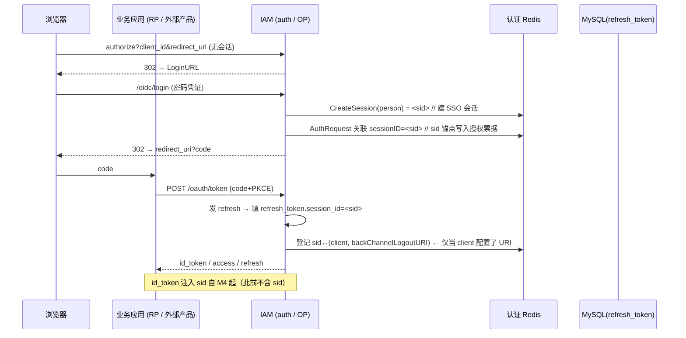
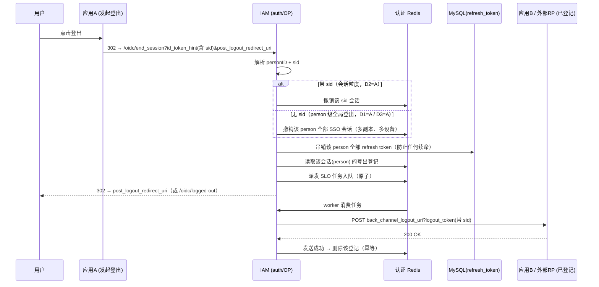

# OIDC 统一登出与 Back-Channel Logout 设计变更

> 本文档是既有 [iam-design.md](iam-design.md)（核心主文档）中"全局登出（§2.5）"的**设计升级**：将当前"仅清中心会话 + 吊销 refresh（access 靠 TTL 失效）"的 MVP 登出，扩展为主流 OIDC 的**标准 Back-Channel Logout（SLO）**，并配套"业务应用无状态、OP 唯一持会话、auth 多副本共享认证 Redis"的部署模型。
>
> 决策依据：参照 Zitadel（开源 IdP）与 [OpenID Connect Back-Channel Logout 1.0](https://openid.net/specs/openid-connect-backchannel-1_0.html) 规范，**以主流 OIDC 为准，允许破坏性调整，引入 `sid` 会话锚点**。

---

## 0. 背景与目标

### 0.1 现状（MVP）与问题

当前登出实现（`docs/design/iam-design.md` §2.5）：

```
用户 → 任一 RP → IAM /oidc/end_session?id_token_hint&post_logout_redirect_uri
  ① 删除中心会话 (sso_session cookie + Redis 记录)
  ② 吊销该 person 在所有租户下的 refresh token (DB 置 revoked_at)
  ③ 302 → post_logout_redirect_uri
  access token 无状态, 靠自身 TTL 失效
```

**问题**：
1. **登出不同步**：`platformadmin`/`tenantadmin` 作为独立应用，只验签 access token，**不校验 OP 会话活性**；A 登出后 B 的 access token 在 TTL（当前 1h）内仍被放行，表现为"B 仍是登录态"。
2. **无标准 SLO**：`/oidc/end_session` 只清 cookie，`OIDCStorage` 未实现 `CanTerminateSessionFromRequest`，无 back-channel 通知框架；对外部第三方 RP 无法主动告知"该用户已登出"。
3. **鉴权模型不成熟**：曾试图让业务应用通过 `HasActiveSession` 访问 OP 的 SSO 会话存储，这**不是主流**（见 §1 架构纠正）。

### 0.2 目标与原则

- **一处登出 → 处处登出**：用户在任一应用登出，其它已登录应用立即（或极短窗口内）失效。
- **以主流水准为准**：对外部产品走**标准 OIDC Back-Channel Logout**；对内部应用允许短窗口失效。
- **业务应用无状态**：`platformadmin`/`tenantadmin` 作为无状态 RP，不依赖 OP 的存储、不共享认证 Redis，可独立部署、可水平扩展。
- **auth 多副本**：auth（OP）支持多副本，各副本**共享同一认证 Redis**（SSO 会话 / 登出登记 / SLO 队列为跨副本单一事实源）。
- **引入 `sid`**：以 SSO 会话 ID 作为 ID token 与 logout token 的会话锚点，实现会话粒度精确登出。

---

## 1. 架构纠正：角色隔离与数据流

### 1.1 核心原则：OP 唯一持会话，业务应用无状态

主流 SSO 中 **OP（IdP）持有全部会话状态，RP（业务应用）只做无状态验签，绝不访问 OP 内部存储**：

```
       ┌─────────────── 业务应用 (RP) ───────────────┐
       │  platformadmin / tenantadmin / 外部第三方产品 │
       │  只验签 access token（公钥）                │
       │  access 短 TTL；refresh 吊销后无法续命       │
       │  不访问 OP 的会话/登出状态                  │
       └─────────────────────┬──────────────────────┘
            authorize/ token │      back-channel logout_token
                             ▼                 ▲
       ┌─────────────── IAM (OP) ───────────────┼────────┐
       │  auth：唯一持 SSO 会话 + 登出登记 + SLO队列 │──────┘
       │  （多副本共享认证 Redis + MySQL）          │
       │  签发 sid / access / id / refresh        │
       └─────────────────────────────────────────┘
```

**这纠正了两点过去的不成熟设想**：
- ~~业务应用用 `HasActiveSession` 查询 OP 会话~~ → 删除此设想，业务应用回归无状态。
- ~~要求各 app 共享同一 Redis~~ → 仅 auth（OP）内部多副本共享认证 Redis；业务应用各自独立。

### 1.2 登出即失效的三条主线

无状态 RP 下，登出失效依赖三层（缺一不可，各自承担不同即时性）：

| 层 | 机制 | 即时性 | 是否依赖共享存储 |
|----|------|--------|------------------|
| ① | **access token 短 TTL**（默认 15min） | 残留窗口 = access TTL | 否（无状态） |
| ② | **refresh token 吊销**（登出时 OP 执行） | access 过期后无法续命 | 否（OP 执行，RP 无感）|
| ③ | **back-channel logout**（OP → 已登记 RP） | **即时**，供有本地态应用清态 | 否（HTTP 通知）|

> **关键点**：无状态应用（平台 admin / tenant admin）**没有本地会话对象**，③ 接受端对它们无意义；其即时性依赖 `②refresh 吊销 + ①短 access TTL`。对外部第三方产品（通常有服务端会话 / 本地 token 缓存），③ 是其接入统一登出的**标准契约**。

### 1.3 与 Zitadel 的异同（决策依据）

| 维度 | Zitadel | Ark（本方案） |
|------|---------|---------------|
| access token TTL | 12h（默认） | **15min 默认**（压缩无状态残留窗口）|
| refresh token 有效期 | 90 天绝对 / 30 天 idle | **30 天绝对**（现状保留，可 per-client）|
| 即时失效手段 | 纯靠 back-channel 通知 | back-channel 通知 + 更短 access TTL 双保险 |
| 业务应用 | 通常是**有状态** RP | **无状态** JWT 应用居多 |
| sid 注入 | `claims.SessionID = sessionID`（`token.go`）| 分步实现（见 §5）|

> Zitadel 依赖"长 access + back-channel 即时通知"；Ark 因内部应用无状态、无接收端，故**缩短 access TTL** 以补足失效窗口。外部契约仍走标准 back-channel。

---

## 2. 部署模型（多副本 + 共享认证 Redis）

### 2.1 拓扑

```
        ┌──────────────────── auth (OP) 多副本 ────────────────────┐
        │  副本1 ─┐   副本2 ─┐   副本N ─┐                          │
        │        ▼          ▼          ▼                          │
        │   ┌────────────────────────────────────────┐            │
        │   │  共享认证 Redis（SSO会话/登出登记/SLO队列）│◀─ redis_config ├
        │   └────────────────────────────────────────┘            │
        │   DB(MySQL)：refresh token 吊销 / 登出登记回溯（共享）      │
        │   签发 access/id/refresh（同一非对称签名密钥）            │
        └────────────────────────────────────────────────────────┘
          │ 签发 access / refresh（公钥验签，同一 issuer）
          ▼
   platformadmin / tenantadmin（无状态 RP，独立部署 / 独立 Redis）
   公钥验签 access → 15min 残留窗口；refresh 吊销 → 续命失败 → 重新认证

   back-channel logout_token（带 sid） ──► 外部第三方 RP（自建接收端清本地态）
```

### 2.2 正确性硬约束（部署前必须满足）

1. **auth 多副本必须共享同一认证 Redis**：`redis_config` 指向同一 Redis（SSO 会话 / 登出登记 / SLO 队列跨副本一致）。多副本若各自 Redis 则会话失效。
2. **auth 多副本共用同一 MySQL**：refresh token 吊销一致。
3. **所有 app 的 `oidc.signingPrivateKeyPath/PEM` 与 `oidc.issuer` 必须一致**：非对称验签前提（各 RP 用公钥验签 access token）。
4. **业务应用不要求共享任何存储**：`platformadmin`/`tenantadmin` 独立部署、独立 Redis，只依赖公钥验签 + refresh 吊销语义。

### 2.3 多副本并发一致性

- **SLO 队列原子消费**：worker 用 Redis `BRPOP`/`SPOP` 原子领取，避免多副本重复发送。
- **登出登记幂等**：收到正确处理回执后 `SREM` 删除登记条目标记完成；重试/重复送达由 `jti` 唯一性 + 登记删除保证幂等。
- **SSO 会话**：Redis 原生原子（`SET`/`SADD`/`SREM`）天然跨副本一致。

---

## 3. 数据流（端到端时序）

### 3.1 登录 → sid 锚点 → 登出登记



### 3.2 登出 → 撤销 + Back-Channel 通知



---

## 4. 核心概念与设计决策

### 4.1 会话锚点：`sid` 与 `OIDCSessionID`（双层）

必须区分两个会话 ID，否则登出登记会失真：

| ID | 载体 | 粒度 | 说明 |
|----|------|------|------|
| `sid` | SSO 中心会话（`sso_session.<sid>`）| **person/设备级** | 一次登录建一个，承载"你是谁"；被多个 client 复用 |
| `OIDCSessionID` | 某次授权码交换签发的令牌账本 | **单次签发级** | 一个 sid 下可为多个 client 各签发一条 |

**`sid` 用途**：
- **ID token** `claims.SessionID` 携带 sid（[规范完备步，见 M4](#m4-规范完备)）。
- **logout token** 携带 sid，RP 据此匹配并清除本地会话。
- **end_session** 用 `id_token_hint` 中的 sid 定位中心会话。

**对应关系**：一个 `sid` 下登记多条 `(OIDCSessionID, clientID, userID, backChannelLogoutURI)`（每个开启过授权的 client 一条）。因此"按 sid 注销"= 撤销该中心会话，并**通知该 sid 下登记的全部 client**；"按 person 注销"= 撤销该 person 全部 sid，并通知其全部登记（含跨设备/跨副本）。

### 4.2 登出登记的粒度与时机

对齐 Zitadel `RegisterLogout`（`oidc_session.go`）的"**空则跳过**"原则：

- **粒度**：`sessionID`（会话）维度登记该会话签发过的 `(OIDCSessionID, clientID, userID, backChannelLogoutURI)`。
- **写入时机**：授权码交换发 refresh token 时。
- **跳过的两种情况**：`sessionID == ""`（服务账号 / Client Credentials）或 client **未配置** `back_channel_logout_uri`。

### 4.3 登出语义分派

> **核心认知**：Ark 是 person 一元身份，登出本质是 **person 级**——**吊销始终按 person 兜底**（D2=A）。`sid` 仅用于定位**发起方中心会话以确定背信道通知范围**，不构造成独立于 person 的"设备隔离吊销"。`id_token_hint` 是否携带 sid，只影响"撤销/通知精确到哪个中心会话"，不影响"吊销该 person 全部 refresh token"。

| 场景 | sid 作用 | 撤销会话范围 | 吊销 refresh | 背信道通知范围 |
|------|----------|-------------|--------------|----------------|
| 带 `id_token_hint` 且含 sid | 定位发起中心会话 | 该 sid 中心会话 | **该 person 全部**（D2=A 兜底）| 该 sid 下登记的全部 client |
| 带 `id_token_hint` 但不含 sid | 无法定位，退化为 person 级 | person **全部** sid | **该 person 全部** | person 全部登记过的 client |
| 无 `id_token_hint` | 无 | person **全部** sid（多副本、多设备，D1=D3=A）| **该 person 全部** | person 全部登记过的 client |

> **为什么带 sid 仍吊销该 person 全部 refresh（D2=A）**：即使只精确注销单个中心会话，也强制复位该自然人全部票据，杜绝任何会话凭泄露后继续续命；避免残留的其它会话/子会话仍可刷新。这与"通知范围按 sid 收窄"正交：**吊销按 person 兜底，通知按 sid 精确**。

**阶段约束**：`id_token_hint` 能携带 sid 依赖 ID token 注入 sid（M4）。因此在 **M3 阶段 ID token 尚不含 sid**，"带 sid 精确注销"分支不可达，`TerminateSessionFromRequest` 统一按 person 级执行；sid 精确分支随 M4 启用。

### 4.4 TTL 决策

| Token | 默认值 | 说明 |
|-------|--------|------|
| access | **15 min** | 压缩无状态应用登出残留窗口；per-client 用 `AccessTokenTTL` 覆盖，未配置则走 `persistent_store.go:173/187` 兜底字面量（须一并联调为 15min）|
| refresh | **30 天** | 现状保留；单次使用轮换；登出时按 person 吊销 |
| SSO 会话 | **24h 滑动续期** | 现状保留 |

---

## 5. 分步实施（里程碑 M1–M5）

> 每阶段可独立交付 / 回滚。**M3 末尾即达成业务目标**（对第三方标准 back-channel，对内部无状态靠短 access + refresh 吊销）。

### M1：共享层 + OP 收敛（无行为变化）

**P1：SSO 会话下沉共享层 `pkg/iam/sso`**
- 新建 `backend/pkg/iam/sso/sso.go`（包 `sso`），迁移 `apps/auth/internal/service/svcsso` 的：
  - `SSOSessionStore` 接口 + `redisSSOSessionStore` 实现
  - `Create/Validate/RevokeSession/RevokeSessionsByPersonID/HasActiveSession`
  - `RevokeSSOSessionsByPersonID` 导出函数
  - `sessionAuditWriter`（审计注入保持可测）
- `SessionTTL` 由 `auth/config.Conf.OIDC.SessionTTL` 改为 `pkg/config`（消除对 `apps/auth` 的依赖）。
- 更新引用方 import：`svcauth/auth.go:324`、`svcoidc/oidc.go`、`svcoidc/routes.go`、`svcoidc/persistent_store.go:335`、`ctrauth/auth.go`、`app.go:25`。
- 迁移 `sso_test.go`，删除旧包。
- **验收**：`go test ./pkg/iam/sso/...` 通过。

**P2：auth 角色收敛（OP 单点持会话）**
- 保留 `auth/app.go:34` 的 `WithOIDCSSOValidation`（换用 `pkg/iam/sso`，行为不变；机器 token 放行 + 无 Redis fail-open）。
- **不** 扩展到 `platformadmin`/`tenantadmin`（不共享认证 Redis，回归无状态）。

### M2：sid 锚点 + 登出登记（数据 / 流程闭合）

**P3：数据模型**
- `pkg/iam/model/application_client.go`：
  - 新增 `BackChannelLogoutURI string`（`back_channel_logout_uri`）。
  - `AccessTokenTTL` 已有字段，默认语义改为 **15min 秒值（900）**。
  - **同步修改兜底字面量**：`svcoidc/persistent_store.go:173`（client_credentials）与 `:187`（authorization_code/refresh）的 `ttl := time.Hour` 改为 `900 * time.Second`，否则未配置 client 仍走 1h。
- `svcoidc/storage.go` `AuthRequest`：新增 `SessionID string`（含 `GetSessionID()`）。
- `svcoidc/protocol_state_store.go`：`CompleteAuthRequest` 携带 sessionID 或新增 `AssociateSession(id, sessionID)` 回写授权票据。
- `platformadmin` `dtoapplicationclient` 增删查 `BackChannelLogoutURI`。
- **验收**：client 可配置 backchannel URI；授权票据可携带 sid。

**P4：会话注入 + refresh 关联**
- 登录完成点回写 sid 到授权票据：`svcoidc/oidc.go:281`（`CompleteLogin`）、`:332`（`SelectTenant`）、`:348`（`CompleteLoginBySession`）。
- `svcoidc/persistent_store.go:185` `CreateAccessAndRefreshTokens`：填 `refreshEntity.SessionID`（`refresh_token.go:17`）+ 保留 `ApplicationClientID`；refresh 轮换分支从旧 token 反查保留。
- **验收**：授权码交换后 `refresh_token.session_id` 有值。

**P5：登出登记存储（会话粒度，认证 Redis）**
- `pkg/iam/sso/slo.go`：登记 set `iam:oidc:slo_reg:<sid>`，提供：
  - `Register(sessionID, clientID, userID, backChannelLogoutURI)`
  - `ListBySessionID(sid)` / `ListByPersonID(personID)`（汇总该 person 全部会话登记，供无 sid 全局登出）
  - `Delete(sessionID, oidcSessionID)`（发送成功回执后删）
- 登记写点：发 refresh 时当 `sessionID!="" && backChannelLogoutURI!=""`。
- `clientBackChannelLogoutURI(clientID)` 从 `ApplicationClientEntity` 读。
- **验收**：登录发 token 后登记存在；可枚举待通知 RP。

> 存储选型备注：登出登记短生命周期、随会话同生共死，优先放**认证 Redis**（与 SSO 会话一致、多副本共享）；审计长留走 DB。

### M3：RP-Initiated 分流 + 背信道发送（核心可对外）

**P6：`TerminateSessionFromRequest`（完整分流）**
- `OIDCStorage` 实现 `CanTerminateSessionFromRequest`（`op/storage.go:76`）`TerminateSessionFromRequest(ctx, *op.EndSessionRequest)(string, error)`：
  1. 解析 personID（`sub`）+ sid（`IDTokenHintClaims.SessionID`，若存在）。
  2. **M3 阶段 ID token 尚无 sid → 统一走 person 级**：撤销该 person 全部中心会话（D1=D3=A）。**仅当 M4 完成、id_token_hint 携带 sid 后**，才启用"带 sid → 精确撤销该中心会话 + 通知该 sid 登记"分支。
  3. 吊销该 person 全部 refresh（D2=A）。
  4. 从登记取通知目标 → 入队 SLO（person 级即取该 person 全部登记）。
  5. 返回重定向（`post_logout_redirect_uri` 校验通过 或 `DefaultLogoutRedirectURI`=`/oidc/logged-out`）。
- 替换 `routes.go:42`（保留清 cookie）与 `storage.go:276` `TerminateSession` 语义收敛。
- **验收**（M3）：`end_session` 不带 id_token_hint（或带但不含 sid）→ 正确 person 级撤销 + 派发。**验收**（M4）：带 sid → 精确撤销该中心会话 + 通知该 sid 登记。

**P7：Back-Channel 发送器**
- `pkg/iam/slo` worker + Redis FIFO `iam:oidc:slo_queue` + `BRPOP` 原子领取（多副本安全）。
- logout token 构造：`oidc.NewLogoutTokenClaims(issuer, personID, aud=[clientID], exp, jti, sid, skew)`（`zitadel/oidc/pkg/oidc/token.go:409`）→ 现有 RSA 私钥签名 → POST `application/x-www-form-urlencoded` 的 `logout_token`。
- 超时（`http.Client.Timeout`）、指数退避重试（N 次）、任务 TTL、成功/失败 `svcaudit`、成功删登记。
- logout token 校验契约：必须含 `sub`/`sid`、`aud`=clientID、`events.backchannel-logout`。
- discovery：`backchannel_logout_supported=true`（`session_supported` 暂 false）。
- **验收**：多 RP 收到带 sid 的 logout token；多副本无重复发送；审计可查。

> **M3 完成即业务目标达成**。

### M4：规范完备（✅ 已实现）

**P8：ID token 携带 sid**
- **实现方式（经实测，零破坏）**：zitadel 的 `op.CreateIDToken`（`zitadel/oidc/pkg/op/token.go`）对实现了 `Storage.(CanSetUserinfoFromRequest).SetUserinfoFromRequest` 的存储，会把返回的 `oidc.UserInfo.Claims` **merge 进 ID token payload**（`IDTokenClaims.SetUserInfo` 的 `gu.MapMerge`），且 `oidc.IDTokenClaims.UnmarshalJSON` 会把 payload 的 `sid` 反序列化进结构化 `SessionID` 字段。
- 因此 `OIDCStorage` 实现 `CanSetUserinfoFromRequest`（`svcoidc/storage.go`）：authorization_code 分支取 `authReq.SessionID`、刷新分支取 `refreshTokenRequest.SessionID`，非空时写入 `userinfo.Claims["sid"]`，即可让 **ID token 携带 sid**，无需 fork/自研 token 端点。
- 同步项：refresh token 持久化 `session_id`（`pkg/iam/model/refresh_token.go`），刷新后的 access token / ID token 继续携带 sid；`GetPrivateClaimsFromRequest` 的刷新分支回填 sid（`svcoidc/storage.go`）。
- discovery `backchannel_logout_session_supported=true`（`oidc.go` op.Config）。
- **验收（已满足）**：ID token 含 `sid`；外部 RP 可精确匹配会话；`end_session` 用 `id_token_hint` 的 sid 精确定位并回填 logout_token.sid。
- **风险缓解**：破坏面极小（仅 userinfo claims 注入），即使回退 `session_supported=false` 也不影响核心登出。

### M5：测试与破坏性回归

- 单元：登记 / 撤销 / sid 定位 / logout token 构造（含 `events.backchannel-logout`）/ 重试 / TTL / 多副本原子领取。
- 集成（**带 sid 的精确注销用例自 M4 起生效**；M3 阶段以 person 级语义验证）：
  1. 两 RP（A、B）登录，各得 sid + access + refresh。
  2. A 登出（带 id_token_hint）→ 断言：A 收到 302 回 post_logout_redirect_uri；auth 撤销中心会话（M4 后为精确 sid，M3 为 person 级）+ 吊销该 person 全部 refresh；B 作为已登记 RP 收到 logout token。
  3. B 无接收端 → B 的 access（15min）到期 + refresh 已吊销 → 无法续命 → 重新认证（**符合预期**）。
- 回归：现有登录 / 选租户 / SSO 复用 / 刷新轮换 / PKCE / API Key / 租户隔离全量。

---

## 6. 代码定位（变更映射）

| 变更点 | 文件（当前）| 改动 |
|--------|------------|------|
| SSO 会话下沉 | `apps/auth/internal/service/svcsso/sso.go` | 迁移 → `pkg/iam/sso/` |
| OP 唯一持会话 | `apps/auth/app.go` | import 切换 |
| client 背信道配置 | `pkg/iam/model/application_client.go` | 加 `BackChannelLogoutURI` |
| sid 锚点 | `pkg/iam/model/refresh_token.go`、`svcoidc/storage.go`、`protocol_state_store.go` | 填 `SessionID`；授权票据携带 sid |
| 登出登记 | 新增 `pkg/iam/sso/slo.go` | 登记 set |
| RP-Initiated 分流 | `svcoidc/storage.go`、`routes.go` | 实现 `CanTerminateSessionFromRequest` |
| SLO 发送器 | 新增 `pkg/iam/slo` | worker + 队列 |
| ID token sid | 自建 token 端点 | 替换 `/oidc/oauth/token` |

---

## 7. 风险与缓解

| 风险 | 缓解 |
|------|------|
| **P8 破坏性大**（替换 token 端点）| 分步：M3 先 deliver（不依赖 ID token sid），M4 失败可回退 `session_supported=false` |
| 无状态应用登出残留窗口 | 已接受（D1=A）：残留 ≤ access TTL（15min）|
| auth 多副本一致性 | 硬约束共享认证 Redis + 同一 DB；SLO worker `BRPOP` 原子领取防重 |
| 登出登记与 SSO 会话一致性 | 同生命周期同 Redis；发送成功 `SREM` 幂等删登记 |
| 外部 RP 未实现接收端 | 这是外部产品接入统一登出的**职责**；OP 只负责发通知（与 Zitadel 态度一致）|

---

## 8. 决策清单（已确认）

| 项 | 决策 |
|----|------|
| 协议对齐 | 标准 OIDC 为准，可破坏性调整 |
| sid 注入 | P4-B，**分步**（M3 先 logout token 带 sid、person 级登出；M4 再 ID token 注入 sid、启用精确会话登出）|
| 业务应用 | 无状态，不共享 OP 认证 Redis，可单独部署 |
| 登出语义 | 登出本质 person 级，吊销始终按 person 兜底（D2=A）；sid 定通知范围（D1=D3=A）|
| 多副本 | auth 多副本共享认证 Redis（person 级全局登出跨设备/跨副本级联）|
| TTL | access 15min / refresh 30 天 / SSO 会活 24h 滑动 |
| 内部应用接收端 | 不做（无状态无本地对象可清），靠短 access + refresh 吊销 |
| 发送器 | goroutine worker + Redis FIFO + 重试 / TTL / 审计（无外部队列）|
