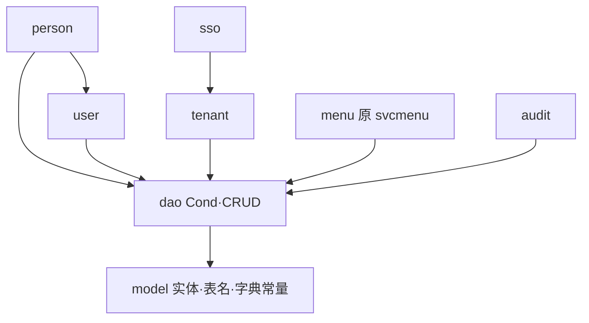
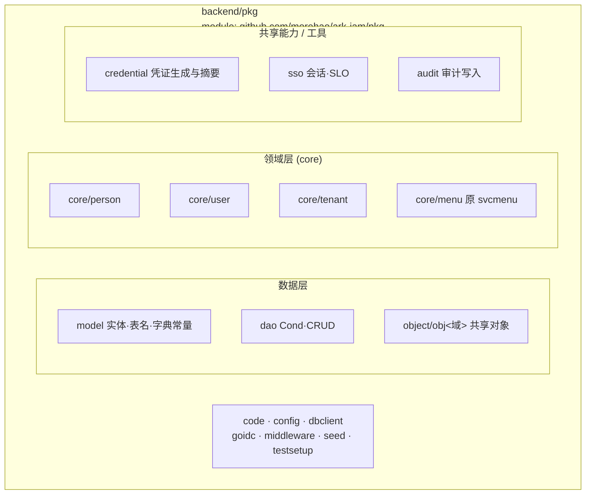
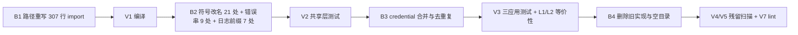

# pkg 共享层重划分技术方案

> 场景：**S3 结构重构**（结构变、外部行为不变）｜档位：**标准档**｜专题：架构设计 + 安全 + 迁移手法

## 背景与目标

### 现状与痛点

`backend/pkg` 是 5 个 Go 模块（`go.work`）中的共享模块，被 auth / platformadmin / tenantadmin / gateway 四个应用共同依赖。它当前的目录形态是历史沉淀的结果，不是设计的结果：

```
backend/pkg/
├── iam/            ← 唯一的"业务域容器"，但边界不自洽
│   ├── model/ dao/ object/        数据层
│   ├── person/ user/ tenant/      跨表领域能力
│   ├── svcmenu/                   跨表领域能力，却带 app 服务层前缀
│   ├── sso/ audit/ password/ apikey/
├── token/          ← IAM 专属，却在容器外
├── goidc/ seed/ dbclient/          ← 同样 IAM 专属，同样在容器外
└── code/ config/ middleware/ testsetup/
```

痛点逐条落到具体位置：

1. **命名重复且不自洽**：模块路径已是 `github.com/morehao/ark-iam/pkg`，再套一层 `iam` 后读作 `ark-iam/pkg/iam/model`，域名出现两次。而 `pkg/token`、`pkg/goidc`、`pkg/seed`、`pkg/dbclient/tenant_scope.go` 这些同样 IAM 专属的包却直接躺在 `pkg` 根下——`pkg/iam` 是**唯一**使用域容器的目录，被自己的兄弟包否定。
2. **`svcmenu` 前缀错位**：本仓库 `svc` 前缀按 `AGENTS.md` 专指应用内服务层（`internal/service/svcxxx`）。`pkg/iam/svcmenu` 是跨应用共享的领域查询能力（纯函数 + dao，不持 DTO、不返错误码、不是接口 + 构造注入形态），名字来自 commit `95f0197` 从 `svctenant`/`svcpermission` 抽取时的残留。留在共享层会传递"服务层代码可以放公共包"的错误示范。
3. **凭证摘要能力无归属，同一件事写了 6 遍**（详见 [§重复实现收敛](#重复实现收敛)）：一个 API Key 的 SHA-256 摘要在 `apikey` / `middleware` / `oidcop` 三处各写一遍；OAuth client secret 的摘要在 auth 与 platformadmin 两处各写一遍；生成侧还有两套 `随机 32 字节 → hex`。

当前依赖方向是干净无环的（`model ← dao ← {person,user,tenant,svcmenu,audit,sso}`），说明**能力划分本身是对的，出问题的只是命名与摆放**。



### 目标与非目标

**目标**

- 共享层路径不再重复域名，包名表达"提供什么"而非"属于谁"。
- 跨应用共享的领域能力有唯一、可预测的归属位置，`svc` 前缀不再出现在共享层。
- 凭证的生成与摘要收敛为单一实现，并显式区分"低熵口令 / 高熵机密"两类哈希策略。

**非目标（超出范畴的用例）**

- **不改任何对外契约**：HTTP 路由、请求响应结构、错误码、数据库 schema、swagger 注解的业务语义全部不变。原因是本方案是纯结构重构，任何契约变更都会把风险从"编译期"抬到"运行期"，与收益不成比例。
- **不改 `pkg` 模块名与模块边界**：`backend/pkg` 这个名字本身是弱名（Go 社区对 `pkg` 目录有长期批评），但改名属于"模块边界"问题，且当前没有干净的"通用库 / 产品内核"切分来支撑拆模块，本期不动。
- **不重命名 `model` / `dao` / `object` 的内部前缀约定**：`object/obj<域>`、`dto/dto<域>`、`controller/ctr<域>` 的"目录前缀"约定在仓库内是一致的，属于既有约定，本期保持。
- **不合并有状态能力**：`sso`（Redis 会话 + SLO）与 `audit`（审计写入）依赖不同、生命周期不同，不并入 `credential`。

### 约束与非功能需求

| 约束 | 内容 |
|---|---|
| 语言与构建 | Go 1.26.1，`go.work` 5 模块，**不新增/不拆分模块**，`go.mod` 无需变更 |
| 行为等价 | 编译产物、测试结果、凭证摘要输出**逐字节一致** |
| 安全 | 摘要算法与编码不变（SHA-256 → hex）；低熵口令继续走 bcrypt；日志与错误串不得引入明文凭据 |
| 排期 | 单人执行；受"在飞分支 rebase"约束，需选无大 PR 在飞的窗口 |

### 验收标准

| # | 验收项 | 阈值 | 验证方式 | 责任方 |
|---|---|---|---|---|
| V1 | 全模块编译通过 | exit 0；包数 80 → 78（`password`/`apikey`/`token` 合并为 `credential`） | `cd backend && go build ./pkg/... ./apps/auth/... ./apps/platformadmin/... ./apps/tenantadmin/... ./apps/gateway/...` | 执行者 |
| V2 | 共享层测试全绿 | 13 个测试包全 `ok` | `cd backend && go test ./pkg/...` | 执行者 |
| V3 | 三应用测试全绿 | 无新增失败 | `make test APP=auth` `APP=platformadmin` `APP=tenantadmin` | 执行者 |
| V4 | 旧路径零残留 | 0 处 | `grep -rn "ark-iam/pkg/iam" backend --include='*.go' --exclude-dir=.tmp` | 执行者 |
| V5 | 共享层零 `svc` 前缀包 | 0 个 | `ls backend/pkg \| grep '^svc'` 无输出 | 执行者 |
| V6 | 凭证摘要字节等价 | 逐条字符串相等 | 见 [§等价性验证方案](#等价性验证方案) | 执行者 + 评审 |
| V7 | Lint 无新增问题 | 各模块 `golangci-lint run ./...` 退化为 0 | `make lint` | 执行者 |

---

## 行为基线与等价性验证

### 重构前基线

在改动前记录并在改动后逐项复现（已在本方案编写时实测）：

| 基线项 | 实测值 |
|---|---|
| 构建 | `go build` 合并 5 模块路径，exit 0，**80 个包** |
| 共享层测试 | `go test ./pkg/...` 全部 `ok`；有测试的包 13 个：`dbclient`、`goidc`、`iam/{audit,dao,model,password,person,sso,tenant,user}`、`iam/object/objauth`、`middleware`、`seed` |
| 无测试的包（重构不改变其行为，靠编译 + 调用点验证） | `code`、`config`、`testsetup`、`iam/apikey`、`iam/svcmenu`、`iam/object/{objaudit,objpermission,objtenant}`、`token` |
| 代码规模 | Go 文件 324 个（排除 `.tmp`），测试文件 90 个 |
| 摘要算法（关键） | 高熵机密：`sha256.Sum256 → hex`（小写，无截断）；低熵口令：`bcrypt`（`gcrypto.GeneratePasswordHash`） |

### 等价性验证方案

本重构不可用"双写/影子流量"验证——它不产生任何运行时行为差异，**等价性完全落在编译期与测试期**。唯一有真实风险的是凭证摘要：改的是代码位置，不是算法，但一旦实现漂移，后果是所有已签发的 API Key / OAuth client secret / refresh token 立即全部失效（生产事故，且对已落库的哈希不可逆）。

分三层验证：

**L1 单元层 · 黄金向量锁定**
在 `pkg/credential` 新增 `TestHashSecret_Golden`，用固定输入锁定输出：

```go
// 黄金向量：锁定"SHA-256 → 小写 hex、不截断"这一契约。
// 任何改动导致本用例失败，即意味着存量库哈希将无法匹配。
func TestHashSecret_Golden(t *testing.T) {
    cases := map[string]string{
        "":        "e3b0c44298fc1c149afbf4c8996fb92427ae41e4649b934ca495991b7852b855",
        "abc":     "ba7816bf8f01cfea414140de5dae2223b00361a396177a9cb410ff61f20015ad",
        "ark-iam": "<改动前用旧实现实测值填入>",
    }
    // 断言 credential.HashSecret(k) == v
}
```

`ark-iam` 一行的期望值必须在改动前用**旧实现**（`pkg/iam/apikey.Hash`、`pkg/token.HashToken` 任一）实测取得并写入测试，作为"改动前事实"的锚点。

**L2 集成层 · 交叉等价断言**
在重构完成、旧实现尚未删除前，新增一个临时测试，对同一组输入同时调用新旧实现并断言相等：

```
assert credential.HashSecret(x) == apikey.Hash(x)   // 对 100 组随机 + 边界输入
```

该测试**在删除旧实现时一并删除**，仅用于迁移窗口内的交叉验证。

**L3 数据层 · 存量对账**
面向已部署环境，在上线前对存量库抽样比对（本方案不含数据迁移，故对账是只读的）：

| 对账对象 | 表 · 列 | 口径 | 抽样 |
|---|---|---|---|
| API Key | `api_key.key_hash` | 由于明文不可得，改为：以现有校验链路实测一次"用已知明文 Key 通过鉴权"（`middleware.ApiKeyAuth`），验证查表命中 | 至少 1 条真实 Key |
| OAuth client secret | `application_client_secret.value_hash` | 以 `client_credentials` 或授权码流实测一次 secret 校验通过 | 每条 client 1 次 |
| refresh token | `refresh_token.token` | 用存量 refresh token 换发一次 access token | 至少 1 条 |

**为什么不对明文重算全量哈希**：明文不落库（这正是设计意图），无法批量重算；因此采用"以真实校验链路探测命中"的方式，口径是**校验通过率 100%**。

### 差异容忍度与处理规则

| 层 | 容忍度 | 不一致时的处理规则 |
|---|---|---|
| L1 黄金向量 | **零容忍**（逐字节相等） | 停止合并，回查 `HashSecret` 实现，**以旧实现为准**修正新实现 |
| L2 交叉等价 | **零容忍** | 同上；该测试失败即禁止删除旧实现 |
| L3 存量对账 | **零容忍**（校验必须通过） | 立即回滚代码（见 [§回滚](#不可逆动作与审批)），不得前滚 |
| V1–V3、V7 | 全绿，无新增失败 | 定位到本次改动；若为既有 flaky 用例，需在 PR 中标注并给出证据 |

---

## 方案设计

### 总体思路

**把 `pkg/iam` 这个"域容器"删掉，让模块路径承担域名；容器内按"数据层 / 领域层 / 基础能力"三类平铺到 `pkg` 根下；跨应用共享的领域能力收进 `pkg/core/<域>`（与各应用既有的 `internal/core/<域>` 对称）；三个纯工具包合并为 `pkg/credential`，并借此把散落的 6 处凭证摘要实现收敛到唯一实现。**

判据（本方案全部结论由这四条推出，可复用于后续同类决策）：

| # | 判据 |
|---|---|
| C1 | 同一信息只表达一次——域名已在模块路径里，包路径不得重复 |
| C2 | 包名表达"提供什么"，不表达"属于谁"；同一模块内存在 ≥2 个并列业务域时才引入域容器 |
| C3 | 与仓库既有约定对称——共享对应物 = `pkg/<与 app 内同角色的名字>`（既有先例：`apps/*/internal/middleware` ↔ `pkg/middleware`） |
| C4 | 不引入比现状更弱的名（名不副实 / 更含糊 / 撞既有语义） |
| C5 | 合并的正当性是"合并后能用一句话说清职责"，不是"行数少"；否则产出 `utils` 式杂物间 |

### 目标结构



| 包 | 职责 | 数据所有权 |
|---|---|---|
| `pkg/model` | 实体、表名、字典常量（落库事实源） | 表结构事实源，只被 `dao` 读 |
| `pkg/dao` | `Cond` + 单表 CRUD | 单表唯一写入口 |
| `pkg/object/obj<域>` | 跨应用共享对象（含 req/resp 结构） | 无状态 |
| `pkg/core/person` | person 聚合 find-or-create（须在调用方事务内） | `person` 表写入路径之一 |
| `pkg/core/user` | `tenant_user` 聚合跨表原子写入（person + user + 部门关系） | `user` / `department_user` 写入路径之一 |
| `pkg/core/tenant` | 建租户 + 根部门、自服务权限开通、会话撤销、编码生成 | `tenant` / `department` / `role` / `role_menu` / `tenant_application` 写入路径之一 |
| `pkg/core/menu` | 菜单树构建、可见性与授权剪枝、管理员类型推导 | 只读 |
| `pkg/credential` | 凭证生成、校验策略、摘要 | 无状态 |
| `pkg/sso` | SSO 中心会话存储（Redis）+ back-channel logout 登记 | Redis 键命名空间唯一所有者 |
| `pkg/audit` | 审计 best-effort 写入 + 动作常量别名 | `audit_log` 写入路径之一 |

### 备选方案与取舍

| 方案 | 做法 | 改动面 | 代价 | 否决理由 |
|---|---|---|---|---|
| **A. 保留容器，只整理内部** | `pkg/iam/core/{person,user,tenant,menu}` | 18 处 import | 最小 | **否决**：不满足 C1（域名仍重复两次）；且 `pkg/iam` 与 `pkg/token`/`pkg/goidc`/`pkg/seed` 的边界矛盾保留 |
| **B. 容器改名** | `pkg/iam` → `pkg/core` / `pkg/kernel` / `pkg/shared` | **307 处 import** | 与方案 C **完全相同** | **否决**：同价换更差的名——`core` 与 `apps/*/internal/core` 撞语义且导致 `pkg/core/core/*`；`kernel` 是术语门槛且不表意；`shared` 与 `pkg` 本身语义重复。C4 不通过 |
| **C. 扁平化（选定）** | 见 [§目标结构](#目标结构) | 307 处 import / 172 文件 | 触碰全部在飞分支 | — |
| **D. 改模块名** | `backend/pkg` → `backend/core`，模块路径 `ark-iam/core` | 448 处 import / 200 文件 + `go.work`/`go.mod` | 最高 | **本期否决**：`pkg` 是弱名属实，但没有干净的通用/产品切分（`dbclient/tenant_scope.go`、`middleware/oidc_auth.go` 都含产品逻辑）来支撑拆模块；列为范围外后续项 |
| **C-（缩减版）** | 只做扁平化，不合并工具包、不去重复 | 307 处 import | 中 | **否决为终态**：凭证能力仍无归属，第 7 处重复必然出现；但可作为**分期交付**的第一期（见 [§阶段与里程碑](#阶段与里程碑)） |

**为什么选 C 而不是 B**：B 与 C 的成本完全相同（都是 307 处 import），但 C 的结果严格更优——它同时消除了重复域名**并**让 `pkg/token`/`pkg/goidc`/`pkg/seed` 从"边界不一致"变为"本来就对"。要花这笔钱，就应换来结构改善，而非只是换一个词。

**什么情况下不该选 C**：如果这个仓库未来会承载**第二个并列业务域**（如 billing），那么 `pkg/iam/*` + `pkg/billing/*` 的域容器是有意义的，应选 A。当前 `pkg` 的消费者只有 4 个 IAM 应用，无第二域，该抽象不付息。

### 技术选型与理由

**合并后的工具包命名**：

| 候选 | 示例 | 评价 |
|---|---|---|
| **`credential`（选定）** | `credential.HashSecret` | 覆盖口令、API Key、client secret、refresh token——都是"凭证"；一句话说清职责，C5 通过 |
| `secret` | `secret.HashSecret` | 自我重复（包名与函数名同词）；语义偏向"机密"而非"凭证" |
| `authn` | `authn.GenerateSecret` | 语义是"认证机制"，而本包是"凭证材料"，错位 |
| `crypto` | `crypto.HashSecret` | 过宽（会吸引一切加密需求），且与标准库同名产生阅读噪音 |

**摘要实现**：保留**一处**具名实现作为 choke point（`credential.HashSecret`），实现体委托 golib 的 `gcrypto.SHA256Hash`，而非继续本地 `sha256.Sum256`。

- 为什么委托而不是自己写：`gcrypto.SHA256Hash` 与现有两处本地实现逐字节相同（`sha256.Sum256` → `fmt.Sprintf("%x", h)`），仓库已在别处使用 `gcrypto`；自带实现属于重复。C1。
- 为什么保留包装而不是直接调 golib：未来若摘要方案需要升级（如换 HMAC + pepper），有唯一改动点；且 `credential.HashSecret(token)` 比 `gcrypto.SHA256Hash(token)` 更能表达意图。
- 代价：多一层一行函数的间接。**什么情况下不该这么做**：若团队认为"不引入任何自有包装、直接用库"优先，可删掉包装，在 6 处调用点直接用 `gcrypto.SHA256Hash`——此时失去 choke point，未来升级摘要需改 6 处。

---

## 迁移批次与切流

本重构**无新旧并存期**：Go 是编译期链接，不存在"部分请求走新路径、部分请求走旧路径"的切流语义，也不存在旧代码与新代码并存的运行态。因此迁移手法退化为**单次原子改名 + 分批验证**：批次划分的目的不是切流，而是把"可机械校验的改动"与"需要人判断的改动"分开，让失败点尽早暴露。



批次进入/退出判据：

| 批次 | 内容 | 进入判据 | 退出判据 |
|---|---|---|---|
| B1 | 目录移动 + 307 行 import 路径重写（纯 sed，可机械校验） | 基线 V1–V3 全绿，已记录 | V1 编译通过 |
| B2 | 包内符号改名：`[svcmenu.` → `[menu.`（7）、错误串 `iam/user:` `iam/tenant:` → `core/user:` `core/tenant:`（9）、47 处注释引用 | B1 退出 | V1 + V2 通过 |
| B3 | 建 `pkg/credential`，合并 password/apikey/token；收敛 6 处摘要 + 2 处生成 | B2 退出；L1 黄金向量已在**改动前**取到旧实现实测值 | V2 + V3 + L1 + L2 通过 |
| B4 | 删除 `pkg/iam/`、`pkg/token/` 空壳与旧实现；重生成 swagger；更新文档 | B3 退出；L2 交叉断言已通过 | V4 + V5 + V7 通过；L3 由部署方执行 |

**为什么不需要灰度与开关**：本次改动为零运行时行为变化（无契约、无数据、无 schema），灰度的前提"新旧两条路径可并行比较"在编译期重构中不成立。等价性由 [§行为基线与等价性验证](#行为基线与等价性验证) 的 L1–L3 承担。

---

## 详细设计

### 包划分与职责

**规则（写进 `AGENTS.md`，成为新增共享代码的判据）**：

| 放什么 | 位置 | 判据 |
|---|---|---|
| 实体 / 表名 / 字典常量 | `pkg/model/` | 落库事实源 |
| `Cond` + 单表 CRUD | `pkg/dao/` | 单表数据访问 |
| 跨应用复用的对象（含 req/resp） | `pkg/object/obj<域>/` | 两端 DTO 共同内嵌 |
| 跨应用复用的领域能力（跨表、在调用方事务内、返回实体/哨兵错误） | `pkg/core/<域>/` | ≥2 个 app 需要，且不含 DTO / 错误码 |
| 跨应用复用的基础能力（外部存储、写入副作用） | `pkg/<name>/` | 无领域不变式 |
| 纯函数工具 | `pkg/<name>/` | 零依赖 |
| **禁止入共享层** | — | app 专属编排、错误码、路由、gin 服务接口、反向依赖 `apps/` |

**app 侧对应关系**：

| app 内（app-local） | 共享层（pkg） | 状态 |
|---|---|---|
| `internal/middleware/` | `pkg/middleware/` | ✅ 已有先例 |
| `internal/core/<域>/` | `pkg/core/<域>/` | 本期新增规则 |
| `internal/service/svcxxx/` | **无对应**——编排不外提；其中可复用的领域不变式下沉 `pkg/core/<域>`，其余留在各 app | 本期新增规则（据此判死 `svcmenu`） |
| `dto/dtoxxx/` | `object/objxxx/` | ✅ 已有先例 |

### 路径与符号映射

**A. import 路径（307 行 / 172 文件）**

| 旧路径 | 新路径 | import 行数 |
|---|---|---|
| `.../pkg/iam/model` | `.../pkg/model` | 149 |
| `.../pkg/iam/dao` | `.../pkg/dao` | 64 |
| `.../pkg/iam/object/objauth` | `.../pkg/object/objauth` | 20 |
| `.../pkg/iam/object/objpermission` | `.../pkg/object/objpermission` | 8 |
| `.../pkg/iam/object/objtenant` | `.../pkg/object/objtenant` | 7 |
| `.../pkg/iam/object/objaudit` | `.../pkg/object/objaudit` | 2 |
| `.../pkg/iam/sso` | `.../pkg/sso` | 22 |
| `.../pkg/iam/audit` | `.../pkg/audit` | 7 |
| `.../pkg/iam/tenant` | `.../pkg/core/tenant` | 7 |
| `.../pkg/iam/password` | `.../pkg/credential` | 7 |
| `.../pkg/iam/person` | `.../pkg/core/person` | 5 |
| `.../pkg/iam/user` | `.../pkg/core/user` | 4 |
| `.../pkg/iam/svcmenu` | `.../pkg/core/menu` | 2 |
| `.../pkg/iam/apikey` | `.../pkg/credential` | 1 |
| `.../pkg/token` | `.../pkg/credential` | 2 |
| **合计** | | **307 行 / 172 文件** |

**B. 符号与字符串（21 处调用点 + 16 处字面量）**

| 旧 | 新 | 调用点数 |
|---|---|---|
| `apikey.Generate()` | `credential.GenerateSecret(credential.APIKeyBytes)` | 1 |
| `apikey.Hash(s)` | `credential.HashSecret(s)` | 1 |
| `apikey.Prefix(s)` | `credential.Prefix(s, credential.APIKeyPrefixLen)` | 1 |
| `token.HashToken(s)` | `credential.HashSecret(s)` | 7 |
| `password.GenerateTemporary()` | `credential.GenerateTemporaryPassword()` | 4 |
| `password.BootstrapAdminPassword` | `credential.BootstrapAdminPassword` | 2 |
| `password.ValidateStrength` | `credential.ValidateStrength`（不改名，`credential.` 前缀已消除歧义） | 0 |
| 日志前缀 `[svcmenu.` | `[menu.` | 7 |
| 错误串 `"iam/user: ..."` | `"core/user: ..."` | 4 |
| 错误串 `"iam/tenant: ..."` | `"core/tenant: ..."` | 5 |

> 注：`tenant.` / `user.` / `person.` / `sso.` / `audit.` / `model.` / `dao.` 等包名本身不变，仅 import 路径变化，**调用点字面量无需改动**——这是 307 行改动中绝大多数是纯 sed 的原因。

### credential 包设计

```go
// Package credential 提供系统内凭证的生成、校验与摘要。
//
// 按"熵"分两类，哈希策略不同，不可混用：
//   - 高熵机密（secret.go）：机器生成的随机串（API Key / OAuth client secret /
//     refresh token），熵足够，用 SHA-256 快哈希即可；
//   - 低熵口令（password.go）：人工输入的口令，必须用 bcrypt 慢哈希抗暴力
//     （哈希本身由调用方走 golib gcrypto.GeneratePasswordHash）。
package credential

// ---- secret.go：高熵机密 ----

const (
    APIKeyBytes       = 32 // API Key 随机字节数
    APIKeyPrefixLen   = 7  // API Key 展示前缀长度
    ClientSecretBytes     = 32 // OAuth client secret 随机字节数
    ClientSecretPrefixLen = 8  // OAuth client secret 展示前缀长度
)

// GenerateSecret 生成指定字节数的随机机密（crypto/rand → 小写 hex）。
func GenerateSecret(byteLen int) (string, error)

// HashSecret 计算机密的 SHA-256 摘要（小写 hex，不截断）。
// 明文不落库，落库与比对都经本函数——它是全系统唯一的机密摘要入口。
func HashSecret(raw string) string

// Prefix 返回用于展示与识别的明文前缀，长度由各凭证类型的常量给出。
func Prefix(s string, n int) string

// ---- password.go：低熵口令 ----

const BootstrapAdminPassword = "admin123" // 全系统唯一允许的固定默认口令，仅种子阶段使用

func ValidateStrength(password string) error      // 8~128 字符且含大写/小写/数字
func GenerateTemporaryPassword() (string, error)  // 16 字符，剔除易混淆字符，保证通过强度校验
```

**为什么两类必须分文件而不是一个文件**：`secret.go` 与 `password.go` 的哈希选择理由相反（快 vs 慢），混在一处会让"为什么 API Key 不用 bcrypt"变成需要考古的问题。分文件让这条安全分界在目录列表里就可见。

**`BootstrapAdminPassword` 为何留在本包**：它是口令策略的显式例外（唯一固定默认口令），其注释与 `GenerateTemporaryPassword` 构成对照说明；唯一消费者是 `pkg/seed`。若评审认为"种子专用常量不应出现在通用凭证包"，可移入 `pkg/seed`——列为[开放问题](#开放问题)。

### 重复实现收敛

**收敛项（8 处）**

| # | 位置 | 现状 | 收敛为 |
|---|---|---|---|
| D1 | `pkg/iam/apikey/apikey.go:20-23` `Hash` | `sha256 → hex` | 删除，调用点改 `credential.HashSecret` |
| D2 | `pkg/token/token.go:10-13` `HashToken` | `sha256 → hex` | 整包删除 |
| D3 | `pkg/middleware/apikey_auth.go:191-194` `hashApiKey` | `sha256 → hex` | 删除，改 `credential.HashSecret` |
| D4 | `apps/auth/internal/core/oidcop/persistent_store.go:88-90` | `sha256 → hex`（API Key 查表） | 改 `credential.HashSecret` |
| D5 | `apps/auth/internal/core/oidcop/persistent_store.go:129-131` | `sha256 → hex`（client secret） | 改 `credential.HashSecret` |
| D6 | `apps/platformadmin/internal/service/svcapplicationclient/application_client.go:368-370` | `sha256 → hex`（client secret） | 改 `credential.HashSecret` |
| D7 | `apps/platformadmin/internal/service/svcapplicationclient/application_client.go:362-367` | `gcrypto.GenerateRandomBytes(32)` + hex | 改 `credential.GenerateSecret(credential.ClientSecretBytes)` |
| D8 | `pkg/iam/apikey/apikey.go:11-17` `Generate` | `crypto/rand(32)` + hex | 实现体改 `credential.GenerateSecret` |

> D4/D5 与 D6 是同一算法的**跨应用**重复（auth ↔ platformadmin），这也是它们此前无法被消除的原因：共享层没有"机密摘要"的归属，两个应用只能各写一份。

**明确不收敛（语义不同，误并入会破坏协议）**

| 位置 | 是什么 | 不能并入的理由 |
|---|---|---|
| `apps/auth/internal/service/svcauth/connector_security.go:26-29` | PKCE S256 challenge | **协议规定 `base64url` 编码**，不是 hex；改了直接破坏 OIDC 授权码流 |
| `apps/auth/internal/service/svcauth/auth.go:514-518` `hashIdentifier` | 登录标识脱敏 | 语义是"隐私截断"（`hex[:8]`），不是"存储比对"，且不用于匹配 |
| `apps/auth/internal/service/svcoidc/provider.go:153,169` | AES 密钥派生 | 用途是密钥派生，不是凭证摘要 |
| `pkg/iam/tenant/code.go:22-27` `GenerateCode` | 租户编码 | 是业务编码而非凭证；继续直接使用 `gutil.RandomHex` |

### 不可逆动作与审批

| 动作 | 是否不可逆 | 执行前检查项 | 审批 |
|---|---|---|---|
| 删除 `pkg/iam/`、`pkg/token/` 目录 | 否（git 可恢复） | V4 残留扫描为 0；V2/V3 全绿 | 无需单独审批 |
| 删除旧摘要实现（D1/D2/D3/D8） | 否（git 可恢复），但**失败会导致存量凭证失效** | L1 黄金向量 + L2 交叉断言 + L3 存量对账全部通过 | **需执行者与评审双方确认 L1/L2/L3 结果** |
| 合并为单个 PR（172 文件） | 否，但**等价于冻结所有在飞分支的 rebase 基线** | 确认无大 PR 在飞；通知协作者 | 需仓库 owner 确认窗口 |

**没有表结构变更、没有数据迁移、没有对外契约变更**——这是本方案不需要灰度、开关、双写与回退窗口的根本原因；回滚即 `git revert` 单个 commit，无数据残留问题。

---

## 实施计划

### 阶段与里程碑

| 阶段 | 交付物 | 独立可验证 | 预估 |
|---|---|---|---|
| P0 冻结窗口 | 确认无大 PR 在飞；记录 [§重构前基线](#重构前基线)；**用旧实现取 L1 黄金向量的期望值** | 基线命令输出存档 | 0.5h |
| P1 路径重写（B1） | 目录移动 + 307 行 import 重写 + 47 处注释引用 | V1 编译 | 1.5h |
| P2 符号与字面量（B2） | `[svcmenu.`→`[menu.`（7）、`iam/*:` 错误串（9）、包文档注释 | V1 + V2 | 0.5h |
| P3 credential 合并（B3） | 新建 `pkg/credential`（4 文件）；21 处符号改名；删除 password/apikey/token 三包 | V2 + V3 | 2h |
| P4 去重复（B3 续） | D1–D8 八处收敛；L1 黄金向量 + L2 交叉断言 | V6（L1/L2） | 1.5h |
| P5 清理与文档（B4） | 删除 `pkg/iam/`/`pkg/token/` 空壳；重生成 swagger；更新 `AGENTS.md` 与 `docs/design` | V4 + V5 + V7 | 1.5h |
| P6 部署侧对账（L3） | 存量 API Key / client secret / refresh token 校验探测通过 | V6（L3） | 0.5h（部署环境） |

**合计 8 小时（单人，含验证）**，假设：无编译期意外、`golangci-lint` 无新增告警、L3 在部署环境一次通过。若 P1 出现非机械错误（预计不会，307 行中 295 行为纯路径替换），每处异常 +0.5h。

**分期选项**：若希望先降低单 PR 体积，可把 P1–P2 作为**第一期**（纯改名，307 处 import，无符号语义变更），P3–P5 作为**第二期**（credential 合并与去重复）。代价是 `pkg/credential` 的引入被推迟，期间仍需忍受凭证实现重复；收益是每期风险更小、评审更快。**默认按单期执行**，因为两期都要触碰同一批 172 文件，拆期反而制造两次 rebase 冻结。

### 时间估算

见上表。人力假设：1 名熟悉本仓库的 Go 开发者；依赖假设：无外部系统阻塞，PostgreSQL/Redis 可用（仅 L3 需要）；排期变化时的调整方式：P3/P4 可整体后移为一期，P1/P2 不受影响。

---

## 风险评估与应对

| 风险 | 触发条件 | 动作 | 验证 | 责任方 |
|---|---|---|---|---|
| **R1 摘要实现漂移导致存量凭证失效**（最高） | L1 黄金向量或 L2 交叉断言失败 | **停止合并**，以旧实现为准修正 `HashSecret` | L1/L2/L3 逐层通过 | 执行者 |
| R2 路径重写漏改（尤其注释、错误串、swagger 生成文件） | V4 残留扫描非 0，或 swagger 文档仍含旧路径 | 按扫描结果补改；swagger 用 `make swag APP=<app>` 重生成而非手改 | V4 = 0 | 执行者 |
| R3 在飞分支大面积冲突 | 合并后协作者 rebase 失败 | 合并前通知并冻结窗口；合并后第一时间广播，提供一条 rebase 指引（`ark-iam/pkg/iam/` → `ark-iam/pkg/`） | 无未合并分支 | 仓库 owner |
| R4 `golangci-lint` 新增告警（如包注释缺失、`revive` 命名） | V7 非 0 | 补齐包文档注释（新 `pkg/core/*` 与 `pkg/credential` 均需 `Package <name> ...` 首句） | `make lint` 退化为 0 | 执行者 |
| R5 历史决策文档被误改 | 有人"顺手"把 `docs/design/*.md` 里的旧路径全量替换 | **禁止改写历史方案文档**；只在 `docs/design/README.md` 加一行迁移说明 | PR diff 中历史文档无路径改写 | 评审 |
| R6 `pkg/core` 与 `apps/*/internal/core` 语义混淆 | 新人在 `pkg/core` 下放工具代码 | `AGENTS.md` 明确 `core` = 领域层容器，工具/辅助代码不得入内 | 评审 checklist | 评审 |

---

## 开放问题

**需评审拍板**

1. `BootstrapAdminPassword` 是否留在 `pkg/credential`？**默认倾向：保留**（与 `GenerateTemporaryPassword` 构成策略对照，且避免 `pkg/seed` 反向成为常量来源）。
2. 是否按"两期"交付（P1–P2 / P3–P5）？**默认倾向：单期**（两期都触碰同一批 172 文件，拆期制造两次 rebase 冻结）。

**实现中才能确定**

3. `credential.Prefix(s, n)` 的调用处常量放 `credential` 还是 `model`。**默认倾向：`credential`**（是凭证形态策略，非落库字典值）。
4. 是否为 `pkg/core/*` 补 `Deprecated` 别名以缓解跨分支过渡。**默认倾向：不补**（无新旧并存期，别名会长期残留成技术债）。

**范围外后续**

5. `backend/pkg` 模块名重命名（方案 D）。**默认倾向：不在本期做**，需先论证通用/产品切分。
6. `pkg/core/tenant` 是否拆分"纯领域能力"与"跨聚合用例"（`CreateTenantWithBuiltinAdmin` / `ProvisionTenantAdmin` 本质是共享应用服务）。**默认倾向：本期不拆**，先在文档标注其性质。

---

## 附录

### A. 完整变更清单

**A1 目录与文件（82 文件 → 81 文件）**

| 序号 | 动作 | 源 | 目标 | 文件数 |
|---|---|---|---|---|
| A1-1 | 移动 | `pkg/iam/model/` | `pkg/model/` | 25 |
| A1-2 | 移动 | `pkg/iam/dao/` | `pkg/dao/` | 26 |
| A1-3 | 移动 | `pkg/iam/object/` | `pkg/object/` | 8 |
| A1-4 | 移动 | `pkg/iam/person/` | `pkg/core/person/` | 2 |
| A1-5 | 移动 | `pkg/iam/user/` | `pkg/core/user/` | 2 |
| A1-6 | 移动 | `pkg/iam/tenant/` | `pkg/core/tenant/` | 6 |
| A1-7 | 移动 + 改名 | `pkg/iam/svcmenu/` | `pkg/core/menu/` | 1 |
| A1-8 | 移动 | `pkg/iam/sso/` | `pkg/sso/` | 5 |
| A1-9 | 移动 | `pkg/iam/audit/` | `pkg/audit/` | 2 |
| A1-10 | 合并 | `pkg/iam/password/`（3）+ `pkg/iam/apikey/`（1）+ `pkg/token/`（1） | `pkg/credential/`（4：`password.go`、`password_test.go`、`secret.go`、`secret_test.go`） | 5 → 4 |
| A1-11 | 删除空容器 | `pkg/iam/` | — | — |

**A2 import 路径**：见 [§路径与符号映射](#路径与符号映射)，307 行 / 172 文件。

**A3 符号与字面量**

| 类别 | 位置 / 数量 |
|---|---|
| `apikey.*` → `credential.*` | `apps/tenantadmin/internal/service/svctenant/api_key.go`（3 处：`Generate`/`Hash`/`Prefix`） |
| `token.HashToken` → `credential.HashSecret` | `apps/auth/internal/core/oidcop/persistent_store.go`（4）、`oidcop/tenant_claim_test.go`（3） |
| `password.GenerateTemporary` → `credential.GenerateTemporaryPassword` | `tenantadmin/.../svctenant/user.go`（2）、`platformadmin/.../svctenant/tenant.go`（2） |
| `password.BootstrapAdminPassword` | `pkg/seed/seed.go`（2） |
| 日志前缀 `[svcmenu.` → `[menu.` | `pkg/core/menu/menu.go`（7） |
| 错误串 `iam/user:` → `core/user:` | `pkg/core/user/user.go:23-26`（4） |
| 错误串 `iam/tenant:` → `core/tenant:` | `pkg/core/tenant/provision.go:48,51,237,240,243`（5） |
| 注释中的 `pkg/iam/...` 路径引用 | 47 行（Go 文件内，含 `pkg/iam/object/objtenant/tenant.go:6`） |

**A4 重复实现收敛**：见 [§重复实现收敛](#重复实现收敛)（D1–D8）。

**A5 文档**

| 文件 | 处理 | 处数 |
|---|---|---|
| `AGENTS.md` | 更新结构段（`:19` 的 `pkg/` 包清单，顺带修正 `stdb` → `dbclient`）；`:63` 修正不存在的测试路径 `pkg/iam/service/svcuser`；补 [§包划分与职责](#包划分与职责) 规则表 | 3 + 2 处漂移 |
| `docs/design/system-design.md` | 更新 `:108-131` 分层图与共享层说明 | 3 |
| `docs/design/run-and-deploy.md` | `:161` 修正不存在的测试路径 | 1 |
| `docs/design/glossary.md` | `:15` 租户编码处的路径引用 | 1 |
| `apps/platformadmin/docs/platformadmin_docs.go` | **重生成**（`make swag APP=platformadmin`），不手改 | 4 |
| `docs/design/` 下 12 篇历史方案文档（`tenant-admin-provisioning-design-20260912.md` 40 处、`application-source-rename.md` 13 处等，合计 117 处） | **不改写**（是当时决策的事实记录）；在 `docs/design/README.md` 加一行迁移说明 | 117 |
| `docs/superpowers/`、`.superpowers/` | 归档，不改 | — |

**A6 零残留门禁命令**

```bash
# V4：旧路径零残留（Go 源码）
grep -rn "ark-iam/pkg/iam" backend --include='*.go' --exclude-dir=.tmp    # 期望：无输出
# V5：共享层零 svc 前缀包
ls backend/pkg | grep '^svc'                                             # 期望：无输出
# V6-L1：凭证黄金向量
cd backend && go test ./pkg/credential/ -run TestHashSecret_Golden -v
# V1/V2/V3/V7
cd backend && go build ./pkg/... ./apps/auth/... ./apps/platformadmin/... ./apps/tenantadmin/... ./apps/gateway/...
cd backend && go test ./pkg/...
make test APP=auth && make test APP=platformadmin && make test APP=tenantadmin
make lint
```

> 注意 `go build ./...` 与 `go build ./apps/...` 在 `go.work` 下**不可用**（`directory prefix ... does not contain modules listed in go.work`），必须逐模块路径列举或进入模块目录执行——这是本仓库既有的构建特性，验收命令已按此编写。

### B. 参考资料

- `AGENTS.md`：项目结构、命名规范、模块划分规范、领域层容器约定
- `docs/design/system-design.md` §2.3 应用内部分层
- 相关历史决策：`docs/design/tenant-admin-provisioning-design-20260912.md`（共享建租户用例）、`docs/design/self-registration-redesign.md`（person 唯一创建路径）、`docs/design/oidc-slo-unified-logout.md`（`pkg/iam/sso` 的来源）
- commit `95f0197` `feat(menu): extract shared svcmenu and add platform my menu tree (#46)`——`svcmenu` 命名的来源

### C. 术语说明

| 术语 | 释义 |
|---|---|
| 域容器 | 以业务域命名的中间目录层（如 `pkg/iam/`），用于在模块内并列多个业务域 |
| 高熵机密 | 由 CSPRNG 生成的随机串（≥128 bit），熵足够，可用快哈希（SHA-256）存储 |
| 低熵口令 | 人工输入的口令，熵低，必须用慢哈希（bcrypt/argon2）抗离线暴力 |
| choke point | 唯一收口点：同类操作只保留一个入口函数，便于统一变更与审计 |
| 黄金向量 | 用固定输入锁定输出值的测试用例，用于固定不可漂移的算法契约 |
| 对账 | 以明确口径比对新旧实现的输出，规定抽样比例与差异处理规则 |

### D. 实施记录（as-built，2026-09-12）

本方案已于 2026-09-12 按 P0–P5 执行完毕。门禁实测结果：

| 门禁 | 命令 | 实测 |
|---|---|---|
| V1 | `go build ./pkg/... ./apps/{auth,platformadmin,tenantadmin,gateway}/...` | **exit 0**（78 个包） |
| V2 | `go test ./pkg/...` | **13 个测试包全 `ok`** |
| V3 | `go test ./apps/{auth,platformadmin,tenantadmin,gateway}/...` | **21 个测试包全 `ok`** |
| V4 | `grep -rn "ark-iam/pkg/iam" backend --include='*.go'` | **0 处** |
| V5 | `ls backend/pkg \| grep '^svc'` | **0 个** |
| V6-L1 | `go test ./pkg/credential/ -run TestHashSecret_Golden` | **通过**（5 组黄金向量与改动前旧实现逐字节一致；生成期实测 `apikey.Hash ≡ token.HashToken`） |
| V6-L2 | 既有独立口径用例 | **通过**：`TestApiKeyHashMatchesPlainSHA256`、`generateTestKey/insertTestApiKey`、oidcop 的 `api_key_credentials_test` / `client_credentials_test` / `protocol_conformance_test` 均自行 `sha256.Sum256` 算期望值再比对生产路径 |
| V6-L3 | 真实库存量凭证对账（本地 PostgreSQL 18，库 `iam`） | **通过**（四步实证，见下） |
| V7 | `golangci-lint run ./...`（5 模块） | **全部 exit 0，零告警** |
| 附加 | `go vet`（5 模块）+ `gofmt -l apps pkg` | **exit 0**；**0** 个文件不合规 |

**V6-L3 实证细节**（在本地真实 PostgreSQL 18 的 `iam` 库上执行，零残留）

存量明文不可得（这正是设计意图），因此对账分四步，逐步收紧：

1. **存量盘点 + 值域校验**：`iam` 库中凭证类数据为 `api_key` 0 行、`application_client_secret` 0 行、`refresh_token` **29 行**；29 行 `token` **全部**匹配 `^[0-9a-f]{64}$`——存量值域与摘要函数的输出值域完全一致（非该函数产出必然被这一步拦下）。
2. **差分证明（替换抽样）**：把重构前的 `apikey.Hash` 与 `token.HashToken` 逐字符内联，与新实现 `credential.HashSecret` 在 **650,532 条**输入上差分（含空串/全 256 字节值/1–512 各长度/不可见字符/中日韩与 emoji/30 万条 64 位小写 hex 真实凭证明文分布/30 万条随机字节串/5 万条可读 ASCII）——**全部逐字节一致**。摘要函数是纯函数，故"任一行能被旧代码产生或匹配 ⇒ 也能被新代码同样产生或匹配"是可**证明**的，比抽样更强，因此第 3 步的抽样比例在此退化为 1 次直接命中即可闭环。
3. **真实行精确命中**：用**运行中的旧二进制**（:8100，重构前构建）走完整 OIDC 授权码 + PKCE 流程签发一枚真实 refresh token，取其明文；新代码 `credential.HashSecret(明文)` 的结果与库中该行 `token` **精确命中**（同一 `id`），并由 `openssl sha256` 独立复核一致；新签发的第二枚 token 亦经 `openssl` 与 PostgreSQL 内置 `sha256()` **三方独立**比对一致。
4. **切换端到端**：用新代码构建网关、以备用端口 :8101 连真实 Postgres + Redis 启动（AutoMigrate + Seed 正常、discovery 正常响应），拿**旧实例签发的** refresh token 打新实例的 `refresh_token` 授予——**刷新成功并完成轮换**（旧行 `revoked_at` 置位）。这验证的正是切换后的真实场景：新代码识别旧代码写入的存量凭证。

> 第 3、4 步在真实库中产生的探针行（1 个 session + 2 个 refresh_token）已按主键精确删除，`refresh_token` 恢复 29 行、`session` 恢复 31 行；临时实例已关闭，未触碰用户正在运行的 :8100 实例。

**与计划的偏差（4 处，均为口径修正，不改变方案本身）**

1. **改动面口径**：计划写"307 行 import / 172 文件"（import 行口径）；实测变更集为 **220 个 Go 文件**（77 个移动/重命名 + 134 个修改 + 5 个删除 + 4 个新增）。差额来自**只在注释中**引用旧路径、不含 import 的文件——47 处注释引用里有相当一部分不在那 172 个文件内。方案选型不受影响（"容器改名"同样是全量触碰，与扁平化同价）。
2. **包数**：80 → **78**（删 `password`/`apikey`/`token` 3 个，新增 `credential` 1 个）；Go 文件 324 → 323，测试文件 90 → 91（新增黄金向量用例）。
3. **D3 的测试同步**：`pkg/middleware/apikey_auth_test.go` 的 `TestHashApiKey` 直接调用被删除的私有 `hashApiKey`，已改为 `TestApiKeyHashMatchesPlainSHA256` 并改调 `credential.HashSecret`，**但保留其独立的 `sha256.Sum256` 期望值**——该用例因此从"实现细节测试"升级为摘要契约在中间件边界的独立交叉校验（即 L2 的一部分）。
4. **swagger**：`make swag APP={auth,platformadmin,tenantadmin}` 已重生成，输出与源注释**字节一致**（差异仅旧路径文案），确认生成物与源已同步；另发现并顺带清除了 4 处生成物中的旧路径文案。

**环境性说明（非仓库变更）**：本机沙箱下 `GOCACHE` 与 `GOLANGCI_LINT_CACHE` 默认位于工作区外、不可写，执行时重定向到 `backend/.tmp/`（已在 `.gitignore` 中）；`golangci-lint` 未预装，一次性装到 `backend/.tmp/lintenv/`。这两项均不产生仓库改动，CI/其他开发者无需照做。

**未执行项**：无。V1–V7 与 L1–L3 全部有实测结论。

**L1 黄金向量（长期契约）**：一次性差分用例已在取证后删除——它与"重构前的实现"比较，随该实现一并消亡；长期锁定契约的是 `pkg/credential/secret_test.go` 里的固定期望值（不需旧代码即可回归）。

### 评审检查清单

- [ ] **目标与范围**：三条目标可衡量；四条非目标均为"超出范畴的用例"并给了原因；标准档篇幅与改动面匹配。
- [ ] **架构合理性**：`pkg/core/<域>` 与应用 `internal/core/<域>` 对称成立；`pkg/credential` 一句话职责成立（C5）；包职责表无重叠、数据所有权清晰。
- [ ] **影响面与兼容**：307 行 import / 172 文件已逐包盘点（A2）；符号与字面量 21 + 16 处已列（A3）；明确声明无契约/数据/schema 变更。
- [ ] **回归与等价性**：行为基线可复现（80 包 / 13 测试包）；L1 黄金向量须**在改动前**用旧实现取值；L2 交叉断言在删除旧实现前必须通过；L3 存量对账口径为"校验通过率 100%"；差异容忍度为零容忍并写明"以旧实现为准"。
- [ ] **安全**：高熵/低熵哈希策略分界已显式化并分文件；PKCE / 脱敏 / 密钥派生三处已明确排除；错误串与日志不引入明文凭据。
- [ ] **迁移与回滚**：无新旧并存期已成因（Go 编译期链接）；B1–B4 各有进入/退出判据；不可逆动作表列出"删旧摘要实现"需双方确认；回滚 = `git revert` 单 commit。
- [ ] **测试与验收**：V1–V7 每项给了阈值、命令与责任方；`go build ./...` 不可用这一仓库特性已在验收命令中规避。
- [ ] **风险控制**：R1–R6 均给触发条件 + 动作 + 验证 + 责任方；假设（单人 8h、无编译意外、L3 一次通过）已显式化。
- [ ] **收尾**：6 项开放问题已按"拍板 / 实现中 / 范围外"三类收口并各给默认倾向；历史决策文档不改写规则已写入 R5。
