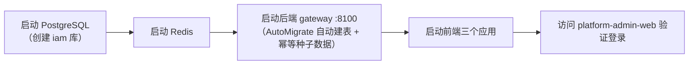
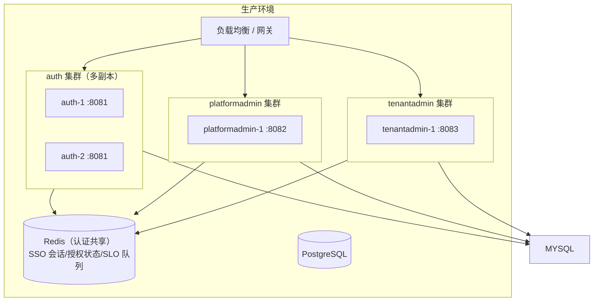

# 运行与部署指南（Run & Deploy）

> 本文说明 Ark IAM 的本地开发环境、构建运行、测试、Docker 部署与多环境部署要点。

---

## 目录

1. [环境要求](#1-环境要求)
2. [本地开发运行](#2-本地开发运行)
3. [测试](#3-测试)
4. [Docker 部署](#4-docker-部署)
5. [多环境部署拓扑](#5-多环境部署拓扑)
6. [常见排障](#6-常见排障)

---

## 1. 环境要求

| 依赖 | 版本 | 用途 |
|---|---|---|
| Go | 1.21+ | 后端（go.work 多模块） |
| Node.js | 18+ | 前端 / e2e |
| pnpm | 8+ | 前端 monorepo 依赖管理 |
| PostgreSQL | 12+ | 主库（库名 `iam`），启动时由 AutoMigrate 自动建表 |
| Redis | 5+ | SSO 会话 / 授权状态 / SLO 队列 |
| OpenTelemetry Collector（可选） | - | 链路追踪（默认 `127.0.0.1:4317`） |

---

## 2. 本地开发运行

### 2.1 后端

```bash
# 下载依赖（go.work 全模块）
make deps

# 列出可用应用
make list-apps

# 运行单个应用（auth / platformadmin / tenantadmin / gateway）
make run APP=auth
make run APP=platformadmin
make run APP=tenantadmin

# 单体聚合运行（一个进程挂载三者，:8100）
make run APP=gateway
```

| 应用 | 端口 | 说明 |
|---|---|---|
| auth | 8081 | 认证 + OIDC Provider（`/oidc`） |
| platformadmin | 8082 | 平台管理 |
| tenantadmin | 8083 | 租户自服务 |
| gateway | 8100 | 聚合部署（推荐日常使用） |

### 2.2 前端

```bash
cd frontend
pnpm install

pnpm dev          # platform-admin-web :4001
pnpm dev:login    # login-web :4000
pnpm dev:tenant   # tenant-admin-web :4002
```

### 2.3 启动顺序与数据准备



种子数据：启动时由 `pkg/seed` 幂等写入（配置 `db.seed: true` 开启）。管理员 `admin / admin123`，OAuth 客户端 `platform-admin-web` / `tenant-admin-web`。

> **Schema 变更（列/表下线）**：本项目按新项目处理，不维护数据迁移脚本（AutoMigrate 只增不删，见 `string-id-pg-automigrate-seed.md` §3）。下线列/表后，开发/测试库需**删库重建**。本地 PostgreSQL 跑在 Docker 里（容器名以 `docker ps` 为准，下例为 `postgres18`）：
>
> ```bash
> docker exec -i postgres18 psql -U postgres -d postgres -c "DROP DATABASE IF EXISTS iam WITH (FORCE)"
> docker exec -i postgres18 psql -U postgres -d postgres -c "CREATE DATABASE iam"
> # 然后重启后端：AutoMigrate + Seed 重建全部表与种子数据
> ```
>
> `WITH (FORCE)`（PG 13+）会断开仍连着该库的会话，因此后端不必先停。旧库中残留的列/表不再被读写，属预期。确需保全旧数据时，在升级前自行执行一次性 SQL 导出/回填。
>
> **已有库升级到 `application.source`（2026-09-12 改造，详见 `application-source-rename.md`）**：`application.type` / `is_system` 与 `application_client.type` / `is_system` / `is_third_party` 已下线，归属统一收敛为 `source`（`builtin` / `first_party` / `third_party`）。AutoMigrate 只会给新列补上列默认值 `third_party`，存量行必须回填——**请在部署新代码之前执行**（新代码不再写 `type`，升级后旧列只剩列默认值，无法再据以推断）：
>
> ```sql
> -- application：is_system(内置) 优先，其次 third_party，其余归 first_party
> UPDATE application SET source = CASE
>   WHEN is_system THEN 'builtin'
>   WHEN type = 'third_party' THEN 'third_party'
>   ELSE 'first_party'
> END
> WHERE source IS DISTINCT FROM (CASE
>   WHEN is_system THEN 'builtin'
>   WHEN type = 'third_party' THEN 'third_party'
>   ELSE 'first_party'
> END);
>
> -- application_client：同规则（种子客户端 is_system=true → builtin）
> UPDATE application_client SET source = CASE
>   WHEN is_system THEN 'builtin'
>   WHEN type = 'third_party' THEN 'third_party'
>   ELSE 'first_party'
> END
> WHERE source IS DISTINCT FROM (CASE
>   WHEN is_system THEN 'builtin'
>   WHEN type = 'third_party' THEN 'third_party'
>   ELSE 'first_party'
> END);
> ```
>
> `WHERE ... IS DISTINCT FROM ...` 让脚本**幂等**（重复执行 0 行受影响），可安全重跑。只有在升级**之后**才补做时，无条件安全的只有第一步（`is_system = true` → `builtin`，它决定删除保护与租户控制台菜单范围），其余行按新策略保持 `third_party` 即可；种子数据（`platform_admin` / `tenant_admin` 与两个内置 OAuth 客户端）由 `pkg/seed` 启动时自行回填为 `builtin`，无需人工介入（归属口径见 `application-source-rename.md` §14）。
>
> **已有库应用编码改为下划线连接（2026-09-12 改造，详见 `application-source-rename.md` §15）**：`application.code` 统一为下划线形态，两个内置应用 `platform-admin` → `platform_admin`、`tenant-admin` → `tenant_admin`。编码是应用的业务唯一键，改名即原地 `UPDATE`，菜单/租户订阅/角色都按 `app_id` 关联，无需一起改。**请在部署新代码之前执行**（否则种子会按新编码另建一套内置应用，旧应用仍占着旧唯一键，菜单与订阅会分裂到两套应用上）：
>
> ```sql
> UPDATE application SET code = 'platform_admin' WHERE code = 'platform-admin';
> UPDATE application SET code = 'tenant_admin'   WHERE code = 'tenant-admin';
> ```
>
> 漏做时 `pkg/seed` 也会在启动时把命中的旧编码原地改名（保留主键，幂等），因此上述 SQL 是「先改名再上代码」的稳妥做法，而非唯一路径。本次只动 `application.code`，菜单编码与 OAuth `client_id` 不变。
>
> 重建后若出现登录态异常（Redis 里仍有指向已消失用户的 SSO 会话），**按前缀**清理本项目的键即可，不要 `FLUSHDB`——本地 Redis 容器常与其它项目共用：
>
> ```bash
> docker exec -i redis7 redis-cli --scan --pattern 'iam:oidc:*' | xargs -r docker exec -i redis7 redis-cli DEL
> ```

### 2.4 验证 OIDC Provider

```bash
# 服务发现
curl http://localhost:8100/oidc/.well-known/openid-configuration

# JWKS
curl http://localhost:8100/oidc/keys

# 健康检查
curl http://localhost:8100/oidc/healthz
```

---

## 3. 测试

```bash
# 运行指定应用测试（推荐）
make test APP=gateway

# 全量测试
go test ./...

# 指定包 / 单个用例
go test ./pkg/iam/service/svcuser -run TestGeneratePassword -v

# 覆盖率
go test ./apps/platformadmin/internal/... -coverprofile=coverage.out
go tool cover -html=coverage.out

# Lint / vet
make lint
go vet ./...
```

**单元测试约定**：各应用 `testutil.SetupSQLite(t, entities...)` 注册内存 SQLite 为全局 iam 库，服务内 `dao.NewXxxDao()` 自动落测试库，直接断言真实 dao 行为。

**e2e（Playwright，浏览器全流程）**：

```bash
cd e2e
npm install
npx playwright install chromium
# 前置：PostgreSQL + Redis + 后端（gateway）+ 三个前端应用已启动（种子数据启动时自动写入）
npx playwright test
```

覆盖场景：首次登录、SSO 免密、登出即失效、双向 SSO、全局登出（SLO）、Cookie 隔离等（详见 `e2e/README.md`）。

---

## 4. Docker 部署

```bash
# 构建镜像（推荐 gateway 单体）
make docker-build APP=gateway

# 运行容器
make docker-run APP=gateway
```

生产容器注意：

- 通过环境变量 `APP_CONFIG_PATH` 挂载生产 `config.yaml`（含正式 issuer、密钥、`cookieSecure: true`）；
- 签名私钥与加密密钥通过 Secret 挂载，不写入镜像；
- 数据库、Redis 使用托管实例，与容器网络隔离。

---

## 5. 多环境部署拓扑



| 部署形态 | 适用 | 说明 |
|---|---|---|
| **单体聚合**（gateway 单进程） | 小规模/开发 | 一个进程挂载三应用，端口 8100 |
| **分体部署** | 中大规模 | auth / platformadmin / tenantadmin 独立进程独立扩缩容 |
| **auth 多副本** | 高可用 | 必须共享同一认证 Redis（会话/授权状态），PostgreSQL 主库；`/oidc` 无状态化依赖 Redis |

**关键约束**：

- 启用了 `enableSSOSessionValidation` 的所有应用必须**共享同一认证 Redis**；
- `issuer` 必须与最终访问入口一致（负载均衡后仍应是客户端可见的正式域名）；
- 签名密钥在多副本间保持一致（同一文件/同一 PEM 配置），避免 kid 漂移。

---

## 6. 常见排障

| 现象 | 排查 |
|---|---|
| 登录后接口 401 | 检查 iss/aud 校验配置、共享 Redis、SSO 会话活性开关（`enableSSOSessionValidation`） |
| `/oidc` 返回 404 | 确认访问的是 auth（:8081）或 gateway（:8100），且 issuer 前缀为 `/oidc` |
| 生产启动失败 | 检查签名/加密密钥是否显式配置（fail-closed）；`cookieSecure` 是否与 HTTPS 匹配 |
| SSO 免密失效 | 检查 `iam_sso_session` Cookie 是否写入（Domain/SameSite/Secure）、Redis 会话是否存在 |
| 跨站无法共享 SSO | 检查 `cookieSameSite: none` + `cookieSecure: true` |
| e2e 失败 | 按 `e2e/README.md` 核对服务映射与种子数据 |
| 令牌验签失败 | 对比 `/oidc/keys` 与 RP 配置公钥是否一致（kid/密钥内容） |
