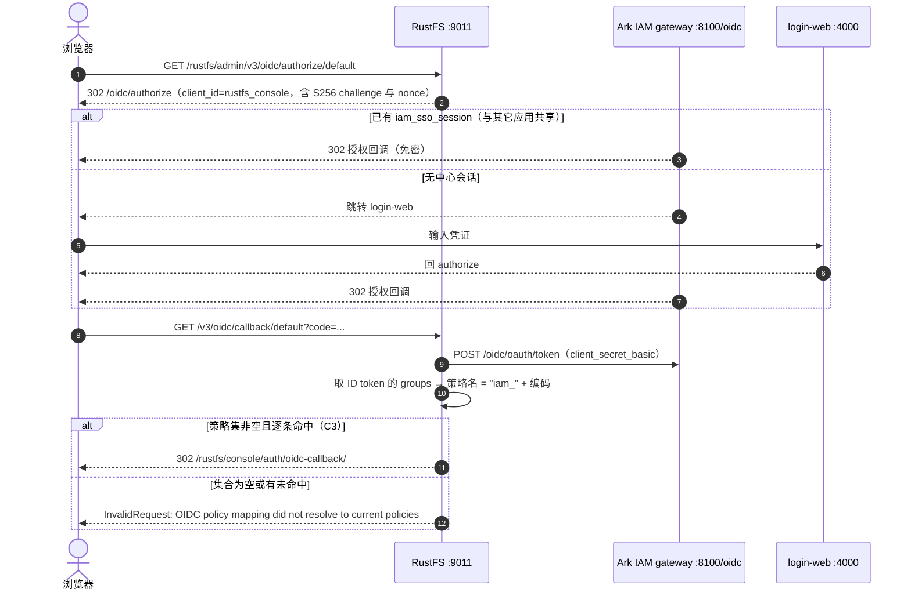
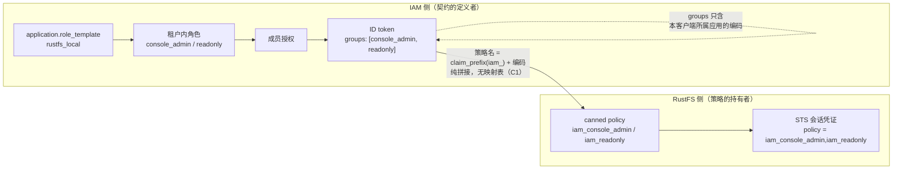

# RustFS 接入实战：存量第三方应用的 OIDC 接入案例

> 本文是 [application-integration-guide.md](application-integration-guide.md) 的**配套实战案例**。通用步骤以该指南为准，
> 本文只记录**案例特有的判断、实测值与坑**——尤其是「不走 IAM SDK、自带权限模型、只实现一半 SLO」这类存量应用。
>
> 案例对象：**RustFS**（S3 兼容对象存储，Rust 实现，自带 canned policy 权限模型，控制台为本体的一部分）。

---

## 目录

1. [为什么单独成文](#1-为什么单独成文)
2. [案例约束](#2-案例约束)
3. [目标与非目标](#3-目标与非目标)
4. [端到端方案](#4-端到端方案)
5. [接入步骤](#5-接入步骤)
6. [三个必须知道的坑](#6-三个必须知道的坑)
7. [登出与 SLO 边界](#7-登出与-slo-边界)
8. [验收结果](#8-验收结果)
9. [复用清单](#9-复用清单)
10. [开放问题](#10-开放问题)

---

## 1. 为什么单独成文

通用指南覆盖的是「**你写一个应用**，用 `react-oidc-context` 接前端、用 `pkg/oidckit` 接反向通道登出」。
RustFS 是另一类形态——**存量第三方应用**，三个特征让接入的难点整体位移：

| 特征 | 后果 |
|---|---|
| **代码不可改**（直接用发行版镜像） | IAM 侧不能假设对方会用我们的 SDK 或接收端；一切都得靠标准协议 + 对方既有配置项 |
| **自带权限模型**（canned policy） | 没有「角色 ↔ 权限」的中间层可对接，只能把 IAM 的角色编码**直接映射成下游策略名** |
| **只实现一半 SLO**（有 RP 发起登出，无反向通道登出） | 登出只能做到单向，"一起登出"需要显式决策而不是默认成立 |

结论先行：**这类应用的核心工作不是"把 OIDC 调通"，而是"两侧语义对齐 + 明确登出边界"。**
协议部分按通用指南走即可，真正耗时的是第 5.1 节的契约设计与第 7 节的登出决策。

---

## 2. 案例约束

以下事实决定了方案空间，均已核对源码（RustFS v1.0.1，`crates/` 与 `rustfs/` 路径相对其仓库根）：

| # | 约束 | 出处 / 实测 |
|---|---|---|
| C1 | **策略名 = `claim_prefix` + `groups` 值**，纯字符串拼接，下游**没有"角色→策略"映射表** | `crates/iam/src/oidc.rs:1508` |
| C2 | `role_policy` 与 claim 映射**互斥**：设了它，`groups` 只作组上下文、不再映射成策略名 | `crates/iam/src/oidc.rs:1489-1492` |
| C3 | 策略解析是**硬校验**：选中集合为空，或其中**任一条**解析不到，整次登录被拒 | `rustfs/src/admin/service/federated_identity.rs:38`，报错见 `:280` |
| C4 | 策略是**全局命名实体**（一条策略全租户共用） | 下游无租户维度的策略隔离 |
| C5 | **不支持反向通道登出**：无接收 `logout_token` 的端点；其内部 `logout_token` 是自签的一次性跳转票据 | `crates/iam/src/oidc.rs:1425/1446` |
| C6 | **STS 凭证即会话**，无独立会话存储；会话默认 **3600s 且不可配** | `rustfs/src/admin/handlers/idp_compat.rs:195`；时长实测 `exp − now = 3600`，`IDENTITY_OPENID_KEYS` 18 个键无时长项 |
| C7 | 登出时把**控制台登录页**作为 `post_logout_redirect_uri` 原样发出 | `rustfs/src/admin/handlers/oidc.rs:839`（`CONSOLE_LOGIN_SUFFIX = "/auth/login"`，见 `:59`） |
| C8 | 一组 OIDC env 中 `config_url` 为空 → **整组被丢弃**；`redirect_uri_dynamic` 为空 → 默认**开** | `crates/iam/src/oidc.rs:1815`、`:1836` |

> **C1 + C3 是本案例的题眼**：下游不认识「角色」这个概念，只认识策略名，且对策略名的要求是**全有或全无**。
> 这直接推导出第 6.1 节的供给顺序硬约束。

---

## 3. 目标与非目标

**目标**

1. RustFS 控制台（`http://localhost:9011/rustfs/console/`）出现统一登录入口，用 Ark IAM 账号登录。
2. RustFS 与其它已接入应用共享 SSO 会话：**登录一次即可相互免密**。
3. IAM 侧的角色授权**决定**用户在存储侧的实际权限（不是只决定"能不能进"）。
4. 密钥、编码等契约值集中管理，不在部署文件里散落硬编码。

**非目标**（明确超出本次范畴的用例）

| 超出范畴 | 原因 |
|---|---|
| S3 API 的程序化 STS 发放 | 本次只解决控制台（人）的登录；SDK 侧接入涉及长期凭证分发策略，单独议题 |
| 反向通道登出（中心登出 → RustFS 立即失效） | 对方无接收端；见第 7 节的三种处置与取舍 |
| RustFS 多节点 / 纠删码部署 | 与接入无关的部署议题 |
| 修改 RustFS 源码 | 发行版直接使用，这是本案例的前提（也是约束 C5 的来源） |

---

## 4. 端到端方案

### 4.1 登录时序



### 4.2 映射关系



> 图中 `groups` 的自环表达的是**按应用裁剪**：只含登录所用客户端（`rustfs_console`）所属应用
> （`rustfs_local`）下的角色编码，其它应用的角色不会出现。这是本系统既有的
> `application-integration-guide.md` §3.4 契约，本案例只是它的一个消费方。
>
> 裁剪的动因值得记住：下游**无从分辨编码来源**，若按租户把所有应用的编码一起下发，
> 在任意无关应用里造一个同码角色即可命中你的策略（跨应用越权）。
> 实现见 `backend/apps/auth/internal/core/oidcop/persistent_store.go:183`（`ClaimGroups` 的注释，含越权动因）
> 与 `:217-218`（`appendRoleGroupClaims`：客户端/应用解析出错或角色读取失败时 fail-closed 拒绝签发；
> 而 `appID` 解析为空的处理是"不产出声明"，两者不同）。

---

## 5. 接入步骤

### 5.1 定契约：编码 ↔ 策略名

| 决策 | 取值 | 为什么 | 代价 / 什么时候不该这么选 |
|---|---|---|---|
| 策略前缀 | `iam_` | 下游策略是**全局命名实体**（C4）。前缀等于给本产品划一个命名空间，避免与下游自建策略或**其它产品**的策略撞名借权 | 策略名不再等于编码，运维核对时多一层心智。若确认下游只有本产品在用，可省前缀（`claim_prefix` 留空即用裸编码） |
| 编码风格 | 小写 + 下划线（`console_admin`、`readonly`） | 受 IAM 侧编码规则约束（`^[a-z][a-z0-9_]*$`），且直接落到下游策略名里，可读性直接影响排障 | 编码**一经授权就难改**：改编码 = 下游策略改名 + 重新授权，按撤权操作对待 |
| 粒度 | 按「人在存储侧的权限档位」划分，不按菜单项 | 策略是权限的原子单位；粒度过细则模板膨胀，且每次调整都触发全租户物化 | 若某应用需要逐桶精细授权，编码里塞不下这种维度，应改用桶策略而非 OIDC 角色 |
| 客户端认证 | `client_secret_basic` | RustFS 是机密客户端（服务端持有密钥），比纯 PKCE 更强 | 需要密钥轮换与保管；若下游是**无法保密**的纯前端 SPA，应改用 PKCE |

本例最终声明：

```json
{
  "roleTemplate": [
    { "code": "console_admin", "name": "存储控制台管理员" },
    { "code": "readonly",      "name": "存储只读用户" }
  ]
}
```

### 5.2 先在下游供给同名策略（**必须先于 5.3**）

```bash
# 策略名 = iam_ + 编码，与 5.1 的模板逐条对应
python3 rustfs_policy.py add iam_console_admin policies/iam_console_admin.json
python3 rustfs_policy.py add iam_readonly      policies/iam_readonly.json
```

| 策略 | 对应编码 | 权限要点 |
|---|---|---|
| `iam_console_admin` | `console_admin` | `admin:*`、`kms:*`、`s3:*`、`sts:AssumeRole` |
| `iam_readonly` | `readonly` | 列桶 + 读对象；**比下游内置 `readonly` 多了 `ListAllMyBuckets`/`ListBucket`/`ListBucketMultipartUploads`** —— 内置那条只有 `GetBucketLocation`/`GetObject`/`GetBucketQuota`，控制台里连桶列表都看不到 |

> 这一步不能挪到后面。原因见 6.1。

### 5.3 创建应用并声明角色模板

```bash
curl -X PUT http://localhost:8100/v1/platform/applications/{appID} \
  -H "Authorization: Bearer <token>" -H "Content-Type: application/json" \
  -d '{"roleTemplate": [{"code": "console_admin", "name": "存储控制台管理员"},
                        {"code": "readonly",      "name": "存储只读用户"}]}'
```

> **接口粒度提醒**：创建应用只返回 `{appID, code}`，更新接口的回包也不是实体本身——
> 需要完整对象时一律**再查一次详情**（本案例初次脚本化时即因此在 `roleTemplate` 上取空）。
> 另：更新接口的 `name` 字段没有"留空即不修改"语义（`code` 才有），
> 只带 `roleTemplate` 的 PUT 会把应用名清空——**更新前先取详情、再整体回填**。

### 5.4 创建 OAuth 客户端

| 配置项 | 取值 | 说明 |
|---|---|---|
| 客户端编码 | `rustfs_console` | = OIDC `client_id`；客户端编码规则比应用更严，**不允许数字** |
| `redirectURIs` | `http://localhost:9011/rustfs/admin/v3/oidc/callback/default` | 与下游实际注册路由一致 |
| `postLogoutRedirectURIs` | `http://localhost:9011/rustfs/console/auth/login` | ⚠ **不是根路径**，见 6.2 |
| `grantTypes` | `["authorization_code"]` | |
| `responseTypes` | `["code"]` | |
| `tokenEndpointAuthMethod` | `client_secret_basic` | 与 5.1 的决策一致 |
| `requirePKCE` | `disable` | 下游自行发 `code_challenge`；此处不强制 |
| `defaultScopes` | `["openid", "profile", "email"]` | **必须含 `profile`**：无 `profile` 时 `appendRoleGroupClaims` 直接返回、根本不产出 `groups`（`backend/apps/auth/internal/core/oidcop/persistent_store.go:218`）。漏配的表现是"登录成功但下游报策略未解析" |

创建密钥后，明文只显示一次，落到下游的密钥载体（本案例为 `.env`，已 gitignore），
部署文件里用 `${VAR:?}` **fail-fast**，避免"忘了填"表现为"登录按钮点不动"。

### 5.5 开通租户并授权成员

1. 把应用开通到目标租户 —— 角色模板此时物化为该租户内的角色。
2. 在租户控制台把角色授权给成员。
3. **成员授权是"人"的授权，不是"应用"的**：同一成员在不同应用下的角色集合互相独立，
   最终进 `groups` 的只有本次登录客户端所属应用的那部分。

### 5.6 验收

见[第 8 节](#8-验收结果)。

---

## 6. 三个必须知道的坑

### 6.1 顺序：策略必须**先于**角色模板

由 C1 + C3 推出：下游按 `前缀 + 编码` 逐条解析策略名，**全有或全无**。

```text
① 下游供给 iam_console_admin / iam_readonly
② 声明 roleTemplate（此时才物化角色）
③ 开通应用 + 授权成员
```

**违反顺序的后果不是降权，是全量登录失败**：模板一保存就物化到所有已开通该应用的租户，
此时策略若还没备好，该应用**所有已授权用户**点登录都会拿到
`InvalidRequest: OIDC policy mapping did not resolve to current policies`。

> 这与"下游认不出的值就跳过"的直觉相反，也和本系统自有应用（`pkg/oidckit` 侧）的
> fail-safe 行为相反。**排障第一动作**是解 ID token 看 `groups` 实际内容，
> 再去下游核对同名策略是否存在——而不是先怀疑令牌或网络。

### 6.2 登出回调地址必须填**控制台登录页**

RustFS 登出时把 `{scheme}://{host}` + `/rustfs/console` + `/auth/login` 拼成
`post_logout_redirect_uri` 发出（C7，**无尾部斜杠**），而 `/oidc/end_session` 对它做**精确匹配**。

填错的表现是：**登录一切正常，一点退出就报**

```json
{"error":"invalid_request","error_description":"post_logout_redirect_uri invalid"}
```

它**不会跳回应用**，用户就停在这段 JSON 上。这个坑的通用形态（"客户端建好了、登出回调地址留空"）
在通用指南 §7.1 已记录；本案例补充的是它的**具体取值来源**——不要凭直觉填应用根路径，
**要去下游源码/请求里确认它实际发送的值**。

### 6.3 会话 1 小时且不可配

RustFS 用的是自签 STS 凭证当会话（C6），时长硬编码 3600s，**环境变量里没有任何时长开关**。
这带来两个运维事实：

- 控制台会话最长 1 小时，过期后回到登录页（中心会话未过期时仍免密一点即入）。
- 想靠"调短下游会话"来逼近登出即时性，**这条路在本案例里不通**。

---

## 7. 登出与 SLO 边界

### 7.1 方向不对称（本案例最重要的结论）

| 方向 | 机制 | 支持 | 实测结果 |
|---|---|---|---|
| RustFS → 中心 | RP-Initiated Logout | ✅ | 控制台登出 → `/v3/oidc/logout` → `/oidc/end_session` → **中心会话被清除**，随后其它应用的 authorize 不再免密，落地登录页 |
| 中心 → RustFS | Back-Channel Logout | ❌ | 源码无接收端（C5）。**在别的应用登出，RustFS 控制台会话不受影响**，最长再存活到 STS 到期（1 小时） |

也就是说：**"一起登录"完全成立；"一起登出"只成立一半**，且不成立的那一半是框架性的，不是配置问题。

> 这不是 RustFS 的孤例。多数自托管 RP（含 Gitea）都只做前者。本系统作为 OP **具备**反向通道能力
> （`application_client.back_channel_logout_uri` + `apps/auth/internal/core/oidcop/logout_worker.go:112` 实际 POST），
> 两个自有控制台即用此实现强一致 SLO；缺的始终是**对方那一侧的接收端**（通用指南 §7.2 给了接收端写法）。

### 7.2 三种处置与取舍

| 方案 | 效果 | 代价 | 什么时候选它 |
|---|---|---|---|
| **A. 接受 1 小时窗口** | 中心登出后，RustFS 最长再活 1h | 无新增组件；登出即时性不满足合规要求 | 内部开发/测试环境，或对登出即时性无硬要求 |
| **B. 外部吊销**（`revoke-tokens`） | 调用后该用户**全部** STS 凭证当场失效 | 需要一个**触发方**；运维须持有下游 admin 凭证；粒度粗 | 有合规要求、且能接受新增一个极薄组件 |
| **C. 对方实现接收端** | 标准 SLO，粒度可到会话 | **要改下游代码**，与"存量第三方应用"前提冲突 | 下游是自有应用时最正的做法 |

方案 B 的实测契约（RustFS 侧**零改动**）：

```text
POST /rustfs/admin/v3/revoke-tokens/builtin?user=<oidc_virtual_parent>&fullRevoke=true
```

- `user` = 下游的 OIDC 虚拟身份，由 `iss` + `sub` 派生（`crates/iam/src/federation/model.rs:60`）：

  ```text
  parent = base64url_nopad(sha256("openid:" + u64be(len(sub)) + sub + u64be(len(iss)) + iss))
  ```

  实测：以 `sub=person:01a0b461-…`、`iss=http://localhost:8100/oidc` 计算，与下游实际使用的
  parent **逐字节一致**——即该映射是**纯函数**，触发方无需共享状态或查库。
- ⚠ **provider 段填 `builtin`，不是 `openid`**：实测填 `openid` 返回 `revoked:0`。
  原因是 OIDC 的 STS 凭证落库时未持久化 claims，下游只能按
  `classify_provider_from_claims`（`rustfs/src/admin/access_key_identity.rs:303`）回落为 `builtin`。
  这与参数名暗示的语义相悖，**接入时必须以实测为准**。
- 实测效果：`{"revoked":16,...}`，调用后此前累积的 16 个会话凭证全部失效（S3 调用由 200 变 403）。

### 7.3 触发方是什么（供决策，不在本次范畴）

把中心登出通知翻译成上面那次调用，需要一个极薄的桥接组件。本系统已提供**输入侧**的现成能力：
配置 `back_channel_logout_uri` 后，OP 会向它 POST 一个标准 `logout_token`。实测其声明为：

```json
{
  "iss": "http://localhost:8100/oidc",
  "sub": "person:01a0b461-002c-7b6d-9308-95c7fde2ad82",
  "aud": ["rustfs_console"],
  "events": { "http://schemas.openid.net/event/backchannel-logout": {} },
  "sid": "b5cfe56edb0914d836e7ddf85ef477de"
}
```

关键：**这里的 `sub` 与登录时 ID token 的 `sub` 完全相同**，所以 7.2 的纯函数映射可以直接套用，
桥接组件不需要任何状态。

若采用方案 B，桥接组件**必须**完成的校验（缺一即是"任意踢人"的公开接口）：
RS256 验签（JWKS：`GET {issuer}/keys`）、`aud` 等于本客户端、`events` 含反向通道登出事件、`exp` 未过期。

**本次决策：不实现。** 记录于此供后续按合规要求取舍。

---

## 8. 验收结果

均为本地实测（issuer `http://localhost:8100/oidc`，控制台 `http://localhost:9011/rustfs/console/`）：

| # | 验收项 | 结果 |
|---|---|---|
| 1 | RustFS 已加载 IAM 提供方 | `GET /rustfs/admin/v3/oidc/providers` → `[{"provider_id":"default","display_name":"Ark IAM"}]` |
| 2 | 授权码登录走通 | 下游 authorize → IAM 登录 → 回调，**无** `InvalidRequest` |
| 3 | `groups` 按应用裁剪 | ID token `groups = ["console_admin","readonly"]`，`aud = ["rustfs_console"]` |
| 4 | 映射到下游策略 | 会话凭证 `policy = "iam_console_admin,iam_readonly"`，与 `groups` 逐条对应 |
| 5 | 与其它应用共享 SSO | 仅从 RustFS 登录一次后，另一个已接入应用的 authorize 直接下发授权码（免密） |
| 6 | 登出传导到中心 | RustFS 登出后 `iam_sso_session` 被清除，其它应用的 authorize 落地登录页 |
| 7 | 密钥未入库 | 真实 `client_secret` 仅在部署方 `.env`（gitignore）；库中只有哈希 |
| 8 | 未改任何一方源码 | RustFS 与 IAM 均为发行版 / 未改代码 |
| 9 | 会话时长 | 实测 `exp − now = 3600s`（与 C6 一致） |

---

## 9. 复用清单

换一个**存量第三方应用**接入时，按此清单走：

```text
① 摸清对方权限模型的"原子单位"是什么
   —— 是策略名 / 是角色 / 是 scope？它是否有"角色→权限"的映射表？
   若没有映射表，你就必须让对方权限模型的原子单位 = 你的角色编码
② 确认对方对"认不出的权限值"是 fail-safe 还是 fail-closed（本案例是后者）
   —— 这决定供给顺序，也决定出错时的爆炸半径（单用户失败 vs 该应用全体失败）
③ 定前缀，划命名空间（对方权限是全局命名实体时必须做）
④ 确认对方登出的两个方向各自支持到哪一步，再决定第 7.2 节选 A / B / C
   —— 不要假设"接了 OIDC 就有 SLO"
⑤ 从对方源码或真实请求里取回跳 / 登出回跳的精确值，不要凭直觉填
   —— 两端都是精确匹配，差一个斜杠就是硬错误
⑥ 按本文第 5 节的 5.2 → 5.3 → 5.4 → 5.5 顺序落地，用第 8 节的表验收
```

---

## 10. 开放问题

| # | 问题 | 默认倾向 |
|---|---|---|
| Q1 | 是否需要为 RustFS 补反向通道登出（第 7.2 节方案 B）？ | **暂不实现**。当前无合规硬要求；真要上，先评估桥接组件的运维成本与 admin 凭证的存放方式 |
| Q2 | `revoke-tokens` 的 provider 语义（`builtin` vs `openid`）是上游缺陷还是刻意兼容？ | 按**上游行为**处理（填 `builtin`），并在注释里记明依据；若上游修复需回归 |
| Q3 | 生产环境的 issuer / 回跳地址如何取值？ | 必须换成正式域名 + HTTPS；本案例的 `localhost` 取值仅适用于开发环境（SSO 依赖同主机 Cookie 域） |
| Q4 | 下游策略是否需要按租户二次隔离？ | 当前不需要（单租户）。多租户场景下策略是全局命名实体（C4），需改为编码内嵌租户维度或改用桶策略 |

---

## 相关文档

- [application-integration-guide.md](application-integration-guide.md) —— 通用接入指南（本文的通用步骤以其为准）
- [sso-oidc-concepts.md](sso-oidc-concepts.md) —— SSO / OIDC 协议概念
- [system-design.md](system-design.md) §5.4（令牌签发与校验）—— `groups` 契约「按应用裁剪」的系统设计说明
- [glossary.md](glossary.md) —— 角色编码、`claim_prefix` 等术语
