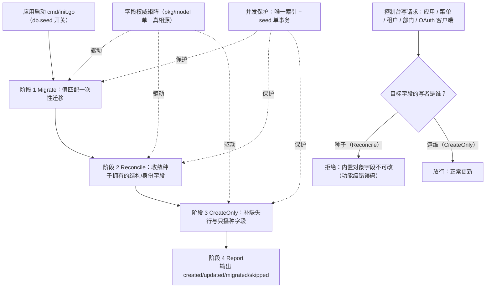

# 种子数据初始化语义重构（单一写者模型）

> 状态：**已落地**（2026-09-12，按本文 M1→M4 实施；实现偏差与验收见文末「落地记录」）
> 决策日期：2026-09-12
> 场景/档位/专题：**S2 增量改造** · **标准档** · 数据模型设计 + 架构设计 + 迁移手法
> 一句话结论：种子初始化的问题不在「回填哪些字段」，而在**没有声明谁是某字段的唯一写者**——把权威做成显式矩阵、按「收敛 / 只播种 / 一次性迁移」三种语义执行、并让控制台对被种子拥有的字段拒写，才能同时满足「存量库一次到位」与「运维改动不被回写」。

---

## 背景与目标

### 业务背景与现状

种子（`pkg/seed`）承担平台自举：平台租户 + 同名根部门、两个内置控制台应用、内置角色、菜单树、默认管理员、租户管理后台权限开通、OIDC 客户端。执行方式是**每个应用进程启动时各自调用**（`apps/*/cmd/init.go:57`，由 `db.seed` 开关控制，`pkg/config/config.go:113`），`AutoMigrate` 与本方案无关（只增不删，见 `AGENTS.md`）。

现有实现形态：每个实体一段「查—命中则按需更新—未命中则创建」的 upsert，命中时**回填哪些字段由各处手写的 `if` 决定**：

- 平台租户：`name`、`status`（`pkg/seed/seed.go:192-215`）
- 根部门：`name` 跟随租户名（`pkg/seed/seed.go:234-246`）
- 内置应用：`source`、`name`、`description`（`pkg/seed/seed.go:311-340`）
- 菜单：`name`/`path`/`icon`/`sort`/`component`/`visibility`/`type`/`parent_id` 共 8 个（`pkg/seed/seed.go:471-505`）
- 内置角色：`admin_type`（`pkg/core/tenant/provision.go:141-147`）
- 种子 OAuth 客户端：`source`、`name`（`pkg/seed/seed.go:713-730`）
- 编码类历史改名：`platform`→`t_platform`、`platform-admin`→`platform_admin`（**值匹配**式迁移，`pkg/seed/seed.go:168-186`、`270-286`）

### 痛点分析

**P1 双写者：种子回填的字段，控制台同时可写，重启后运维改动被静默收回。**

| 实体 | 种子回填字段 | 控制台写入点 | 后果 |
|------|--------------|--------------|------|
| 应用 | `name`/`description` | `svcapplication.Update`（`application.go:80-110`） | 改名/改描述重启即被收回 |
| 菜单 | 8 个展示与结构字段 | `svcpermission.menu.Update`（`menu.go:110-140` 写 12 个字段） | **既有缺陷**：菜单管理改名后重启回滚 |
| 租户 | `name`/`status` | `svc tenant.Update`（`tenant.go:244-273`） | 平台租户改名/挂起重启即回滚（挂起回滚可视为保护，改名回滚是困惑） |
| 根部门 | `name` | `department.Update`（`tenantadmin/department.go:227-258`） | 改部门名重启即回滚 |
| OAuth 客户端 | `name` | `oAuthClientSvc.Update`（`application_client.go:132-173`） | 改客户端名重启即回滚 |

频次不是问题，**不可预期性**才是：运维无法从界面判断「这个字段到底谁说了算」；一旦踩中，现象是「改了、过一阵自己变回去了」，排查成本高。

**P2 口径靠注释而非机制。** 哪些字段种子拥有、哪些运维拥有，散落在各 upsert 的 `if` 与注释里（如 `seed.go:311-340` 的「sort/status 属运行时编排，种子不覆盖」）。没有单一清单，新增字段时默认落入「漏回填」或「静默覆盖」二选一，评审也无从检查。

**P3 「改名」被两种语义表达。** 编码改名用值匹配一次性迁移（P1 证据行），本次展示名改名却用无条件收敛——同一个文件里同一类需求两套语义，正是双写者矛盾的来源。

**P4 执行者不唯一且无并发保护。** 4 个应用进程都可自举种子；`role_menu`/`tenant_application`/`user_role` 无唯一索引，幂等仅靠应用层查重（`pkg/core/tenant/provision.go:41` 自述）。分体部署同时启动存在重复行竞态。

**P5 无变更报告。** 只有零散 `glog.Infof`，部署时无法核对「这次启动改了什么」，也无法回答「为什么租户名变了」。

**P6 非原子。** `SeedIam` 未包事务，中途失败留下半播状态（虽可重入，但需要逐条推断哪些已完成）。

### 目标与非目标

**目标**

- **G1 单一写者**：每个内置实体的每个字段，写者唯一（种子或运维），且该身份可被测试断言。
- **G2 存量自愈**：存量库不删库、不手工 SQL，启动即收敛到目标态（本次改名诉求）。
- **G3 结构可演进**：菜单/角色/授权等产品结构随版本增删改，仍由种子自愈（不靠人工对账）。
- **G4 拒绝要显式**：控制台对只读字段返回明确错误，而不是静默忽略或先写后收回。
- **G5 变更可核对**：每次启动输出结构化变更报告（created/updated/migrated/skipped + 字段级 `from→to`）。

**非目标（超出范畴的用例）**

- **不引入 schema/数据迁移框架**（Flyway、Atlas、goose）：本项目按新项目维护 schema、开发/测试库删库重建，引入框架会与 `AutoMigrate` 形成两个真相源；确有多环境审计级诉求时独立立项（见开放问题 Q5）。
- **不做白标**（同一产品多品牌的内置控制台命名）：需要品牌配置模型，超出本期；见 Q1。
- **不做种子分片**（多产品线/可选模块的种子子集）。
- **不定义内置行的删除语义**：内置行不删，能力下线走退役清单（`pkg/seed/retired_menu.go`）。

### 约束与非功能需求

| 维度 | 约束 | 口径/来源 |
|------|------|-----------|
| 兼容 | 存量库**不删库**即可收敛；开发/测试库仍可删库重建 | `AGENTS.md` schema 约定 |
| 幂等 | 任意次序、任意次数执行，终态一致 | 现有契约，保持不变 |
| 并发 | 分体部署多进程同时启动不得产生重复行 | 当前不满足（P4） |
| 一致性 | 一次 seed 不留半成品：关联表写入置于单事务 | 当前不满足（P6） |
| 可观测 | 结构化变更报告 + 汇总日志 | 新增 |
| 失败策略 | seed 失败阻断启动 | 沿用现状 |
| 性能 | **不设 QPS/SLA 指标**：内置实体 `O(10)` 行/类、启动期执行 1 次 | 现测：`pkg/seed` 全流程含事务约 0.1s（`go test ./pkg/seed/...`，SQLite）；目标 <100ms/次，冷启动阶段口径。不成立时应对：实体数量增长两个数量级后重估，与字段权威模型无关 |

### 验收标准

| 编号 | 验收内容 | 谁验 / 怎么验 / 阈值 |
|------|----------|----------------------|
| V1 | **终态对齐**：全新库执行 seed 后 DB 终态 == 声明清单 | CI：`go test ./pkg/seed/...`；差异 = 0 |
| V2 | **运营字段不被回写**：改名 CreateOnly 字段后重跑 seed，值不变 | 单测；用例 ≥ 矩阵中 CreateOnly 行数 |
| V3 | **种子字段拒写**：控制台更新种子拥有字段返回功能级错误码，DB 值不变，seed 仍收敛 | 单测（service 层）：每领域 ≥1 例 |
| V4 | **迁移只命中历史值**：值 == 旧种子值才改；运维自定义值跳过；二次执行幂等 | 单测 ≥3 例（命中/跳过/重入） |
| V5 | **并发安全**：并发执行 seed 不产生重复行 | 集成测试（2 并发 goroutine）+ 唯一索引约束 |
| V6 | **变更报告**：报告覆盖矩阵实体与平台自举产物的 created 计数，二次执行零 created/零 migrated | 单测 `TestRunReportsChanges`；逐实体计数相等 |

---

## 方案设计

### 总体思路

**把「谁拥有这个字段」从注释升级为可执行的声明，并按语义三分执行。**

1. **Reconcile（收敛）**：字段是产品结构/身份的一部分，随版本演进必须一致 → 种子每次启动收敛，且**控制台拒写**（唯一写者 = 种子）。适用：内置应用与 OAuth 客户端的 `name`/`description`/`source`、菜单的结构与展示字段、内置角色的 `admin_type`、平台租户的 `status`。
2. **CreateOnly（只播种）**：字段属部署/运营数据 → 种子只在行不存在时写入，此后**永不回写**，控制台可改。适用：平台租户 `name`/`type`/`tag`/`db_user`、应用与客户端的 `status`/`sort`/回调地址/TTL、内置角色 `name`/`description`、管理员口令。
3. **MigrateOnce（一次性迁移）**：跨版本的核心标识改名 → 以**值匹配**触发（当前值 == 历史种子值 X 才改成 Y），迁移完成即自然失效，运维自定义值一律不动。适用：`platform`→`t_platform`、`platform-admin`→`platform_admin`、`Default Tenant`→`平台运营中心`、旧应用名→新应用名。

三者的收益：**双写者被消除而不是被调和**——种子不再"猜"该不该覆盖，控制台也不再提供"改了会被收回"的假可编辑。改名类需求（本次诉求）落在 MigrateOnce，既满足"一次到位"，又不牺牲运营改名能力。

### 总体架构



职责与数据所有权：

| 模块 | 职责 | 数据所有权 |
|------|------|-----------|
| `pkg/model/seed_authority.go`（新增） | 声明字段权威矩阵（实体 × 字段 × 语义），导出查询函数 | **真相源**；不写数据 |
| `pkg/seed` | 按矩阵执行 Migrate/Reconcile/CreateOnly，产出 Report | 内置种子行的 **Reconcile 字段**（唯一写者） |
| 应用 service（application/menu/tenant/department/application_client） | 写前按矩阵校验，种子字段拒绝 | 对应实体的 **CreateOnly 字段**（唯一写者） |
| 前端 | 按 `source`/`type` + 矩阵渲染只读态与提示 | 无 |

### 核心流程

**启动（种子侧）**

1. `AutoMigrate`（既有，独立于本方案）→ `db.seed=true` 时进入 seed；
2. **Migrate**：逐条应用迁移清单 `{实体, 唯一键, 字段, from, to}`，仅当 `当前值 == from` 时写 `to` 并计入报告；
3. **Reconcile**：仅对矩阵中 `Reconcile` 字段做「不同才写」，一次 `Updates` 批量提交；菜单树按 parent 顺序（既有实现）；
4. **CreateOnly**：行不存在才创建（租户/根部门/管理员/应用/客户端）；根部门名在"租户名被 Migrate 改动"时同步一次（不是每次启动强制跟随）；
5. **Report**：聚合各阶段动作，输出汇总日志一行 + 逐条明细（`entity/key/action/fields`）；有 `migrated` 条目时提高日志级别，便于部署核对。

**控制台写入（运营侧）**

1. service 组装 `updateMap` 前，按矩阵过滤/校验目标实体字段；
2. 命中种子字段且**值确有变化** → 返回该领域的功能级错误码（文案统一：「内置对象，字段由平台版本定义，不可修改」），不落库；
3. 值未变化（前端回传原值）→ 放行，避免"没改也报错"（幂等友好）；
4. 前端对应控件置灰并给出 tooltip；状态/排序等 CreateOnly 字段保持可编辑。

**异常分支**：任一步错误 → 返回错误、阻断启动（沿用）；迁移条目 `from` 不存在于库中即为空操作（不报错）；并发由唯一索引兜底，事务回滚后下次启动重入。

### 备选方案与取舍

| 方案 | 做法 | 代价 | 什么情况下才该选 |
|------|------|------|------------------|
| **A 维持现状 + 让收敛更彻底** | 继续手写 `if` 回填，把本次改名也做成无条件收敛（即当前实现） | 双写者不消除，运维改动仍被收回；矩阵隐式，无法评审 | 内置实体不向控制台暴露编辑入口时（当前不是：应用/菜单/租户/部门/客户端都可编辑） |
| **B 只播种不收敛** | 删掉全部回填，改名靠人工 SQL/一次性脚本 | 菜单新增/改路径/下线失去自愈，每个部署都要人工对账；跨版本升级成本随菜单数量增长 | 内置数据极少且几乎不随版本变化（当前不是：菜单 15 行且仍在演进） |
| **C（推荐）声明式矩阵 + 三分语义 + 控制台拒写 + 值匹配迁移** | 本方案 | 需维护一份矩阵 + 控制台加校验分支（约 5 个 service + 前端置灰） | 本文场景；若控制台本就不提供这些实体的编辑入口，B 更省 |
| **D 引入迁移框架**（Flyway/Atlas/goose）+ 种子仅播种 | 版本化 SQL 管理 schema 与数据 | 与 `AutoMigrate` 两个真相源；每次种子调整都要写迁移脚本 | 多环境生产交付、需要外部审计每次变更、且愿意全量接管 schema 时；本项目按新项目维护 schema，否决 |

### 技术选型与理由

**矩阵放哪里：`pkg/model` vs `pkg/seed` vs 独立 YAML manifest**

| 载体 | 优点 | 代价 | 结论 |
|------|------|------|------|
| `pkg/model/seed_authority.go` | 与实体同源、编译期可查；业务 service 引用不引入对「种子执行器」的依赖 | 模型包多一份与种子相关的声明 | **选它**：矩阵是数据模型属性（"这个字段的写者是谁"），依赖方向最干净 |
| `pkg/seed/authority.go` | 与执行逻辑同源 | 5 个业务 service 需 import 种子包（当前只有 cmd 引用），语义倒挂 | 不选 |
| 独立 YAML manifest | 非 Go 人员可改、可被外部工具消费 | 新增解析/校验代码与第二个真相源；Go 侧仍需常量做编译期检查 | 规模 >100 内置实体/字段或产品侧自助维护时再切换 |

**并发原语：唯一索引 + 单事务 + advisory lock**

- 唯一索引（`tenant_application(tenant_id,app_id)`、`role_menu(tenant_id,role_id,menu_id)`、`user_role(tenant_id,user_id,role_id)`）是**持久保证**：`AutoMigrate` 可新增，重复行从此不可能；
- seed 整体包一个事务，保证不留半成品；
- Postgres advisory lock（`pg_advisory_xact_lock(<常量>)`）做进程间串行化，避免并发插入撞唯一键后中断启动。
- 取舍：advisory lock 是数据库特有（SQLite 测试库不支持）→ 用方言判断或直接依赖唯一索引 + 冲突重试；**不建议**为并发引入分布式锁组件。
- 什么情况下不该选：单进程单实例部署且永不分体 → 唯一索引仍建议加（成本近零），advisory lock 可省。

**拒写的粒度：静默过滤 vs 显式报错**

选显式报错。静默过滤会让前端以为保存成功（数据却没变），与 P1 的"不可预期"是同一类问题；显式错误码可被前端区分展示。代价：批量表单需按字段给出错误定位。

---

## 详细设计

### 模块划分与职责

- **`pkg/model/seed_authority.go`（新增）**：`type SeedFieldMode string`（`reconcile` / `create_only`）、`SeedFieldAuthority` 表 + `OwnedBySeed(entity, field) bool`、`SeedOwnedFields(entity) []string`。**不含任何 I/O**。
- **`pkg/seed`**：
  - `Run(ctx, db) (Report, error)`（现 `SeedIam` 的更名/扩展）；四阶段编排；
  - `migrations.go`：迁移清单 `[]seedMigration{{Entity, KeyField, KeyValue, Field, From, To}}`（把现有散落的 legacy 分支收敛到这里）；
  - `reconcile.go`：按矩阵生成更新 map（替代各处手写 `if`）；
  - `Report`：`[]Change{Entity, Key, Action, Fields map[string][2]string}` + `Summary()`。
- **应用 service**：新增共享校验（放 `pkg/model` 的纯函数 + 各 service 调用），命中种子字段且值变化 → 领域错误码。
- **前端**：`source==='builtin'` 且字段属矩阵时置灰（应用名/描述、客户端名、菜单结构与展示字段）；平台租户的挂起开关禁用（见 Q3）。

### 接口设计

**种子服务内部接口（唯一契约来源）**

```go
// pkg/seed
type Report struct {
    Changes []Change // 按实体聚合，含 action: created|updated|migrated|skipped
}
func Run(ctx context.Context, db *gorm.DB) (Report, error)
```

- 幂等：可安全重复执行；`Run` 返回错误即调用方阻断启动（沿用 `cmd/init.go` 现有处理）；
- 并发：`Run` 内部开启单事务 + （Postgres）advisory lock；
- 变更报告：仅结构化输出到日志（本期不落库，见 Q4）；`migrated` 非空时以 `Warn` 级输出，便于部署核对。

**控制台接口**：路径/方法/契约不变（如 `PUT /v1/platform/applications/{appID}`），仅新增拒绝语义：

| 场景 | 现状 | 目标 |
|------|------|------|
| 更新内置应用 `name` | 200，成功落库，重启被收回 | 400 + 领域错误码「内置对象字段不可修改」 |
| 更新内置应用 `status`/`sort` | 200 | 200（不变，CreateOnly） |
| 挂起平台租户 | 200，重启被 seed 纠正 | 400 + 「平台租户不可挂起」（见 Q3） |
| 更新菜单结构/展示字段（内置应用） | 200，重启被收回 | 400（CreateOnly 的 `status` 除外） |

错误码沿用各领域既有号段，新增如 `ApplicationBuiltInFieldImmutableError`、`MenuBuiltInFieldImmutableError`、`TenantPlatformFieldImmutableError`、`DepartmentBuiltInFieldImmutableError`、`ApplicationClientBuiltInFieldImmutableError`（具体编号实现时定，见 Q4）。**不新增** HTTP 语义（继续走现有 `gincontext.Fail`）。

### 数据模型

**不新增表、不新增列**（关键取舍）：值匹配迁移不需要版本表。对比「新增 `seed_version` 表」：优点是能表达无法用值匹配的迁移（按时间窗口的一次性计算）；代价是新增真相源与版本语义，且与本项目「幂等重入」哲学冲突。触发切换的条件写进开放问题 Q6。

**字段权威矩阵（目标态）**——评价基准是「该字段是产品结构还是部署数据」：

| 实体（唯一键） | 字段 | 目标语义 | 控制台可写 | 现状 |
|----------------|------|----------|-----------|------|
| tenant（`code=t_platform`） | `code` | MigrateOnce（`platform`→`t_platform`，已落地） | 否 | 已实现（`seed.go:168-186`） |
| | `name` | **MigrateOnce**（`Default Tenant`→`平台运营中心`）后转 CreateOnly | **是** | 现为无条件 Reconcile（`seed.go:192-215`） |
| | `status` | Reconcile（恒 `active`） | **否（改为拒写）** | Reconcile + 可写（`tenant.go:244-273`）= 双写者 |
| | `type`/`tag`/`db_user` | CreateOnly | 是 | 不回填 |
| department（平台租户根部门） | `name` | Derived：仅在租户名被 Migrate 改动时同步 | 是 | 现为每次启动跟随（`seed.go:234-246`） |
| | `status`/`sort` | CreateOnly | 是 | 不回填 |
| application（`code`，`source=builtin`） | `source` | Reconcile | 否 | Reconcile（`seed.go:313-323`） |
| | `name`/`description` | **Reconcile** | **否（改为拒写）** | 本次改造引入无条件 Reconcile（`seed.go:311-340`）+ 可写（`application.go:80-110`） |
| | `status`/`sort`/`logo_url`/`homepage_url` | CreateOnly | 是 | 不回填 |
| menu（`app_id+code`） | `name`/`code`/`path`/`icon`/`sort`/`component`/`type`/`visibility`/`parent_id` | Reconcile | **否（改为拒写）** | Reconcile（`seed.go:471-505`）+ 可写（`menu.go:110-140`）= 既有缺陷 |
| | `status` | CreateOnly | 是 | 不回填 |
| role（`tenant_id+app_id+source=builtin`） | `name`/`description` | CreateOnly | 是 | 不回填 |
| | `admin_type` | Reconcile（安全不变式） | 否 | Reconcile（`provision.go:141-147`） |
| application_client（`code`） | `source` | Reconcile | 否 | Reconcile（`seed.go:715-723`） |
| | `name` | **Reconcile** | **否（改为拒写）** | 本次改造引入（`seed.go:713-730`）+ 可写（`oAuthClientSvc.Update`，`application_client.go:132-173`） |
| | `app_id`（归属应用） | Reconcile | 否（控制台无改归属入口） | 内置客户端与内置应用一一对应（platform-admin-web→platform_admin、tenant-admin-web→tenant_admin）；历史库两者都挂 platform_admin，靠该声明启动自愈 |
| | 回调地址/授权类型/TTL 等运行参数 | CreateOnly | 是 | 不回填 |
| person+user（`username=admin`） | `password_encrypted` | CreateOnly（**绝不覆盖**） | 是（走重置接口） | 不回填（`seed.go:561-635`）✓ |
| | `source`/`is_owner`/部门归属 | Reconcile（安全不变式）/CreateOnly | 否 / 是 | 部分回填 |

> 矩阵判据一句话：**产品定义 → Reconcile（种子唯一写者，控制台拒写）；部署数据 → CreateOnly（运维唯一写者，种子只播种）；历史改名 → MigrateOnce（值匹配，不改运维自定义值）。**

### 关键逻辑与算法

**三分语义的执行骨架（伪代码）**

```go
for _, m := range seedMigrations {          // 阶段 1：值匹配迁移
    if current[m.Entity][m.Field] == m.From {
        update(m.Field, m.To)
        report.Migrated(m)
    }
}

for entity, fields := range seedOwnedFields { // 阶段 2：收敛（写者=种子）
    if diff := diffReconcileFields(entity, fields); len(diff) > 0 {
        update(entity, diff)                 // 一次 Updates，不同才写
        report.Updated(entity, diff)
    }
}

for _, def := range seedDefinitions {        // 阶段 3：只播种（行不存在才创建）
    if !exists(def) { create(def); report.Created(def) }
}
```

**迁移清单与链式改名**：同一字段多次改名时，清单**追加新条目**而不是改写旧条目——旧库（值 = A）经 A→B 条目到达 B，下一版由 B→C 条目到达 C；已是最新值的库两条都不命中。若允许跳过中间态，则允许登记 A→C 直接目标；两种都保持幂等，**禁止**用"当前值 != 目标值就覆盖"代替（那正是双写者）。

**根部门名的处理**：`name` 是 `Derived`——只在租户名发生迁移改动的同一次启动内同步，避免"运维把部门改名后下次启动被拉回"。

**失败与重入**：Reconcile 阶段包在单事务；迁移与 CreateOnly 各自单语句幂等。任一步失败返回错误，下次启动从头顶重入（所有分支都以"当前值"为条件，天然可重入）。

---

## 实施计划

### 阶段与里程碑

| 里程碑 | 内容 | 独立可验证的产出 |
|--------|------|------------------|
| **M1 固化问题面**（1-2 人日） | 新增矩阵常量 + 终态对齐测试；为双写者补**先红**的回归用例（菜单/应用/租户/部门/客户端各 1 例）；迁移清单抽取但暂不改行为 | 测试可复现 P1；无生产行为变化 |
| **M2 语义落地**（1-2 人日） | Reconcile 按矩阵执行；改名改走 MigrateOnce（租户名、两个应用名/描述、两个客户端名）；根部门改为 Derived；CreateOnly 去掉多余回填 | V1/V2/V4 通过；存量库启动即收敛 |
| **M3 控制台拒写**（1 人日） | 5 个 service 加矩阵校验 + 领域错误码；前端置灰与提示 | V3 通过 |
| **M4 并发与可观测**（0.5-1 人日） | 三个关联表补复合唯一索引；seed 单事务 + advisory lock；Report 与汇总日志 | V5/V6 通过 |

### 资源需求

1 名后端（M1-M4）+ 0.5 名前端（M3 置灰），无新增基础设施、无停机窗口。

### 时间估算

**3.5-6.5 人日**（M1 1-2 + M2 1-2 + M3 1 + M4 0.5-1）。假设：无跨团队评审、无生产库在线审计要求；若 Q1 选择白标（需品牌配置模型）或 Q3 选择"允许挂起平台租户 + 保护逻辑"，各 +1-2 人日。

---

## 风险评估与应对

| 风险 | 触发条件 | 应对（动作 + 验证） |
|------|----------|---------------------|
| **R1 运营失去改名能力**（业务风险） | 运维本就在控制台改内置应用名/菜单名 | 拒写返回明确文案；保留 `status`/`sort` 可编辑；在 `docs/design/` 说明"内置身份由版本定义"；确有白标诉求 → 按 Q1 升级为"允许 override 并记录" |
| **R2 迁移漏登记**（技术风险） | 部署后租户/应用仍显示旧名 | `Report.migrated` 非空时 Warn 级日志 + 汇总行；验收 V4 覆盖"命中/跳过/重入"；部署核对判据：报告为空且库值 != 旧种子值 |
| **R3 修复期"改了又被回滚"投诉**（业务风险） | M1-M2 期间有人在菜单管理改名 | 把菜单拒写提前到 M2；过渡期可 `db.seed=false` 临时关闭收敛（代价：新菜单不播种，需人工） |
| **R4 并发重复行**（技术风险） | 分体部署多进程同时启动 | 唯一索引（持久）+ 单事务 + advisory lock；验收 V5；若唯一索引上线前已有脏数据，先按 `docs` 的一次性 SQL 去重（不在启动流程内做） |
| **R5 拒写破坏既有自动化**（业务风险） | 有脚本/CI 调更新接口改内置对象字段 | 上线前盘点调用方（`grep` + 网关日志）；将脚本改为改 CreateOnly 字段或不调该字段 |

**回滚方案**：`db.seed=false` 一键回到"不播种不收敛"（运维改动全部保留）；代码回退无数据破坏风险——种子只做创建与更新，**从不删除**；唯一索引为增量 DDL，回退代码后索引保留（无害）。触发条件：上线后出现 R1/R5 且 30 分钟内无法给出说明；回滚后验证：重启服务、确认 `[seed]` 无输出且控制台可编辑。

---

## 待确认与开放问题

**需拍板**

- **Q1 内置控制台是否允许白标改名**（默认倾向：不允许，`name`/`description` 归种子；租户名仍归运维）。
- **Q2 平台租户挂起怎么处理**（默认倾向：控制台拒绝挂起平台租户，`TenantPlatformFieldImmutableError`；`status` 的 Reconcile 降级为兜底不变式而非主要机制）。
- **Q3 本期是否补三个关联表的复合唯一索引**（默认倾向：补，成本近零且根治 P4）。

**实现中确定**

- Q4 错误码编号与文案模板；是否需要一个共享错误码还是每领域一个（默认：每领域一个，符合既有号段划分）。
- Q5 变更报告是否落库/暴露接口（默认：仅结构化日志；后续有审计诉求再落库）。

**范围外（独立立项）**

- Q6 引入迁移框架（与 `AutoMigrate` 并存的边界需专门设计）。
- Q7 多产品线种子分片；白标若立项，需品牌配置模型与品牌化菜单命名。

---

## 附录

### 术语说明

| 术语 | 含义 |
|------|------|
| 种子（seed） | 随产品交付、启动时幂等写入的基础数据（平台租户、内置应用、菜单、内置角色） |
| 双写者 | 同一字段既被种子回填、又被控制台更新，导致"谁最后写谁赢"的不可预期行为 |
| Reconcile（收敛） | 每次启动把声明字段对齐到定义值，写者唯一为种子 |
| CreateOnly（只播种） | 仅在行不存在时写入，之后永不回写，写者唯一为运维 |
| MigrateOnce（一次性迁移） | 以"当前值 == 历史种子值"为条件的一次性改名，天然幂等且不覆盖运维自定义值 |
| 权威矩阵 | 实体 × 字段 × 语义的声明表，是本方案唯一真相源 |

### 参考资料

- `AGENTS.md`：schema 变更约定（按新项目处理、AutoMigrate 只增不删、删库重建）
- `docs/design/application-source-rename.md`：`source` 回填与"只回填 source"的原始口径（本方案对其做了显式化与收窄）
- `docs/design/tenant-admin-provisioning-design-20260912.md`：`ProvisionTenantAdmin` 与建租户链路共用种子定义
- 代码证据：`pkg/seed/seed.go`、`pkg/core/tenant/provision.go`、`apps/platformadmin/internal/service/{svcapplication,svcpermission,svctenant,svcapplicationclient}`、`apps/tenantadmin/internal/service/svctenant/department.go`

### 评审检查清单（S2 · 标准档）

**目标与范围**：G1-G5 可验证；非目标 4 条均给原因；档位与"单模块 + 跨 5 个 service 的校验分支"匹配，无成本/容灾章节膨胀。

**影响面与兼容**：已盘点 5 个控制台写入点 + 4 个启动执行点 + 3 张无唯一索引的关联表；存量库不删库即可收敛（G2）；拒绝语义是**新增**行为，需按 R5 盘点外部调用方。

**数据所有权**：矩阵覆盖 6 类内置实体；每字段写者唯一；`pkg/model` 为唯一真相源，无第二份规则。

**迁移与回滚**：迁移为值匹配 + 可累积条目；无不可逆动作；回滚 = `db.seed=false`，数据无损。

**测试与验收**：V1-V6 均给"谁验/怎么验/阈值"；关键路径覆盖全新库、旧库、运营改名后、并发四类场景。

**风险控制**：R1-R5 均含触发条件 + 动作 + 验证；假设已显式写入「约束与非功能需求」（不设性能指标及其来源）。

---

## 落地记录（2026-09-12）

### 落点清单

| 层 | 文件 | 内容 |
|----|------|------|
| 真相源 | `pkg/model/seed_authority.go` | 字段权威矩阵（6 类实体 × 40 条字段）、`SeedFieldModeOf` / `SeedOwnsField` / `SeedReconcileFields`、`SeedPlatformTenantCode` |
| 种子 | `pkg/seed/seed.go` | `Run`（单事务 + Postgres advisory lock）→ `seedAll` 四阶段；`seedMigrations` 值匹配迁移清单（`Default Tenant`→`平台运营中心`，租户与根部门各一条）；`reconcileFields` 按矩阵收敛；`Report`（created/updated/migrated + 汇总日志，migrated 走 Warn） |
| 控制台拒写 | `svcapplication` / `svcpermission` / `svctenant` / `svcapplicationclient` | 应用名称+描述、内置应用菜单树、平台租户挂起、内置客户端名称 |
| 错误码 | `pkg/code/{permission,tenant}.go` | `ApplicationBuiltInFieldImmutableError(100749)`、`MenuBuiltInFieldImmutableError(100606)`、`TenantPlatformSuspendForbiddenError(100211)`、`ApplicationClientBuiltInFieldImmutableError(100821)` |
| 并发 | `pkg/model/{tenant_application,role_menu,user_role}.go` | 部分唯一索引 `uk_*_active`（`where deleted_at IS NULL`） |
| 前端 | platform-admin-web：application / menu / tenant / oauthClient | 内置对象的 identity 字段置灰 + 只读提示；平台租户挂起开关禁用 |

### 实现偏差（与本文方案的差异及原因）

1. **菜单按「内置应用的菜单树整体归产品定义」执行，比方案更宽一格**：方案只写"更新时 9 个字段拒写"，实现同时拒绝了 **Create 与 Delete**。原因：删除会被 `seedMenus` 在下次启动重新播种（并丢掉 role_menu 授权）、新增的行既改不了也删不掉，两者与"改结构被收回"属同一类双写者。`status` 仍归运维（只改状态的更新放行）。
2. **唯一索引是"部分唯一"而非全量唯一**：三张关联表都带 `deleted_at`（软删），全量唯一索引会让"软删后重新授权"撞上历史行。`where deleted_at IS NULL` 两库（Postgres/SQLite）都支持，且可以纯声明式写在 GORM tag 上，不引入迁移脚本。首次对存量库执行 `AutoMigrate` 时，若历史脏数据已有重复活跃行会失败——按项目约定删库重建（或先跑文档给出的一次性去重 SQL）。
3. **`ProvisionTenantAdmin` 内部写入未进 Report**：它由建租户链路与种子共用，签名未加 `*Report`（避免污染业务调用）。报告覆盖矩阵实体 + 种子侧自举产物（角色/订阅/管理员/关联）；若要全量审计，后续给它加"可选报告接收者"。
4. **平台租户挂起改为控制台拒写**（Q2 默认口径）：`status=reconcile` 由此降级为兜底不变式，主机制是"控制台不允许挂起"。
5. **报告只写日志、不落库**（Q5 默认口径）。

### 验收对照

| 编号 | 用例（全部通过） |
|------|------------------|
| V1/V2/V4 | `pkg/seed`：`TestSeedIamRespectsOperatorOwnedFields`、`TestSeedIamBackfillsSeedDisplayNames`、`TestSeedIamMigratesLegacyPlatformTenantCode`、`TestSeedIamMigratesLegacyApplicationCode`；`pkg/model`：`TestSeedAuthorityMatrixIsUniqueAndWellFormed`、`TestSeedOwnsFieldOnlyForReconcile`、`TestSeedReconcileFields` |
| V3 | `svcapplication`：`TestUpdateBuiltInApplicationRejectsSeedOwnedFields`；`svcpermission`：`TestUpdateBuiltInAppMenuRejectsSeedOwnedFields`、`TestCreateAndDeleteBuiltinAppMenuRejected`；`svcapplicationclient`：`TestUpdateBuiltInClientRejectsSeedOwnedName`；`svctenant`：`TestTenantUpdateRejectsPlatformTenantSuspend` |
| V5 | `pkg/seed`：`TestSeedAssociationPartialUniqueIndexes` |
| V6 | `pkg/seed`：`TestRunReportsChanges` |
| 前端 | application / menu / tenant 三个页面各一条置灰回归（platform-admin-web 48 tests 全绿） |

### 运维注意

- **存量库**：`AutoMigrate` 会新增三个部分唯一索引；若库中已有重复活跃行（历史并发播种产物），需先按 `(tenant_id, app_id)` / `(tenant_id, role_id, menu_id)` / `(tenant_id, user_id, role_id)` 去重再启动。
- **回滚**：`db.seed=false` 即回到"不播种不收敛"（运维改动全部保留）；代码回退无数据破坏（种子从不删除行）。
- **外部脚本**：若有脚本/CI 调用应用、菜单、客户端、租户的更新接口去改被拒字段，会收到新的功能级错误码（不再静默成功），需按 R5 盘点改造。
