# SSO 与 OIDC 概念、协议与流程

> 本文面向希望快速建立 **SSO / OIDC** 知识框架的读者：先讲清"是什么、为什么"，再讲协议细节与端到端流程，最后给出本系统（Ark IAM）中的落地对应。正文以图形（Mermaid）为主、文字为辅。
>
> 配套阅读：[system-design.md](system-design.md)（本系统设计）、[application-integration-guide.md](application-integration-guide.md)（应用接入）。

---

## 目录

1. [什么是 SSO](#1-什么是sso)
2. [为什么需要 OIDC](#2-为什么需要oidc)
3. [OIDC 核心概念](#3-oidc-核心概念)
4. [协议端点](#4-协议端点)
5. [典型流程（时序图）](#5-典型流程时序图)
6. [令牌生命周期（状态图）](#6-令牌生命周期状态图)
7. [单点登出（SLO）](#7-单点登出slo)
8. [安全要点](#8-安全要点)
9. [术语速查](#9-术语速查)

---

## 1. 什么是SSO

**SSO（Single Sign-On，单点登录）** 指用户在企业的一组应用间只需**认证一次**，即可免密访问所有已授权的应用。

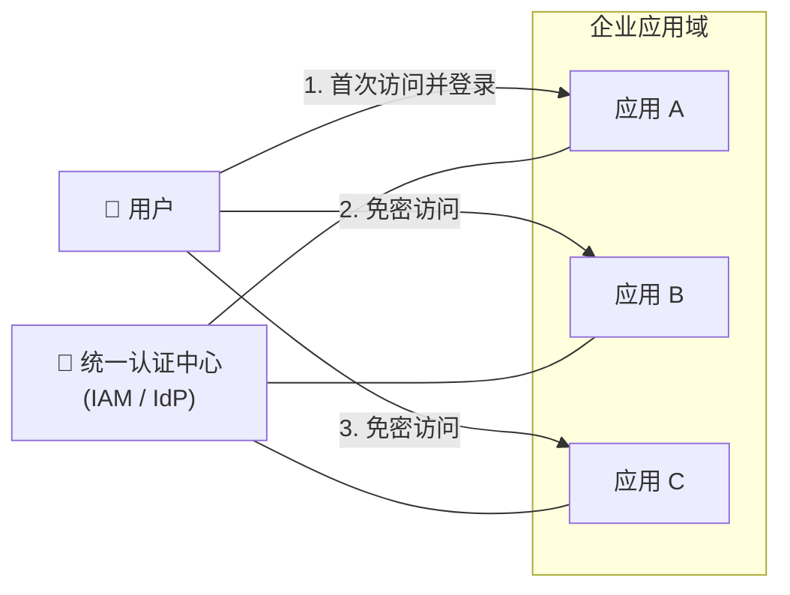

**没有 SSO 时**：每个应用各自维护账号密码，用户要记 N 套口令、重复登录 N 次；应用各自实现认证逻辑，密码散落多处，安全与体验都差。

**有了 SSO 后**：

- 用户只登录一次，后续访问其他应用自动免密（由认证中心下发**会话**或**令牌**证明"已认证"）；
- 认证逻辑收敛到认证中心一处，统一执行密码策略、MFA、风控、审计；
- 支持**一处登出、处处登出（SLO，Single Logout）**，集中吊销会话。

### 1.1 SSO 的几种实现模式

| 模式 | 思路 | 典型协议 | 说明 |
|---|---|---|---|
| **共享会话 Cookie** | 认证中心下发中心会话，各应用同域共享 Cookie | 自定义 / CAS | 仅限同域，跨域需代理 |
| **令牌传递（本系统采用）** | 认证中心签发标准令牌（JWT），应用各自校验 | **OIDC / OAuth 2.0** | 无状态、跨域、标准互操作 |
| **代理认证** | 反向代理统一拦截并注入身份头 | 网关认证 | 适合遗留系统 |

Ark IAM 采用 **OIDC（令牌传递）模式**：认证中心（OP）签发 ID Token / Access Token，业务应用（RP）通过标准协议校验令牌获取用户身份，并依赖中心会话（`iam_sso_session`）实现免密续登。

---

## 2. 为什么需要OIDC

### 2.1 从 OAuth 2.0 到 OpenID Connect

- **OAuth 2.0**（RFC 6749）解决的是**授权**问题："用户允许某个应用代表自己访问资源"（如"允许该应用读取我的照片"）。它只发 **Access Token**，**不关心"你是谁"**。
- **OpenID Connect（OIDC，OpenID Connect Core 1.0）** 在 OAuth 2.0 之上增加**身份层**：新增 **ID Token**（携带用户身份声明）与 **UserInfo 端点**，解决"这个访问者是谁"的**认证**问题。

```
OAuth 2.0（授权）              OIDC（授权 + 认证）
┌──────────────────┐          ┌──────────────────────────┐
│ Access Token     │   + ID   │ Access Token             │
│ 授权访问资源      │ ───────► │ ID Token（你是谁）        │
│ 不知道是谁       │          │ UserInfo 端点             │
└──────────────────┘          │ Discovery 元数据          │
                              └──────────────────────────┘
```

> 一句话：**OIDC = OAuth 2.0 + 身份信息**。凡是"登录"场景，用 OIDC；凡是"授权第三方访问"场景，用 OAuth 2.0。

### 2.2 为什么选 OIDC 而不是自研登录协议

- **标准开放**：RFC / OIDC 规范定义完整，客户端生态成熟（oidc-client-ts、react-oidc-context、spring-security-oidc 等）；
- **互操作**：接入方遵循标准即可接入，不依赖特定 SDK；
- **安全成熟**：授权码 + PKCE、state/nonce、JWT 签名校验等安全机制经过广泛实践检验；
- **可扩展**：支持 Web / 移动端 / 服务端到服务端 / 第三方应用等各类接入形态。

---

## 3. OIDC 核心概念

### 3.1 参与者

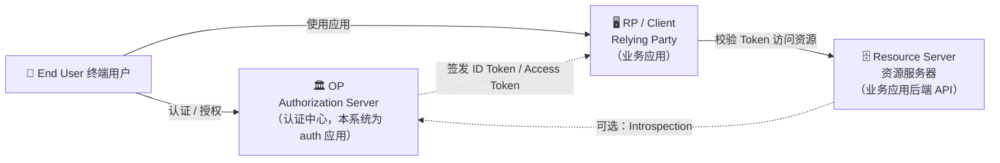

| 角色 | 全称 | 在本系统中的对应 |
|---|---|---|
| **End User** | 终端用户 | 自然人（person），跨租户的全局身份 |
| **OP / IdP** | OpenID Provider / Identity Provider | `auth` 应用的 `/oidc` 服务（OIDC Provider） |
| **RP / Client** | Relying Party | 业务应用前端/后端，如 platform-admin-web、tenant-admin-web |
| **Resource Server** | 资源服务器 | 业务应用后端 API（platformadmin / tenantadmin 等） |
| **Authorization Server** | 授权服务器 | 同 OP，负责认证用户并签发令牌 |

### 3.2 Client 注册信息（客户端配置）

RP 接入前必须在 OP 注册一个 **OAuth Client**，核心注册字段（本系统对应 `application_client` 表）：

| 字段 | 说明 | 本系统默认值 |
|---|---|---|
| `client_id` | 客户端唯一标识 | 如 `platform-admin-web` |
| `client_secret` | 客户端密钥（仅机密客户端需要，库中只存哈希） | - |
| `redirect_uris` | 授权码回调地址（**必须白名单精确匹配**） | 如 `http://localhost:3001/callback` |
| `grant_types` | 允许的授权类型 | `["authorization_code"]` |
| `response_types` | 允许的响应类型 | `["code"]` |
| `token_endpoint_auth_method` | 令牌端点客户端认证方式 | `client_secret_basic` / `client_secret_post` / `none` |
| `post_logout_redirect_uris` | 登出后跳转白名单 | - |
| `back_channel_logout_uri` | 背信道登出通知地址（SLO） | - |
| `require_pkce` | 是否强制 PKCE | 默认否（协议侧始终支持 S256） |
| `default_scopes` | 默认授权 scope | `["openid","profile"]` |
| `access_token_ttl` / `refresh_token_ttl` | 令牌有效期（秒） | 900 / 2592000 |

### 3.3 授权类型（Grant Types）

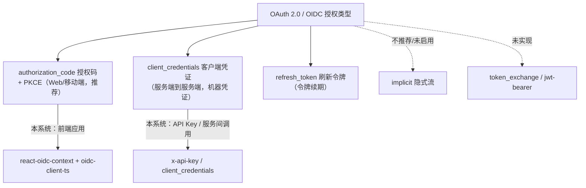

- **authorization_code**：前端 / 原生应用标准流程，配合 **PKCE** 防止授权码拦截。
- **client_credentials**：没有用户参与，应用用自己的凭证直接换令牌，适用于服务间调用、定时任务。
- **refresh_token**：Access Token 过期后用刷新令牌静默换取新令牌，避免频繁重新登录。

### 3.4 Token（令牌）

| 令牌 | 载体 | 用途 | 关键点 |
|---|---|---|---|
| **ID Token** | JWT | 证明"用户是谁" | 必须校验签名、`iss`、`aud`、`nonce`；有效期短（本系统 10 分钟） |
| **Access Token** | JWT（本系统为 JWT，RS256） | 访问业务 API 的凭证 | 携带 `sub`、`tenant_id`、`user_id`、`client_id`、`token_usage` 等声明 |
| **Refresh Token** | 不透明字符串 | 换取新的 Access Token | 库中只存哈希；支持轮换与吊销 |
| **ID Token 声明（Claims）** | JWT 载荷 | 用户身份信息 | `sub`/`iss`/`aud`/`exp`/`iat`/`amr`/`auth_time`/`sid` 等 |

**本系统 Access Token 的私有声明**（`pkg/iam/object/objauth`）：

| Claim | 含义 |
|---|---|
| `sub` | 主体标识，自然人格式为 `person:<personID>` |
| `tenant_id` | 用户当前所在的租户 |
| `user_id` | 用户在租户内的成员 ID |
| `client_id` | 签发该令牌的 OAuth Client |
| `token_usage` | 令牌用途：`machine`（机器凭证签发）或空（人登录签发） |

### 3.5 Scope 与 Claims

- **Scope** 是权限范围：`openid`（必须，声明启用 OIDC）、`profile`、`email`、`phone`、`offline_access`（允许发 Refresh Token）等。
- **Claims** 是 ID Token / UserInfo 中的身份声明，按 scope 裁剪返回。
- 本系统在 `application_client.default_scopes` 中配置客户端默认 scope；`resource`/`scope` 表用于资源级权限建模（见 [system-design.md](system-design.md)）。

---

## 4. 协议端点

OIDC 端点基于 **issuer（签发者标识）** 派生，本系统 issuer 默认为 `http://localhost:8081/oidc`。客户端可访问 `GET {issuer}/.well-known/openid-configuration` 发现全部端点（Discovery）。

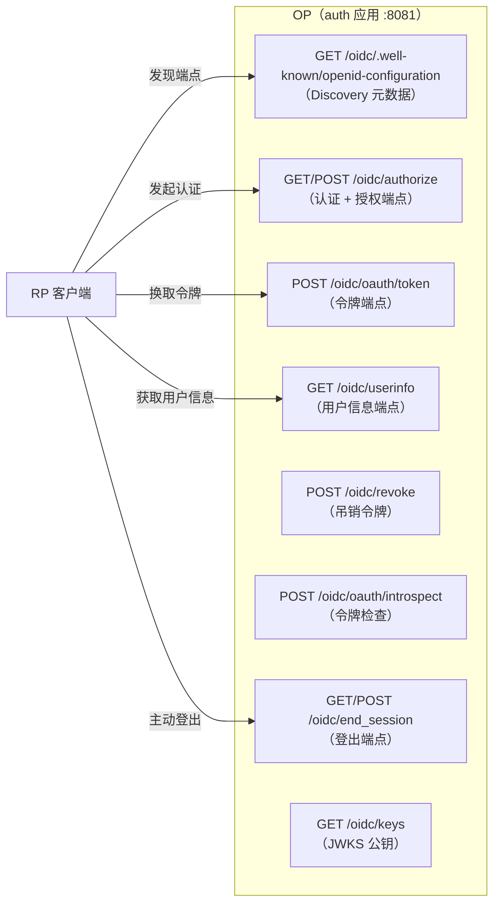

| 端点 | 方法 | 作用 |
|---|---|---|
| `/.well-known/openid-configuration` | GET | 服务发现：返回 issuer、各端点地址、支持的算法/scope |
| `/authorize` | GET/POST | 认证用户、征求授权、返回授权码（`code`） |
| `/oauth/token` | POST | 用授权码/刷新令牌/客户端凭证换取令牌 |
| `/userinfo` | GET | 返回当前用户的标准声明（按 scope 裁剪） |
| `/revoke` | POST | 吊销 Refresh Token |
| `/oauth/introspect` | POST | 检查 Access Token 有效性（资源服务器用） |
| `/end_session` | GET/POST | OIDC 前端登出（Session Management / RP-Initiated Logout） |
| `/keys` | GET | JWKS：验证 ID Token / Access Token 签名的公钥集 |

> 本系统还提供了 OIDC 规范之外的辅助端点：`POST /oidc/login`（登录页提交凭证）、`POST /oidc/login/selectTenant`（多租户选择）、`GET /oidc/sso-login`（SSO 免密续登）、`GET /oidc/logged-out`（登出落地页）。详见 [api-reference.md](api-reference.md)。

---

## 5. 典型流程（时序图）

### 5.1 授权码 + PKCE（推荐，前端应用）

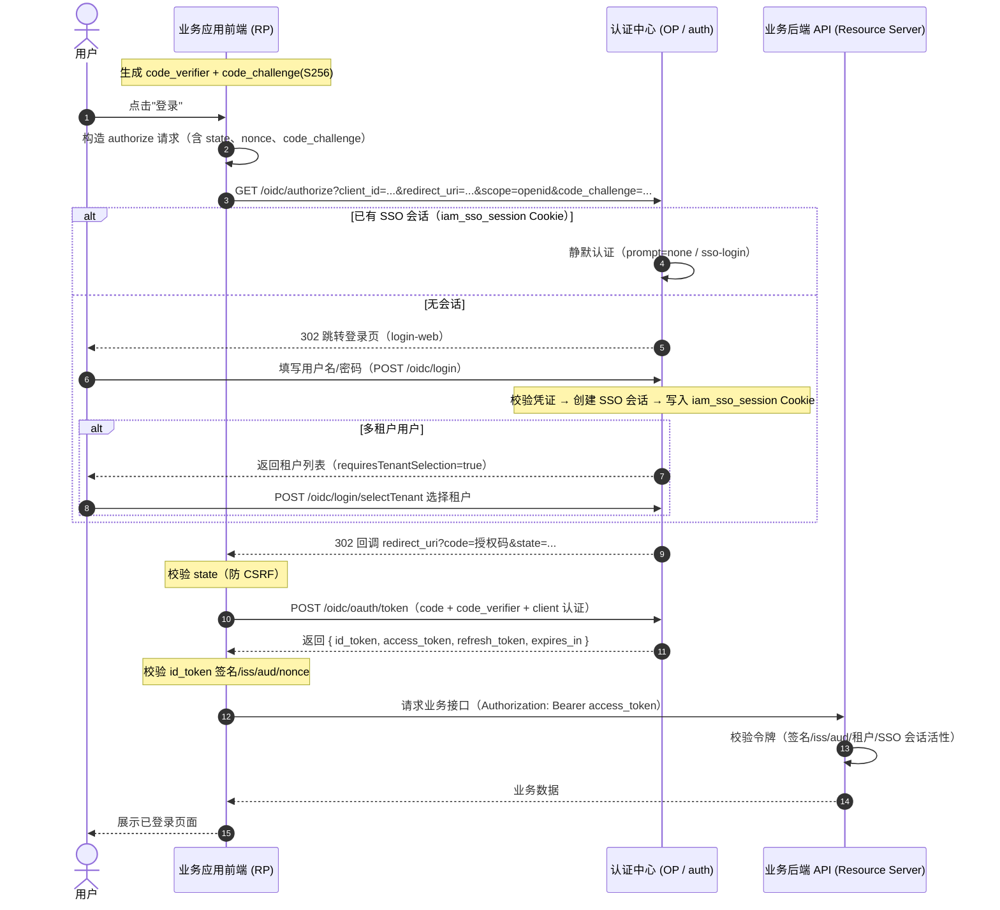

**要点**：授权码只在"用户已认证"后签发；`state` 防 CSRF；`nonce` 防重放；`code_verifier` 确保只有持有 PKCE 秘密的客户端能换令牌。

### 5.2 免密续登（SSO 静默认证）

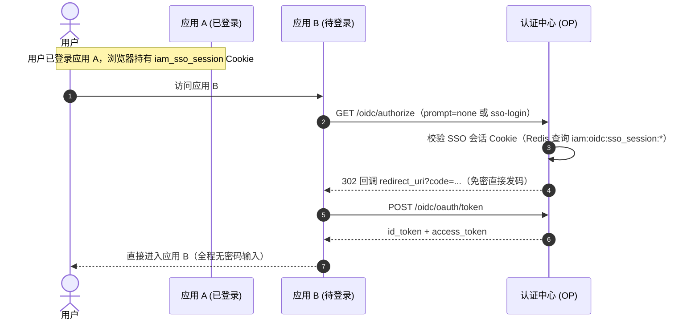

### 5.3 client_credentials（机器凭证）

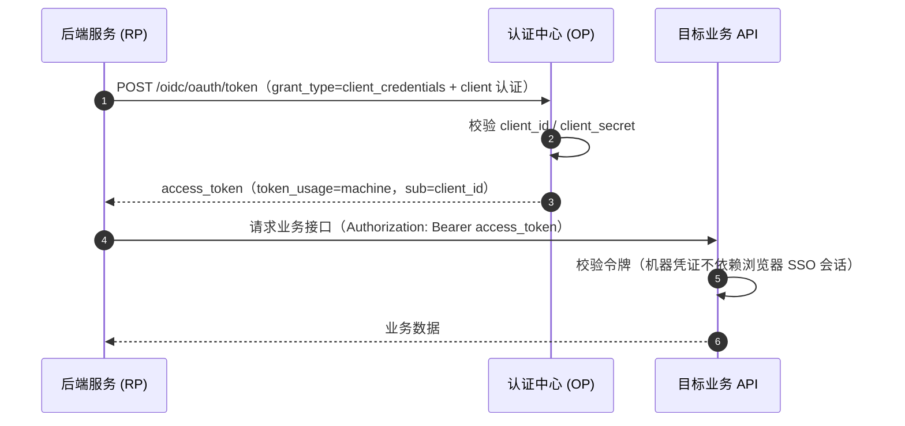

### 5.4 刷新令牌轮换

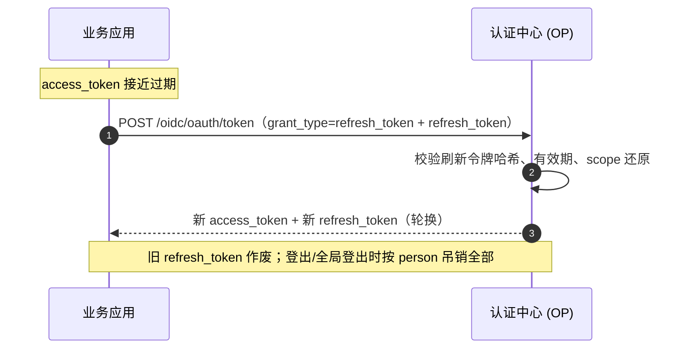

---

## 6. 令牌生命周期（状态图）

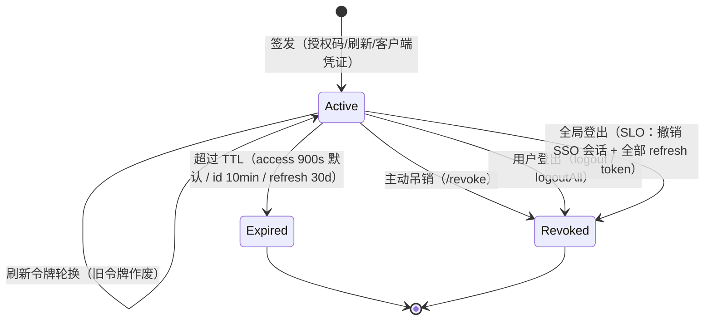

**本系统令牌失效策略**：

- **Access Token**：JWT 无状态，靠**短 TTL**（默认 900s，客户端可配置）自然过期；业务 API 每次请求还校验 **SSO 会话活性**（`HasActiveSession`），实现登出后近乎即时失效；
- **Refresh Token**：库中存 SHA-256 哈希，支持轮换、按 person 批量吊销；
- **ID Token**：10 分钟短生命周期，主要用于前端身份展示。

---

## 7. 单点登出（SLO）

### 7.1 两级登出

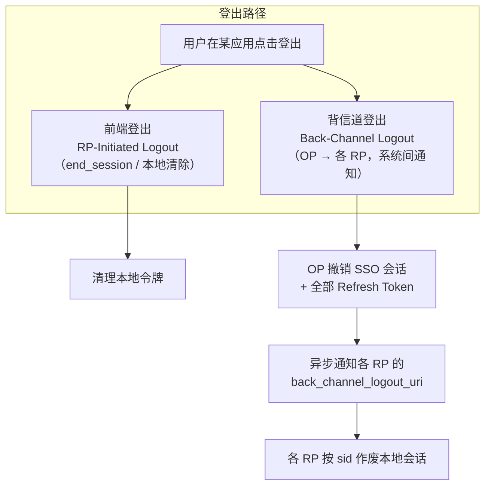

- **前端登出（Front-Channel）**：用户在应用 A 点击登出 → 调用 OP 登出端点 → OP 清除 SSO 会话 Cookie 与全部 Refresh Token → 其他应用下次请求因会话已撤销而被拒绝（请求粒度即时生效）。
- **背信道登出（Back-Channel，标准 SLO）**：OP 向所有"登记过令牌"的 RP 的 `back_channel_logout_uri` 异步发送签名的 **logout_token**，RP 校验后按 `sid` 作废本地会话——**即使其他应用页面未刷新也能被登出**。

### 7.2 背信道登出时序

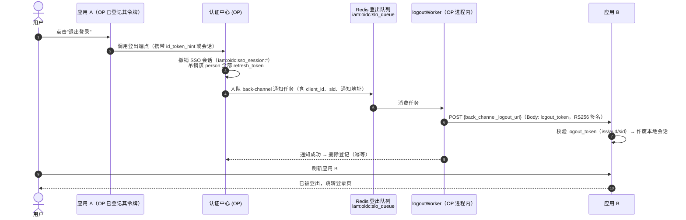

---

## 8. 安全要点

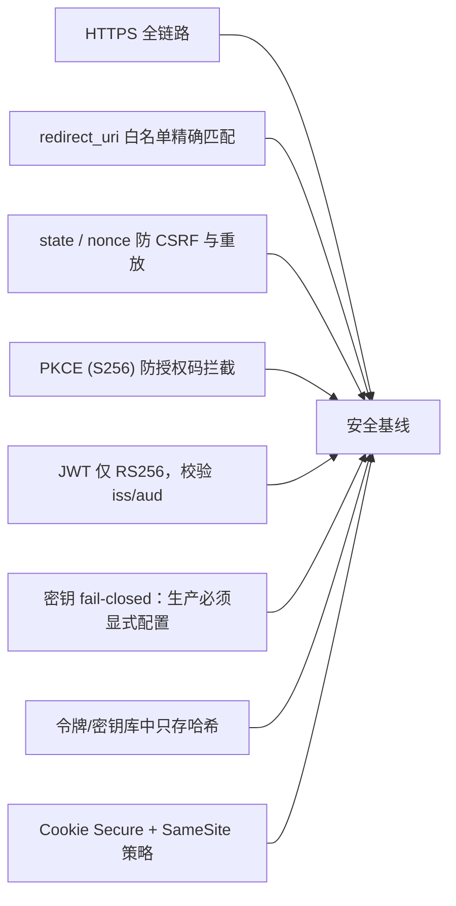

| 措施 | 说明 | 本系统落地 |
|---|---|---|
| HTTPS | 生产必须全链路 HTTPS，令牌不落明文 | 配置 `cookieSecure: true` |
| redirect_uri 校验 | 回调地址必须精确命中注册白名单 | authorize 静默认证前校验回调归属 |
| state / nonce | 防 CSRF / 防令牌重放 | 前端 OIDC SDK 自动生成 |
| PKCE | S256 挑战码，杜绝授权码拦截 | 协议层 `CodeMethodS256: true`，客户端可强制 |
| 签名算法白名单 | 拒绝 HS256 等对称算法混淆 | 校验仅允许 `RS256` |
| iss / aud 校验 | 防止跨 issuer / 跨客户端串用令牌 | RP 中间件 `WithOIDCIssuer` / `WithOIDCAudiences` |
| 密钥管理 | 非开发环境未配置密钥直接启动失败 | 签名/加密密钥 fail-closed |
| 令牌存储 | 刷新令牌、客户端密钥只存 SHA-256 哈希 | `pkg/token.HashToken` |

---

## 9. 术语速查

| 术语 | 英文 | 说明 |
|---|---|---|
| 单点登录 | SSO | 一次认证，多应用免密通行 |
| 单点登出 | SLO | 一处登出，处处登出 |
| 授权服务器 | Authorization Server / OP | 认证用户、签发令牌 |
| 依赖方 | Relying Party / Client / RP | 接入认证的业务应用 |
| 身份提供商 | Identity Provider / IdP | 提供身份认证的机构/系统 |
| 资源服务器 | Resource Server | 承载受保护 API 的服务 |
| 授权码 | Authorization Code | 授权后回传的一次性凭证 |
| 访问令牌 | Access Token | 访问 API 的短期凭证 |
| ID 令牌 | ID Token | 携带用户身份声明的 JWT |
| 刷新令牌 | Refresh Token | 换取新访问令牌的长期凭证 |
| 声明 | Claim | 令牌中关于主体的键值信息 |
| 范围 | Scope | 请求的权限范围 |
| 公钥集合 | JWKS | JSON Web Key Set，验签公钥 |
| 挑战码 | PKCE code_challenge | 防止授权码被拦截的证明 |
| 发现端点 | Discovery | `.well-known/openid-configuration` 元数据 |
| 背信道登出 | Back-Channel Logout | OP 主动通知 RP 登出的机制 |
| 会话标识 | sid | SSO 会话 ID，用于登出关联 |

> 更多与本系统强相关的术语（租户、自然人、应用、OAuth 客户端、连接器、API Key 等）见 [glossary.md](glossary.md)。
