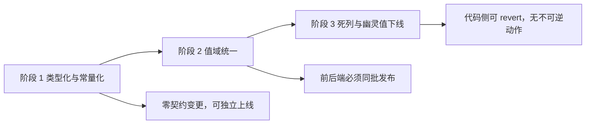
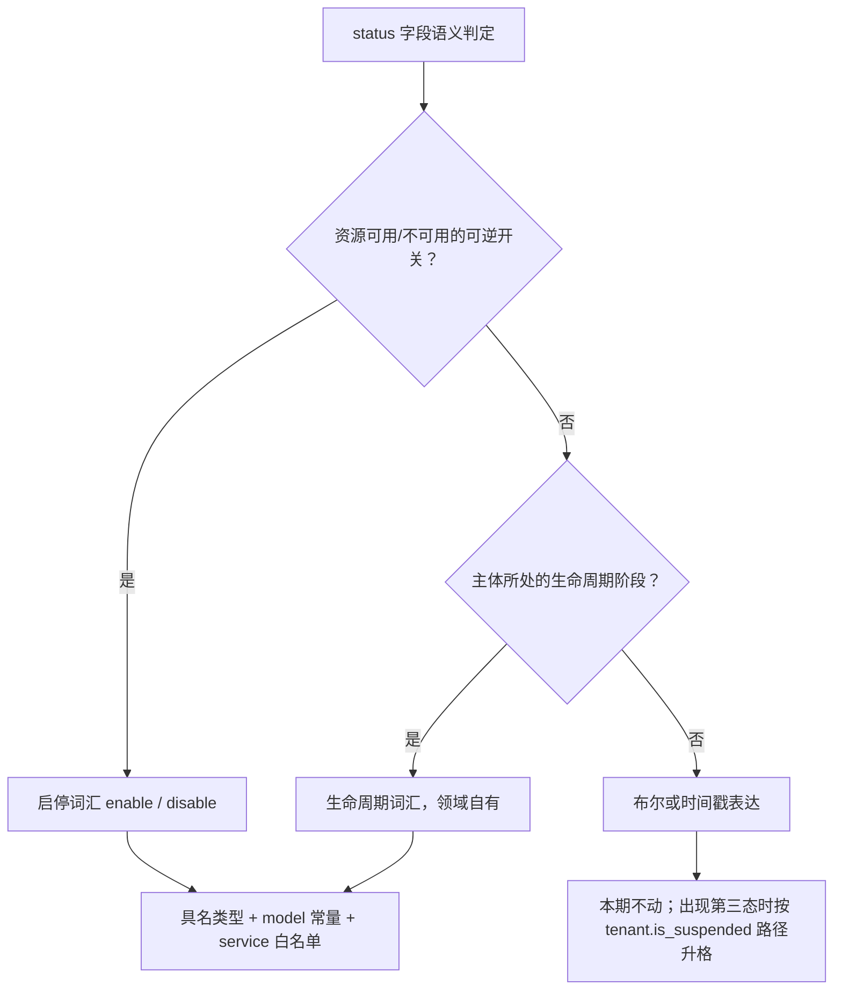

# status / source 字段一致性与强类型整改方案

> 状态：**待评审**（方案与全部决策均已定稿，评审只做确认）
> 决策日期：2026-09-12
> 决策口径：**合理性优先**——原先的开放项已逐条拍定，每条给出「结论 / 理由 / 代价 / 改判条件」，见「决策记录」；本文不留任何"待定"
> 场景：**S2 增量改造**（主场景，因为阶段 2 改变对外可观察的取值）；补充义务来自 **S3 结构重构**（阶段 1 纯类型化需行为基线 + 等价性验证）与 **S5 下线与废弃**（阶段 3 需消费者盘点 + 数据处置）
> 档位：**标准档**（已删除不适用章节：成本分析、容量规划、压测方案、容灾备份、消息与异步——本方案不涉及性能、容量、部署形态与第三方依赖）
> 专题：**数据模型设计**（枚举类型与常量布局）+ **API 设计**（契约取值迁移 + swagger 枚举重生成）
> 影响一句话：收敛 3 套"启用"词汇、为 7 个裸 `string` 枚举补具名类型、把 2 处漂到 service 层的枚举常量下沉 `model`、消除 21 处审计 `result` 硬编码、为 4 个缺失白名单的 status 补校验；涉及后端 5 模块 38 个非测试文件 + 25 个测试文件、前端 13 个文件、2 份 swagger 产物与 3 份 living doc。
> 兼容性结论：**阶段 1 零契约变更**（旧库无需处置）；**阶段 2 改变落库值，前后端必须同批发布**（旧库删库重建或一次性 SQL）；**阶段 3 无不可逆动作**（AutoMigrate 只增不删，删代码可 `git revert`）。

---

## 背景与目标

### 现状盘点

全仓 `status` / `source` 类字段共 **20 个**，分布在 `backend/pkg/iam/model/` 的 13 张表。其中 `source` 4 个（风格已一致，见附录 A），其余 16 个见下表——含 10 个字符串 status、3 个布尔、3 个时间戳，按"值的表达方式"分为三类：

| 表达方式 | 字段 | 取值 | 具名类型 | 实体字段类型 | 常量位置 |
|---|---|---|---|---|---|
| 字符串 | `menu.status` | enable/disable | `MenuStatus` ✅ | `MenuStatus` ✅ | `model/menu.go:46` |
| 字符串 | `application.status` | enable/disable | ❌ 无 | `string` ❌ | `model/application.go:30`（**无类型**） |
| 字符串 | `application_client.status` | enable/disable | ❌ 无 | `string` ❌ | `model/application_client.go:25`（**无类型**） |
| 字符串 | `tenant_application.status` | enable/disable | ❌ 无 | `string` ❌ | **借用** `AppStatus*` |
| 字符串 | `department.status` | active/inactive | `DeptNodeStatus` | `string` ❌ | `model/department.go:13` |
| 字符串 | `connector.status` | enabled/（空） | ❌ 无 | `string` ❌ | **`apps/auth/.../svcauth/connector.go:27`** ❌ |
| 字符串 | `tenant.status` | active/suspended | `TenantStatus` ✅ | `TenantStatus` ✅ | `model/tenant.go:20` |
| 字符串 | `invite.status` | pending/accepted/revoked/expired | `InviteStatus` | `InviteStatus` ✅ | `model/invite.go:15` |
| 字符串 | `session.status` | active/（revoked 从未写入） | ❌ 无 | `string` ❌ | **`pkg/iam/sso/sso.go:24`** ❌ |
| 字符串 | `audit_log.result` | success/failure | ❌ 无 | `string` ❌ | ❌ 无（21 处硬编码） |
| 布尔 | `person.is_suspended` | bool | — | `bool` | — |
| 布尔 | `tenant_user.is_suspended` | bool | — | `bool` | — |
| 布尔 | `domain.is_verified` | bool | — | `bool` | — |
| 时间戳 | `api_key.revoked_at` | nil / 时刻 | — | `*time.Time` | — |
| 时间戳 | `application_client_secret.revoked_at` | nil / 时刻 | — | `*time.Time` | — |
| 时间戳 | `refresh_token.revoked_at` | nil / 时刻 | — | `*time.Time` | — |

`source` 侧共 4 个字段，风格已高度一致（详见附录 A），仅 `role.source` 未跟上具名类型。

**code 事实源**：`docs/design/application-source-rename.md` 已定稿 `source` 三值口径；`frontend/DESIGN.md` §7.2（第 169-181 行）已把前端 Tag 字典写成规范。

### 痛点分析

按"会不会真的出事"排序，6 类痛点均可复现：

1. **"启用"有 3 种英文写法**：`enable`（application / application_client / menu / tenant_application）、`active`（department）、`enabled`（connector）。三者在同一系统内表达同一语义，跨表排查与前端字典复用都要额外记忆。
2. **同一个字面量 `active` 渲染出两个中文标签**：`StatusTag`（`frontend/packages/ui/src/status.tsx:17`）把 `active` 映射为**启用**，`SuspendedTag`（同文件 `:34`）把 `active` 映射为**正常**。租户页（`apps/platform-admin-web/src/pages/tenant/index.tsx:167`）与部门页（`apps/tenant-admin-web/src/pages/department/index.tsx:252`）因此对同一个值显示不同文案——这是现状里最容易让使用者困惑的一点。
3. **非法 status 会被静默写库**：`application` / `application_client` / `tenant_application` / `connector` 四个 status 从入参直落 DB，无白名单（`apps/platformadmin/internal/service/svcapplication/application.go:75`、`svcapplicationclient/application_client.go:134`、`svctenantapplication/tenant_application.go:72`）。写进 `"ENABLE"` 之类非法值后，DAO 的 `Status: model.AppStatusEnable` 过滤会查不到该行——**"停用"表现为"记录消失"而非报错**。
4. **声明的枚举永不流转（文档化谎言）**：`session.status` 注释写 `active/revoked`、并有 `revoked_at` 列，但全仓**没有任何代码写入 `revoked` 或 `revoked_at`**；同表的 `last_active_at` 也从未被写入。三列在生产代码里只有 `CreateSession` 的 `status='active'` 一次写入，**零读取路径**（完整消费者盘点见「阶段 3 的消费者盘点」）。会话撤销实际走 Redis 删 key，该表只写不读（会话列表来自 `refresh_token`，见 `apps/auth/internal/service/svcsession/session.go:34`）。读代码的人会误以为可以查 `status=revoked`。同类幽灵值还有 `InviteStatusExpired`（`model/invite.go:18`，全仓零引用）——过期已由 `expires_at` 时间列在读取时派生（`apps/auth/internal/service/svcauth/auth.go:211-213`：`ExpiresAt != nil && time.Now().After(*ExpiresAt)` → `InviteExpiredError`），存储态从未被写入。
5. **审计 `result` 21 处硬编码**：`audit.AuditEntry.Result` 是裸 `string`（`pkg/iam/audit/audit.go:32`），19 处 `Result: "success"/"failure"` 字面量加 `apps/auth/internal/service/svcauth/auth.go:548,550` 的 2 处局部变量字面量（合计 21 处），散布 7 个文件。同一个结构体里 `Action` 用了常量、`Result` 和 `TargetType`（20 处字面量）却是裸字符串。
6. **违反 `AGENTS.md` 强类型枚举硬规则**：`DeptNodeStatus` 已声明具名类型但实体字段是 `string`（`model/department.go:29`），并出现 `string(model.DeptNodeStatusActive)` 显式转换（`apps/tenantadmin/internal/service/svctenant/department.go:59,275`）；`model/role.go:34` 同样出现 `string(RoleSourceBuiltin)`；`AppStatus*` / `ApplicationClientStatus*` 是**无类型常量**（`AppStatusEnable = "enable"`），无法靠类型约束调用方、也无法标注 DTO。

### 目标与非目标

**目标**

1. 建立一条可判定的词汇判定规则，把"启用"收敛到唯一写法（见「目标口径（决策表）」D1）。
2. 所有字符串枚举达成 `AGENTS.md` 三件套：**具名类型全链路 + 常量定义在 `model` + service 入口白名单**（白名单须配非法值拒绝用例，见 R6）。
3. 消除枚举值的硬编码（审计 `result` / `targetType`）。
4. 消除"声明了却永不流转"的枚举与死列。

**非目标（超出范畴的用例）**

- **不**把布尔状态升格为枚举：`person.is_suspended` / `tenant_user.is_suspended` / `domain.is_verified` 保持布尔。原因是已有明文批准的决策——`docs/design/tenant-admin-provisioning-design-20260912.md:496` 约定"出现 `expired`/`locked` 等第三态时再按 `tenant.is_suspended → status` 的同一路径升格"。现在动它们属于提前抽象。
- **不**统一"是否失效"的三种表达（字符串枚举 / 布尔 / 时间戳）。`has_value = 已撤销` 的时间戳表达本身语义准确且已有 4 个消费者（如 `pkg/middleware/apikey_auth.go:95`），强行统一为字符串枚举会引入一个必须与时间戳保持同步的冗余列。
- **不**重命名既有具名类型（`DeptNodeStatus`、`AppStatus*`、`AppSource`）。改名收益低于跨 38 个文件的改动成本，且与本次"收敛取值"正交。
- **不**动 `docs/superpowers/**` 的历史 plan/spec 与 `docs/design/` 中已标注"历史记录"的文档。
- **不**引入数据库迁移脚本（遵循 `AGENTS.md`「按新项目处理」）。

### 约束与非功能需求

| 约束 | 内容 | 来源 |
|---|---|---|
| 兼容约束 | 具名类型的底层是 `string`，JSON 序列化仍是普通字符串、GORM 仍存 varchar，**前端与数据库对类型化无感知** | `AGENTS.md` 强类型枚举硬规则 4 |
| 兼容约束 | 阶段 2 改变落库值，因此**前后端不可分开发布** | 本文「兼容性策略与旧库处置」 |
| Schema 约定 | 不写迁移脚本、不加兼容旧库分支；旧库残留列属预期，处置方式是删库重建 | `AGENTS.md` |
| 测试约定 | 单测走 `testutil.SetupSQLite(t, entities...)`；SQLite 对 `not null` JSON 列需显式播种 | `AGENTS.md` |
| 交付约定 | 每个阶段必须独立可上线、独立可回滚 | 本文「阶段与里程碑」 |

本方案不涉及性能、可用性、容量与成本目标（无新增运行时组件、无新查询路径、无请求量变化）。

### 验收标准

| 阶段 | 谁验 | 怎么验 | 阈值 |
|---|---|---|---|
| 阶段 1 | 开发 | 5 个 Go 模块 `go build`；`make test APP=auth/platformadmin/tenantadmin`；前端 `typecheck` + `test`；白名单负向用例（R6） | 全绿；对改造前后同一组 API 请求抓取响应，**响应体字节级一致**；`grep -rn 'Result:\s*"\|TargetType:\s*"' apps pkg --include='*.go' \| grep -v _test \| wc -l` 结果为 **0**；4 条非法值用例全部被拒 |
| 阶段 2 | 开发 + 前端 | 部门启停 E2E、连接器授权/回调 E2E；旧库删库重建后执行 seed 并抽查 | 全绿；`grep -rn "'active'\|'inactive'\|\"active\"\|\"inactive\"\|enabled"` 在 department / connector 相关文件（含 seed、swagger、前端页面）为 **0** |
| 阶段 3 | 开发 + 架构 + DBA | 全仓 `grep` 零残留；全量测试；DBA 按「阶段 3 的消费者盘点」完成 SQL 审计并连续观察 7 天确认无外部读取 | 零残留且测试全绿；`session` 三列与 `InviteStatusExpired` 的读写引用数为 **0**；DBA 书面确认无外部消费者 |

---

## 方案设计

### 总体思路

一句话：**先定词汇判定规则（不碰值）→ 再用"具名类型 + model 常量 + service 白名单"把规则固化下来（仍不碰值）→ 最后才改值、删死列**。

三个阶段严格按"是否改变对外可观察行为"切分：阶段 1 是纯 Go 层重构（S3 义务：行为基线 + 等价性验证），阶段 2 才动取值（S2 义务：影响面 + 兼容性 + 回归范围），阶段 3 下线死列（S5 义务：消费者盘点 + 数据处置）。



### 目标口径（决策表）



| 编号 | 决策 | 采纳 | 备选与否决理由 |
|---|---|---|---|
| **D1** | 词汇表收敛为**两套**：启停语义用 `enable`/`disable`；生命周期语义用领域自有词汇 | ✅ | ① *全系统单套 `enable`/`disable`*：否决——`tenant.status=suspended` 是"挂起"（有非 active 租户禁止登录与签发令牌的语义），降级为"停用"丢失语义；② *各领域自持不做收敛*：否决——这正是现状问题 |
| **D2** | 具名类型**每字段一个**，不共享通用 `EnableStatus` | ✅ | *共享一个 `EnableStatus`*：常量只写一份、改动最小，但跨领域可互相赋值、编译期隔离消失。否决依据：`application-source-rename.md` §0.1 决策 6 已确立"即使取值与 `AppSource` 完全相同，`application_client` 仍新增独立具名类型 `ApplicationClientSource`"的先例 |
| **D3** | 枚举常量**一律下沉 `model/`** | ✅ | *保持 service 私有*：否决——与 `AGENTS.md`「数据库存储的枚举值定义在对应结构体文件」直接冲突，且跨 app 无法复用 |
| **D4** | `connector.status` 的 `default:''` 改为 `'enable'` | ✅ | *保留空默认*：否决——空值不命中任何白名单，连接器创建后即永久不可用（`svcauth/connector.go:416,486` 判 `!= enable` 直接拒绝） |
| **D5** | `session.status` / `revoked_at` / `last_active_at` **三列下线** | ✅ | ① *在登出路径回写 `revoked`*：登出是热路径，Redis 删除成功后再写库会引入"库写失败但已登出"的不一致，收益仅是让审计表可查撤销时间——而该信息已由 `refresh_token.revoked_at` 覆盖，属重复表达；② *只改注释说明恒为 active*：留一个恒量列，仍会误导读者 |
| **D6** | 删除 `InviteStatusExpired` 常量 | ✅ | *保留并在读取时派生*：过期已由 `expires_at` 在读取时派生（`svcauth/auth.go:211-213`），派生态不落库、无法参与 DAO 过滤，留着只会让人以为库里存在 `expired` 行 |
| **D7** | 审计 `result` **与 `targetType` 同批**常量化 | ✅ | *只做 `result`*：同一结构体、同一改法，分两批做的边际成本高于合并，且会留下"半类型化"的中间态 |
| **D8** | 布尔/时间戳状态**不动** | ✅ | 见「非目标」 |
| **D9** | 前端新增 `EnableTag`，并**移除** `StatusTag` | ✅ | *把 `StatusTag` 留作 deprecated 别名*：别名会原样保留 `active`→启用 的错标能力，正是本次要消除的缺陷，等于把坑留在公共包里 |
| **D10** | 新类型**不**实现 `MarshalJSON`/`UnmarshalJSON` | ✅ | *自定义序列化*：底层是 `string`，`encoding/json` 与 gin 绑定已正确处理，自定义 marshaller 只增加无收益的代码面与出错点 |
| **D11** | `IsEnable()` 类判定方法**按需添加**，不批量对称补齐 | ✅ | *为每个新类型都加*：属于投机性泛化，无调用方的导出方法只增加维护面。仅当确有"避免枚举三值"的调用点时才加 |
| **D12** | 白名单必须配**负向测试**（非法值被拒） | ✅ | *只测合法路径*：白名单的唯一职能就是拒绝非法值，不测等于没实现；成本为每个白名单 1 条用例 |
| **D13** | 存量库处置**只认删库重建**，一次性 SQL 仅作例外 | ✅ | *把一次性 SQL 写成与删库重建并列的常规选项*：会在项目里引入第二套分叉的升级流程，与 `AGENTS.md`「按新项目处理」相悖 |

### 词汇表与值域迁移表

| 表.字段 | 现值域 | 目标值域 | 是否改值 | 阶段 |
|---|---|---|---|---|
| `application.status` | enable/disable | 不变 | 否 | 1（仅类型化） |
| `application_client.status` | enable/disable | 不变 | 否 | 1 |
| `tenant_application.status` | enable/disable | 不变 | 否 | 1 |
| `menu.status` | enable/disable | 不变 | 否 | 已合规，零改动 |
| `tenant.status` | active/suspended | 不变 | 否 | 已合规，零改动 |
| `department.status` | **active/inactive** | **enable/disable** | **是** | 2 |
| `connector.status` | **enabled/''** | **enable/disable** | **是** | 2 |
| `invite.status` | pending/accepted/revoked/expired | 不变，去 `expired` | 否 | 3 |
| `session.status` | active/（revoked 从未写） | 列下线 | — | 3 |
| `audit_log.result` | success/failure | 不变 | 否 | 1（常量化） |

---

## 详细设计

### 阶段划分与职责

| 阶段 | 内容 | 交付物 | 可独立上线 |
|---|---|---|---|
| **1 类型化与常量化** | 补 `AppStatus`/`ApplicationClientStatus`/`TenantApplicationStatus` 具名类型；`DeptNodeStatus`/`RoleSource`/`InviteStatus` 的实体与 DTO 字段改具名类型；`session`/`connector` 常量下沉 `model`；4 处 service 白名单；`model.AuditResult`/`model.AuditTargetType` 具名化 + 41 处常量化；前端 TS 联合类型补齐 | 代码 + 测试 | ✅ 无契约变更 |
| **2 值域统一** | `department.status` `active/inactive` → `enable/disable`；`connector.status` `enabled` → `enable` 并补 `disable`；`connector.status` 默认值改 `'enable'`；前端 department 页面字面量同步；新增 `EnableTag` 并移除 `StatusTag`；swagger 重生成；living doc 更新 | 代码 + 前端 + swagger + 文档 | ✅ 但前后端同批发布 |
| **3 死列与幽灵值下线** | `session.status`/`revoked_at`/`last_active_at` 三列删代码（含 `SessionAuditCond.Status` 与相关测试断言）；`InviteStatusExpired` 删除；`system-design.md` 的 `session` 表 DDL 同步 | 代码 + 文档 | ✅ 无不可逆动作 |

### 数据模型（枚举类型与常量布局）

常量与类型一律落在对应实体的 `model/*.go`，形态统一为「具名类型 + 具名常量 + 判定方法」：

```go
// model/application.go
type AppStatus string

const (
    AppStatusEnable  AppStatus = "enable"  // 启用
    AppStatusDisable AppStatus = "disable" // 停用
)

type ApplicationEntity struct {
    // ...
    Status AppStatus `gorm:"column:status;type:varchar(32);not null;default:'enable';comment:状态" json:"status"`
}
```

```go
// model/session.go —— 常量下沉后的形态（阶段 3 会随列一并删除）
type SessionStatus string

const (
    SessionStatusActive  SessionStatus = "active"
    SessionStatusRevoked SessionStatus = "revoked"
)
```

新增类型清单：

| 新增具名类型 | 取值 | 落在 |
|---|---|---|
| `AppStatus` | enable/disable | `model/application.go` |
| `ApplicationClientStatus` | enable/disable | `model/application_client.go` |
| `TenantApplicationStatus` | enable/disable | `model/tenant_application.go` |
| `ConnectorStatus` | enable/disable | `model/connector.go` |
| `SessionStatus` | active/revoked | `model/session.go`（阶段 3 删除） |
| `AuditResult` | success/failure | `model/audit_log.go` |
| `AuditTargetType` | person / user / tenant / application / application_client / api_key（6 值已盘点，见「决策记录」R3） | `model/audit_log.go` |

同时补一条判定方法（供未来调用方避免枚举三值）：`func (s AppStatus) IsEnable() bool { return s == AppStatusEnable }`（按需添加，见 R6）。

> **为什么 `SessionStatus` 在阶段 1 建、阶段 3 又删？** 阶段 1 的门禁是"`model` 之外不得存在字典常量"，所以必须先把它从 `pkg/iam/sso` 收进 `model` 并给实体字段具名类型；阶段 3 的下线受 S5 义务约束（消费者盘点 + DBA 侧 7 天观察），不能与阶段 1 合并。两阶段之间该类型是**有意义的过渡态**——它让"这列其实从不流转"在类型系统里显式可见，而不是被一个散落的 service 私有常量掩盖。

### 执行记录（2026-09-12）

**阶段 1、阶段 2 均已执行完成**（阶段 3 未启动，受 S5 的 DBA 7 天观察门禁约束）。

阶段 2 的实际落地与两处执行期修正：

| 项 | 计划 | 实际 |
|---|---|---|
| `StatusTag` 调用方 | 6 处 | **7 处**——原清单漏计部门页 `department/index.tsx`（该页正是"同值两种文案"的当事页面之一），已一并切到 `EnableTag` |
| `connector.status` 默认值 | 改列默认值 `'enable'` | 列默认值改为 `'enable'`，**并且在 `buildConnectorInsertEntity` 里显式兜底**——不依赖驱动回读默认值，出参与落库都确定是 `enable` |
| 前端 `status` 链路类型 | 未在计划中 | 顺带收紧：`api/department.ts` 的 4 个 `status?: string` 与页面的 `query`/`editingNode`/`onFinish`/`openEditNode` 全部改为 `DeptNodeStatus`。**收紧后 typecheck 立刻报了 4 处真实类型漂移**（`string` 与枚举混用），证明这条链路此前是松的 |

**未做**：计划里阶段 2 的验收含「E2E 通过」，本机无 E2E 环境（需起服务 + Postgres），**未执行**；替代证据为后端 288→**292** 个用例、前端 45+6 个用例全绿 + 生产构建通过。发布前建议补一次真实 E2E。

**阶段 3 的代码侧已完成**（2026-09-12），但**下线判据第 2 条未满足**，据此发布前必须补做：

| 判据 | 状态 |
|---|---|
| ① 代码侧三列与 `InviteStatusExpired` 的 `grep` 引用归零 | ✅ 已满足（实测均为 0） |
| ② DBA 侧 SQL 审计连续 7 天只见 `INSERT ... session` | ❌ **未满足**——本机无目标库，无法执行；属部署时验证 |
| ③ 全量测试通过且 5 模块 `go build` 通过 | ✅ 已满足（292 后端用例 + 51 前端用例 + 3 端生产构建） |

**为什么在 ② 未满足时仍执行代码侧**：② 验证的是「目标库有没有外部报表/离线作业读这三列」，属部署环境事实，不改变代码应长什么样；而本阶段**不含任何 `DROP COLUMN` 与数据变更**（见上文「数据处置」），
外部读取方即使存在，读到的仍是与今天完全相同的 `active`/NULL 值，行为不变。因此代码侧可先落地，**风险为零且可 `git revert`**；
但**在拿到 DBA 的 7 天审计结论之前，不要把这次改动发布到生产**。

代码侧实际落地：删除 `SessionStatus` 类型与常量、`session` 三列实体字段、`SessionAuditCond.Status` 过滤字段、`CreateSession` 的 `status` 写入；
删除 `InviteStatusExpired`；`system-design.md` 的 session 表 DDL 删三行；`swag` 重生成（`InviteStatus` 枚举由 4 值收敛为 3 值）。
表本身**保留**并显式定位为「登录会话审计（只追加、不可变）」。

顺带补了 2 条此前缺失的用例（`TestJoinTenantRejectsExpiredInvite`、`TestJoinTenantAcceptsInviteNotYetExpired`）——
R2 的结论是「过期由 `expires_at` 派生」，但原仓库**没有任何用例断言这条路径**；删掉 `InviteStatusExpired` 后，
这成了「邀请会过期」这一事实的唯一表达处，必须锁住。

### 接口设计（契约影响面）

**阶段 1 不改任何接口契约（已实测验证）**：具名类型的 JSON 序列化与 `string` 完全一致，swagger 中的字段类型仍是 `string`。

**一处执行期修正（2026-09-12 实测）**：swag 会把具名枚举类型渲染为 `enum` + `x-enum-varnames`/`x-enum-comments` 元数据，而裸 `string` 不产生这些字段。因此**阶段 1 也需要 `make swag` 重生成**（原方案只把它列在阶段 2），否则 swagger 会停留在旧口径。这是**文档口径变精确**——枚举取值从「未声明」变为「已声明且与服务白名单一致」——不是运行时行为变更：HTTP 请求/响应体字节不变（已由 `dtoapplication` 的 JSON 兼容性用例与全量测试锁定）。

**阶段 2 改变 2 个字段的取值域**，涉及以下对外契约：

| 接口 | 字段 | 值变化 |
|---|---|---|
| `PUT /v1/tenant/departments/{departmentID}` | `status` 入参与出参 | `active`/`inactive` → `enable`/`disable` |
| `GET /v1/tenant/departments/*`（含 tree） | `status` 出参 | 同上 |
| `GET /v1/tenant/departments`（status 过滤） | `status` 查询参数 | 同上 |
| connector 相关（auth app） | `status` 入参与出参 | `enabled` → `enable`，新增 `disable` |

**service 入口白名单**（阶段 1 补齐，4 处，写法对齐已合规的 `apps/platformadmin/internal/service/svcpermission/menu.go:20-36`）：

```go
func validateAppStatus(s model.AppStatus) bool {
    switch s {
    case model.AppStatusEnable, model.AppStatusDisable:
        return true
    default:
        return false
    }
}
```

非法值返回各自领域的功能级错误码（复用现有 `ApplicationUpdateError` 等，不新增错误码编号——沿用 `application-source-rename.md` §4「常量名与文案改、编号不动」的口径）。

### 前端设计

**阶段 2 的前端改动分两半：**

1. **字面量同步**（`apps/tenant-admin-web/src/pages/department/index.tsx:216,262,326,327,396,399,400`）：7 处 `'active'`/`'inactive'` → `'enable'`/`'disable'`。
2. **Tag 组件收敛**（`frontend/packages/ui/src/status.tsx`）：

   | 组件 | 现状 | 目标 |
   |---|---|---|
   | `StatusTag` | 认 `enable`/`1`/`active`/`disable`/`0`/`inactive`/`suspended` 七种输入 | **废弃**：从导出中移除；其调用方（**7 处**，含部门页 `department/index.tsx`）改用 `EnableTag` |
   | `EnableTag`（新增） | — | 只认 `enable` → 启用(success)、`disable` → 停用(default)，不做数字兼容 |
   | `SuspendedTag` | 认 `1`/`true`/`suspended` 与 `0`/`false`/`active` | **保持不变**：`apps/tenant-admin-web/src/pages/user/index.tsx:274,711` 仍传布尔 `isSuspended`，待 D8 的升格决策落地后再收紧 |
   | `SourceTag` | 一套 map 覆盖应用/客户端/角色来源 | 保持不变 |

   关于移除数字分支的依据：`StatusTag` 的 6 个调用方（`tenantApplication/index.tsx:117`、`menu/index.tsx:362`、`application/index.tsx:113,234`、`oauthClient/index.tsx:103`、`oauthClient/Detail.tsx:137`）全部传字符串 `status`；**执行期修正**：实际还有第 7 处——部门页 `department/index.tsx:252`，原清单漏计，已一并切到 `EnableTag`，`'1'`/`'0'` 分支当前**无调用方**。

3. **TS 类型补齐**（`frontend/packages/types/`）：`platform.ts` 的 `ApplicationItem`/`OAuthClientItem`/`TenantApplicationItem`/`ConnectorItem` 的 `status` 由 `string` 改为对应联合类型（`EnableStatus`、`TenantStatus` 等）；`department.ts:8,19` 的 `status` 改为 `EnableStatus`；`tenant.ts:117` 的 `source?: 'builtin' | 'custom' | string` **去掉末尾的 `| string`**（该写法会让联合类型失效）。

4. **living doc 同步**：`frontend/DESIGN.md` §7.2（第 169-181 行）的状态 Tag 字典表按上表改写。

---

## 影响面、兼容性与回归

### 影响面盘点

| 层 | 数量 | 明细 |
|---|---|---|
| 后端非测试代码 | **38 个文件**引用枚举常量（实测） | 5 个 Go 模块：auth / platformadmin / tenantadmin / gateway / pkg |
| 后端测试 | **25 个测试文件**引用枚举常量；**29 个**含 status 字面量（实测） | 覆盖 `svcapplication`、`svcapplicationclient`、`svctenantapplication`、`svctenant`、`svcpermission`、`svcoidc`、`oidcop`、`svcsession`、`seed`、`middleware` 等 |
| 审计硬编码 | **7 个文件 / 19 处** `Result:` 字面量 + `auth.go:548,550` 的 2 处局部变量字面量（合计 **21 处**）+ **20 处** `TargetType` 字面量（实测） | auth 8 处、svcoidc 3、tenantadmin 3、platformadmin 5 |
| seed | `backend/pkg/seed/seed.go` 6 处 status 赋值（`:204,228,301,422,505,693`） | 阶段 2 需同步 `:228` 的 `DeptNodeStatusActive` |
| swagger 产物 | **3 个文件**含枚举值 | `backend/apps/{auth,platformadmin,tenantadmin}/docs/*_docs.go`：阶段 1 因具名类型新增 `enum`/`x-enum-*` 元数据，阶段 2 因取值变更再次重生成；两阶段都需 `make swag APP=...` |
| 前端 | **13 个文件**含 status/source 字面量（实测） | 5 个 platform-admin 页面 + 3 个测试 + tenant-admin 的 role/department 页 + `packages/ui/src/status.tsx` + `packages/types/{platform,tenant}.ts`；另有 `packages/types/src/department.ts` 不含字面量、仅需类型补齐 |
| living doc | 3 份 | `frontend/DESIGN.md` §7.2（第 169-181 行）、`docs/design/glossary.md`（第 20 行「租户状态」、第 40 行「来源」）、`docs/design/system-design.md:441-443`（`session` 表 DDL 中阶段 3 待删的三行） |
| E2E | **0**（实测） | `e2e/tests/` 与 `e2e/helpers/` 无 status/source 字面量，本方案不影响 E2E 用例 |

### 阶段 3 的消费者盘点（S5 义务）

**`session` 三列（`status` / `revoked_at` / `last_active_at`）的消费者**——全仓 `grep` 实测结果：

| 消费者类型 | 命中 | 处置 |
|---|---|---|
| 生产写入路径 | **1 处**：`pkg/iam/sso/sso.go:125-130`（`CreateSession` 只写 `status=active`；`revoked_at`/`last_active_at` 从不写） | 随三列一并删除 |
| 生产读取路径 | **0 处**：无任何 DAO 查询、接口出参或业务判断读取这三列 | 无需迁移 |
| DAO 层 | `pkg/iam/dao/session_audit.go:9,13`（`SessionAuditCond.Status` 过滤字段，**无生产调用方**） | 删除该 Cond 字段 |
| 测试 | `pkg/iam/dao/session_audit_test.go:35,53`、`pkg/iam/sso/sso_test.go:52,65`、`pkg/iam/tenant/tenant_test.go:37` | 同步改断言（`sso_test.go:65` 断言的正是 `status`） |
| 建表注册 | `pkg/iam/model/automigrate.go:30` | 保留（表本身仍作为登录会话审计保留） |
| 文档 | `docs/design/system-design.md:441-443` | 同步删三行 |
| 外部消费者（报表 / 离线作业 / 其他系统） | **0 处**（仓库内不存在此类作业；SQL 审计需在真实环境确认，见下） | 上线前由 DBA 在目标库确认无外部定时任务/报表读 `session` 表 |

**`InviteStatusExpired` 的消费者**：全仓 **0 处**（仅 `model/invite.go:18` 的定义行本身；Grep 含 `--include='*.go' --include='*.ts' --include='*.tsx'`，排除 node_modules）。

**僵尸消费者排查方法**（在真实环境执行，本仓库无法覆盖）：对目标库开启 SQL 审计或在 `pg_stat_statements` 中按表名检索，确认 `session` 表除 `INSERT` 外无其他语句类型；连续观察 **7 天**（覆盖周/月报周期）后再执行阶段 3。

**下线判据**（三条全满足才允许执行阶段 3）：

1. 代码侧三列与 `InviteStatusExpired` 的 `grep` 引用数归零（`entity` / `Cond` / 测试 / 文档均无）；
2. DBA 侧 SQL 审计连续 7 天只见 `INSERT ... session`，无 `SELECT` 引用这三列；
3. 全量测试通过且 `go build` 5 模块通过。

**数据处置**：**不做数据归档，也不执行 `DROP COLUMN`**。理由是这三列自建表起就没有业务数据（`status` 恒为 `active`，另两列恒为 NULL），无归档价值；本项目遵循 `AGENTS.md`「AutoMigrate 只增不删」，代码删除后旧库残留列不被读写、属预期，处置方式是新库重建（不含这三列）或按 `run-and-deploy.md` §2.3 删库重建。因此阶段 3 **不产生不可逆动作**，也不涉及合规留存问题（撤销审计由 `refresh_token` 与 `audit_log` 承担）。

### 兼容性策略与旧库处置

| 阶段 | 是否改落库值 | 旧库处置 | 前端兼容 |
|---|---|---|---|
| 1 | 否 | **无需处置**（具名类型是 Go 层构造，物理列仍是 varchar） | 无需前端改动即可上线（TS 类型改动不影响运行时） |
| 2 | 是 | 二选一：① **推荐「删库重建」**（符合 `AGENTS.md` 与 `organization-container-redesign.md` 先例，重建后 AutoMigrate + Seed 即目标结构）；② 若有需保全的库，把一次性 SQL（`UPDATE department SET status='enable' WHERE status='active'`、`UPDATE department SET status='disable' WHERE status='inactive'`、`UPDATE connector SET status='enable' WHERE status='enabled'`）写进部署文档交执行方，**不塞进启动流程** | **必须同批发布**：前端传 `'active'` 而白名单只认 `'enable'` 时，部门启停会直接失败 |
| 3 | — | 无需处置：AutoMigrate 只增不删，删代码后旧库残留列不被读写，属预期 | 无影响（`session` 表无前端消费者） |

**回滚**：

- 阶段 1：`git revert` 即可，无数据影响。
- 阶段 2：代码可 `git revert`，但**已按新值写入的行不会自动回退**——回滚必须同时执行反向 SQL（`UPDATE department SET status='active' WHERE status='enable'`、`SET status='inactive' WHERE status='disable'`、`UPDATE connector SET status='enabled' WHERE status='enable'`）或在重建库上重新 seed。这是本方案唯一的"回滚需修补数据"点，也是阶段 2 必须前后端同批发布的原因。
- 阶段 3：删代码可 `git revert`；物理列残留不影响功能，**本阶段无不可逆动作**（本项目不做 `DROP COLUMN`）。

### 回归与验证范围

阶段 1 属结构重构（行为应不变），必须给出**行为基线**与**等价性验证**：

- **行为基线**：改造前后各抓一遍关键接口响应（部门树、应用列表、OAuth 客户端列表、租户列表、审计日志列表、连接器列表），逐字段比对。
- **等价性验证**：由于类型化不改变序列化结果，验收判据是**响应体字节级一致**；任何字段差异都视为回归。`session` / `connector` 的常量下沉只改常量引用位置，不参与 API 输出。
- **差异容忍度**：无容忍度——本阶段预期零差异。若出现差异，以改造前响应为准并回退该文件。
- **回归清单**（按风险从高到低）：

  | 风险面 | 回归用例 |
  |---|---|
  | DAO Cond 字段类型变更导致过滤失效 | `svcapplication/application_page_list_test.go`、`svcpermission/tenant_scope_test.go`、`tenantadmin/svctenant/department_test.go` |
  | service 白名单新增后合法值被误拒 | `svcapplication/application_create_test.go`、`svcapplicationclient/application_client_delete_test.go`、`svctenantapplication/tenant_application_create_test.go` |
  | 审计 `result` 取值变化 | `svcauth/auth_person_flow_test.go`、`connector_person_flow_test.go`、`seed/seed_test.go` |
  | 常量下沉后循环依赖 | `go build` 5 个模块（`pkg/iam/model` 不得反向 import `pkg/iam/sso`） |
  | 前端 Tag 收敛后文案错位 | `tenant/index.test.tsx`（`SuspendedTag`）、`menu/index.test.tsx`、`application/index.test.tsx` |

---

## 实施计划

### 阶段与里程碑

| 阶段 | 步骤 | 完成判据 |
|---|---|---|
| **1** | ① 补 4 个 `enable/disable` 具名类型 + `AuditResult`/`AuditTargetType`（6 值，见 R3）；② 改 `DeptNodeStatus`/`RoleSource`/`InviteStatus` 的实体与 DTO 字段类型；③ 常量下沉；④ 补 4 处白名单 + 各 1 条非法值负向用例（R6）；⑤ 41 处审计字面量改常量；⑥ 前端 TS 联合类型；⑦ `make swag` 重生成（具名类型会新增 enum 元数据，见下） | 5 模块 `go build` 通过；三端 `make test` 全绿；响应体比对零差异；`Result:` 与 `TargetType:` 字面量归零；4 条负向用例通过 |
| **2** | ① 改 `DeptNodeStatus*` 与 `ConnectorStatus*` 常量值；② `connector.status` 默认值改 `'enable'`；③ seed 与前端 7 处字面量同步；④ 新增 `EnableTag` 并移除 `StatusTag`；⑤ `make swag` 重生成；⑥ `DESIGN.md` + `glossary.md` 更新 | department/connector 相关 `active`/`inactive`/`enabled` 字面量归零；E2E 通过；前端 typecheck + test 通过 |
| **3** | ① 按「阶段 3 的消费者盘点」完成消费者盘点（含 DBA 侧 SQL 审计，观察 7 天）；② 删除 `session` 三列相关代码与测试断言；③ 删除 `InviteStatusExpired`；④ 同步 `system-design.md` DDL | ②③④ **代码侧已完成**；① 的 DBA 侧 7 天审计**待补**（发布前必须完成） |

每阶段结束提交一次、独立可上线。依赖顺序：**阶段 2 必须在阶段 1 之后**（依赖具名类型与 service 白名单）；阶段 3 与阶段 1 无代码依赖，**可在阶段 1 之后任意时点执行**，仅受 S5 的 DBA 观察窗口约束。

### 时间估算

| 阶段 | 估算 | 假设 |
|---|---|---|
| 1 | **1.5–3 人日** | 1 名熟悉本仓库的 Go + React 全栈工程师；含改代码、跑测试、响应体比对；不含评审等待与 swagger 生成排队 |
| 2 | **1–2 人日** | 含前端组件拆分与 living doc 更新 |
| 3 | **0.5–1 人日** | 删除为主，工作量集中在零残留核查 |
| 合计 | **3–6 人日** | 已含 R3（`TargetType` 纳入阶段 1）的约 0.3 人日 |

估算上调条件：若阶段 1 的响应体比对发现既有 API 已存在非法 status 脏数据（会暴露为字段差异），需追加清洗决策，+0.5 人日。

---

## 风险评估与应对

| 风险 | 触发条件 | 动作 | 责任方 |
|---|---|---|---|
| 前后端不同步发布导致部门启停失效（阶段 2 唯一高危点） | 阶段 2 只发布一侧 | 强制同批发布；发布前断言 `grep -rn "'active'" frontend/apps/tenant-admin-web/src/pages/department` 为空；若已误发，立即回滚后端或前滚前端，**不做双值兼容分支**（`AGENTS.md` 禁止兼容分支污染） | 开发 + 发布负责人 |
| 常量下沉 `model` 后引入循环依赖 | `model` 包反向依赖 `pkg/iam/sso`（例如连 `sso` 的判定逻辑一起搬过去） | 下沉只搬 `const` 声明与具名类型、**不搬函数**，`pkg/iam/sso` 继续单向 import `model`。门禁：`go build` 5 个模块，并检查 `model` 的依赖集合中无 `sso` | 开发 |
| 白名单上线后误拒既有合法值 | 存量库存在非白名单值（如手工写入的 `'ENABLE'`） | 阶段 1 上线前先对目标库跑一次 `SELECT DISTINCT status FROM ...`，发现非法值则先清洗再看板；白名单错误码返回明确的功能级错误，便于定位 | 开发 + DBA |
| 阶段 2 回滚需修补数据 | 阶段 2 上线后回滚 | 回滚脚本与发布脚本同批准备（反向 `UPDATE`），回滚后跑一次部门树回归 | 开发 |
| 审计 `result` 具名化被误判为接口变更 | 评审时质疑 | 明确：具名类型底层是 `string`，`audit_log.result` 无前端消费者，JSON 与 DB 均无感知；以响应体比对结果为准 | 开发 |

---

## 决策记录

评审只做确认。每条给出**结论 / 理由 / 代价 / 改判条件**——改判条件即"什么情况下应该推翻本决策"，便于日后回溯；R6 为明细项，省略代价列。

### R1 `session` 三列下线（对应 D5）

- **结论**：删除 `session.status`、`session.revoked_at`、`session.last_active_at` 三列相关的全部代码。
- **理由**（合理性优先的核心判断）：**一个声明了却永不流转的状态列，比没有这一列更有害**——它会让读代码的人写出 `WHERE status='revoked'` 这种永远返回空集的查询，且不会被任何测试发现。实测三列在生产代码中零读取、`revoked_at`/`last_active_at` 零写入、`status` 只在 `CreateSession` 写一次常量。删除后该表定位显式收敛为「登录会话审计（只追加、不可变）」，与 `user_login_log` 的定位一致——这本身才是合理的设计。
- **代价**：失去"从 DB 直接查某个会话是否已撤销"的能力。该能力目前也不存在（Redis 才是会话事实源，`refresh_token.revoked_at` 覆盖了撤销时间），因此代价为零。
- **改判条件**：若产品后续要求"在管理台列出/审计历史登录会话及其撤销时间"，则应**重建为不可变审计表**（保留 `revoked_at`、去掉 `status` 与 `last_active_at`），而不是恢复恒量列。

### R2 删除 `InviteStatusExpired`（对应 D6）

- **结论**：删除该常量；过期继续由 `expires_at` 在读取时派生。
- **理由**：这不是取舍问题而是**事实纠正**——过期在 `apps/auth/internal/service/svcauth/auth.go:211-213` 已正确实现为 `ExpiresAt != nil && time.Now().After(*ExpiresAt)`，存储态从未被写入。若改成写入存储态，反而引入"已过期但定时任务还没跑到"的一致性窗口，是**用更差的方案替换正确方案**。
- **代价**：无法用 `WHERE status='expired'` 过滤。当前无此类查询；若将来需要，用 `WHERE expires_at < now()` 表达即可。
- **改判条件**：若邀请单需要"过期后自动清理并留痕"的审计语义，则另立 `expired` 为**事件**（追加到审计日志），而非覆盖 `status`。

### R3 `TargetType` 纳入阶段 1（对应 D7）

- **结论**：纳入。取值集合已盘点完毕，定为 6 值：`person`(11 处) / `user`(2) / `tenant`(2) / `application`(1) / `application_client`(2) / `api_key`(2)，共 20 处字面量、7 个文件。
- **理由**：`AuditEntry` 里 `Action` 已是常量、`Result` 与 `TargetType` 是裸字符串——只修 `Result` 会留下一个"半类型化"的结构体，下一个改动者仍需再盘一次这 7 个文件。且审计字段无前端消费者，改动风险与 `result` 同级。
- **代价**：阶段 1 多约 0.3 人日（已计入估算）。
- **改判条件**：若审计字段即将随 `system` 模块或外部日志管道一起重构，则不值得先类型化——应先确认审计域的归属与最终形态。

### R4 移除 `StatusTag` 而非保留别名（对应 D9）

- **结论**：阶段 2 从 `@ark-iam/ui` 导出中移除 `StatusTag`，7 个调用方一次性切到新增的 `EnableTag`。
- **理由**：`StatusTag` 把 `active` 标为**启用**、`SuspendedTag` 把 `active` 标为**正常**——保留 deprecated 别名等于把"同一字面量两种文案"的错标能力留在公共包里，正是本次要消除的缺陷。移除是唯一能保证不再复发的做法。附带效果：阶段 2 之后 `active` 只剩"租户正常"一个含义（department 迁到 `enable/disable`、`session` 不参与渲染），一值两标签问题**从根上消失**。
- **代价**：跨越 `packages/ui` 的破坏性导出变更。该包是 monorepo 内部包、无外部消费者，且 6 个调用方同批改完，实际代价仅为一次批量替换。
- **改判条件**：无。若阶段 2 被无限期推迟，则应保留 `StatusTag` 现状而不做半吊子收紧（避免出现"部分页面用新组件、部分用旧组件"的更差中间态）。

### R5 存量库处置以删库重建为唯一常规路径（对应 D13）

- **结论**：常规路径只有「删库重建」；一次性 SQL 仅在确有需保全的非开发环境时作为**例外**，写入部署文档、不进启动流程。
- **理由**：`AGENTS.md` 已确立"按新项目处理、不写迁移脚本"。把一次性 SQL 提升为并列选项，会在项目里长期留下第二套分叉的升级流程，且两套流程的验证成本都无人承担。
- **代价**：删除开发/测试库的本地数据（重建后 AutoMigrate + Seed 恢复基准数据）。项目处于开发期，此代价可接受。
- **改判条件**：出现第一个需要保全数据的**非开发环境**（预发/生产）时，按例外流程处理，并同时评估是否需要把"值域升级"纳入常规部署规范。

### R6 其余实现细节（对应 D10–D12）

| 项 | 结论 | 理由 | 改判条件 |
|---|---|---|---|
| `MarshalJSON`/`UnmarshalJSON` | **不做** | 底层 `string`，`encoding/json` 与 gin 绑定已正确处理 | 出现具体失败用例（如绑定时报错或空值语义异常）时再补 |
| `IsEnable()` 类判定方法 | **按需添加** | 无调用方的导出方法属投机性泛化 | 出现需要"避免枚举三值"的调用点（如 DAO 过滤复用）时按需加 |
| 白名单负向测试 | **补** | 白名单的唯一职能是拒绝非法值，不测等于没实现 | 无（成本为每白名单 1 条用例） |

### R7 明确不在本次范围（后续独立立项）

- 布尔状态（`is_suspended` / `is_verified`）升格为具名枚举——触发条件见 `tenant-admin-provisioning-design-20260912.md:496`（出现第三态时）。
- `source` 同名不同义（role/user 是"创建方式"、application/client 是"归属方"）的命名澄清。
- `DeptNodeStatus` / `AppStatus` 等类型名的对齐重命名。

---

## 附录

### A. `source` 字段现状（已一致，仅 `role.source` 待类型化）

| 表.字段 | 具名类型 | 取值 | 实体字段 | DTO | 常量 |
|---|---|---|---|---|---|
| `tenant_user.source` | `UserSource` | builtin/manual | `UserSource` ✅ | dao Cond `model.UserSource` ✅ | `model/user.go:35` |
| `role.source` | `RoleSource` | builtin/custom | `string` ❌ | `string` ❌（`apps/tenantadmin/internal/dto/dtotenant/role_response.go:20,34`） | `model/role.go:14` |
| `application.source` | `AppSource` | builtin/first_party/third_party | `AppSource` ✅ | `model.AppSource` ✅ | `model/application.go:18` |
| `application_client.source` | `ApplicationClientSource` | 同上 | `ApplicationClientSource` ✅ | `model.ApplicationClientSource` ✅ | `model/application_client.go:16` |

阶段 1 只需补 `role.source` 的实体与 DTO 类型，并移除 `model/role.go:34` 的 `string(RoleSourceBuiltin)` 强转。

### B. 术语说明

| 术语 | 释义 |
|---|---|
| 启停语义 | 表示资源当前可用/不可用的**可逆开关**，如"这个应用是否可被访问" |
| 生命周期语义 | 表示主体处于哪个**阶段**（可能含不可逆终态），如租户"正常/已挂起"、邀请"待使用/已使用/已撤销" |
| 具名类型（named type） | Go 的 `type X string` 声明，使不同枚举在编译期不可互相赋值 |
| 幽灵枚举值 | 在常量表里声明、但全仓无任何代码写入或读取的取值 |
| 死列 | 已建表、有注释，但无任何读写路径的列 |

### C. 评审检查清单

决策已定（见「决策记录」R1–R7），评审只做确认；下列各条若不同意，请在对应条目上给出改判理由。

**目标与范围**
- [ ] 两套词汇（启停 / 生命周期）的判定规则是否认可？边界字段（`tenant.status`、`invite.status`、`session.status`）的归类是否正确？
- [ ] 非目标（布尔不升格、时间戳不统一、类型不改名）的取舍理由是否接受？
- [ ] 档位是否匹配？（已删除成本/容量/压测/容灾章节，是否同意本方案不涉及这些维度）

**影响面与兼容**
- [ ] 38 个后端文件 + 13 个前端文件的影响面盘点是否完整？是否有遗漏的消费者（如离线作业、报表、外部系统）？
- [ ] 阶段 2「前后端同批发布」在发布流程中如何保证？谁执行发布前的 `grep` 断言？
- [ ] R5 以「删库重建」为唯一常规路径是否确认？当前是否存在需保全的非开发环境（若有，按例外流程处理）？

**回归与等价性**
- [ ] 阶段 1 的"响应体字节级一致"作为等价性判据是否充分？是否需要补充双跑比对？
- [ ] 回归清单覆盖的风险面是否完整（尤其 DAO Cond 类型变更）？

**数据模型**
- [ ] 具名类型粒度选「每字段一个」而非共享 `EnableStatus`，是否确认？
- [ ] R1（删 `session` 三列）与 R2（删 `InviteStatusExpired`）是否确认？二者的改判条件是否已记录清楚？
- [ ] `IsEnable()` 类方法按需添加（R6）是否确认？

**测试与验收**
- [ ] 三个阶段的验收阈值（响应体一致 / 字面量归零 / 引用归零）是否可执行？
- [ ] R6 要求每个白名单补 1 条非法值负向用例，是否确认纳入阶段 1 完成判据？

**风险控制**
- [ ] 阶段 2 回滚需修补数据这一唯一高危点，是否接受？
- [ ] 非法存量值（若存在）的清洗责任方与时机是否明确？（阶段 1 上线前用 `SELECT DISTINCT status` 探明）
