# Ark IAM 系统设计文档

> 本文是 Ark IAM（统一身份认证与访问管理服务）的总体设计文档，涵盖：背景与目标、总体架构、应用划分、技术栈、数据库设计、核心业务流程、新应用接入流程、安全设计与演进方向。
>
> 配套阅读：[sso-oidc-concepts.md](sso-oidc-concepts.md)（SSO/OIDC 协议概念）、[api-reference.md](api-reference.md)（API 清单）、[application-integration-guide.md](application-integration-guide.md)（应用接入实操）、[configuration-reference.md](configuration-reference.md)（配置）。

---

## 目录

1. [背景与目标](#1-背景与目标)
2. [总体架构](#2-总体架构)
3. [应用划分与技术栈](#3-应用划分与技术栈)
4. [数据库设计](#4-数据库设计)
5. [核心业务流程](#5-核心业务流程)
6. [新应用接入流程](#6-新应用接入流程)
7. [安全设计](#7-安全设计)
8. [演进方向](#8-演进方向)

---

## 1. 背景与目标

### 1.1 背景

企业内存在多个独立系统（管理平台、租户自服务平台、业务应用等），传统做法是各系统**各自维护账号体系**，带来一系列问题：

- **体验差**：用户在多个系统重复注册、重复登录、重复修改密码；
- **不安全**：口令散落在各系统，密码策略不统一，缺乏集中审计与风控；
- **难治理**：员工离职/调岗时，难以在多个系统同步禁用账号；
- **无法扩展**：新增一个应用就要重新实现一套认证逻辑。

因此需要建设一个**统一身份认证中心（IAM）**，收敛认证与身份治理能力，各业务应用通过标准协议接入。

### 1.2 目标

| 目标 | 说明 |
|---|---|
| **统一认证（SSO）** | 基于 OIDC 标准协议，一次登录、处处通行 |
| **多租户隔离** | 支持多个客户租户，数据与权限按租户隔离 |
| **多应用管理** | 平台统一管理应用、OAuth 客户端、令牌策略 |
| **统一身份模型** | 自然人（跨租户）与租户成员（租户内）两级身份 |
| **统一权限模型** | 角色（Role）— 菜单（Menu）/ 权限点（Scope）— 资源（Resource） |
| **统一登出（SLO）** | 一处登出、处处登出，含标准 Back-Channel Logout |
| **机器凭证** | 支持 API Key / client_credentials 的服务间认证 |
| **可审计** | 登录日志、操作审计日志统一落库 |
| **可扩展** | 支持接入外部身份源（Connector）与第三方应用 |

### 1.3 非目标（当前版本）

- 不做细粒度数据级权限（仅到菜单/权限点/资源级）；
- 不做完整的 SCIM 用户供给协议（Connector 支持 OIDC/OAuth2 身份源登录）；
- 不做组织架构审批流等 OA 能力。

---

## 2. 总体架构

### 2.1 架构总览

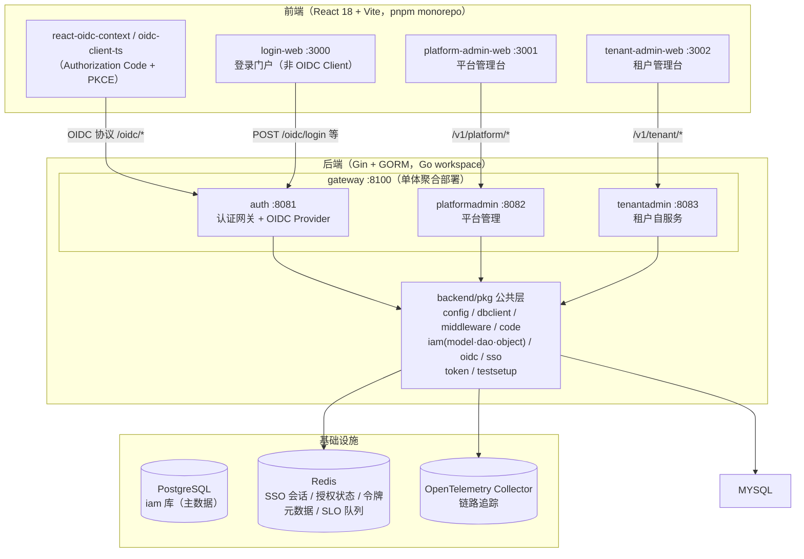

### 2.2 核心设计决策

| 决策 | 理由 |
|---|---|
| **OIDC 标准协议** | 生态成熟、客户端 SDK 丰富、安全机制经实践检验（见 [sso-oidc-concepts.md](sso-oidc-concepts.md)） |
| **OP（auth）与业务 API（RP）分层** | OP 持有中心会话（Redis），RP 无状态校验令牌，实现请求粒度的"登出即失效" |
| **四应用 + 共享 pkg** | 认证 / 平台管理 / 租户自服务按职责拆分；`gateway` 单体聚合便于单进程部署，也支持分体部署 |
| **person + user 两级身份** | person 是跨租户全局身份（用户名/邮箱/手机号全局唯一），user 是租户内成员，天然支持"一人多租户" |
| **JWT Access Token + 短 TTL** | 无状态校验、水平扩展友好；登出失效依赖 SSO 会话活性校验兜底 |
| **Redis 为中心会话存储** | SSO 会话、授权码、令牌元数据、SLO 队列共享同一认证 Redis，支持 auth 多副本 |

### 2.3 应用内部分层

所有业务应用统一采用 **controller → service → dao → model** 分层（`internal/` 目录）：

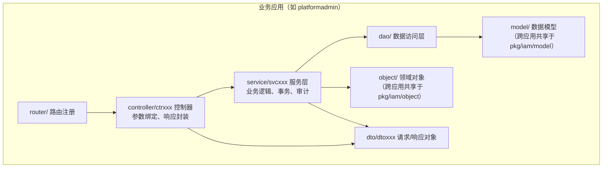

- **跨应用共享**的 model / dao / object 抽到 `pkg/iam`，通用中间件抽到 `pkg/middleware`（含 OIDC 鉴权中间件 `oidcauth`）；
- 服务层依赖接口 + 构造函数注入，控制器统一 `gincontext.Success/Fail` 返回 `{code, msg, data}` 信封；
- 数据库访问基于 GORM，事务用 `dbclient.IamDB(ctx).Transaction(...)` 封装。

---

## 3. 应用划分与技术栈

### 3.1 后端应用

| 应用 | 服务标识 | 独立端口 | 职责 | 主要领域 |
|---|---|---|---|---|
| **auth** | `auth` | 8081 | 认证网关：登录/注册/令牌/OIDC Provider/SSO/SLO/Connector | person、user（成员）、refresh_token、session、connector、user_identity |
| **platformadmin** | `platform` | 8082 | 平台管理：租户/用户/角色/菜单/权限/应用/OAuth 客户端/API Key/域名/系统配置/审计 | tenant、user、role、menu、scope、resource、application、application_client、api_key、domain、department、system |
| **tenantadmin** | `tenant` | 8083 | 租户自服务：组织/组织角色/组织成员/租户菜单 | organization、organization_role、organization_user |
| **gateway** | 聚合 | 8100 | 单体聚合部署，挂载 auth + platformadmin + tenantadmin | 无独立业务 |

> 各应用通过 `ginserver.NewRouterGroups(engine, "<服务标识>", ...)` 注册前缀，业务路由形如 `/v1/{auth|platform|tenant}/...`；OIDC 协议端点固定挂在 `/oidc/*`（R3 专用前缀，不走业务路由规范）。

### 3.2 前端应用

| 应用 | 端口 | 说明 |
|---|---|---|
| login-web | 3000 | 登录门户：凭证登录、多租户选择（非 OIDC Client，直接调用 `/oidc/login`） |
| platform-admin-web | 3001 | 平台管理控制台（OIDC Client，client_id `platform-admin-web`） |
| tenant-admin-web | 3002 | 租户自服务控制台（OIDC Client，client_id `tenant-admin-web`） |

### 3.3 技术栈

| 层 | 技术 |
|---|---|
| 后端框架 | Gin + GORM + Go workspace（`backend/go.work`，5 个模块） |
| OIDC Provider | [zitadel/oidc/v3](https://github.com/zitadel/oidc)（`op` 包） |
| JWT | golang-jwt/jwt/v5（RP 校验）、go-jose（logout_token 签名） |
| 数据库 | PostgreSQL（主库，`iam`，启动时 AutoMigrate 自动建表），测试用 SQLite 内存库 |
| 缓存/会话 | Redis（SSO 会话、授权状态、令牌元数据、SLO 队列） |
| 日志 | golib/glog（zap 内核，全链路 requestID / traceID） |
| 链路追踪 | OpenTelemetry（OTLP gRPC Collector） |
| 前端 | React 18 + TypeScript + Vite 5 + Ant Design 5 + react-oidc-context |
| 测试 | Go 标准 testing + testify；Playwright（e2e） |

---

## 4. 数据库设计

### 4.1 设计原则

- 统一前缀/命名：表名小写下划线，主键 `gorm.Model`（`id/created_at/updated_at/deleted_at`），审计字段 `created_by/updated_by/deleted_by`；
- **person 为中心的跨租户模型**：身份类字段（username/email/phone/password）只放 `person`，`user` 只放租户内成员关系与租户内资料；
- 字典值全部常量定义（如 `application_client.type`、`tenant.type`），禁止硬编码字符串；
- 关联表（多对多）独立建表：`user_role`、`role_menu`、`role_scope`、`organization_user`、`organization_role_user`、`user_department`；
- 令牌/密钥类敏感字段只存**哈希**（`refresh_token.token`、`application_client_secret.value_hash`、`api_key.key_hash`）；
- 空值可空标识字段存 `NULL`（`person.username/primary_email/primary_phone` 均为可空指针，配唯一索引），避免唯一索引撞空串。

### 4.2 ER 图

```mermaid
erDiagram
    tenant ||--o{ user : "1:N 成员"
    person ||--o{ user : "1:N 成员"
    tenant ||--o{ tenant_application : "1:N"
    application ||--o{ tenant_application : "1:N"
    application ||--o{ application_client : "1:N"
    application_client ||--o{ application_client_secret : "1:N"
    tenant ||--o{ organization : "1:N"
    organization ||--o{ organization_role : "1:N"
    organization ||--o{ organization_user : "1:N"
    user ||--o{ organization_user : "1:N"
    organization_role ||--o{ organization_role_user : "1:N"
    user ||--o{ organization_role_user : "1:N"
    tenant ||--o{ department : "1:N"
    user ||--o{ user_department : "1:N"
    department ||--o{ user_department : "1:N"
    tenant ||--o{ role : "1:N"
    application ||--o{ role : "1:N"
    user ||--o{ user_role : "1:N"
    role ||--o{ user_role : "1:N"
    role ||--o{ role_menu : "1:N"
    menu ||--o{ role_menu : "1:N"
    role ||--o{ role_scope : "1:N"
    scope ||--o{ role_scope : "1:N"
    resource ||--o{ scope : "1:N"
    application ||--o{ menu : "1:N"
    tenant ||--o{ menu : "1:N"
    tenant ||--o{ connector : "1:N"
    connector ||--o{ user_identity : "1:N"
    person ||--o{ user_identity : "1:N"
    tenant ||--o{ domain : "1:N"
    tenant ||--o{ api_key : "1:N"
    person ||--o{ refresh_token : "1:N"
    person ||--o{ session : "1:N"
    person ||--o{ user_login_log : "1:N"
    tenant ||--o{ system : "1:N"
    tenant ||--o{ log : "1:N"

    person {
        uint id PK
        string username UK "全局用户名，可空"
        string primary_email UK "主要邮箱，可空"
        string primary_phone UK "主要手机号，可空"
        string password_encrypted "bcrypt 哈希"
        string password_method
        string name "姓名"
        string avatar
        json profile
        json custom_data
        tinyint is_suspended
        datetime last_sign_in_at
    }
    user {
        uint id PK
        uint tenant_id FK
        uint person_id FK
        string name "租户内姓名"
        json profile
        json custom_data
        tinyint is_suspended
        tinyint is_owner "是否租户拥有者"
        datetime joined_at
        datetime last_sign_in_at
    }
    tenant {
        uint id PK
        string code UK "租户编码"
        string name
        string type "customer/platform"
        string db_user
        tinyint is_suspended
        string tag
    }
    application {
        uint id PK
        string code UK "应用编码"
        string name
        string type "first_party/third_party"
        string status "enable/disable"
        string visibility "public/private"
        json tenant_policy "允许个人建租户等策略"
        string homepage_url
        string logo_url
    }
    application_client {
        uint id PK
        uint tenant_id FK
        uint app_id FK
        string client_id UK "OIDC Client ID"
        string name
        json redirect_uris
        json post_logout_redirect_uris
        string back_channel_logout_uri
        json grant_types
        json response_types
        string token_endpoint_auth_method
        json allowed_origins
        tinyint require_pkce
        json default_scopes
        bigint access_token_ttl
        bigint refresh_token_ttl
        string type "first_party/third_party"
        tinyint is_third_party
        string status
        tinyint is_system
    }
    application_client_secret {
        uint id PK
        uint application_client_id FK
        string name
        string value_hash "密钥哈希"
        string value_prefix
        datetime expired_at
        datetime revoked_at
    }
    tenant_application {
        uint id PK
        uint tenant_id FK
        uint app_id FK
        string status
        json config "租户级应用配置"
        json granted_scope "租户级 scope 授权"
    }
    organization {
        uint id PK
        uint tenant_id FK
        string name
        string description
        json custom_data
        tinyint is_mfa_required
    }
    organization_role {
        uint id PK
        uint tenant_id FK
        uint organization_id FK
        string name
        string type
    }
    organization_user {
        uint id PK
        uint tenant_id FK
        uint organization_id FK
        uint user_id FK
    }
    organization_role_user {
        uint id PK
        uint tenant_id FK
        uint organization_id FK
        uint organization_role_id FK
        uint user_id FK
    }
    department {
        uint id PK
        uint tenant_id FK
        string name
        uint parent_id
    }
    user_department {
        uint id PK
        uint tenant_id FK
        uint user_id FK
        uint department_id FK
        tinyint is_primary
    }
    role {
        uint id PK
        uint tenant_id FK
        uint app_id FK
        string name
        string code
        string type "User/Machine"
        tinyint is_default
    }
    menu {
        uint id PK
        uint app_id FK
        uint tenant_id FK "租户菜单时使用"
        uint parent_id
        string name
        string code
        string path
        string icon
        string type
        string component
        string permission
        string status
    }
    scope {
        uint id PK
        uint tenant_id FK
        uint resource_id FK
        string name "权限点"
        string description
    }
    resource {
        uint id PK
        uint tenant_id FK
        string name
        string indicator "资源标识符"
        tinyint is_default
        bigint access_token_ttl
    }
    user_role {
        uint id PK
        uint tenant_id FK
        uint user_id FK
        uint role_id FK
    }
    role_menu {
        uint id PK
        uint tenant_id FK
        uint role_id FK
        uint menu_id FK
    }
    role_scope {
        uint id PK
        uint tenant_id FK
        uint role_id FK
        uint scope_id FK
    }
    connector {
        uint id PK
        uint tenant_id FK
        string name
        string protocol "OIDC/OAuth2"
        string provider
        string status
        tinyint allow_auto_create_user
        tinyint allow_account_link
        tinyint sync_profile
        tinyint enable_token_storage
        json config "连接器配置"
        json claim_mapping "声明映射"
        json domain_policy "域策略"
    }
    user_identity {
        uint id PK
        uint person_id FK
        uint connector_id FK
        string provider
        string issuer
        string external_subject "外部主体标识"
        json detail
        datetime last_used_at
    }
    domain {
        uint id PK
        uint tenant_id FK
        string domain
        tinyint is_verified
    }
    api_key {
        uint id PK
        uint tenant_id FK
        string name
        string key_hash
        string key_prefix
        json scope
        datetime expired_at
        datetime revoked_at
    }
    refresh_token {
        uint id PK
        uint person_id FK
        uint tenant_id FK
        uint user_id FK
        uint application_client_id FK
        string session_id "SSO 会话 ID"
        string token "SHA-256 哈希"
        json scopes
        json amr
        datetime auth_time
        string client_type
        string client_ip
        string user_agent
        datetime expired_at
        datetime revoked_at
        datetime last_rotated_at
    }
    session {
        uint id PK
        uint person_id FK
        string session_id UK
        uint tenant_id FK
        string client_ip
        string user_agent
        datetime login_time
        datetime last_active_at
        datetime revoked_at
        string status "active/revoked"
    }
    user_login_log {
        uint id PK
        uint person_id FK
        uint tenant_id FK
        uint user_id FK
        string login_type "password"
        string login_ip
        string user_agent
        datetime login_time
    }
    audit_log {
        uint id PK
        uint actor_person_id FK
        uint actor_user_id FK
        uint tenant_id FK
        string client_id
        string action "动作标识"
        string target_type
        uint target_id
        string result "success/failure"
        string ip
        string user_agent
        text detail
    }
    system {
        uint id PK
        uint tenant_id FK
        string key "配置键"
        json value "配置值"
    }
    log {
        uint id PK
        uint tenant_id FK
        string key
        json payload
    }
```

### 4.3 表说明（按业务域）

#### 身份域（跨租户）

| 表 | 说明 |
|---|---|
| `person` | **自然人**：全局唯一身份。username / primary_email / primary_phone 可空且全局唯一（NULL 不撞唯一索引）；密码 bcrypt 哈希；`is_suspended` 全局挂起 |
| `user` | **租户成员**：person × tenant 的成员记录；`is_owner` 标记租户拥有者；租户内资料（name/profile/custom_data） |
| `user_identity` | 外部身份关联：person 在外部 IdP（Connector）的身份映射，`external_subject` 为外部主体标识 |
| `user_login_log` | 登录日志：记录每次密码登录的时间/IP/UA/类型 |

#### 租户域

| 表 | 说明 |
|---|---|
| `tenant` | 租户：`type` 分 customer/platform；`code` 全局唯一；`is_suspended` 挂起 |
| `tenant_application` | 租户-应用开通关系：`status` 开通状态、`config` 租户级配置、`granted_scope` 租户级 scope 授权 |
| `domain` | 租户域名（验证状态 `is_verified`） |
| `system` | 租户系统配置（key-value，value 为 JSON） |
| `log` | 租户日志（通用 key-payload） |

#### 组织架构域

| 表 | 说明 |
|---|---|
| `organization` | 组织节点（租户内）；`is_mfa_required` 是否强制 MFA |
| `organization_role` | 组织角色 |
| `organization_user` | 组织-成员关联 |
| `organization_role_user` | 组织角色-成员关联 |
| `department` | 部门（支持 `parent_id` 树） |
| `user_department` | 用户-部门关联（`is_primary` 主部门） |

#### 权限域

| 表 | 说明 |
|---|---|
| `role` | 角色：租户内 + 按应用（`app_id`）作用域；`type` User/Machine；`is_default` 默认角色 |
| `menu` | 菜单：按应用管理（`app_id`），支持树（`parent_id`），租户侧动态菜单（`tenant_id`） |
| `scope` | 权限点：隶属于资源 |
| `resource` | 资源：`indicator` 资源标识符、`access_token_ttl` |
| `user_role` | 用户-角色关联 |
| `role_menu` | 角色-菜单关联（可访问菜单） |
| `role_scope` | 角色-权限点关联 |

#### 应用与客户端域（OIDC）

| 表 | 说明 |
|---|---|
| `application` | 业务应用定义：编码/名称/类型（first_party/third_party）/状态/可见性/`tenant_policy`（如允许个人建租户） |
| `application_client` | **OAuth/OIDC 客户端**：client_id、redirect_uris、grant_types、token_endpoint_auth_method、PKCE、令牌 TTL、是否第三方 |
| `application_client_secret` | 客户端密钥：只存哈希（`value_hash`）+ 前缀（`value_prefix`），支持过期/吊销 |
| `api_key` | API Key：机器凭证，只存哈希，支持 scope/过期/吊销 |

#### 会话与审计域

| 表 | 说明 |
|---|---|
| `refresh_token` | 刷新令牌：SHA-256 哈希存储；还原 scope/amr/auth_time；轮换与吊销字段 |
| `session` | 会话审计：SSO 会话落库记录（`session_id` 唯一、`status` active/revoked） |
| `audit_log` | 操作审计：动作、目标、结果、IP/UA、详情 |

> 注：SSO 会话的**活体数据**存 Redis（`iam:oidc:sso_session:*`、`iam:oidc:sso_user_sessions:*`），`session` 表是审计落库；`refresh_token` 与 `session` 通过 `session_id` 关联。

### 4.4 Redis Key 设计

| Key | 类型 | 说明 |
|---|---|---|
| `iam:oidc:sso_session:<sessionID>` | String | SSO 会话数据（personID、AMR），TTL = sessionTTL（默认 24h） |
| `iam:oidc:sso_user_sessions:<personID>` | Set | 某 person 的全部会话 ID 索引 |
| `iam:oidc:sso_reg:<sessionID>` | Set | 会话级反向通道登出登记（client_id、sid、通知地址），TTL 24h |
| `iam:oidc:slo_queue` | List | 反向通道登出任务 FIFO 队列（LPUSH/BRPOP） |
| `iam:oidc:at:meta:<tokenID>` | String | Access Token 签发元数据（introspection/userinfo 用） |
| `iam:oidc:*`（授权码/请求状态） | String | OIDC 协议状态（zitadel storage 实现） |
| 登录风控计数 | String/计数器 | 登录失败次数/锁定时长（`security.login` 配置） |

---

## 5. 核心业务流程

### 5.1 用户注册（平台自助注册）

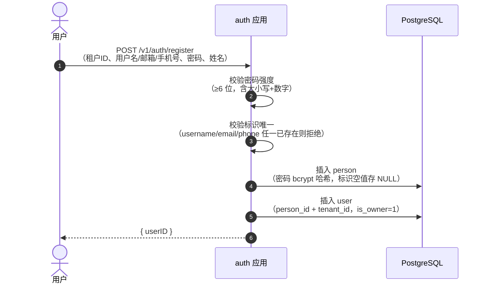

**要点**：注册即成为该租户的**拥有者**（`is_owner=1`）；后续可通过 `POST /v1/auth/joinTenant` 加入其他租户。

### 5.2 密码登录（OIDC 授权码流程中的认证环节）

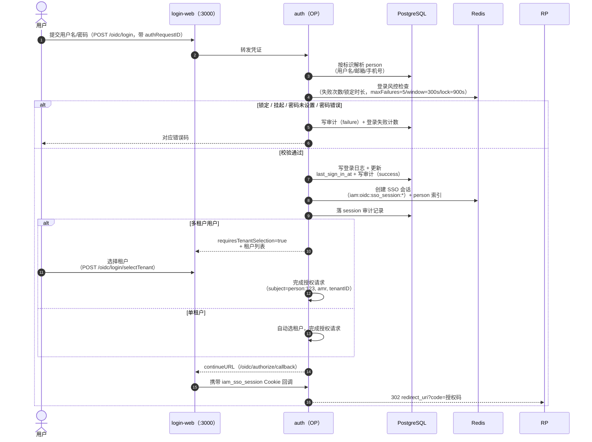

### 5.3 免密续登（SSO）

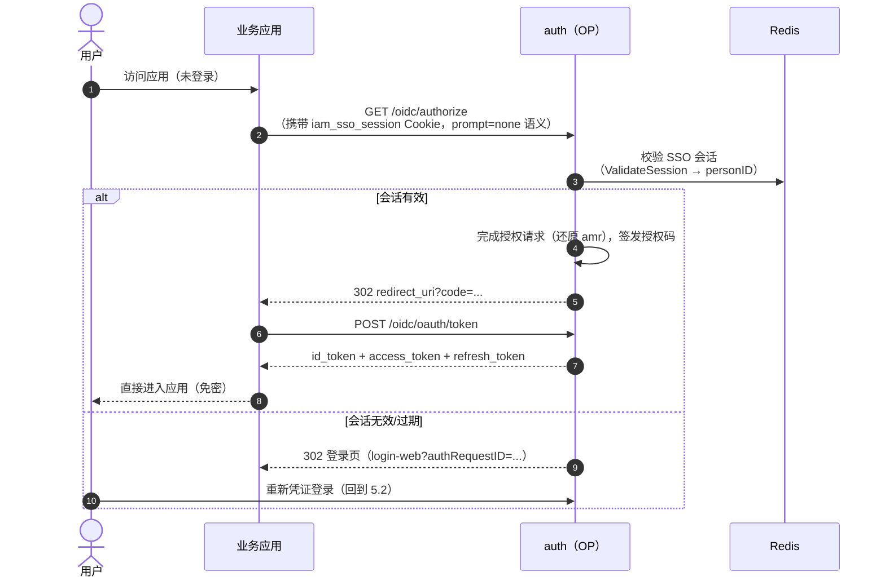

### 5.4 令牌签发与校验（RP 侧）

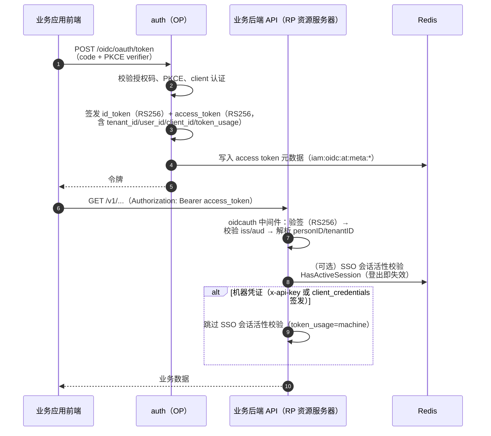

### 5.5 登出与全局登出（SLO）

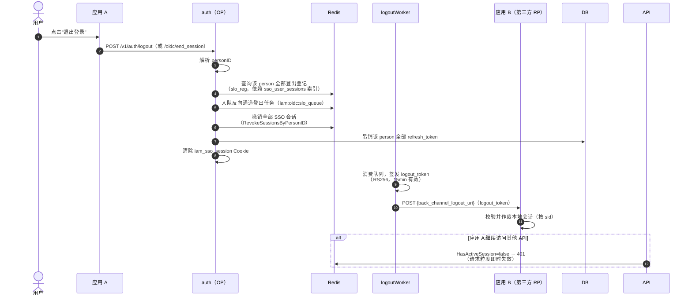

### 5.6 API Key（机器凭证）鉴权

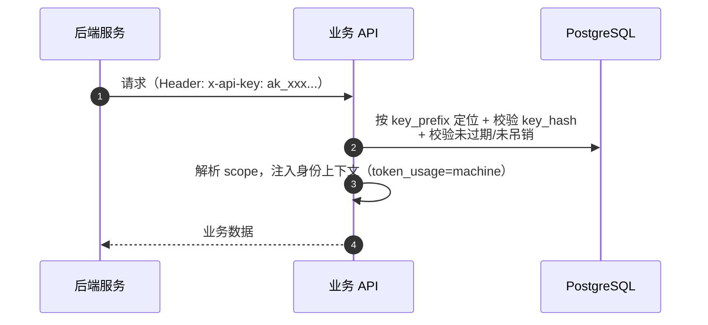

### 5.7 Connector 外部身份源登录（OIDC/OAuth2 IdP）

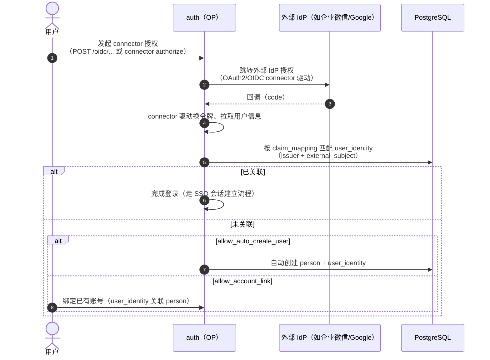

---

## 6. 新应用接入流程

新业务应用接入 Ark IAM 的总体流程（详细实操见 [application-integration-guide.md](application-integration-guide.md)）：

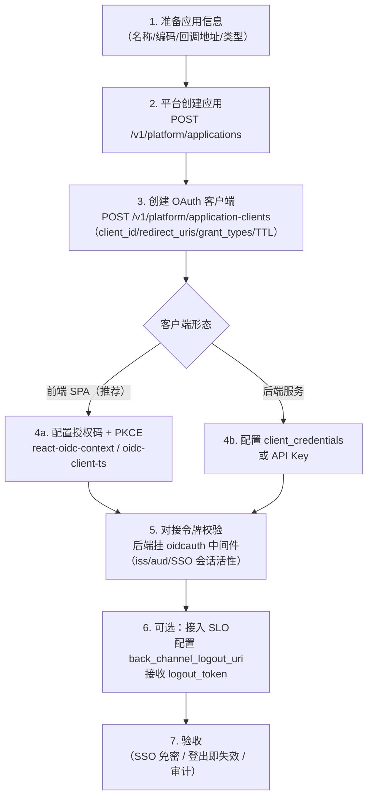

| 步骤 | 说明 | 关键接口 |
|---|---|---|
| 1. 应用定义 | 应用编码全局唯一，`first_party` 或 `third_party` | `application` 表 |
| 2. 创建应用 | 平台管理员创建应用并配置租户策略 | `POST /v1/platform/applications` |
| 3. 创建客户端 | 一个应用可多个客户端（多端/多环境），**redirect_uri 必须精确白名单** | `POST /v1/platform/application-clients` |
| 4. 前端接入 | Authorization Code + PKCE，`state`/`nonce` 由 SDK 处理 | `/oidc/*` 端点 |
| 5. 后端校验 | `oidcauth.OIDCCompatibleAuth` 中间件：验签 + iss/aud + SSO 会话活性 | `pkg/middleware/oidcauth` |
| 6. 单点登出 | 配置 `back_channel_logout_uri` 接收 logout_token | `POST /oidc/bc-logout` |
| 7. 验收 | 跨应用免密、一处登出处处登出、审计可查 | - |

---

## 7. 安全设计

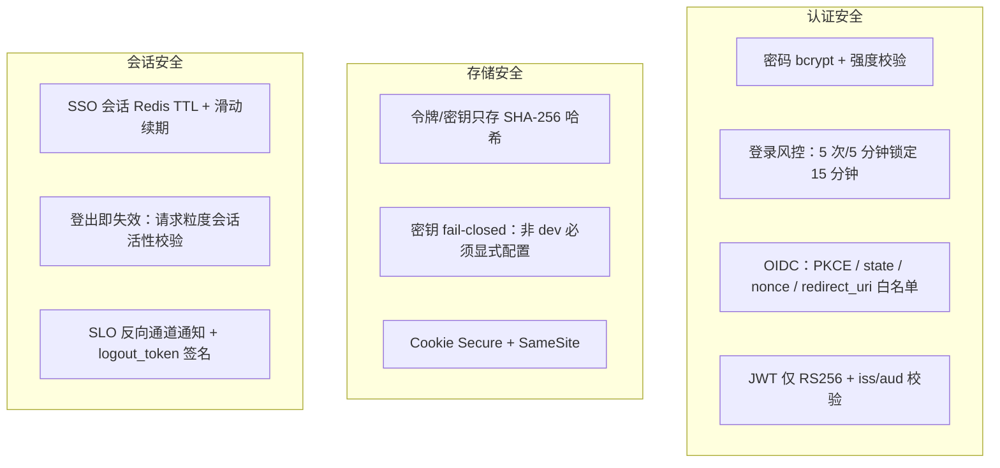

| 领域 | 措施 |
|---|---|
| 凭证 | bcrypt 存储；注册密码强度校验（≥6 位且含大小写+数字）；登录风控（`security.login`：5 次失败/300s 窗口/锁定 900s） |
| 协议 | 授权码 + PKCE（S256）；state 防 CSRF；nonce 防重放；redirect_uri 精确白名单；token 端点 client 认证（basic/post/none） |
| 令牌 | 仅 RS256；RP 校验 `iss`/`aud`；Access Token 短 TTL；Refresh Token 哈希存储 + 轮换 + 按 person 吊销；ID Token 10min |
| 密钥 | 签名/加密密钥生产 fail-closed（未配置直接启动失败）；dev 自动生成临时密钥 |
| 会话 | SSO Cookie `iam_sso_session`（SameSite 默认 Lax，生产 Secure）；Redis 会话 TTL + 活跃续期；登出撤销全部会话与刷新令牌 |
| 审计 | 登录成功/失败、租户切换、操作动作全量写 `audit_log`；登录写 `user_login_log` |
| 中间件 | `oidcauth`：无 token 401、API Key 通道独立（`x-api-key`）、机器凭证豁免 SSO 会话活性校验 |

---

## 8. 演进方向

- **组织架构增强**：部门/组织与角色联动、批量导入导出；
- **更多授权类型**：`urn:ietf:params:oauth:grant-type:token-exchange`、jwt-bearer（当前显式拒绝，避免虚假宣称）；
- **MFA**：基于 `organization.is_mfa_required` 的 TOTP/短信二次认证；
- **SCIM 供给**：租户→应用的用户供给协议；
- **细粒度授权**：资源级（`resource`/`scope`）的 ABAC 策略引擎；
- **auth 高可用**：共享认证 Redis 已支持多副本，后续补会话一致性看护与优雅降级；
- **前端登录页自定义**：login-web 品牌化、多主题。

---

## 附：文档地图

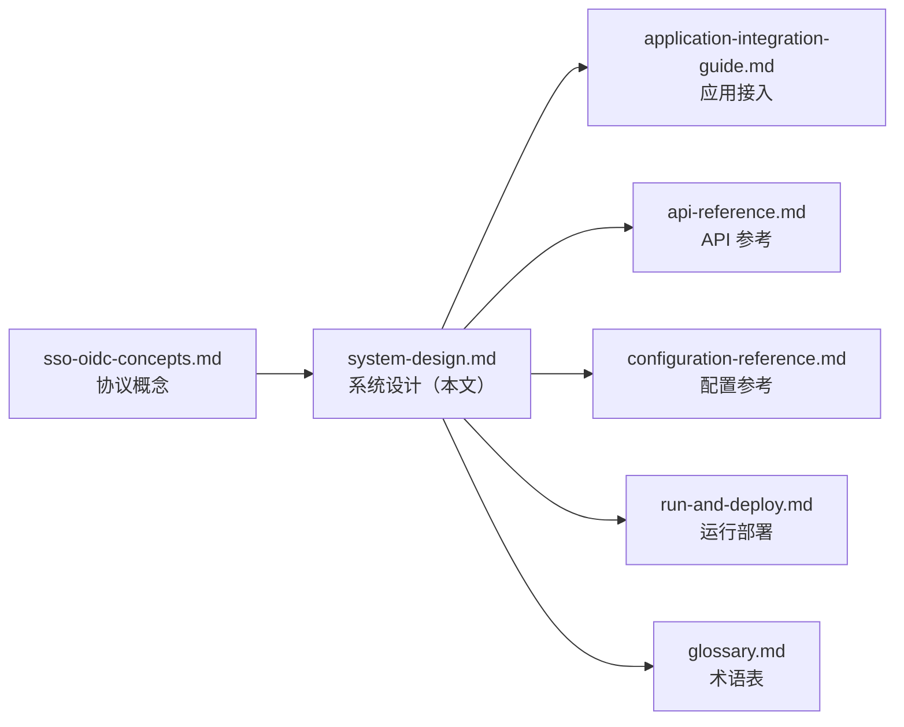
