# Ark IAM 系统设计文档

> 本文是 Ark IAM（统一身份认证与访问管理服务）的总体设计文档，涵盖：背景与目标、总体架构、应用划分、技术栈、数据库设计、核心业务流程、新应用接入流程、安全设计与演进方向。
>
> 配套阅读：[sso-oidc-concepts.md](sso-oidc-concepts.md)（SSO/OIDC 协议概念）、[api-reference.md](api-reference.md)（API 清单）、[application-integration-guide.md](application-integration-guide.md)（应用接入实操）、[configuration-reference.md](configuration-reference.md)（配置）。

---

## 目录

1. [背景与目标](#1-背景与目标)
2. [总体架构](#2-总体架构)
3. [应用划分与技术栈](#3-应用划分与技术栈)
4. [数据库设计](#4-数据库设计)
5. [核心业务流程](#5-核心业务流程)
6. [新应用接入流程](#6-新应用接入流程)
7. [安全设计](#7-安全设计)
8. [演进方向](#8-演进方向)

---

## 1. 背景与目标

### 1.1 背景

企业内存在多个独立系统（管理平台、租户自服务平台、业务应用等），传统做法是各系统**各自维护账号体系**，带来一系列问题：

- **体验差**：用户在多个系统重复注册、重复登录、重复修改密码；
- **不安全**：口令散落在各系统，密码策略不统一，缺乏集中审计与风控；
- **难治理**：员工离职/调岗时，难以在多个系统同步禁用账号；
- **无法扩展**：新增一个应用就要重新实现一套认证逻辑。

因此需要建设一个**统一身份认证中心（IAM）**，收敛认证与身份治理能力，各业务应用通过标准协议接入。

### 1.2 目标

| 目标 | 说明 |
|---|---|
| **统一认证（SSO）** | 基于 OIDC 标准协议，一次登录、处处通行 |
| **多租户隔离** | 支持多个客户租户，数据与权限按租户隔离 |
| **多应用管理** | 平台统一管理应用、OAuth 客户端、令牌策略 |
| **统一身份模型** | 自然人（跨租户）与租户成员（租户内）两级身份 |
| **统一权限模型** | 角色（Role）— 菜单（Menu）；资源级 scope 授权不由 IAM 承载（业务权限点归业务应用，见 §8） |
| **统一登出（SLO）** | 一处登出、处处登出，含标准 Back-Channel Logout |
| **机器凭证** | 支持 API Key / client_credentials 的服务间认证 |
| **可审计** | 登录日志、操作审计日志统一落库 |
| **可扩展** | 支持接入外部身份源（Connector）与第三方应用 |

### 1.3 非目标（当前版本）

- 不做细粒度数据级权限（IAM 只到「角色—菜单」粒度，业务侧细粒度鉴权由业务应用自行实现）；
- 不做完整的 SCIM 用户供给协议（Connector 支持 OIDC/OAuth2 身份源登录）；
- 不做部门架构审批流等 OA 能力。

---

## 2. 总体架构

### 2.1 架构总览

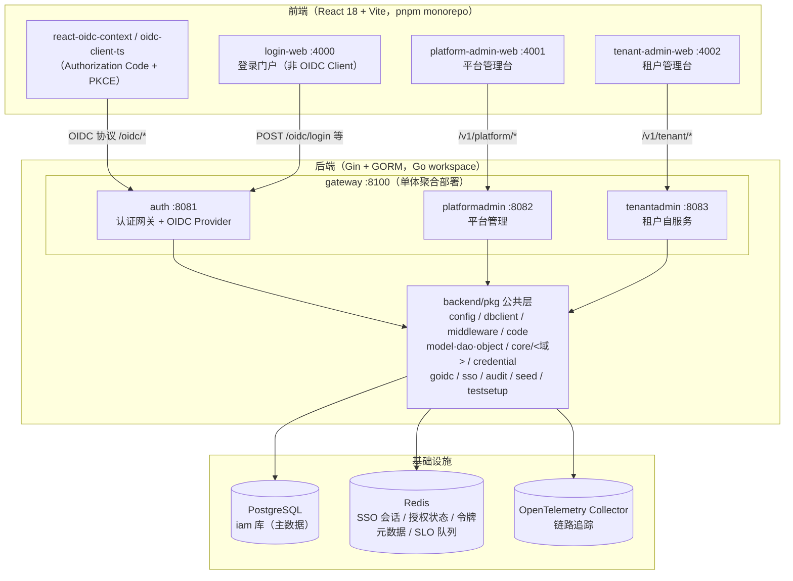

### 2.2 核心设计决策

| 决策 | 理由 |
|---|---|
| **OIDC 标准协议** | 生态成熟、客户端 SDK 丰富、安全机制经实践检验（见 [sso-oidc-concepts.md](sso-oidc-concepts.md)） |
| **OP（auth）与业务 API（RP）分层** | OP 持有中心会话（Redis），RP 无状态校验令牌，实现请求粒度的"登出即失效" |
| **四应用 + 共享 pkg** | 认证 / 平台管理 / 租户自服务按职责拆分；`gateway` 单体聚合便于单进程部署，也支持分体部署 |
| **person + user 两级身份** | person 是跨租户全局身份（用户名/邮箱/手机号全局唯一），user 是租户内成员，天然支持"一人多租户" |
| **JWT Access Token + 短 TTL** | 无状态校验、水平扩展友好；登出失效依赖 SSO 会话活性校验兜底 |
| **Redis 为中心会话存储** | SSO 会话、授权码、令牌元数据、SLO 队列共享同一认证 Redis，支持 auth 多副本 |

### 2.3 应用内部分层

所有业务应用统一采用 **controller → service →（core）→ dao → model** 分层（`internal/` 目录）：

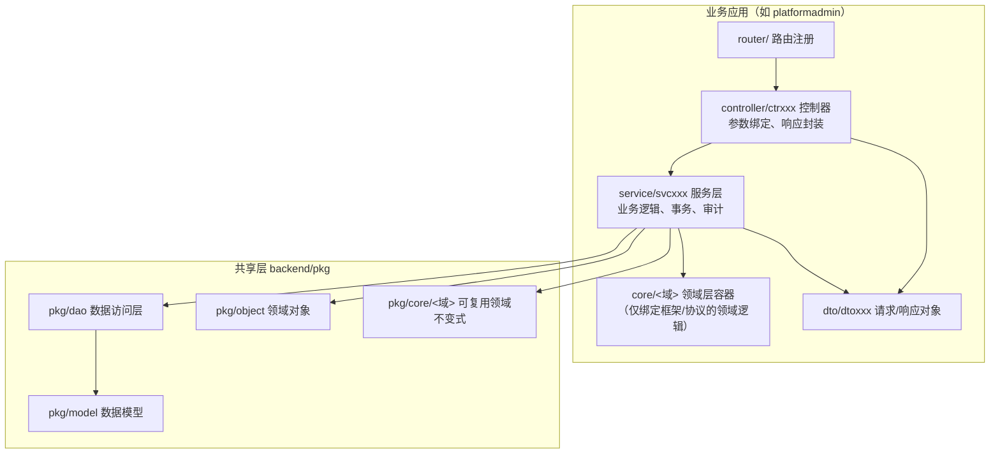

> `dao/`、`model/`、`object/` **不在应用内**：跨应用共享的实体 / 访问器 / 对象统一在 `pkg/dao`、`pkg/model`、`pkg/object`（模块路径已表达域名，不再套业务域容器）。

- **领域层容器**：绑定框架/协议的领域逻辑放应用内 `internal/core/<域>`（当前仅 auth 的 `internal/core/oidcop`——OP 侧 `op.Storage` 适配 / 协议态 / 持久化 / 客户端适配）；可复用的领域不变式下沉 `pkg/core/<域>`（当前 `person`/`user`/`tenant`/`menu`/`application`），与 `internal/core/<域>` 对称。`core` 只承载领域逻辑，禁止放工具与辅助代码。
- **基础能力**：凭证（口令强度 / 临时口令 / API Key·client secret·refresh token 的生成与摘要）统一在 `pkg/credential`（全系统只允许一份摘要实现）；OIDC 鉴权中间件在 `pkg/middleware/oidc_auth.go`；RP 侧 back-channel logout 接收端在 `pkg/goidc`；种子初始化在 `pkg/seed`；操作审计在 `pkg/audit`；
- 服务层依赖接口 + 构造函数注入，控制器统一 `gincontext.Success/Fail` 返回 `{code, requestID, msg, data}` 信封；
- 数据库访问基于 GORM，事务用 `dbclient.IamDB(ctx).Transaction(...)` 封装。

---

## 3. 应用划分与技术栈

### 3.1 后端应用

| 应用 | 服务标识 | 独立端口 | 职责 | 主要领域 |
|---|---|---|---|---|
| **auth** | `auth` | 8081 | 认证网关：登录 / 注册 / 令牌 / OIDC Provider / SSO / SLO / Connector；自助注册与建租户收口在 `/oidc/registerPerson` + `/oidc/createTenant` | person、tenant_user（成员）、tenant_invite、refresh_token、session、connector、user_identity |
| **platformadmin** | `platform` | 8082 | 平台管理：租户（建租户时自动创建内置管理员、可重置其口令）/ 菜单 / 应用 / OAuth 客户端 / 域名 / 租户应用 / 审计；**不提供 users / roles / api-keys 接口**（用户与角色管理全在租户端） | tenant、menu、application、application_client、domain、tenant_application、audit_log |
| **tenantadmin** | `tenant` | 8083 | 租户自服务：部门架构 / 用户与角色 / 服务账号 / 加入邀请 / API 密钥 / 租户菜单 | department、department_user、tenant_user、tenant_invite、role、api_key |
| **gateway** | 聚合 | 8100 | 单体聚合部署，挂载 auth + platformadmin + tenantadmin；部署为 gateway 时 OIDC issuer 同步切到 `http://localhost:8100/oidc` | 无独立业务 |

> 各应用通过 `ginserver.NewRouterGroups(engine, "<服务标识>", ...)` 注册前缀，业务路由形如 `/v1/{auth|platform|tenant}/...`；OIDC 协议端点固定挂在 `/oidc/*`（R3 专用前缀，不走业务路由规范）。

### 3.2 前端应用

| 应用 | 端口 | 说明 |
|---|---|---|
| login-web | 4000 | 登录门户：凭证登录、首次改密、自助注册/建租户、多租户选择（非 OIDC Client，直接调用 `/oidc/login` 等端点） |
| platform-admin-web | 4001 | 平台管理后台（OIDC Client，client_id `platform_admin_web`，public + PKCE） |
| tenant-admin-web | 4002 | 租户管理后台（OIDC Client，client_id `tenant_admin_web`，public + PKCE） |

前端为 pnpm monorepo：`packages/{types,api,auth,ui}` 为共享包（`@ark-iam/ui` 提供设计令牌与共享组件，令牌事实源是 `frontend/packages/ui/src/theme.ts` 的 `tokens`），业务页面一律复用共享组件、禁止硬编码色值；视觉规范见 `frontend/DESIGN.md`。

### 3.3 技术栈

| 层 | 技术 |
|---|---|
| 后端框架 | Gin + GORM + Go workspace（`backend/go.work`，5 个模块） |
| OIDC Provider | [zitadel/oidc/v3](https://github.com/zitadel/oidc)（`op` 包） |
| JWT | golang-jwt/jwt/v5（RP 校验）、go-jose（logout_token 签名） |
| 数据库 | PostgreSQL（主库，`iam`，启动时 AutoMigrate 自动建表），测试用 SQLite 内存库 |
| 缓存/会话 | Redis（SSO 会话、授权状态、令牌元数据、SLO 队列） |
| 日志 | golib/glog（zap 内核，全链路 requestID / traceID） |
| 链路追踪 | OpenTelemetry（OTLP gRPC Collector） |
| 前端 | React 18 + TypeScript + Vite 5 + Ant Design 5 + react-oidc-context |
| 测试 | Go 标准 testing + testify；Playwright（e2e） |

---

## 4. 数据库设计

### 4.1 设计原则

- 统一前缀/命名：表名小写下划线；主键统一 `gormdao.BaseEntity.StringID`——`varchar(36)` **UUID v7**（时间有序，由 `BaseEntity` 自动生成，DTO 侧一律 `string`），审计字段 `created_by/updated_by/deleted_by`；
- **person 为中心的跨租户模型**：身份类字段（username/email/phone/password）只放 `person`，`user`（物理表 `tenant_user`）只放租户内成员关系与租户内资料；
- **字典值全部声明为具名类型 + 常量**（如 `TenantStatus`、`AppSource`、`RoleSource`、`AdminType`、`DeptUserRelationType`），实体/DAO/DTO/service 全链路复用该类型与常量，禁止硬编码字符串与 `string(x)` 强转；非法取值校验归 service 入口；
- 关联表（多对多）独立建表：`user_role`、`role_menu`、`department_user`；
- 令牌/密钥类敏感字段只存**哈希**（`refresh_token.token`、`application_client_secret.value_hash`、`api_key.key_hash`）；
- 空值可空标识字段存 `NULL`（`person.username/primary_email/primary_phone` 均为可空指针，配唯一索引），避免唯一索引撞空串；
- **Schema 按新项目处理**：`AutoMigrate` 只新增缺失的表/列/索引，**不删不改**既有结构；列/表下线即彻底删代码，旧库残留列属预期，处置方式是删库重建（见 §4.5、[run-and-deploy.md](run-and-deploy.md)）。

### 4.2 ER 图

> 所有表主键统一为 `varchar(36)` UUID v7（`gormdao.BaseEntity.StringID`），下图不再逐表标注类型细节；`created_by/updated_by/deleted_by` 与 `created_at/updated_at/deleted_at` 为所有表共有的审计字段，图中省略。`tenant_user.user_id` 与 `department_user.user_id`、`user_role.user_id`、`api_key.owner_user_id` 指向的都是 `tenant_user`。

```mermaid
erDiagram
    tenant ||--o{ tenant_user : "1:N 成员"
    person ||--o{ tenant_user : "1:N 成员"
    tenant ||--o{ tenant_invite : "1:N 加入邀请"
    tenant ||--o{ tenant_application : "1:N 开通"
    application ||--o{ tenant_application : "1:N"
    application ||--o{ application_client : "1:N"
    application_client ||--o{ application_client_secret : "1:N"
    tenant ||--o{ department : "1:N 部门树(parent_id 自引用)"
    department ||--o{ department_user : "1:N 关系(primary/secondary/leader)"
    tenant_user ||--o{ department_user : "1:N"
    tenant ||--o{ role : "1:N"
    application ||--o{ role : "1:N 作用域"
    tenant_user ||--o{ user_role : "1:N"
    role ||--o{ user_role : "1:N"
    role ||--o{ role_menu : "1:N"
    menu ||--o{ role_menu : "1:N"
    application ||--o{ menu : "1:N"
    tenant ||--o{ connector : "1:N"
    connector ||--o{ user_identity : "1:N"
    person ||--o{ user_identity : "1:N"
    tenant ||--o{ domain : "1:N"
    tenant ||--o{ api_key : "1:N"
    tenant_user ||--o{ api_key : "1:N 归属主体"
    person ||--o{ refresh_token : "1:N"
    person ||--o{ session : "1:N"
    person ||--o{ user_login_log : "1:N"
    tenant ||--o{ log : "1:N"

    tenant {
        string id PK "UUID v7"
        string code UK "租户编码 t_<12位hex>，服务端生成，创建后不可改"
        string name
        string type "customer 客户 / platform 平台（分类标识，不参与隔离判定）"
        string status "active 正常 / suspended 已挂起"
        string tag
        string db_user
    }
    person {
        string id PK "UUID v7"
        string username UK "全局用户名，可空"
        string primary_email UK "主要邮箱，可空"
        string primary_phone UK "主要手机号，可空"
        string password_encrypted "bcrypt 哈希"
        string password_method "bcrypt"
        bool must_change_password "临时密码/被重置后必须先改密"
        string name "姓名"
        string avatar
        json profile
        json custom_data
        bool is_suspended "全局挂起"
        datetime last_sign_in_at
    }
    tenant_user {
        string id PK "UUID v7（领域实体 UserEntity，物理表名 tenant_user：user 为 PG 保留字）"
        string tenant_id FK
        string person_id FK "服务账号(machine)恒空"
        string user_type "member 真实用户 / machine 服务账号"
        string source "builtin 内置 / manual 手动"
        string name "租户内姓名 / 服务账号名称"
        string description "描述(服务账号用途等)"
        string avatar
        json profile
        json custom_data
        bool is_suspended
        bool is_owner "是否租户拥有者"
        datetime joined_at
        datetime last_sign_in_at
    }
    tenant_invite {
        string id PK "UUID v7"
        string tenant_id FK
        string code "邀请码"
        string status "pending/accepted/revoked"
        datetime expires_at "空为永久"
    }
    application {
        string id PK "UUID v7"
        string code UK "应用编码（可改）"
        string seed_key "种子身份键（内置应用；控制台不可见不可写）"
        string name
        string description
        string logo_url
        string homepage_url
        string source "builtin/first_party/third_party"
        string status "enable/disable"
        int sort
        bool allow_person_create_tenant "允许个人自助建租户"
        bool allow_join_by_invite "允许凭邀请加入"
        json role_template "应用角色模板：[{code,name}]，开通应用时物化到各租户"
    }
    application_client {
        string id PK "UUID v7"
        string tenant_id FK
        string app_id FK
        string code UK "= OIDC client_id（仅小写字母与下划线，创建时必填）"
        string name
        json redirect_uris
        json post_logout_redirect_uris
        string back_channel_logout_uri
        json grant_types
        json response_types
        string token_endpoint_auth_method "client_secret_basic/client_secret_post/none"
        json allowed_origins
        bool require_pkce
        bool require_auth_time
        json default_scopes
        bigint access_token_ttl "秒"
        bigint refresh_token_ttl "秒"
        string source "builtin/first_party/third_party"
        string status "enable/disable"
    }
    application_client_secret {
        string id PK "UUID v7"
        string application_client_id FK
        string name
        string value_hash "密钥哈希"
        string value_prefix
        datetime expired_at
        datetime revoked_at
    }
    tenant_application {
        string id PK "UUID v7"
        string tenant_id FK
        string app_id FK
        string status "enable/disable"
        json config "租户级应用配置"
        json granted_scope "租户级 scope 授权"
    }
    department {
        string id PK "UUID v7"
        string tenant_id FK
        string parent_id "父节点(空为根)"
        string dept_path "祖先链(含自身)"
        int dept_depth "深度(根=1)"
        string name "部门仅有名称，无业务编码"
        int sort
        string status "enable/disable"
    }
    department_user {
        string id PK "UUID v7"
        string tenant_id FK
        string department_id FK
        string user_id FK
        string relation_type "primary/secondary/leader"
    }
    role {
        string id PK "UUID v7"
        string tenant_id FK
        string app_id FK "作用域：租户内按应用"
        string code "跨系统授权契约值（OIDC groups 取值）；仅产品锚点与应用角色模板物化的角色非空"
        string name "应用内唯一"
        string description
        string source "builtin 内置 / custom 自定义"
        string admin_type "admin 管理员 / normal 普通"
    }
    menu {
        string id PK "UUID v7"
        string app_id FK "归属应用（可改；种子按 seed_key 认行）"
        string parent_id
        string name
        string code "菜单编码（可改）"
        string seed_key "种子身份键（内置菜单；控制台不可见不可写）"
        string path
        string icon
        int sort
        string type "directory/menu/button"
        string visibility "public/member/admin"
        string component
        string redirect
        bool hidden
        bool external_link
        bool keep_alive
        string status "enable/disable"
    }
    user_role {
        string id PK "UUID v7"
        string tenant_id FK
        string user_id FK
        string role_id FK
    }
    role_menu {
        string id PK "UUID v7"
        string tenant_id FK
        string role_id FK
        string menu_id FK
    }
    connector {
        string id PK "UUID v7"
        string tenant_id FK
        string name
        string display_name
        string protocol "OIDC/OAuth2"
        string provider
        string status "enable/disable"
        bool allow_auto_create_user
        bool allow_account_link
        bool sync_profile
        bool enable_token_storage
        json config "连接器配置"
        json claim_mapping "声明映射"
        json domain_policy "域策略"
    }
    user_identity {
        string id PK "UUID v7"
        string person_id FK
        string connector_id FK
        string provider
        string issuer
        string external_subject "外部主体标识"
        json detail
        datetime last_used_at
    }
    domain {
        string id PK "UUID v7"
        string tenant_id FK
        string domain
        bool is_verified
        datetime verified_at
    }
    api_key {
        string id PK "UUID v7"
        string tenant_id FK
        string owner_user_id FK "归属主体：服务账号(machine)，少数历史数据为真实用户"
        string name
        string key_hash "SHA-256 哈希"
        string key_prefix "明文前 7 位，仅列表展示"
        json scope
        datetime expired_at
        datetime last_used_at
        datetime revoked_at
    }
    refresh_token {
        string id PK "UUID v7"
        string person_id FK
        string tenant_id FK
        string user_id FK
        string application_client_id FK
        string session_id "SSO 会话 ID"
        string token "SHA-256 哈希"
        json scopes
        json amr "认证方法引用"
        datetime auth_time "原始认证时间"
        string client_type
        string client_ip
        string user_agent
        datetime expired_at
        datetime revoked_at
        datetime last_rotated_at
    }
    session {
        string id PK "UUID v7（只追加审计表，无状态流转）"
        string person_id FK
        string session_id UK
        string tenant_id FK
        string client_ip
        string user_agent
        datetime login_time
    }
    user_login_log {
        string id PK "UUID v7"
        string person_id FK
        string tenant_id FK
        string user_id FK
        string login_type "password 等"
        string login_ip
        string user_agent
        datetime login_time
    }
    audit_log {
        string id PK "UUID v7"
        string actor_person_id FK
        string actor_user_id FK
        string tenant_id FK
        string client_id
        string action "动作标识（model.AuditAction*）"
        string target_type
        string target_id
        string result "success/failure"
        string ip
        string user_agent
        text detail
    }
    log {
        string id PK "UUID v7"
        string tenant_id FK
        string key "日志键"
        json payload "日志内容"
    }
```

### 4.3 表说明（按业务域）

#### 身份域（跨租户）

| 表 | 说明 |
|---|---|
| `person` | **自然人**：全局唯一身份。username / primary_email / primary_phone 可空且全局唯一（NULL 不撞唯一索引）；密码 bcrypt 哈希；`must_change_password` 标识"临时密码 / 被重置后必须先改密"（登录链路据此拦截）；`is_suspended` 全局挂起 |
| `tenant_user` | **租户账号**（领域实体 `UserEntity`，物理表名 `tenant_user`：`user` 是 PG 保留字）：member=真实用户（person × tenant 成员记录，可登录/入部门）；machine=服务账号（`person_id` 恒空，不可登录/无自然人/不可任部门负责人，但**从属部门**：主部门 primary 必填 + 参与部门 secondary 可多条，仅作角色主体与 API Key 归属）；`source` 区分 builtin（随租户创建由系统生成：平台建租户的管理员 / 自助开通租户的 owner / 种子管理员）与 manual；`is_owner` 仅真实用户可持有；租户内资料（name/description/avatar/profile/custom_data） |
| `user_identity` | 外部身份关联：person 在外部 IdP（Connector）的身份映射，`external_subject` 为外部主体标识 |
| `user_login_log` | 登录日志：记录每次登录的时间/IP/UA/类型 |

#### 租户域

| 表 | 说明 |
|---|---|
| `tenant` | 租户：`type` 分 customer/platform（分类标识，不参与隔离判定）；`code` 全局唯一且由服务端自动生成（`t_<12 位随机 hex>`，平台租户种子固定为 `t_platform`，创建后不可改）；`status` 生命周期状态（active/suspended，取代早期 `is_suspended`） |
| `tenant_invite` | 加入邀请：通道 B 的凭据，`code` 邀请码 + `status`（pending/accepted/revoked）+ 可空 `expires_at` |
| `tenant_application` | 租户-应用开通关系：`status` 开通状态、`config` 租户级配置、`granted_scope` 租户级 scope 授权 |
| `domain` | 租户域名：`is_verified` + `verified_at`（当前仅平台端录入与管理，登录链路尚未按域名识别租户） |
| `log` | 租户日志（通用 key-payload） |

#### 部门架构域

| 表 | 说明 |
|---|---|
| `department` | 部门树节点（租户内用户容器）：`parent_id` 树 + `dept_path`/`dept_depth` 物化路径，`status` 启停用。**部门只有名称、无业务编码**（`department.code` 已彻底下线） |
| `department_user` | 部门关系（多态）：`relation_type` 强类型枚举 primary/secondary/leader（primary 行政主部门至多 1 行/用户，无 is_primary） |

#### 权限域

| 表 | 说明 |
|---|---|
| `role` | 角色：租户内 + 按应用（`app_id`）作用域；`source` builtin/custom；`admin_type` admin/normal 是系统管理能力标签（**内置角色整体只读**：禁删、禁编辑——名称/描述/编码一律不可改）。`code` 是**跨系统授权契约值**（`^[a-z][a-z0-9_]*$`）：它是 OIDC ID token `groups` 声明的取值，下游系统按「前缀 + 编码」认自己的策略名（如对象存储 `claim_prefix=iam_` → 策略 `iam_platform_admin`）。**编码只有两个来源，租户侧没有任何写入入口**：① 产品锚点角色（`platform_admin`/`tenant_admin`，`source=builtin && admin_type=admin`，随种子/建租户产生）；② **应用角色模板**（`application.role_template`，开通应用时物化到该租户，`source=builtin && admin_type=normal`）。**租户自建角色（`source=custom`）的 `code` 恒为空串、不进入 `groups` 声明**——下游策略是全局命名实体（策略名 = `claim_prefix` + 编码，全租户共用一条、无映射表可回查），若允许租户写编码，任何租户管理员都能造出一个撞上既有策略的编码从而自提权；把契约值收归应用方定义后，「定义值的人」与「在下游供给策略的人」是同一主体，不再需要保留字护栏。**该声明只下发给「本角色所属应用的客户端」**（作用域键 = `application_client.app_id`，见 §5.4）：下游只认自己那个应用的编码，跨应用的角色不会进入其策略命名空间；反之若按租户全量下发，在无关应用里造一个同码角色即可命中下游策略（跨应用越权）。**无 `type`、无 `is_default`** |
| `menu` | 菜单：按应用管理（`app_id`），支持树（`parent_id`）；`type` directory/menu/button；`visibility` public/member/admin 为可见性门槛；`seed_key` 为种子身份键（控制台不可见不可写）。**顺序由 `sort` 唯一决定**（升序，同值按 `code`，见 `pkg/dao.MenuOrderBySort`）：所有面向界面的菜单查询（两端侧边栏、角色授权树、菜单管理树/列表）都必须显式 ORDER BY，缺省顺序数据库不保证、控制台改排序会看不到效果。**无 `tenant_id`、无 `permission`** |
| `user_role` | 用户-角色关联 |
| `role_menu` | 角色-菜单关联（可访问菜单） |

> 业务权限点不由 IAM 承载：`scope` / `resource` / `role_scope` 三张表与 `system`（冗余配置）模块**已整体下线**，`AutoMigrate` 不再创建，代码全仓零残留。

#### 应用与客户端域（OIDC）

| 表 | 说明 |
|---|---|
| `application` | 业务应用定义：编码/名称/描述/来源（`source`：builtin/first_party/third_party）/状态/排序/两个**入口策略**布尔位（`allow_person_create_tenant` 通道 A、`allow_join_by_invite` 通道 B；NULL 与 false 同义，判定见 §5.1）/`seed_key`（内置应用的种子身份键）/`role_template`（**应用角色模板**：`[{code,name}]`，本应用对外的契约角色清单，见 §5.4；平台侧维护，`create_only`）。控制台只能创建 `third_party` |
| `application_client` | **OAuth/OIDC 客户端**：`code` 即 `client_id`（创建时必填，`^[a-z][a-z_]*$`：小写字母开头，仅小写字母与下划线）、`app_id` 归属、redirect_uris / post_logout_redirect_uris、grant_types、token_endpoint_auth_method、PKCE、令牌 TTL、来源（`source`） |
| `application_client_secret` | 客户端密钥：只存哈希（`value_hash`）+ 前缀（`value_prefix`），支持过期/吊销 |
| `api_key` | API Key 机器凭证：只存哈希（`key_hash`）+ 前缀（`key_prefix`，明文前 7 位，仅列表展示），支持 scope/过期/吊销；`owner_user_id` 归属**服务账号**（个人密钥能力已下线，历史 member 数据兼容展示），鉴权按归属服务账号注入身份；明文仅创建时展示一次，管理在租户端（需系统管理能力） |

#### 会话与审计域

| 表 | 说明 |
|---|---|
| `refresh_token` | 刷新令牌：SHA-256 哈希存储；还原 scope/amr/auth_time；轮换与吊销字段 |
| `session` | 会话审计：SSO 会话落库记录（`session_id` 唯一）。**只追加、无状态列**——撤销时间由 `refresh_token.revoked_at` 承担 |
| `audit_log` | 操作审计：动作、目标、结果、IP/UA、详情 |

> 注：SSO 会话的**活体数据**存 Redis（`iam:oidc:sso_session:*`、`iam:oidc:sso_user_sessions:*`），`session` 表是审计落库；`refresh_token` 与 `session` 通过 `session_id` 关联。

### 4.4 Redis Key 设计

| Key | 类型 | 说明 |
|---|---|---|
| `iam:oidc:sso_session:<sessionID>` | String | SSO 会话数据（personID、AMR），TTL = sessionTTL（默认 24h） |
| `iam:oidc:sso_user_sessions:<personID>` | Set | 某 person 的全部会话 ID 索引 |
| `iam:oidc:slo_reg:<sessionID>` | Set | 会话级反向通道登出登记（client_id、sid、通知地址），TTL 24h |
| `iam:oidc:slo_queue` | List | 反向通道登出任务 FIFO 队列（LPUSH/BRPOP） |
| `iam:oidc:at:meta:<tokenID>` | String | Access Token 签发元数据（introspection/userinfo 用） |
| `iam:oidc:at:revoked:<tokenID>` | String | Access Token 主动撤销标记（登出即失效） |
| `iam:oidc:auth_req:` / `iam:oidc:auth_code:` / `iam:oidc:auth_code:spent:` | String | OIDC 协议态（授权请求 / 授权码 / 已消费授权码，zitadel storage 实现） |
| `iam:connector:state:` | String | Connector 外部 IdP 授权 state |
| `iam:login_fail:` / `iam:login_lock:` | String / 计数器 | 登录失败次数与锁定时长（`security.login` 配置） |

### 4.5 种子数据与字段权威（single writer per field）

`pkg/seed` 在每次启动时执行**幂等种子**：为内置租户 / 应用 / OAuth 客户端 / 菜单 / 角色 / 管理员补齐缺失的行，并输出本次的创建 / 收敛 / 迁移变更报告。多进程（分体部署四应用同启）由 Postgres 事务级 advisory lock 串行化。核心约定是**每个字段只有一个写者**——矩阵声明在 `pkg/model/seed_authority.go`（`SeedFieldAuthorities`），是"某字段归种子还是归运维"的唯一真相源。

三种语义：

| 语义 | 写者 | 行为 |
|---|---|---|
| `reconcile`（种子收敛） | 种子 | 每次启动都收敛到种子定义；**控制台必须拒写**，否则出现"运维改完、重启被收回"的双写者 |
| `create_only`（只播种） | 运维 | 仅在行不存在时写入初值，此后永不回写；控制台可自由修改 |
| `migrate_once`（一次性迁移） | 种子 | 以「当前值 == 历史种子值」为条件的一次性改名，迁移完成后自然失效，运维自定义值一律不动 |

**`reconcile` 的准入判据**：只有"被控制台改写后会导致种子定位失效或鉴权被绕过"的字段才准入，即**安全不变式**——`tenant`/`application`/`application_client` 的 `source`（内置标记）、`role.admin_type`、平台租户 `status`、`tenant_user.source`，外加内置客户端的归属 `app_id`。展示 / 结构 / 编码类字段（应用名与描述、**应用角色模板 `role_template`**、客户端名、角色名/描述/编码、菜单的名/图标/排序/可见性/路径/组件/层级）一律 `create_only` 归运维；矩阵之外的字段视为 `create_only`。跨版本改名一律用 `migrate_once` 登记（`pkg/seed` 的迁移清单），**禁止用 `reconcile` 表达改名**。

**种子认行靠 `seed_key`，不靠业务编码**：`menu` 与 `application` 各有一个控制台**不可见不可写**的内部列 `seed_key`（创建时写入、此后不变），种子按它定位既有行。因此菜单的 `code` 与归属应用、自建应用 / 客户端的 `code` 都可以自由修改而不触发"重复建行"。`application_client` 仍按 `code`（= `client_id`）认行。

**仍保持只读的编码**（不是矩阵规则，而是 service 层拒改）：

- **内置应用的 `code`**：各控制台的菜单入口按它定位（platformadmin 的 `MyTree` 按 `platform_admin` 查应用，tenantadmin 的 `loadConsoleApps` 只保留 `tenant_admin`），改名会当场锁死对应控制台且界面无法自救；
- **内置客户端的 `code`**（= `client_id`：`platform_admin_web` / `tenant_admin_web`）：同时是网关 aud 白名单、back-channel logout 的客户端识别与前端 `VITE_OIDC_CLIENT_ID` 默认值的取值来源。两者定义在 `pkg/model`（`SeedBuiltinClientPlatformAdminWeb` / `SeedBuiltinClientTenantAdminWeb`），更换属版本级动作；
- **角色的 `code`**（`role.code`，跨系统授权契约值）：**租户侧在结构上没有写入入口**——`dtotenant.RoleCreateReq`/`RoleUpdateReq` 不含该字段，service 创建自建角色时恒写空串、更新只改名称/描述。取值只能由产品锚点（种子）与应用角色模板（`application.role_template`）产生，见 §5.4。

**菜单的"行"归运维**：控制台可新增根菜单 / 子菜单，也可删除任意菜单（含内置菜单）。删除是**软删除**，软删行仍带 `seed_key`，等于"该菜单已被人为下线"的**墓碑**——`seedMenus` 命中墓碑即跳过创建（该检查必须早于 `(app_id, code)` 兜底，否则会误认领运维自建的同 code 菜单）。因此**不要假设内置菜单行一定存在**，也不要指望从控制台删除后种子会把它建回来。版本级下线另在 `pkg/seed/retired_menu.go` 的 `retiredMenus` 登记（父目录与子菜单一并登记），并**物理删除**、不留墓碑。

---

## 5. 核心业务流程

### 5.1 自助开通租户（通道 A：`registerPerson` → `createTenant`）与凭邀请加入租户（通道 B）

注册不再有独立的 `/v1/auth/register` 端点，已全部收口到 OIDC 流程内（login-web 直接调用 `/oidc/*`）。两条通道相互独立，**owner 只由通道 A 或平台建租户产生**，通道 B 加入者永远是普通成员。

**通道 A：自助注册自然人 + 自助开通租户（`POST /oidc/registerPerson` → `POST /oidc/createTenant`）**

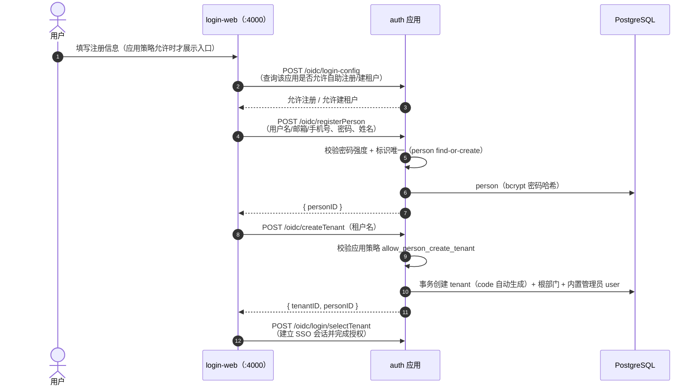

**要点**：

- **门禁是应用级策略，不是全局开关**：是否允许自助注册 / 自助建租户由 `application.allow_person_create_tenant` 与登录页前置查询 `/oidc/login-config` 的返回共同决定；早期的全局 `SecurityConfig.SelfRegister` 开关已移除。
- **解析实现与通道 B 共用一份**：`client_id` → 应用 → 读开关统一走 `pkg/core/application`（`GetByClientID` / `AllowsPersonCreateTenant`），禁止各通道各写一套；字段为 NULL（未配置）与解析不出应用都视为不允许（fail-closed）。
- **注册与建租户拆成两步**：`registerPerson` 只做 person 的 find-or-create（复用既有自然人时不覆盖口令、也不置强制改密）；`createTenant` 才落租户、根部门与内置管理员。
- **SSO 会话不在注册时建立**：会话在 `POST /oidc/login/selectTenant` 完成授权时创建，因此注册后仍需走一次登录收尾。
- 通道 A 的注册人自任该新租户的**拥有者**（`is_owner=1`，`source=builtin`），对标 zitadel `register/org`；**平台建租户同样置 `is_owner=1` + `source=builtin`**（见 §5.8）。

**通道 B：凭邀请加入已有租户（`POST /v1/auth/joinTenant`）**

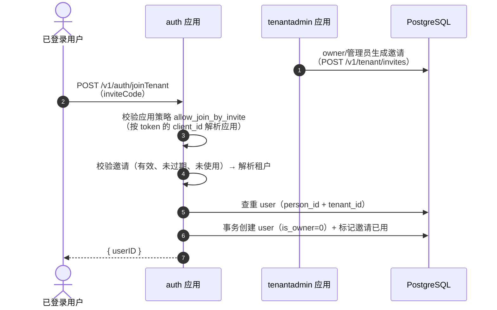

**要点**：落哪个租户由**邀请码**决定（租户侧授权）；`joinTenant` **禁止裸 `tenantID` 直入**——这是软隔离多租户模型下的必要门禁（对标 keycloak 落当前 realm / zitadel org scope）。加入者永远是普通成员：`is_owner` 只在**自助开通租户或平台建租户**时产生，平台端不提供 owner 指派接口（`PUT /v1/platform/users/{userID}/owner` 已下线），该字段仅用于展示、不参与鉴权。

通道 B 有**两道门禁**，按序判定（见 `backend/apps/auth/internal/service/svcauth/auth.go` 的 `JoinTenant`）：

1. **应用级策略** `application.allow_join_by_invite`：与通道 A 的 `allow_person_create_tenant` 完全对称——按调用方 access token 的 `client_id` 解析出应用，再读该应用的开关（`pkg/core/application.GetByClientID` + `AllowsJoinByInvite`，两条通道共用同一份实现）。
   - **fail-closed**：解析不出应用（`client_id` 为空、客户端或应用不存在）一律拒绝；字段为 NULL（未配置）同样视为不允许。（机器凭证通道不注入 person 身份，`JoinTenant` 在其之前即按未认证拒绝，因此走不到本门禁。）
   - 该检查**先于邀请解析**：功能关闭时不消费邀请，也不向外暴露"邀请码是否存在"。
   - 拒绝返回 `AuthJoinNotAllowedError`(110013)；解析过程本身出错返回 `AuthJoinPolicyCheckError`(110015)。
   - 开关在 platform-admin-web 的「应用」新建/编辑表单中配置（个人自助创建租户 / 允许邀请加入租户两个开关）。
2. **邀请本身**：存在、`status=pending`、未过期（`expires_at` 为空表示永久）。

### 5.2 密码登录（OIDC 授权码流程中的认证环节）

**首次登录强制改密**：登录校验通过后若命中 `person.must_change_password`（临时口令，或口令刚被管理员重置），auth **不建立 SSO 会话、也不签发授权码**，而是返回需改密状态；login-web 随即引导调用 `POST /oidc/login/changePassword`（改密后必须重新登录）。已登录用户的自助改密走 `POST /v1/auth/me/changePassword`。

### 5.3 免密续登（SSO）

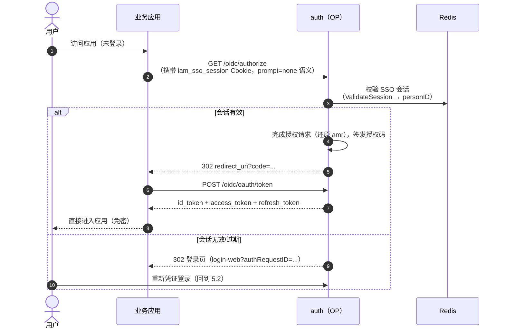

### 5.4 令牌签发与校验（RP 侧）

> **ID token 声明与 `groups`（跨系统授权契约）**：`IDTokenUserinfoClaimsAssertion()` 必须为 `true`
> （`apps/auth/internal/core/oidcop/client.go`）——zitadel 在 `false` 时会把 `profile`/`email`/`phone`
> 从 ID token 的 scope 里裁掉（`pkg/op/token.go` 的 `removeUserinfoScopes`），ID token 只剩 `sub`；
> 而只读 ID token 的 RP（对象存储控制台这类）需要 `groups` 与 `preferred_username`。
> `groups` = **本次签发租户内、且属于本次请求客户端所属应用的角色编码**（`model.RoleCode`），在
> `OIDCStorage.SetUserinfoFromRequest` 注入：授权码流取授权票据的租户与 client、刷新流取 refresh token
> 的租户与 client，userinfo 端点则按 access token 元数据的租户与 client 产出；仅随 `profile` scope
> 授权，未请求 `profile` 不产出。**应用作用域（`application_client.app_id`）是声明的命名空间边界**：
> 下游只可能认自己那个应用的角色编码，若把租户内所有应用的编码一起下发，任何应用里的角色都会进入
> 每个下游的策略命名空间（在无关应用里造一个同码角色即可命中下游策略），下游无从分辨来源。
> 客户端未知（记录不存在）或角色读取失败按 **fail-closed** 返回错误拒绝该次签发——宁可登录失败，
> 也不签发作用域不明或缺 `groups` 的令牌让下游把用户当「无策略」静默降权；客户端为空或未绑定应用时
> 视为「无命名空间」而不产出声明（与「租户未定不猜租户」同构）。
>
> **契约值只由应用方定义（这是「前缀隔离不了同码」的根本解）**：下游按「`claim_prefix` + 编码」逐字拼
> 策略名，前缀只隔离命名空间、隔离不了同码——而且策略在下游是**全局命名实体**（一条策略全租户共用，
> 下游没有「角色 ↔ 策略」的映射表可回查），所以「哪个编码会在下游存在一条策略」**只能由应用方说了算**。
> 据此 `role.code` 只有两个来源，租户侧没有任何写入入口（请求 DTO 里没有该字段，service 恒写空串）：
> ①**产品锚点**（`model.productAnchorRoleCodes`：`platform_admin`/`tenant_admin`）写死在制品代码里，
> 语义是「平台自己的策略命名空间」；
> ②**应用角色模板**（`application.role_template` = `[{code,name}]`）：平台侧维护该应用对外的契约角色
> 清单，开通应用时物化到租户（`source=builtin && admin_type=normal`，见 §5.8 建租户流程），租户侧对这些
> 角色整体只读（连改名也拒——名称同样由应用方定义），成员授权仍归租户。
> 租户自建角色（`source=custom`）的 `code` 恒为空串，因此**不可能**撞上模板编码或产品锚点，也就无需
> 保留字护栏（早先的 `reserved_role_codes` 是「租户可写编码」前提下的补丁式 blocklist，已被本模型取代）。
> 模板是**单一事实源**：更新模板时对每个已开通租户做差量同步——新增物化、改名回写、**移除即从各租户
> 撤下该角色并级联删除其 `user_role`/`role_menu`**（撤权是模板收敛的必然结果，故平台控制台必须二次
> 确认，见 api-reference 的应用更新接口）；若某租户存在同码的**自建**存量角色（本模型上线前的历史数据），
> 同步只告警跳过、不接管（防御性：接管等于悄悄改掉租户自己的角色）。

### 5.5 登出与全局登出（SLO）

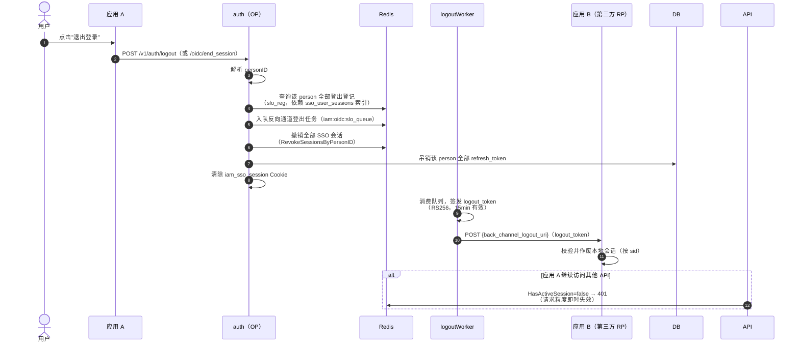

### 5.6 API Key（机器凭证）鉴权

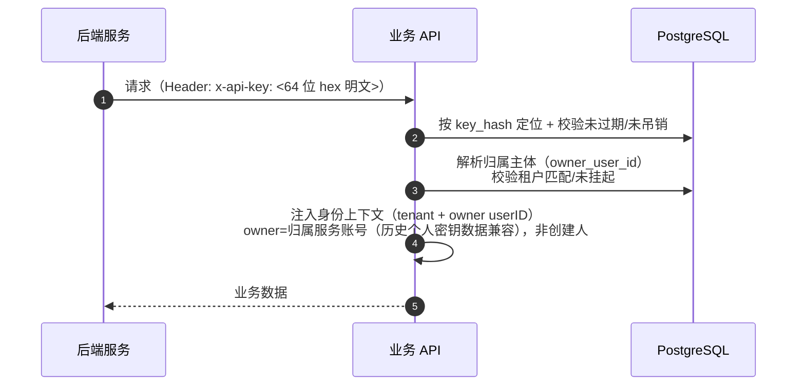

### 5.7 Connector 外部身份源登录（OIDC/OAuth2 IdP）

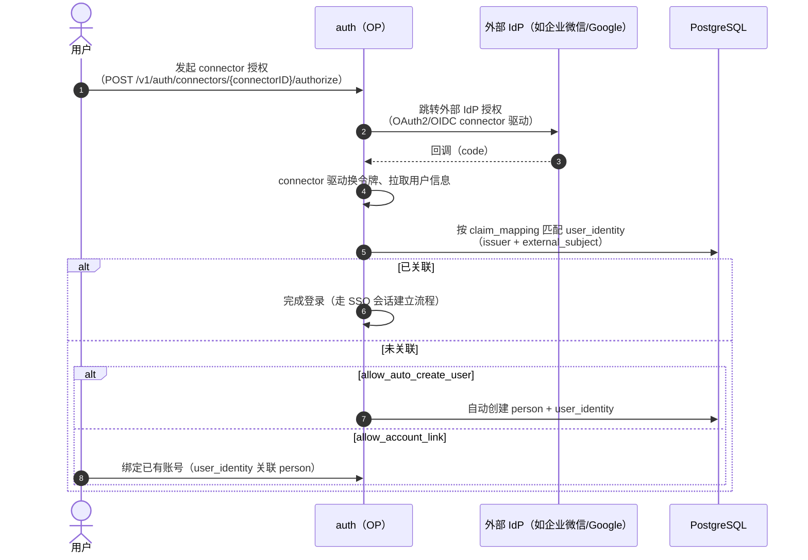

---

### 5.8 建租户与内置管理员（一次性临时口令 + 首次强制改密）

平台端 `POST /v1/platform/tenants` 建租户时，在**同一事务**内一并创建该租户的**内置管理员成员**，使租户开箱可用（实现：`pkg/core/tenant.CreateTenantWithBuiltinAdmin`）：

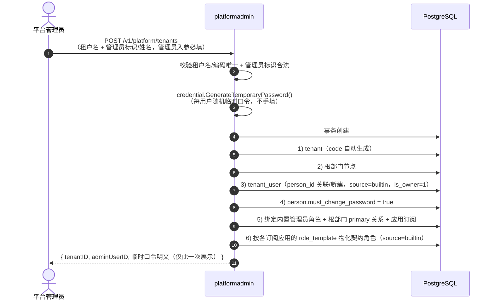

**要点**：

- **每个租户都必须有管理员**：建租户的管理员入参为必填，避免出现无人可登录的租户。
- **应用订阅即契约角色物化**：`tenant_application` 落行时（建租户内的订阅、以及平台侧单独开通应用）在同一事务里按该应用的 `role_template` 在租户内 upsert 对应角色（`source=builtin && admin_type=normal`，`description` 标注来源）；租户侧对这些角色只读。模板更新走 `SyncAppRoleTemplateToTenants` 对各已开通租户做差量同步（新增/改名/移除撤权），详见 §5.4。
- **口令不由创建人手填**：服务端用 `pkg/credential.GenerateTemporaryPassword` 生成每用户随机临时口令，全系统口令强度规则一致；**明文只在创建响应中回显一次**，库里只存 bcrypt 哈希。
- **内置标记 `source=builtin`**：该成员由系统随租户创建生成（区别于控制台手工创建的 `manual`），仅作为后端语义，不在租户控制台展示为可编辑字段。
- **首次登录强制改密**：`person.must_change_password=true`，改密前不建会话、不发令牌（见 §5.2）。
- **口令丢失的兜底**：平台侧提供 `POST /v1/platform/tenants/{tenantID}/builtin-admin/reset-password`，重置后同样回显一次性临时口令并重新置 `must_change_password`。该接口**仅允许作用于 `source=builtin` 的内置管理员**，不得触碰租户手工创建的成员。

---

## 6. 新应用接入流程

新业务应用接入 Ark IAM 的总体流程（详细实操见 [application-integration-guide.md](application-integration-guide.md)）：

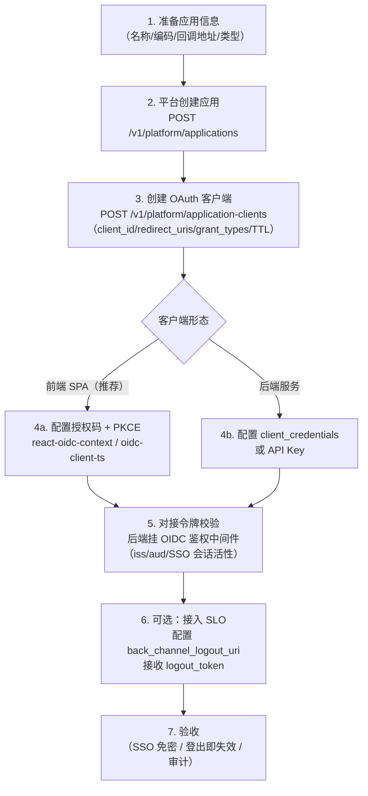

| 步骤 | 说明 | 关键接口 |
|---|---|---|
| 1. 应用定义 | 应用编码全局唯一，来源为 `third_party`（控制台创建） | `application` 表 |
| 2. 创建应用 | 平台管理员创建应用并配置租户策略 | `POST /v1/platform/applications` |
| 3. 创建客户端 | 一个应用可多个客户端（多端/多环境），**redirect_uri 必须精确白名单** | `POST /v1/platform/application-clients` |
| 4. 前端接入 | Authorization Code + PKCE，`state`/`nonce` 由 SDK 处理 | `/oidc/*` 端点 |
| 5. 后端校验 | `middleware.OIDCCompatibleAuth` 中间件：验签 + iss/aud + SSO 会话活性 | `pkg/middleware` |
| 6. 单点登出 | 配置 `back_channel_logout_uri` 接收 logout_token（RP 侧接收端，本仓内置实现在 `pkg/goidc`，platformadmin/tenantadmin 分别挂载 `/oidc/bc-logout/platform`、`/oidc/bc-logout/tenant`） | `back_channel_logout_uri` |
| 7. 验收 | 跨应用免密、一处登出处处登出、审计可查 | - |

---

## 7. 安全设计

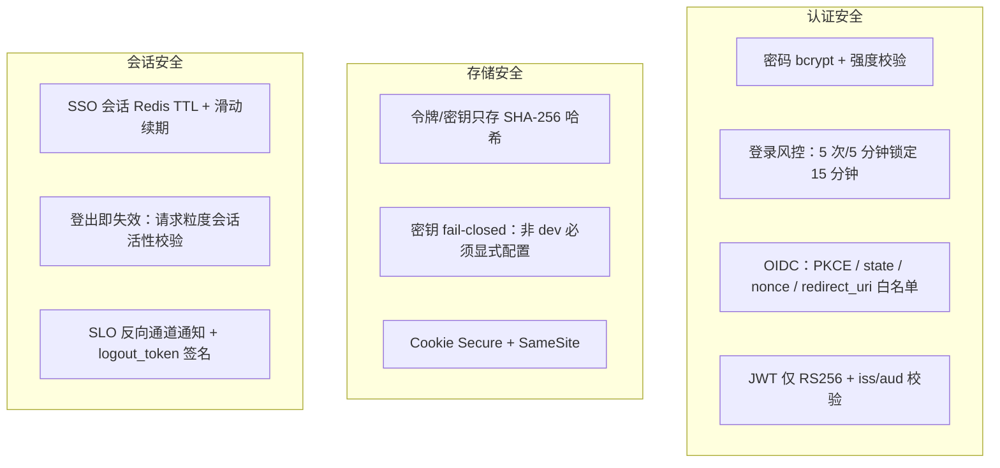

| 领域 | 措施 |
|---|---|
| 凭证 | bcrypt 存储；口令强度校验（**≥8 位、上限 128**，且含大小写+数字，见 `pkg/credential`）；临时口令每用户随机、首次登录强制改密；登录风控（`security.login`：5 次失败/300s 窗口/锁定 900s）与按 IP 限流（`ratePerMinute`/`burst`） |
| 协议 | 授权码 + PKCE（S256）；state 防 CSRF；nonce 防重放；redirect_uri 精确白名单；token 端点 client 认证（basic/post/none） |
| 令牌 | 仅 RS256；RP 校验 `iss`/`aud`；Access Token 短 TTL（默认 900s）；Refresh Token 哈希存储 + 轮换 + 按 person 吊销；ID Token 10min（API Key 机器凭证路径为 1h） |
| 密钥 | 签名/加密密钥生产 fail-closed（未配置直接启动失败）；dev 自动生成临时密钥 |
| 会话 | SSO Cookie `iam_sso_session`（SameSite 默认 Lax，生产 Secure）；Redis 会话 TTL + 活跃续期；登出撤销全部会话与刷新令牌 |
| 审计 | 登录成功/失败、租户切换、操作动作全量写 `audit_log`；登录写 `user_login_log` |
| 中间件 | OIDC 鉴权：无 token 401、API Key 通道独立（`x-api-key`）、机器凭证豁免 SSO 会话活性校验 |
| 租户隔离 | 见下方「7.1 租户数据隔离（fail-closed）」 |

### 7.1 租户数据隔离（fail-closed）

**机制**：含 `tenant_id` 列的表，其 SELECT/UPDATE/DELETE 由 `pkg/dbclient` 挂载的租户插件（golib `gormplugin`）自动注入 `tenant_id = ?`，条件由**上下文里的租户作用域**决定；不含该列的全局表登记在 `pkg/dbclient/gorm.go` 的 `tenantScopeSkipTables`。

**作用域是一等值**（golib `biz/gcontext`）：`TenantScope{Kind, TenantID}`，`Kind ∈ {Current, Explicit, All}`。

| 声明方式 | 用途 | 写入点 |
|---|---|---|
| `gincontext.SetTenantScope(ctx, gcontext.CurrentScope(tenantID))` | 当前租户（默认） | 认证中间件：`pkg/middleware/oidc_auth.go`（OIDC claims）、`pkg/middleware/apikey_auth.go`（API Key 归属租户）各写一次 |
| `dbclient.ExplicitTenantContext(ctx, tenantID)` | 指定它租户（加入租户、平台侧操作他人租户、新建租户的根部门） | 具名 dao/领域方法内，调用方零判断 |
| `dbclient.CrossTenantContext(ctx)` | 跨全部租户（按全局唯一键反查 client_id/邀请码/API Key 摘要、自然人级全局登出、启动期 AutoMigrate 与种子） | 调用点显式书写并注释理由 |

**fail-closed**：ctx 未声明作用域时，插件拒绝执行 SQL 并返回 `dbclient.ErrTenantScopeMissing`（错误信息含表名与修复指引），**绝不静默放行成跨租户读**。灰度回退开关为 `dbclient.SetMissingTenantScopeMode(dbclient.MissingTenantScopeWarn)`（只告警不拦截）。

**两层载体**：规范存储是**请求上下文**里的类型化作用域（跨 `http.Handler` 的协议层、异步任务同样可见，OIDC provider 的 `op.Storage` 因此零改造）；同一 helper 同时把当前租户投影到 gin Keys，使 `gincontext.Get*String` 的 135 处读取点与历史写法继续可用。两者语义等价、类型化优先——因此即使某个引擎漏开 `ContextWithFallback`，隔离也不会静默失效。

**验收测试**：`pkg/dbclient/tenant_scope_enforcement_test.go` 覆盖「gin ctx 与 `ctx.Request.Context()` 解析逐字节一致（G2）」「未声明作用域 fail-closed」「All/Explicit/Current 三类语义」「开关关闭时投影仍生效」「AsyncContext 带走作用域且不继承取消」。

---

## 8. 演进方向

- **部门架构增强**：部门/部门与角色联动、批量导入导出；
- **更多授权类型**：`urn:ietf:params:oauth:grant-type:token-exchange`、jwt-bearer（当前显式拒绝，避免虚假宣称）；
- **MFA**：TOTP/短信二次认证（部门级 MFA 策略已移出部门表，后续按租户级配置承载——`system` 冗余配置模块已下线）；
- **SCIM 供给**：租户→应用的用户供给协议；
- **细粒度授权**：资源级（`resource`/`scope`）的 ABAC 策略引擎；
- **auth 高可用**：共享认证 Redis 已支持多副本，后续补会话一致性看护与优雅降级；
- **前端登录页自定义**：login-web 品牌化、多主题。

---

## 附：文档地图

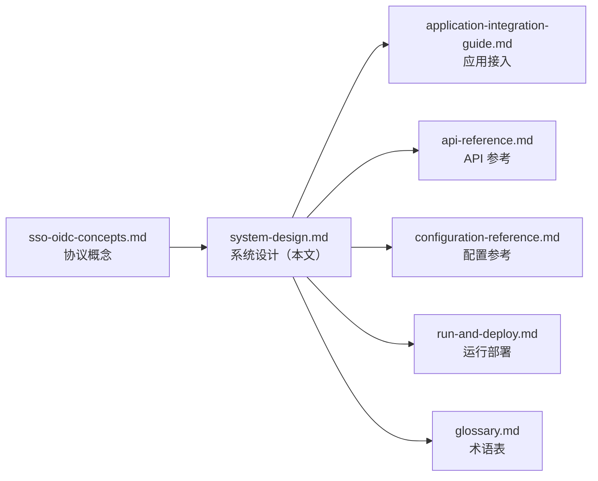
