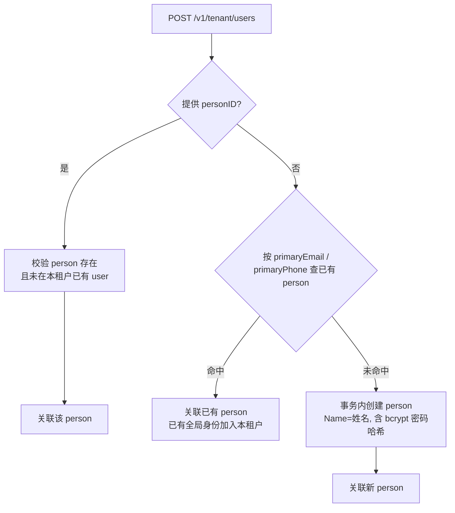

# 管理台页面功能重规划（租户自管理 / 平台管理职责划分）

> 状态：已实施（阶段一后端 + 阶段二租户端前端 + 阶段三平台端下线均完成；`go test ./...` 全绿、`golangci-lint` 0 issues、两个前端应用构建通过）
> 涉及：`tenant-admin-web` 页面从 1 个扩展为 3 个（组织架构 / 用户管理 / 角色管理）；`platform-admin-web` 用户/角色页面调整为「平台排查视角」；`tenantadmin` 后端新增用户 / 角色接口并富化组织成员信息；种子菜单补充。

## 1. 背景与目标

### 1.1 现状问题

| 应用 | 现状 | 问题 |
|---|---|---|
| 租户自管理（tenant-admin-web） | 仅 1 个「组织架构」页（左侧树 + 右侧节点操作与成员） | 页面数严重不足，用户期望的「用户管理 / 角色管理（含授权）」缺失；成员列表只展示 `OrganizationUser` 关系字段（`userID / userName / relationType / isPrimary`），**没有租户用户基础信息**（头像 / 用户名 / 邮箱 / 手机 / 状态）——后端 `organization_user` PageList 也未返回这些字段；添加成员需手输 `userID`，无用户选择器 |
| 平台管理（platform-admin-web） | 14 个静态菜单页面 | 用户管理（跨租户目录）、角色管理（实为按当前租户隔离）、菜单/权限域/资源（权限字典）与租户自管理职责重叠，平台端不聚焦 |

### 1.2 职责划分原则（本文档的契约）

> **租户自管理 = 租户内的「组织 + 人 + 权限」自服务**：组织架构（部门）、租户用户目录、租户角色与授权，全部收敛到 tenant-admin。
> **平台管理 = 平台层（跨租户）的管理与排查**：租户生命周期、应用与接入、平台级权限字典（菜单/资源/权限域）、安全运维；对租户内数据只保留「只读排查视角」。

## 2. 租户自管理页面规划

### 2.1 菜单结构

种子菜单（`appCodeTenantAdmin`）+ 前端组件白名单同步：

| 菜单 | 路径 | 图标 | 排序 |
|---|---|---|---|
| 组织架构 | `/organization` | apartment | 1（已有） |
| 用户管理 | `/user` | user | 2（新增） |
| 角色管理 | `/role` | role | 3（新增） |

前端 `App.tsx`：`COMPONENT_MAP` 增加 `/user`、`/role`；`ICON_MAP` 增加 `user`、`role`；静态 fallback 菜单同步 3 项；默认落地页仍为 `/organization`。

### 2.2 组织架构（部门管理）

**布局重构**：左侧组织树卡片（**收窄至 260**，选中节点高亮，避免占太宽）+ 右侧内容区改用 **Tabs**：

- **Tab1 节点信息**：
  - 顶部：面包屑（`orgPath` 转名称链）、名称、编码、排序、状态（启用/停用 Tag）、子节点数、成员数；
  - 操作：新建子组织、编辑、移动（改父组织，走 `PUT` 全量更新）、启停用、删除（有子节点/成员默认拒绝，`?cascade=1` 级联）。
- **Tab2 成员管理**：
  - 表格字段：**头像、姓名、用户名、邮箱、手机、状态（挂起/正常）、关系（成员/负责人）、主归属、操作（改关系、设主归属、移除）**——用户基础信息来自租户用户目录（person 表富化），不再只有关系字段；
  - 支持按关系类型 / 关键词（姓名/用户名/邮箱/手机）筛选 + 分页；
  - 「添加成员」改为**用户选择器**：弹出抽屉，从 `/tenant/users` 按关键词搜索选择（可多选），默认关系 `member`，首个可勾选为主归属；禁止手输 `userID`。

### 2.3 用户管理

- **列表**：头像、姓名、用户名、邮箱、手机、状态（挂起 Tag）、主组织、角色数、创建时间；关键词（姓名/用户名/邮箱/手机）+ 状态筛选 + 分页。
- **创建用户**：租户管理员在租户内新建账号（**姓名 / 部门(必填下拉) / 邮箱 / 手机 / 初始密码 / 状态**），`POST /tenant/users`。**姓名即自然人信息**：无匹配自然人时按姓名创建 person；部门必选，创建同时建立组织归属（`organizationIDs`，首个为主组织）。用户名不作为创建属性。
- **行内操作**：
  - 详情 Drawer：基础信息 + **组织归属管理**（勾选组织，首个为主归属，`GET/PUT /users/:userID/organizations`，接口已有）+ **角色列表**（展示已分配角色）；
  - **分配角色**：Drawer 列出租户角色（搜索），勾选后 `PUT /users/:userID/roles` 全量替换——**用户侧入口**（对应决策：用户列表的操作负责分配角色）；
  - 编辑基础信息、挂起/恢复（PATCH）、重置密码（`POST /users/:userID/reset-password`）。

### 2.4 角色管理（含角色授权）

- **角色从属于应用**：租户内角色归属到租户订阅的应用（`appID` 必选，应用选项来自 `GET /tenant/apps`），不同应用角色相互独立、编码应用内唯一。
- **列表**：名称、所属应用、编码、描述、类型、成员数、菜单数、创建时间；**应用过滤**（下拉）+ 关键词筛选 + 分页。
- **CRUD**：创建（选所属应用）/ 编辑 / 删除（租户内角色，名称必填、编码应用内唯一）。
- **授权**：行内「菜单权限」操作——Drawer 内以**树形菜单**勾选该角色可访问的**所属应用的菜单**，`GET/PUT /roles/:roleID/menus` 全量替换——**角色侧入口**（对应决策：角色列表的操作负责分配菜单）。
- 角色成员关系由用户侧（2.3 分配角色）维护，角色列表仅展示成员数；如需成员明细可后续加 `GET /roles/:roleID/users` 只读列表。

### 2.5 后续扩展（「等等」预留）

- 登录日志（租户视角，只读，复用 `user_login_log` / `audit_log`）；
- 我的应用（租户已开通应用列表）；
- 个人中心（个人信息 / 修改密码 / 我的组织 / 我的角色）。

## 3. 平台管理页面规划（聚焦平台层）

### 3.1 保留（平台层职责）

| 分组 | 页面 |
|---|---|
| 仪表盘 | 仪表盘 |
| 组织与租户 | 租户管理、租户应用（开通关系） |
| 应用与接入 | 应用管理、OAuth 客户端、域名管理 |
| 权限基础（平台级权限字典） | 菜单管理、权限域、资源 |
| 安全与运维 | API Key、系统配置、审计日志 |

### 3.2 调整为「平台排查视角」

| 页面 | 调整 |
|---|---|
| 用户管理 | 保留为**跨租户用户目录**（查询 / 挂起 / 重置密码，用于平台排查），页面标题/描述加「平台视角」标注，明确不承担租户内组织归属、角色分配 |
| 角色管理 | 保留为**平台角色视角**：种子角色（admin/user/guest）与跨租户角色只读排查，加「平台视角」标注；租户内角色 CRUD/授权收敛到租户自管理 |
| 组织架构 | 平台不提供写入；需要时可加只读页（`GET /v1/platform/organizations/tree`，?tenantID= 必填），本规划暂不实施 |

## 4. 后端 API 支撑（tenantadmin）

### 4.1 组织成员信息富化

`GET /v1/tenant/organizations/:organizationID/users` 返回项从关系字段扩展为**关系 + 租户用户基础信息**（对齐 `/v1/tenant/users` 的 `UserPageListItem` 模式）：`userID / userName(姓名) / username / primaryEmail / primaryPhone / avatar / isSuspended / relationType / isPrimary / joinedAt`。实现：批量加载 person 信息（复用 `loadPersonMap`），消除现有按行 `GetByID` 的 N+1。

### 4.2 用户

| 方法 | 路径 | 说明 |
|---|---|---|
| POST | `/v1/tenant/users` | 创建租户用户（姓名/部门(organizationIDs)/邮箱/手机/初始密码/状态）；**person find-or-create**（§4.4：姓名即自然人信息，未命中则按姓名创建）；部门归属同事务建立 |
| GET | `/v1/tenant/users` | 目录分页（keyword 过滤：姓名/用户名/邮箱/手机；含主组织/角色数聚合） |
| GET | `/v1/tenant/users/:userID` | 详情：基础信息 + 组织归属 + 角色列表 |
| PATCH | `/v1/tenant/users/:userID` | 局部更新（状态 / 基础信息） |
| POST | `/v1/tenant/users/:userID/reset-password` | 重置密码（动作子路径，R2） |
| GET | `/v1/tenant/users/:userID/roles` | 用户已分配角色（父资源子集合视角） |
| PUT | `/v1/tenant/users/:userID/roles` | 全量替换用户角色（批量授权） |
| GET / PUT | `/v1/tenant/users/:userID/organizations` | 用户组织归属（已有，不动） |

### 4.3 角色（租户隔离，`tenant_id` 取当前登录租户）

| 方法 | 路径 | 说明 |
|---|---|---|
| GET | `/v1/tenant/apps` | 租户订阅的应用列表（角色归属 / 菜单授权的应用选项） |
| POST | `/v1/tenant/roles` | 创建角色（**appID 必选**，角色从属于应用；name/code/description/type，编码应用内唯一） |
| GET | `/v1/tenant/roles` | 分页列表（?appID=&keyword=），带成员数 / 菜单数聚合 + 所属应用名 |
| GET | `/v1/tenant/roles/:roleID` | 详情 |
| PUT | `/v1/tenant/roles/:roleID` | 全量更新 |
| DELETE | `/v1/tenant/roles/:roleID` | 删除（级联清理成员/菜单关联） |
| GET | `/v1/tenant/roles/:roleID/menus` | 角色已授权菜单（**所属应用的菜单树** + 已授权ID，供勾选回显；无应用归属的种子角色回退全控制台菜单） |
| PUT | `/v1/tenant/roles/:roleID/menus` | 全量替换角色菜单（校验菜单属于角色所属应用） |

> 说明：角色-用户关系仅由用户侧维护（4.2 的 `PUT /users/:userID/roles`），角色侧不提供写接口；角色列表的成员数由 `user_role` 聚合查询得到。

### 4.4 创建租户用户时的自然人（person）处理

**核心规则**：`user.person_id` 必须指向存在的 person。创建租户用户时**默认以姓名作为自然人信息**，若没有对应自然人则先创建 person（与 user 同事务），即 find-or-create。



细节约定：

1. **指定 personID**：校验 person 存在；同一 person 在本租户只能有一条 `user`（服务层校验 `tenant_id + person_id` 唯一），已存在则拒绝并提示「该用户已在本租户内」；
2. **按全局标识 find-or-create**：`primaryEmail / primaryPhone`（及可选 username）为 person 表全局唯一标识（空值存 NULL）。请求未带 personID 时，按提供的标识逐个查 person：命中 → 直接关联（视为「已有自然人加入本租户」）；未命中 → 同事务内先创建 person（`PersonDao.WithTx(tx).Insert`，**Name 取姓名**，密码用 `gcrypto.GeneratePasswordHash` 生成 bcrypt 哈希），再关联；
3. **与平台端语义差异**：平台端 `svcuser.Create` 对标识冲突直接报 `AlreadyExists`（创建「新 person」语义）；租户端为 find-or-create（加入已有全局身份语义），显式提供标识即视为意图关联；
4. **无 personID 且无任何登录标识**（email/phone/password 均空）：**仍创建 person（仅含姓名）并关联**——person 始终存在，后续可通过重置密码等补充登录能力（不再创建无自然人关联的 user）；
5. **组织归属同事务建立**：`organizationIDs` 提供时校验均属于本租户，创建 user 后插入 `member` 关系（首个为主组织）；
6. **实现复用**：person 创建逻辑对齐平台端 `svcuser.Create`（person 实体字段 Username/PrimaryEmail/PrimaryPhone 用 `model.StrPtr` 存 NULL、Profile/CustomData 初始 `'{}'`、CreatedBy 取当前操作人）。

## 5. 前端改动清单

### 5.1 tenant-admin-web

- `App.tsx`：`ICON_MAP` / `COMPONENT_MAP` / `STATIC_MENU_TREE` 增加用户管理、角色管理；
- `pages/organization/index.tsx`：布局重构为「左树 + 右 Tabs（节点信息 / 成员管理）」；成员表格展示完整用户信息；添加成员改用户选择器抽屉；
- `pages/user/index.tsx`（新增）：用户列表 + 创建 + 详情 Drawer（基础信息 / 组织归属 / 角色分配）+ 挂起 / 重置密码；
- `pages/role/index.tsx`（新增）：角色 CRUD + 菜单权限授权 Drawer（树形菜单勾选）；
- `api/user.ts` 扩展（创建 / 详情 / PATCH / 重置密码 / 角色分配），新增 `api/role.ts`（CRUD + 菜单授权）；
- `pages/organization` 成员选择器复用 `getTenantUserPageList`。

### 5.2 platform-admin-web

- `pages/user/index.tsx`、`pages/role/index.tsx`：页面标题/描述加「平台视角」标注，职责文案对齐（跨租户排查 / 种子角色与只读排查）；
- 菜单文案可微调（如「用户管理」→「用户排查（平台）」或保留原名仅加描述，实施时定）。

### 5.3 packages

- `packages/types`：新增/扩展租户域类型（`TenantUserItem`（含 person 基础信息）、`TenantUserDetail`（含组织归属+角色）、`TenantRoleItem` 等），与 `dtotenant` 对齐；
- `packages/api`：如需跨应用复用可在 `resources/` 增加 tenant 资源，当前 tenant-admin-web 走自身 `api/` 目录即可，暂不动。

## 6. 种子数据调整（pkg/seed）

`seedMenus` 的 `appCodeTenantAdmin` 段新增两条菜单：

```
{appCode: appCodeTenantAdmin, name: "用户管理", code: "user", path: "/user", icon: "user", sort: 2, component: "pages/user", permission: ""}
{appCode: appCodeTenantAdmin, name: "角色管理", code: "role", path: "/role", icon: "role", sort: 3, component: "pages/role", permission: ""}
```

种子幂等（按 `app_id + code` 查重），已初始化库重启后自动补种；`seedRoleMenus` 如需让 admin 角色默认可见新菜单，补充对应 relation（实施时定）。

## 7. 实施阶段与验收标准

### 7.1 实施阶段

1. **阶段一（后端支撑）**：`organization_user` 成员信息富化；tenantadmin 用户接口（创建/详情/PATCH/重置密码/角色分配）+ 角色接口（CRUD/菜单授权）；种子菜单补充；单测（复用 `testutil.SetupSQLite`）。
2. **阶段二（租户端前端）**：组织页重构（Tabs + 完整成员信息 + 用户选择器）；用户管理页；角色管理页（含菜单授权）；`App.tsx` 路由/菜单/白名单。
3. **阶段三（平台端 + 打磨）**：执行平台端下线清单（见 §8）——用户/角色页降级「平台排查视角」、删除死接口与孤儿代码；关键词筛选、分页、空态、加载态细节；README/文档同步。

### 7.2 验收标准

1. 租户自管理侧边栏出现「组织架构 / 用户管理 / 角色管理」三项，动态菜单与静态 fallback 一致，路由均可进入（无 404）；
2. 组织架构成员表格展示完整用户基础信息（头像/用户名/邮箱/手机/状态），添加成员可从用户目录搜索选择，不再手输 ID；
3. 用户管理支持创建、挂起/恢复、重置密码、组织归属管理、角色分配（用户侧入口，全量替换生效）；
3.1 创建租户用户时 person find-or-create 正确：指定 personID 直接关联并校验租户内唯一；按 username/email/phone 命中已有 person 则关联、未命中则同事务先创建 person；无任何标识则创建无自然人关联的租户内用户；
4. 角色管理支持 CRUD 与菜单权限授权（角色侧入口，树形勾选回显正确、全量替换生效）；
5. 平台管理用户/角色页标注「平台视角」，职责文案清晰；
6. `go test ./...` 全绿、`make lint` 通过；tenant-admin-web 构建通过，页面可用。

## 8. 平台端下线清单（页面 / 接口 / 代码）

> 判定标准：前端 API 函数无任何页面消费（非测试）→ 删；后端路由无任何前端调用且能力已收敛到 tenantadmin 或纯冗余 → 删路由注册 + 孤儿 controller/service/dto；**页面不整页下线**——用户管理 / 角色管理降级为「平台排查视角」（§3.2），下掉与租户自管理重复的写功能，其余 12 页保留；**数据表 / 实体保留**（role_menu / user_role 将由 tenantadmin 新接口写入，role_scope 数据保留供权限引擎后续消费）。

### 8.1 前端 API 函数删除（packages/api/resources/platform.ts）

| 函数 | 原因 |
|---|---|
| `getRoleDetail` | 无页面消费（角色详情 Drawer 用列表数据） |
| `getTenantDetail` / `getTenantApplicationDetail` | 无页面消费（页面只用列表 + create/update/delete） |
| `getMenuPageList` / `getMenuDetail` | 无页面消费（菜单页用 tree + create/update/delete） |
| `getConnectorPageList` / `getConnectorDetail` / `createConnector` / `updateConnector` / `deleteConnector` / `getConnectorFactoryList` | 前端无任何页面消费；后端 `/auth/connectors` 属认证域保留，前端函数先删，连接器管理页后续按需重建 |
| `createUser` / `updateUser` / `deleteUser` | 用户页下掉新建/编辑/删除后无消费（创建收敛到 `POST /tenant/users`） |
| `createRole` / `updateRole` / `deleteRole` | 角色页下掉 CRUD 后无消费（角色管理收敛到 tenantadmin） |
| `assignRoleUsers` / `removeRoleUser` | 角色页下掉成员管理（写）后无消费（成员分配收敛到租户端用户页） |

保留：`getUserPageList` / `getUserDetail` / `updateUserStatus` / `updateUserPassword` / `getUserIdentityByUser` / `createUserIdentity` / `deleteUserIdentity` / `getUserLoginLogByUser` / `getRolePageList` / `getRoleUsers`（详情只读成员列表仍在用）及仪表盘计数所用的 4 个列表函数。

### 8.2 前端页面调整（platform-admin-web）

| 页面 | 调整 |
|---|---|
| 用户管理 | 下掉：新建 / 编辑 / 删除；保留：列表、详情（基本信息 / 第三方身份 / 登录日志）、挂起恢复、重置密码；标题/描述加「平台视角」标注 |
| 角色管理 | 下掉：新建 / 编辑 / 删除、成员管理（写）；保留：列表、详情（含成员只读列表）；标题/描述加「平台视角」标注 |
| 其余 12 页 | 保留不动 |

### 8.3 后端路由删除（platformadmin）

| 路由文件 | 删除 | 保留 |
|---|---|---|
| `permission.go` | `POST/PUT/DELETE /roles`；`PUT/DELETE /roles/:roleID/users`；roleMenuRouter 整组（`GET/POST/DELETE /roles/:roleID/menus`）；roleScopeRouter 整组（`GET/POST/DELETE /roles/:roleID/scopes`）；userRoleRouter 整组（`GET/POST/DELETE /users/:userID/roles`） | `GET /roles`、`GET /roles/:roleID`、`GET /roles/:roleID/users`（排查视角） |
| `user.go` | `POST /users`、`PUT /users/:userID`、`DELETE /users/:userID`；`GET /user-identities`（顶层）；`GET/PUT /users/:userID/identities/:identityID`（详情/更新）；`GET /login-logs`、`GET /login-logs/:loginLogID`（顶层） | `GET /users`、`GET/PATCH /users/:userID`、`POST /users/:userID/changePassword`；identities 子资源 list/create/delete；`GET /users/:userID/login-logs` |
| `tenant.go` | `POST /tenants/createAsOwner`（路由下线，服务 `CreateTenantAsOwner` 为「自然人自助建租户」能力，待 auth 注册流程接入时再挂）；`GET /organizations/tree`、`GET /users/:userID/organizations`（平台只读组织，无消费方） | tenants CRUD、systems CRUD、logs list |

### 8.4 后端孤儿代码清理

- **controller**：`ctrpermission/role_menu.go`、`role_scope.go`、`user_role.go` 整文件删；`ctrtenant/organization.go` 删 `Tree` / `GetUserOrganizations`；`ctrtenant/tenant.go` 删 `CreateAsOwner`；`ctruser/user.go` 删 `DetailUserIdentity` / `UpdateUserIdentity` / `PageListUserIdentity` / `PageListUserLoginLog` / `DetailUserLoginLog`；
- **service**：`svcpermission/role_menu.go`、`role_scope.go`、`user_role.go` 整文件删；`svctenant/organization.go`（平台只读部分）删；`svctenant/tenant.go` 删 `CreateTenantAsOwner`（含 gate 校验，若后续接入 auth 自助建租户则仅删路由、服务暂留，实施时定）；`svcuser/user_identity.go` 删 Detail/Update/PageList 方法；`svcuser/user.go` 删 `PageListUserLoginLog` / `DetailUserLoginLog`；
- **dto**：`dtopermission` 中 role_menu / role_scope / user_role 相关 struct；`dtouser` 中 identity 详情/更新、login_log 顶层相关；`dtotenant` 中 `TenantCreateAsOwnerReq/Resp`、组织只读相关；
- **错误码**：对应 code 段清理（实施时核对引用）；
- **单测**：`role_menu_delete_test.go` / `role_scope_delete_test.go` / `user_role_delete_test.go` / `create_tenant_as_owner_test.go` 删除，`user_identity_test.go` / `tenant_scope_test.go` 等按保留方法裁剪。

### 8.5 保留（数据 / 实体 / 接口）

- 实体与表：`role_menu`（tenantadmin 角色菜单授权将写入）、`user_role`（tenantadmin 用户角色分配将写入）、`role_scope`（数据保留，权限引擎后续消费）、`organization` / `organization_user`（tenantadmin 维护）；
- 接口：§8.3「保留」列的排查视角接口（用户列表/详情/状态/重置密码、身份与登录日志子资源、角色列表/详情/只读成员、租户/应用/域名/菜单/权限域/资源/API Key/系统配置/审计日志 CRUD）。
