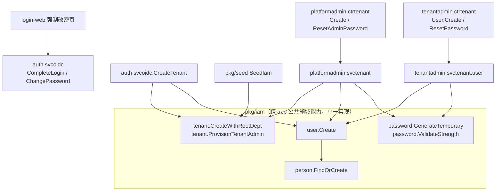
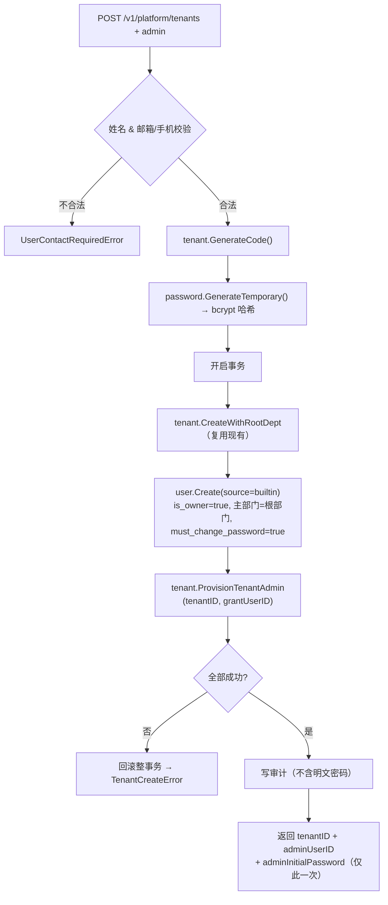
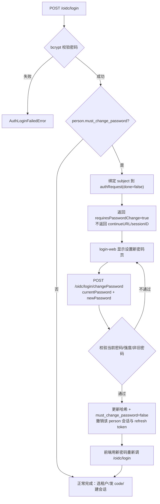
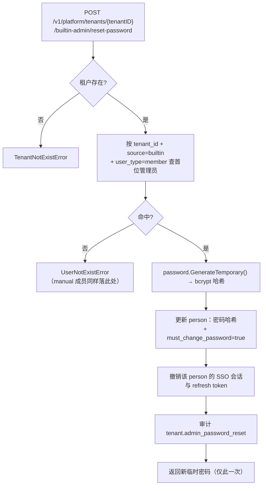

# 建租户自动创建租户管理员技术方案

> 场景：**S2 增量改造** ｜ 档位：**标准** ｜ 专题：**API 设计 + 数据模型设计 + 安全**
> 状态：**待评审**（未实施）。评审通过后再进入实施阶段。
> 需求来源：① 共用现有内部创建用户逻辑；② 密码无需手填、全系统默认密码规则一致；③ 建租户时创建的 user 需有特殊标识。
>
> 评审决策记录（已确认）：
> - **D1 一并开通租户权限**，使管理员开箱可用。
> - **D2 每个租户都必须有管理员**：`admin` 入参必填。
> - **D3 首次登录强制改密**纳入本期，初始密码采用主流"每用户随机临时密码"机制。
> - **D4 `source` 标识不在租户控制台展示**：仅作为后端语义，不新增 DTO 字段与前端列。
> - **D5 平台侧提供 builtin 管理员密码重置**，作为"初始密码丢失"的兜底（仅限 `source=builtin`，不得触碰租户手工成员）。
> - **D6 临时密码下发通道**：本期只能走"响应一次性回显"，代码中保留 `TODO(delivery)` 待接入邮件/短信通道后切换（见 T1）。
> - **D7 租户自服务的密码交互与平台侧一致**：租户控制台建用户、重置成员密码同样由**系统生成临时密码**（管理员不再手填口令），响应一次性回显 + `must_change_password=true` 强制改密；前后端交互形态与建租户管理员完全对齐。

## 背景与目标

### 业务背景与现状

平台侧建租户与租户内建用户目前是两条互不相干的链路：

| 链路 | 入口 | 现状行为 |
|---|---|---|
| 平台建租户 | `POST /v1/platform/tenants` → `platformadmin/internal/service/svctenant/tenant.go:43` | 一个事务内建 `tenant` + 同名根部门节点；**不创建任何用户**；且内联复制了 `pkg/iam/tenant.CreateWithRootDept` 的建租户/建根部门逻辑（重复实现） |
| 租户内建用户 | `POST /v1/tenant/users` → `tenantadmin/internal/service/svctenant/user.go:195` | person find-or-create → 插入 `tenant_user` → 建部门归属（primary/leader/secondary，leader 部门唯一）；密码可选，不传则 person 无密码哈希、无法登录 |
| 自助建租户 | `POST /oidc/createTenant` → `auth/internal/service/svcoidc/register.go:143` | 自然人自助注册（`/oidc/registerPerson`）后，若其零租户且 OAuth 客户端所属应用 `allowPersonCreateTenant=true`（`svcoidc/helper.go:27`），可自建租户并把**自己**作为 `is_owner=true` 成员插入；**不做任何权限开通** |
| 密码登录 | `POST /oidc/login` → `svcoidc/auth.go:75` → `svcauth.authenticateResolvedPerson`（`auth.go:122`） | 校验 bcrypt 哈希后直接完成 authRequest 并发 code/建 SSO 会话，**没有"必须先改密"的中断点** |
| 改密 | `PUT /v1/auth/me/password` → `svcperson.UpdatePassword`（`person_profile.go:44`） | 需旧密码；改密后撤销该 person 全部 SSO 会话与 refresh token |
| 重置密码 | `POST /v1/tenant/users/{userID}/reset-password` → `tenantadmin/svctenant/user.go` | 租户管理员直接设新密码；**不强制改密、不撤销该成员既有会话** |
| 默认密码 | `pkg/seed/seed.go:35` | 仅种子里有私有常量 `adminPassword = "admin123"`；未抽公共，且不满足 `pkg/iam/password.ValidateStrength`（缺大写） |
| 内置角色与订阅 | `pkg/seed/seed.go:92/117/260/423` | `tenant_application` 订阅、内置角色 `admin`/`tenant_admin`、`role_menu` 授权、管理员 `user_role` **只在平台租户**由种子写入 |
| 审计动作 | `pkg/iam/audit/audit.go:15-23` | 已有 `login`/`logout`/`tenant.create`/`api_key.revoke` 等；无密码重置类动作 |

补充事实（影响方案边界）：**仓库内不存在任何邮件/短信发送通道**（全仓无 SMTP/短信依赖与配置），因此本期初始密码只能走"接口一次性返回 + 页面展示复制"的通道，无法做激活链接邮件；已登记为 TODO T1。

### 痛点分析

1. **建完租户是"空壳"**：新建客户租户没有任何角色、没有 `tenant_application` 订阅，`tenantadmin` 的 `loadTenantApps`（`menu.go:57`）返回空 → 租户控制台无菜单；`svcmenu.ResolveUserAdminType` 查不到角色 → `admin_type=normal`，所有管理写操作被 `requireSystemAdmin`（`menu.go:207`）拒绝。租户连一个能管理它的人都没有。自助建租户同理。
2. **创建用户逻辑有第二份实现风险**：平台侧若为建租户管理员再写一套 person/user/部门归属逻辑，就会与 `tenantadmin` 的实现漂移。
3. **初始凭据没有体系**：目前只有种子里一个固定默认口令字面量。按主流安全实践，管理员代建的账号应使用**每用户随机的临时密码 + 首次登录强制修改**；固定默认口令属 [CWE-1392](https://cwe.mitre.org/data/definitions/1392.html)/[CWE-1393](https://cwe.mitre.org/data/definitions/1393.html) 缺陷模式。
4. **无强制改密能力**：登录链路在密码校验通过后立即完成认证，没有"先改密再放行"的中断点；`ResetPassword` 重置成员密码后既不强制改密也不撤销既有会话——管理员设一个已知口令即可长期冒用该账号。
5. **初始凭据丢失无兜底**：本期不建消息通道，临时密码只在响应里出现一次，运营未保存即无法交付；且平台侧用户管理页此前已整体下线（`tenant-admin-console-redesign.md` §3.2），没有任何重置入口。
6. **无法区分"随租户内置的管理员"与"后来手工建的成员"**：`tenant_user` 只有 `is_owner`（仅展示、不参与鉴权）与 `user_type`（member/machine），没有"来源"标识，运营/排查无法分辨——这同时也是 D5 兜底接口的**授权边界依据**。

### 目标与非目标

**目标**

- G1：`POST /v1/platform/tenants` 支持并**要求**创建租户管理员（姓名 + 手机/邮箱），与租户、根部门同事务（D2）。
- G2：创建用户的"核心写逻辑"收敛为一份公共实现，`platformadmin` 与 `tenantadmin` 共用（需求①）。
- G3：管理员初始密码由系统按**统一规则**生成**每用户随机的临时密码**，调用方无需传入；全系统临时/默认密码的生成规则只有一处实现（需求②）。
- G4：建租户创建的 user 带专用来源标识 `source=builtin`，仅后端语义、不在租户控制台展示（需求③ + D4）。
- G5：建租户时一并开通租户自服务权限，使管理员开箱可登录可管理（D1）。
- G6：**首次登录强制改密**：持临时密码的账号在登录链路被拦到"设置新密码"，改密成功前不签发 code、不建会话；管理员重置成员密码后同样强制改密并撤销既有会话（D3）。
- G7：**平台侧 builtin 管理员密码重置**：为"初始密码丢失"提供兜底，只允许作用于该租户 `source=builtin` 的管理员，复用同一套临时密码 + 强制改密机制，并写审计（D5）。
- G8：**租户自服务的密码交互与平台侧一致**（D7）：租户控制台建用户/重置密码不再由管理员手填口令，改为系统生成临时密码 + 一次性回显 + 强制改密；两端（platformadmin / tenantadmin）密码语义、响应形态、前端交互完全对齐。

**非目标（超出范畴的用例）**

- 不引入邮件/短信下发初始密码或激活链接：仓库无任何消息通道，本期初始密码走"接口一次性返回 + 页面复制"，代码与文档留 `TODO(delivery)`（T1、Q4）；原因是新建消息通道是独立立项。
- 不在平台侧提供**任意租户成员**的密码管理：D5 的授权边界只到 `source=builtin` 的租户首位管理员；租户手工成员（`manual`）的密码只能由租户自己在控制台重置（延续 `tenant-admin-console-redesign.md` §3.2 的职责划分）。
- **不允许管理员手工指定成员口令**（D7 的必然结果）：建用户与重置密码都不再接受 `password` 入参，一律由系统生成临时密码。这是主流做法（Keycloak/Okta/Entra 同形），代价是"管理员想给员工设一个固定口令"这类诉求不再支持（见开放问题 Q7）。
- 不做周期性密码过期/轮换：OWASP 明确不推荐周期性强制轮换（[Authentication Cheat Sheet](https://cheatsheetseries.owasp.org/cheatsheets/Authentication_Cheat_Sheet.html)）；本期只做"一次性临时密码 → 首次登录强制修改"。
- 不提供面向管理员的 MFA/二次验证：超出本期范围。
- 不为**存量**客户租户补建管理员/角色：存量库按新项目约定重建（`AGENTS.md`「数据库 Schema 变更约定」），不做数据回填脚本。
- 不新建独立租户开通服务：沿用 `platformadmin` 单事务内完成。

### 约束与非功能需求

- 技术栈约束：Gin + GORM + PostgreSQL（AutoMigrate 只增不删），跨 app 共享只能走 `pkg`（`go.work` 下 `apps/*` 之间不互相 import）。
- 路由约束：新增路由按 `docs/design/api-routing-convention.md` 的 R1/R2 判定，层级 ≤ 6 段。
- 数据一致性：租户、根部门、管理员、角色授权必须在**同一事务**内成功或全部回滚，不允许"有租户无管理员"或"有管理员无角色"的半成品。
- 幂等性：权限开通逻辑必须可重复执行且不产生重复行（`tenant_application`/`role`/`role_menu`/`user_role` 四张表均无唯一索引，靠应用层查重）。
- 凭据安全：临时密码必须由 CSPRNG 生成；只存 bcrypt 哈希；明文只在创建/重置响应中出现一次；**禁止进入 `glog`、审计日志等任何落盘**（`AGENTS.md` 安全约定 + OWASP 要求）。
- 性能：建租户、改密、重置都是**低频操作**（运营建租户、账号首次激活、口令丢失兜底）。量化口径见下表及其后的写入量/存储量估算。

| 指标 | 目标 | 口径 |
|---|---|---|
| 建租户成功率 | 100%（事务原子） | 服务端接口维度，失败即整体回滚并返回 `TenantCreateError` |
| 建租户 P99 延迟 | ≤ 500ms（不含网络） | 服务端处理耗时；假设同机房 PostgreSQL、单事务 ~12 条语句、现有 bcrypt 哈希耗时 50–150ms（**待验证假设**，实测以压测为准） |
| 临时密码强度 | 100% 通过 `password.ValidateStrength`，长度 16 | 单测批量生成 1 万次断言强度与字符集 |
| 强制改密拦截 | 持临时密码的登录 100% 返回 `requiresPasswordChange=true` 且**不**签发 code/会话 | `svcoidc` 单测 + 路由冒烟测试 |
| 开通幂等 | 重复执行后 `role`/`tenant_application` 各 1 行、`role_menu` 4 行 | 单测对同一租户调用两次后计数断言 |
| 重置边界 | 仅 `source=builtin` 可被平台重置；对 `manual` 成员请求返回"不存在" | `platformadmin` 单测（用 `manual` 用户构造请求断言拒绝） |

建租户单次事务的写入量（**估算，待实测校验**）：`tenant` 1 + `department` 1 + `department` 路径回写 1 + `person` 0–1 + `tenant_user` 1 + `department_user` 1 + `tenant_application` 1 + `role` 1 + `role_menu` 4 + `user_role` 1 ≈ **11–12 条语句**。单租户新增数据 ≈ 5KB（账号/租户/角色/关联行原始大小），按索引与副本膨胀系数 ×3 计 ≈ **15KB/租户**；1 万租户 ≈ **150MB**，相对既有 `audit_log`/`user_login_log` 增量可忽略（假设：平台侧建租户 ≤ 100 次/日、峰值系数 1–2，属纯运营低频操作）。重置接口只更新 1 行 person + 撤销会话，量级更低。

### 验收标准

| 编号 | 验收内容 | 验证方式 | 责任方 |
|---|---|---|---|
| A1 | `POST /v1/platform/tenants` 缺 `admin` 或邮箱/手机都为空时报错；成功后返回 `tenantID` + `adminUserID` + `adminInitialPassword` | 接口联调 + `svctenant` 单测 | 后端 |
| A2 | 建租户后：`tenant_user.source=builtin`、`user_type=member`、`person_id` 非空、部门归属为租户根部门（primary） | `platformadmin/testutil.SetupSQLite` 单测逐项断言 | 后端 |
| A3 | 用响应中的 `adminInitialPassword` 明文校验 person 密码哈希通过；该密码满足 `ValidateStrength`；再查任意接口都**取不回**该明文 | `pkg/iam/password` + `svctenant` 单测（`gcrypto.ComparePasswordHash`） | 后端 |
| A4 | 新建租户存在 1 条 `tenant_application`(tenant-admin)、1 条 builtin `tenant_admin` 角色（`admin_type=admin`）、4 条 `role_menu`、1 条指向管理员的 `user_role` | 单测计数断言；重复调用后计数不变 | 后端 |
| A5 | 该管理员登录租户控制台可见 4 个菜单，且对部门/用户/角色写接口通过 `requireSystemAdmin` | 前端联调 | 后端 + 前端 |
| A6 | 持临时密码首次登录：`/oidc/login` 返回 `requiresPasswordChange=true`，无 `continueURL`/`sessionID`；调 `/oidc/login/changePassword` 成功后再次登录才拿到 code | `svcoidc` 单测 + 路由冒烟测试 | 后端 |
| A7 | 强制改密页拒绝弱密码与"新旧相同"；改密成功后 `person.must_change_password=false` | `svcoidc` 单测 | 后端 |
| A8 | 管理员重置成员密码后：该成员既有 SSO 会话与 refresh token 被撤销、下次登录被强制改密 | `tenantadmin` 单测 | 后端 |
| A9 | 平台侧重置 builtin 管理员：返回一次性新临时密码，`must_change_password=true`，既有会话被撤销；对 `manual` 成员调用返回 `UserNotExistError`；写审计 `tenant.admin_password_reset` | `platformadmin` 单测（含拒绝路径 + 审计断言） | 后端 |
| A10 | 既有行为不回归：`tenantadmin` 建用户仍为 `source=manual`、种子平台租户的 `admin`/`tenant_admin` 角色与订阅数量不变、种子 admin 用 `admin123` 可正常登录且不被拦到改密页 | `go test ./...`（`pkg/seed`、`tenantadmin/svctenant`、`auth/svcoidc`、`platformadmin/svctenant`）+ e2e 冒烟 | 后端 |
| A11 | 前端：新建租户弹窗含管理员分区与"初始密码仅展示一次"的复制交互；租户列表提供 builtin 管理员重置入口（二次确认 + 一次性展示）；login-web 有强制改密页；`source` 不出现在租户控制台 | 前端构建 + 页面人工验证 | 前端 |
| A12 | 代码中存在 `TODO(delivery)` 标记（临时密码改由邮件/短信下发），并在文档 T1 有对应登记 | `grep -rn "TODO(delivery)"` + 文档互查 | 后端 |
| A13 | 租户侧一致性（D7）：`POST /v1/tenant/users` 与 `POST /v1/tenant/users/{userID}/reset-password` 均不再接受 `password` 入参，返回 `initialPassword`（仅新建 person 时非空）；新成员登录被强制改密；重置后该成员会话被撤销且强制改密 | `tenantadmin` 单测 + 前端联调 | 后端 + 前端 |

> **实现自检（M1–M9 完成后）**：A1–A4、A6–A10、A12、A13 的后端部分由单测覆盖（`pkg/iam/{password,user,tenant}`、`pkg/seed`、`platformadmin/.../tenant_test.go`、`tenantadmin/.../user_test.go`、`auth/.../change_password_test.go`、`auth/.../register_test.go`）；A11 与 A13 的界面交互由 `frontend/apps/platform-admin-web/src/pages/tenant/index.test.tsx` 覆盖并随三端 `pnpm run build` 验证；**A5 需真实登录联调**（本次未做端到端人工验收）。逐项落地情况见「实施计划 → 落地记录」。

## 方案设计

### 总体思路

一句话：**把"建租户"从"只建壳"升级为"建壳 + 建人 + 开权"的一个事务**，把"人"的初始凭据升级为主流形态（**每租户随机临时密码 + 首次登录强制修改**），并为该凭据补一条受严格边界约束的**平台侧重置兜底**。

- "建人"复用抽到 `pkg/iam/user` 的唯一实现（需求①）。
- "初始密码"复用 `pkg/iam/password` 的唯一生成规则：CSPRNG 16 位临时密码，创建响应一次性回显（需求②）；下发通道缺位以 `TODO(delivery)` 登记（D6）。
- "内置管理员"用 `source=builtin` 标识，仅后端语义（需求③ + D4），同时充当 D5 重置接口的授权边界。
- "开权"复用与种子同源的 `pkg/iam/tenant.ProvisionTenantAdmin`（D1）。
- "强制改密"在 OIDC 登录链路加中断点 + 新增改密接口（D3）。
- "重置兜底"在平台侧新增 `POST /v1/platform/tenants/{tenantID}/builtin-admin/reset-password`（D5）。

对应需求映射：

| 需求 | 落地 |
|---|---|
| ① 共用内部创建用户逻辑 | 新增 `pkg/iam/user.Create`，两处 service 都调它；顺带复用 `pkg/iam/tenant.CreateWithRootDept` 消除重复 |
| ② 密码无需手填、规则统一 | `pkg/iam/password.GenerateTemporary()` 唯一实现；调用方不传密码；种子 bootstrap 口令作为显式例外登记在同包 |
| ③ 特殊标识 | `tenant_user.source`（`builtin`/`manual`），仅后端语义 + 兜底接口边界 |
| D1 权限开通 | `pkg/iam/tenant.ProvisionTenantAdmin`，建租户与 `pkg/seed` 共用 |
| D2 人人有管理员 | `admin` 入参 `binding:"required"` + 邮箱/手机至少一个 |
| D3 首次登录强制改密 | `person.must_change_password` + `/oidc/login` 拦截 + `POST /oidc/login/changePassword` |
| D4 不展示 source | 不加 `source` 到任何 `tenantadmin` DTO、不加前端列 |
| D5 重置兜底 | `POST /v1/platform/tenants/{tenantID}/builtin-admin/reset-password`（仅 `source=builtin`） |
| D6 下发通道 TODO | 代码 `TODO(delivery)` + 文档 T1/Q4 |
| D7 租户侧密码交互一致 | `tenantadmin` 建用户/重置密码去 `password` 入参，改由 `password.GenerateTemporary()` + 一次性回显 + `must_change_password=true`；前端与平台侧同款"初始密码一次性展示"交互 |

### 总体架构



职责与数据所有权（写权限唯一）：

| 模块 | 职责 | 可写表 |
|---|---|---|
| `pkg/iam/user` | 用户聚合写入：person 解析/find-or-create、`tenant_user` 插入、部门归属 | `person`(经 `person` 包)、`tenant_user`、`department_user` |
| `pkg/iam/tenant` | 租户聚合：`CreateWithRootDept`（已有）、`ProvisionTenantAdmin`（新增） | `tenant`、`department`、`tenant_application`、`role`、`role_menu`、`user_role` |
| `pkg/iam/password` | 强度校验（已有）、临时密码生成（新增）、bootstrap 口令登记（新增） | 无 |
| `auth/svcoidc` | 登录/建租户编排、强制改密拦截与改密接口 | 经 `dao` 更新 `person.must_change_password`/密码哈希 |
| `auth/svcauth` | 密码校验、登录审计与登录守卫 | 不写业务表 |
| `platformadmin/svctenant` | 建租户编排、builtin 管理员密码重置 | 经公共能力 + `person` 密码字段更新 |
| `tenantadmin/svctenant` | 租户内用户 CRUD、重置成员密码（含强制改密标记与会话撤销） | 同 platformadmin |
| `pkg/seed` | 平台租户 bootstrap：调用 `ProvisionTenantAdmin`，保留 `admin` 角色与 `admin123` 例外 | 经公共能力 + 平台租户特例 |

### 核心流程

**流程一：平台建租户（含管理员与权限开通）**



**流程二：首次登录强制改密**



**流程三：平台侧重置 builtin 管理员密码（D5 兜底）**



异常分支：`user.Create` 返回"自然人已在本租户内"对**新建租户**理论上不可达（租户刚建），仍保留防御性映射；person 唯一索引并发冲突由 DB 兜底并整体回滚。

### 备选方案与取舍

| 决策点 | 备选 | 代价 / 否决理由 | 结论 |
|---|---|---|---|
| 初始密码形态 | A. **每用户随机临时密码 + 首次登录强制改密**（选中，D3）<br>B. 按手机/邮箱确定性派生<br>C. 全系统固定默认口令 | B：知道手机/邮箱即可推算口令，等价于公开默认口令，且与强制改密组合存在"抢先改密顶掉真管理员"的实质风险，非主流（OWASP 要求 CSPRNG）；C：属 CWE-1392/1393 缺陷模式，且无法做到"值不同" | **A** |
| 临时密码交付 | A. **接口一次性返回 + 页面复制**（选中，D6）<br>B. 邮件/短信激活链接<br>C. 平台侧可反复查询 | B：仓库无任何消息通道，新建通道是独立立项（登记为 T1/Q4）；C：明文可反复读取等于长期泄露 | **A**（保留 `TODO(delivery)`） |
| 初始密码丢失兜底 | A. **平台侧重置 builtin 管理员**（选中，D5）<br>B. 不做，靠前端一次性提示<br>C. 回到"派生可复算" | B：运营漏复制即彻底失联，属功能缺口；C：等于复活被否掉的默认口令模式 | **A** |
| 重置接口授权边界 | A. **仅 `source=builtin`**（选中）<br>B. 平台可重置租户任意成员<br>C. 只有租户自己可重置（平台不可） | B：踩回 `tenant-admin-console-redesign.md` §3.2 已否决的"平台管理别人租户成员"；C：新租户只有这一个管理员，丢了就没人能重置 | **A** |
| 强制改密落点 | A. **OIDC 登录链路拦截 + 专用改密接口**（选中）<br>B. JWT 鉴权中间件里校验标记并返回 403<br>C. 前端路由拦截 | B：用户此刻还没 token（登录未完成），拦不住，且会波及所有已签发 token 的接口（需额外查库）；C：前端不是安全边界 | **A** |
| 改密接口凭据 | A. **authRequestID + 当前临时密码 + 新密码**（选中）<br>B. 下发一次性 change-ticket 令牌<br>C. 允许无凭证改密 | B：更严格但需额外的票据签发/存储/过期（`authRequest` 本身就是短期一次性票据，重复造轮子）；C：无凭证即可改任何未完成登录的账号密码，不可接受 | **A** |
| 复用建用户逻辑 | A. **抽 `pkg/iam/user`**（选中）<br>B. `platformadmin` 直接 import `tenantadmin`<br>C. 就地复制一份 | B：跨 app 直接依赖，破坏分体边界，且 `internal` 包不可跨模块引用；C：逻辑必然漂移 | **A** |
| 特殊标识 | A. **`tenant_user.source` 具名枚举**（选中，D4）<br>B. 复用 `is_owner=true`<br>C. 新增布尔 `is_tenant_admin` | B：`is_owner` 语义是"租户拥有者"，自助 owner 也在用，会把两类东西混在一起；C：布尔无法承载"邀请/同步"等后续来源，也无法作为重置接口的边界 | **A** |
| 权限开通放哪 | A. **`pkg/iam/tenant.ProvisionTenantAdmin`，`seed` 复用**（选中）<br>B. 建租户路径独立实现一份<br>C. 只建角色不开应用订阅 | B：角色/菜单集合出现两份定义，必然漂移；C：`loadTenantApps` 返回空，控制台仍无菜单 | **A** |
| 种子 bootstrap 口令 | A. **保留 `admin123` 且不强制改密**（选中）<br>B. 改走临时密码规则并强制改密 | B：会破坏 e2e（`e2e/config.ts`）、部署文档与运维既有认知；bootstrap 账号的已知口令是刻意设计 | **A**（显式例外，登记在 `pkg/iam/password`） |

### 技术选型与理由

- **公共层承载共享逻辑**（`pkg/iam/user`、`pkg/iam/tenant`、`pkg/iam/password`）：与仓库既有约定一致（`person`/`tenant`/`password` 都按领域聚合）。代价：`pkg` 新增一个包与若干导出常量；不适用场景：若只有单一 app 使用则不该上提 `pkg`（本方案确有三处调用方，故成立）。
- **`person.must_change_password` 放在 person 而非 user**：密码是自然人全局凭据（`person.password_encrypted`），同一个人在多个租户共享一套密码，"必须先改密"必须随之做 person 级。代价：一个自然人被任一租户管理员重置密码后，其在**所有**租户的登录都要先改密——但这正是正确语义（密码被重置过）。不适用场景：若未来密码改为租户级（不共享），标记需下沉到 `tenant_user`。
- **重置接口落在 `platformadmin/svctenant` 而非新建 `svcuser`**：它的授权边界是"租户内置管理员"（租户聚合的初始凭据生命周期），不是通用用户管理；与建租户放在同一领域服务，复用同一套临时密码 + 强制改密手段。代价：`svctenant` 职责从纯租户 CRUD 扩到"租户初始凭据"，需要文档与命名交代清楚；不适用场景：若未来平台侧开放更多用户运维能力，应另立领域服务而不是继续堆进 `svctenant`。
- **应用层幂等查重（不用唯一索引）**：与 `pkg/seed` 现有做法一致。代价：并发下可能产生重复行；不适用场景：若开通路径高并发（本场景低频，不成立）。
- **临时密码明文不落任何日志**：`glog`/审计只记录 `tenantID`/`userID`，绝不记录明文。代价：排障时无法从日志回溯；不适用场景：需要受控的运维复算工具时另行提供（不复算，改用重置接口）。

## 详细设计

### 模块划分与职责

新增/改动清单（按依赖顺序）：

| 文件 | 动作 | 内容 |
|---|---|---|
| `pkg/iam/password/temporary.go` | 新增 | `GenerateTemporary()`（CSPRNG 16 位，满足 `ValidateStrength`，带 `TODO(delivery)` 说明）+ `BootstrapAdminPassword` 常量（值 `admin123`，注明例外原因） |
| `pkg/iam/model/user.go` | 改 | 具名类型 `UserSource` + 常量 `UserSourceBuiltin`/`UserSourceManual`、字段 `Source`、方法 `IsBuiltin()` |
| `pkg/iam/model/person.go` | 改 | 字段 `MustChangePassword bool`（`must_change_password`，默认 false） |
| `pkg/iam/dao/user.go` | 改 | `UserCond` 增 `Source model.UserSource` 过滤项（重置接口定位 builtin 管理员用） |
| `pkg/iam/user/user.go` | 新增 | `CreateReq` + `Create(ctx, tx, req)`；哨兵错误 `ErrAlreadyInTenant`、`ErrDeptLeaderConflict`（主部门为单值，无"多主部门"哨兵） |
| `pkg/iam/tenant/provision.go` | 新增 | `ProvisionTenantAdmin` + 内置角色/菜单/应用编码常量（单一事实源） |
| `pkg/iam/audit/audit.go` | 改 | 新增动作常量 `ActionTenantAdminPasswordReset = "tenant.admin_password_reset"` |
| `platformadmin/internal/dto/dtotenant/*` | 改 | `TenantCreateReq.Admin *TenantAdminCreateReq`；`TenantCreateResp.AdminUserID/AdminInitialPassword`；新增 `TenantAdminResetPasswordReq/Resp` |
| `platformadmin/internal/service/svctenant/tenant.go` | 改 | `Create` 编排（复用 `CreateWithRootDept`/`user.Create`/`ProvisionTenantAdmin`）；新增 `ResetAdminPassword` |
| `platformadmin/internal/controller/ctrtenant/tenant.go`、`router/tenant.go` | 改 | 新增重置接口 handler 与路由（`POST /v1/platform/tenants/:tenantID/builtin-admin/reset-password`，单体子资源 + 动作子路径） |
| `tenantadmin/internal/service/svctenant/user.go` | 改 | `Create` 改调 `pkg/iam/user.Create`（`source=manual`）；`ResetPassword` 置 `must_change_password=true` + 撤销该 person 会话/refresh token |
| `auth/internal/dto/dtooidc/*` | 改 | `OIDCLoginResp.RequiresPasswordChange`；新增 `OIDCChangePasswordReq` |
| `auth/internal/service/svcoidc/auth.go` | 改 | `CompleteLogin` 增加强制改密拦截；新增 `ChangePassword` |
| `auth/internal/controller/ctroidc/*`、`router/oidc.go` | 改 | 新增 `POST /oidc/login/changePassword` |
| `auth/internal/service/svcperson/person_profile.go` | 改 | 自助改密成功后清 `must_change_password`（与已有会话撤销逻辑合并） |
| `auth/internal/service/svcoidc/register.go` | 改 | 自助建租户 owner 标 `source=builtin` + 调 `ProvisionTenantAdmin` |
| `pkg/seed/seed.go` | 改 | `tenant_admin` 角色/菜单/订阅改由 `ProvisionTenantAdmin` 承担；`adminPassword` 改用 `password.BootstrapAdminPassword`；种子 admin 用户 `source=builtin` 且**不**强制改密 |
| 前端 `packages/types`、`packages/api`、`platform-admin-web`、`login-web` | 改 | 类型 + 新建租户表单（含初始密码一次性展示）+ 租户列表 builtin 管理员重置入口 + 强制改密页 |

### 接口设计

**1）建租户**（`POST /v1/platform/tenants`，`application/json`）：

```json
{
  "name": "Acme Corp",
  "type": "customer",
  "tag": "vip",
  "dbUser": "acme",
  "admin": {
    "name": "张三",
    "username": "acme-admin",
    "primaryPhone": "13800000000",
    "primaryEmail": "admin@acme.com"
  }
}
```

```go
type TenantCreateReq struct {
    objtenant.TenantBaseInfo
    Admin *TenantAdminCreateReq `json:"admin" binding:"required"` // 租户管理员(必填)
}

type TenantAdminCreateReq struct {
    Name         string `json:"name" binding:"required"` // 姓名(必填)
    Username     string `json:"username"`                // 全局用户名(可选)
    PrimaryEmail string `json:"primaryEmail"`            // 主要邮箱(与手机号至少一个)
    PrimaryPhone string `json:"primaryPhone"`            // 主要手机号(与邮箱至少一个)
}
```

**响应**（`adminInitialPassword` **仅此一次返回**，不落库明文、不可再查；`TODO(delivery)`：接入邮件/短信后改为通道下发、响应不再回显）：

```json
{
  "tenantID": "<uuid7>",
  "adminUserID": "<uuid7>",
  "adminInitialPassword": "<16 位随机临时密码；若命中已有自然人则为空串>"
}
```

**已有自然人语义**：若 `admin` 的邮箱/手机/用户名命中**已存在**的 person，则复用该 person、**不覆盖其密码、不置强制改密**，`adminInitialPassword` 返回**空串**，前端据此提示"该自然人已有账号，密码未被改动"；此时若仍需交付凭据，由运营走 D5 重置接口。

**2）首次登录强制改密**（`/oidc/login` 响应扩展 + 新接口）：

```go
// OIDCLoginResp 新增字段（omitempty，正常登录不受影响）
RequiresPasswordChange bool `json:"requiresPasswordChange,omitempty"`
```

```
POST /oidc/login/changePassword
{
  "authRequestID": "<未完成的 authorize 票据>",
  "currentPassword": "<临时密码>",
  "newPassword": "<新密码>"
}
→ { "code": 0, "data": "密码修改成功" }
```

语义：
- `authRequestID` 必须是**未完成**（`done=false`）且已绑定 subject 的登录票据；改密成功后票据**不**自动完成，前端用新密码重新调 `/oidc/login`（复用同一票据）。
- 服务端校验：当前密码正确（bcrypt，常量时间比较）+ 新密码过 `ValidateStrength` + 新旧不同 + 该 person 的 `must_change_password=true`（否则拒绝，避免把该接口当成免登录的任意改密入口）。
- 成功后：写新哈希、清 `must_change_password`、撤销该 person 的全部 SSO 会话与 refresh token。
- 复用 `/oidc/login` 同组中间件 `middleware.LoginRateLimit()` 防爆破。

**3）平台侧重置 builtin 管理员密码**（D5，R2 动作子路径）：

```
POST /v1/platform/tenants/{tenantID}/builtin-admin/reset-password
（无请求体；tenantID 来自 path）
→ { "userID": "<uuid7>", "initialPassword": "<16 位随机临时密码>" }
```

```go
type TenantAdminResetPasswordReq struct {
    TenantID string `json:"-" uri:"tenantID" binding:"required"` // 租户ID
}

type TenantAdminResetPasswordResp struct {
    UserID          string `json:"userID"`          // 被重置的内置管理员用户ID
    InitialPassword string `json:"initialPassword"` // 新临时密码(仅此一次返回)
}
```

语义与边界：
- 路由定性：`builtin-admin` 是租户下的**单体子资源**（每租户恰好一个内置管理员，与 `/v1/auth/me` 同类），因此不引入 `{userID}`；`reset-password` 为 R2 动作子路径。路径共 6 段（`v1/platform/tenants/{tenantID}/builtin-admin/reset-password`），符合层级上限。选它而不是 `.../admins/{userID}/reset-password`（7 段、越界），也把 D5 的边界写进了路径本身。
- 定位对象 = 该租户 `source=builtin` + `user_type=member` 的**首位**用户（即平台建租户时创建的管理员，或自助建租户时创建的 owner）；查不到（含只有 `manual` 成员的情况）一律 `UserNotExistError`，**不区分**"不存在"与"不允许"，避免暴露租户成员结构。
- 操作 = 生成新临时密码 → 更新 person 哈希 + `must_change_password=true` → 撤销该 person 的 SSO 会话与 refresh token → 写审计。
- 只影响凭据本身：不改角色、不改部门归属、不改租户状态。
- 返回的明文与建租户同一个约定：仅此一次、不落库、不写日志；同样带 `TODO(delivery)`。
- 幂等性：**非幂等**（每次调用生成新口令并使旧口令立即失效）；前端必须二次确认。

**错误码**：新增 1 个，其余复用现有映射：

| 场景 | 错误码 |
|---|---|
| 缺 `admin` / 缺姓名 | 框架校验失败（400），保持现有 `gincontext.Fail` 行为 |
| 邮箱与手机号都为空 | `UserContactRequiredError (100521)` |
| 建租户/建管理员/开权任一步系统失败 | `TenantCreateError (100200)`，日志带具体子步骤 |
| 重置：租户不存在 | `TenantNotExistError (100205)` |
| 重置：无 builtin 管理员 / 传了 manual 成员 | `UserNotExistError (100505)` |
| 重置：生成/更新口令失败 | `TenantAdminResetPasswordError (100210)`（新增） |
| 改密：票据不存在/已完成 | `OIDCSessionNotFound` |
| 改密：当前密码错误 | `PasswordMismatchError`（已有） |
| 改密：新密码弱/与旧相同 | `PasswordValidationError`（已有） |
| 改密：账号未处于强制改密状态 | `OIDCSessionNotFound`（与"票据无效"同一响应，不暴露账号状态） |

**幂等与重试**：建租户与重置口令**非幂等**（每次都生成新凭据）；`changePassword` 天然幂等（重复提交因 `must_change_password=false` 被拒，以第一次成功状态为准）。权限开通函数幂等。

**鉴权**：建租户与重置沿用平台侧现有中间件（仅平台租户管理员可访问 `/v1/platform/*`）；`/oidc/login/changePassword` 与 `/oidc/login` 同组（`/oidc` R3 协议专用前缀，无 JWT，凭 authRequest + 当前密码自证）。

**不做什么**：不新增"给已有租户补建管理员""平台侧重置租户**普通成员**密码""单独开通某租户权限"的接口。

**4）租户自服务用户管理（D7，契约对齐平台侧）**

```
POST /v1/tenant/users
{ "name": "...", "primaryEmail": "...", "departmentIDs": ["..."], ... }
→ { "userID": "<uuid7>", "initialPassword": "<16 位随机临时密码>" }
```

```go
// 去掉 Password 入参：口令一律由系统生成，管理员不再手填(D7)
type UserCreateReq struct {
    PersonID        string   `json:"personID"`
    Username        string   `json:"username"`
    PrimaryEmail    string   `json:"primaryEmail"`
    PrimaryPhone    string   `json:"primaryPhone"`
    Name            string   `json:"name" binding:"required"`
    Avatar          string   `json:"avatar"`
    IsSuspended     bool     `json:"isSuspended"`
    DepartmentIDs []string `json:"departmentIDs" binding:"required"`
    SecondaryDepartmentIDs []string `json:"secondaryDepartmentIDs"`
    LeaderDepartmentIDs    []string `json:"leaderDepartmentIDs"`
}

type UserCreateResp struct {
    UserID          string `json:"userID"`          // 用户ID
    InitialPassword string `json:"initialPassword"` // 初始临时密码(仅此一次返回)
}

// 重置密码：同样不接受 password，系统生成临时密码
type UserResetPasswordReq struct {
    UserID string `json:"-" uri:"userID" binding:"required"` // 用户ID
}

type UserResetPasswordResp struct {
    InitialPassword string `json:"initialPassword"` // 新临时密码(仅此一次返回)
}
```

语义与边界（与平台侧逐条对齐）：
- **不覆盖已有自然人的密码**：`personID` 指向已存在 person、或邮箱/手机命中已有 person 时，沿用其既有密码，**不置** `must_change_password`（与 D2 建租户管理员同一条规则）；此时 `initialPassword` 返回空串，前端据此提示"该自然人已有账号，无需初始密码"。
- 只有 `person` 由本次创建时，`initialPassword` 才非空，且对应 `must_change_password=true`。
- `ResetPassword` 改 `UserResetPasswordResp`（原为返回空）：生成新临时密码 + 置 `must_change_password=true` + 撤销该 person 会话与 refresh token；对 `machine` 服务账号不适用（该接口只处理 member）。
- 响应字段名、`TODO(delivery)` 约定、前端"仅显示一次"交互与平台侧完全一致。

### 数据模型

两处 schema 变更（均为 AutoMigrate 新增列，不改不删既有列）：

**1）`tenant_user.source`（需求③，D4 不展示、D5 授权边界）**

```go
// pkg/iam/model/user.go
type UserSource string

const (
    UserSourceBuiltin UserSource = "builtin" // 内置用户：随租户创建自动生成（平台建租户的管理员 / 自助开通租户的 owner / 种子管理员）
    UserSourceManual  UserSource = "manual"  // 手动创建：控制台手工创建的用户
)

Source UserSource `gorm:"column:source;type:varchar(16);not null;default:'manual';comment:用户来源(builtin内置/manual手动)"`
```

**2）`person.must_change_password`（D3）**

```go
// pkg/iam/model/person.go
MustChangePassword bool `gorm:"column:must_change_password;type:boolean;not null;default:false;comment:是否必须先修改密码(临时密码/被重置)"`
```

| 列 | 类型 | 默认 | 语义 | 索引 |
|---|---|---|---|---|
| `tenant_user.source` | varchar(16) | `'manual'` | 用户来源，具名枚举；D4 不展示，D5 用作重置边界 | 不建索引：重置按 `tenant_id + source` 定位单行，单租户行数极小（**待验证假设**：单租户 builtin 用户数 = 1，`manual` 成员 ≤ 10⁴） |
| `person.must_change_password` | boolean | `false` | 持临时密码/被重置后必须改密 | 不建索引：登录按主键取 person 后判字段，无批量查询需求（**待验证假设**：不存在"扫描待改密用户"的运维需求） |

写入来源矩阵：

| 创建/变更路径 | `source` | `must_change_password` | 说明 |
|---|---|---|---|
| 平台建租户的管理员（新） | `builtin` | `true` | 持有一次性临时密码 |
| 自助建租户的 owner（改） | `builtin` | `false` | owner 是自己注册时设的密码 |
| 种子平台管理员（改） | `builtin` | **`false`**（例外） | bootstrap 口令 `admin123`，强制改密会破坏 e2e 与运维认知 |
| 租户控制台建用户（改，D7） | `manual`（默认值） | 新建 person 时 `true`；命中已有 person 时不变 | 口令由系统生成并一次性回显，不再手填 |
| 租户控制台重置成员密码（改，D7） | 不变 | `true` | 系统生成临时密码 → 强制本人改密 |
| 平台侧重置 builtin 管理员（新，D5） | 不变（`builtin`） | `true` | 兜底路径，产出新临时密码 |
| 服务账号 `machine` | `manual` | 不适用（不可登录） | 与 `user_type=machine` 正交 |
| 自助改密（`svcperson.UpdatePassword`） | 不变 | 置 `false` | 已改密，清除标记 |

存量数据处理：AutoMigrate 加列后存量行取默认值，属预期；按新项目约定不写回填脚本。种子平台租户的 `admin` 用户由 `seed` 幂等回填 `source=builtin`（与既有 `tenant.status` 回填同风格）。

> **命名决策（已确认保留）**：该标记维持布尔命名 `MustChangePassword` / `must_change_password`，不改名为 `PasswordChangeRequired`、也不升格为 `PasswordState` 枚举。理由：触发条件单一（仅"持临时口令/被重置后必须先改密"一种），全链路（entity/DAO/pkg/service/DTO/测试）已一致且无歧义消费者；改名的主要收益只是澄清 Go 中 `Must*`（`regexp.MustCompile` 式"失败即 panic"）的语感差异，低于跨多个模块与文档、swagger 的改动成本。**未来触发条件**：一旦出现 `expired`/`locked` 等第三态，按 `tenant.is_suspended → status` 的同一路径升格为具名枚举（届时仍按新项目约定删列重建，不写迁移脚本）。

### 关键逻辑与算法

**1）临时密码生成 `pkg/iam/password.GenerateTemporary`**

```go
// GenerateTemporary 由 CSPRNG 生成一次性临时密码，满足 ValidateStrength。
// 规则（全系统唯一）：长度 16；字符集 = 小写 + 大写 + 数字（剔除易混淆的 0/O/1/l/I）；
// 前 3 位强制各取一个小写/大写/数字，其余位随机，最后整体洗牌（crypto/rand）。
//
// TODO(delivery): 接入邮件/短信通道后，临时密码改为由通道下发给账号本人，
// 创建/重置响应不再回显明文（见 docs/design/tenant-admin-provisioning-design-20260912.md T1）。
func GenerateTemporary() (string, error)
```

约定：
- **规则唯一**：任何"临时/默认密码"只允许来自本函数；种子 bootstrap 口令是唯一例外，以 `password.BootstrapAdminPassword`（值仍为 `admin123`）显式登记在同一包内并注明原因。
- **既有 person 不覆盖密码**：`person.FindOrCreate` 命中已有自然人时直接复用、**不写** `password_encrypted`、也不置 `must_change_password`（见 `pkg/iam/person/find_or_create.go` 文档注释）。因此临时密码只对**本次新建的 person** 生效；管理员手机/邮箱若已存在自然人，则该账号沿用其既有密码与既有登录方式。这是刻意行为，避免把既有账号的强密码降级为可交接的临时密码。**此时若运营需要交付，应走 D5 重置接口**（这才是兜底的完整闭环）。
- **不落日志**：明文只在内存里用于 `gcrypto.GeneratePasswordHash` 与填充响应，禁止进入 `glog`/审计。

**2）共用的用户创建 `pkg/iam/user.Create`**

```go
type CreateReq struct {
    TenantID   string
    PersonID   string                   // 已解析的自然人(与 Person 二选一)
    Person     *person.FindOrCreateReq  // PersonID 为空时在事务内 find-or-create(绝不覆盖既有密码)
    UserType   model.UserType           // 空 => member
    Source     model.UserSource         // 空 => manual
    Name, Avatar, Description string
    IsSuspended, IsOwner bool
    JoinedAt   *time.Time
    CreatedBy  string
    PrimaryDepartmentID  string   // 行政主部门（单值，空 = 无主部门）
    SecondaryDepartmentIDs, LeaderDepartmentIDs []string
}

func Create(ctx context.Context, tx *gorm.DB, req *CreateReq) (*model.UserEntity, bool, error)
```

`person.FindOrCreateReq` 增 `MustChangePassword bool`（随新建 person 落库；命中已有 person 时忽略），返回 `created` 供调用方决定是否回显临时密码。

边界与失败处理：
- 必须传入非空 `tx`（与 `person.FindOrCreate` 同约定）。
- `PrimaryDepartmentID` 为单值（`string`，空 = 无主部门，不再有"多主部门"非法态）；目标部门已有其他 leader → `ErrDeptLeaderConflict`；同一 person 在本租户已有 user → `ErrAlreadyInTenant`。哨兵由各 service 映射为各自错误码。
- `Profile`/`CustomData` 初始化为 `{}`，`JoinedAt` 由调用方给出，与现有实现逐字段对齐。

**3）租户权限开通 `pkg/iam/tenant.ProvisionTenantAdmin`**

```go
// 内置定义（单一事实源，seed 与建租户共用）
const (
    ProvisionAppCode    = "tenant-admin"  // 租户自服务应用
    ProvisionRoleName   = "租户管理员"     // 内置租户管理员角色（角色无业务编码，(tenant_id, app_id, source=builtin) 即其幂等键）
    ProvisionRoleDesc   = "租户自服务应用管理员，拥有全部租户自服务权限"
    ProvisionAdminType = model.SysAdminTypeAdmin
    ProvisionMenuCodes  = "department,tenant-user,tenant-role,tenant-api-key"
)

type ProvisionTenantAdminReq struct {
    TenantID    string
    GrantUserID string // 可选：把角色授予该用户（建租户管理员时传入）
    CreatedBy   string
}

func ProvisionTenantAdmin(ctx context.Context, tx *gorm.DB, req *ProvisionTenantAdminReq) (*model.RoleEntity, error)
```

步骤（全部在调用方事务内，逐步应用层查重后 upsert，幂等）：
1. 按 `code=tenant-admin` 查应用；不存在则返回错误（应用/菜单是全局种子数据，缺失说明种子未跑完，属系统错误，不静默跳过）。
2. upsert `tenant_application(tenant_id, app_id=tenant-admin, status=enable, config='{}', granted_scope='[]')`。
3. upsert `role(tenant_id, app_id, source=builtin, admin_type=admin, name/description)`（角色无业务编码，`(tenant_id, app_id, source=builtin)` 即内置角色幂等键）。
4. 按 `app_id + code` 取 4 个菜单，逐个 upsert `role_menu(tenant_id, role_id, menu_id)`；缺失菜单仅 `glog.Warnf` 跳过（菜单可能被下线，不应阻断建租户）。
5. `GrantUserID != ""` 时 upsert `user_role(tenant_id, user_id, role_id)`。
6. 返回角色实体，供 seed 继续给默认管理员授权。

**4）建租户 + 内置管理员的组合能力 `pkg/iam/tenant.CreateTenantWithBuiltinAdmin`**

为了让平台侧（`platformadmin`）与自助侧（`auth` 的"注册后建租户"）**共用同一份编排**，把"建租户 → 建管理员 → 开权"三步收敛成一个公共函数（三者同事务）：

```go
type CreateTenantWithBuiltinAdminReq struct {
    Tenant   *CreateWithRootDeptReq // 租户 + 根部门入参
    AdminUser *user.CreateReq      // 管理员入参（Person 或 PersonID 二选一）
}

type CreateTenantWithBuiltinAdminResult struct {
    Tenant            *model.TenantEntity
    RootDept           *model.DepartmentEntity
    AdminUser         *model.UserEntity
    AdminPersonCreated bool         // false = 命中已有自然人，临时密码不生效
}

// 覆盖规则：AdminUser.TenantID/Source=builtin/IsOwner=true/PrimaryDepartmentID=根部门 由本函数统一设置，
// 调用方无需（也不应）自行拼接，避免两处编排漂移。
func CreateTenantWithBuiltinAdmin(ctx context.Context, tx *gorm.DB, req *CreateTenantWithBuiltinAdminReq) (*CreateTenantWithBuiltinAdminResult, error)
```

`CreateWithRootDept` 相应改为返回 `(*model.TenantEntity, *model.DepartmentEntity, error)`（原为只返回租户），以便调用方拿到根部门 ID 建立管理员的主部门归属。

**5）`platformadmin.svctenant.Create` 编排（薄编排）**

```go
tenantCode, err := tenant.GenerateCode()                   // 失败 → TenantCreateError
// 校验：admin 必填(框架 binding) + 邮箱/手机至少一个 → UserContactRequiredError
tempPassword, err := password.GenerateTemporary()          // 失败 → TenantCreateError
passwordHash, err := gcrypto.GeneratePasswordHash(tempPassword) // 失败 → PasswordHashError
var result *tenant.CreateTenantWithBuiltinAdminResult
txErr := dbclient.IamDB(ctx).Transaction(func(tx *gorm.DB) error {
    var err error
    result, err = tenant.CreateTenantWithBuiltinAdmin(ctx, tx, &tenant.CreateTenantWithBuiltinAdminReq{
        Tenant: &tenant.CreateWithRootDeptReq{ /* name/type/tag/dbUser/code */ },
        AdminUser: &user.CreateReq{
            Person: &person.FindOrCreateReq{
                Username: admin.Username, Name: admin.Name,
                PrimaryEmail: admin.PrimaryEmail, PrimaryPhone: admin.PrimaryPhone,
                PasswordEncrypted: passwordHash, PasswordMethod: "bcrypt",
                MustChangePassword: true, CreatedBy: operatorID,
            },
            Name: admin.Name, CreatedBy: operatorID,
        },
    })
    return err
})
// 事务后：审计 tenant.create + 返回 adminInitialPassword（仅 PersonCreated=true 时回显）
// TODO(delivery): 接入邮件/短信后改为通道下发，响应不再回显明文
```

自助建租户（`auth/internal/service/svcoidc/register.go`）调同一个函数，只是 `AdminUser.PersonID = 当前登录 person`——owner 因此同时获得"根部门主归属 + `source=builtin` + 租户管理员角色/应用订阅"，与平台侧完全同构。

**6）强制改密拦截与改密接口（`auth`）**

```go
// svcoidc.CompleteLogin：密码校验成功后、任何 authRequest 完成动作之前插入
if personEntity.MustChangePassword {
    // 绑定 subject、保持 done=false（与"多租户待选择"同一手法）
    CompleteAuthRequest(ctx, authRequestID, oidcop.BuildSubject(personEntity.ID), now, []string{"pwd"}, "", "", false)
    return &dtooidc.OIDCLoginResp{ PersonID: personEntity.ID, RequiresPasswordChange: true }, nil
}
```

`svcoidc.ChangePassword(authRequestID, currentPassword, newPassword)`：
1. 取 authRequest，要求未完成（`done=false`）→ 否则 `OIDCSessionNotFound`。
2. `oidcop.ParseSubject` 取 personID（由上面拦截步骤绑定）。
3. 取 person；要求 `MustChangePassword=true`（否则 `OIDCSessionNotFound`——与"票据无效"同一响应，不泄露该账号是否处于强制改密状态）。
4. `person.PasswordEncrypted` 为空（纯第三方登录账号）→ `PasswordNotSetError`。
5. `password.ValidateStrength(newPassword)`；新旧相同 → `PasswordValidationError`。
6. `gcrypto.ComparePasswordHash` 校验 currentPassword（失败 → `PasswordMismatchError`）。
7. `UpdateMap(personID, {password_encrypted, password_method:bcrypt, must_change_password:false, updated_by})`。
8. `tenant.RevokePersonSessions(personID)`（撤销 refresh token + SSO 会话 + 反向通道登出，与 `svcperson.UpdatePassword` 同处置）。
9. 不完成 authRequest；前端用新密码重新登录。

**不变量**：SSO 会话只可能在"完成过一次需密码的登录"之后建立，而完成登录的前提是 `must_change_password=false`；因此 SSO/静默登录路径无需重复判该标记（改密接口只需防"未走强制改密流程的调用"）。

**补强**：`svcperson.UpdatePassword`（自助改密）在写入新哈希的同时清 `must_change_password`，覆盖"标记在会话有效期内被置位"的边界场景。

**7）平台侧重置 builtin 管理员（D5）**

```go
func (svc *tenantSvc) ResetAdminPassword(ctx *gin.Context, req *dtotenant.TenantAdminResetPasswordReq) (*dtotenant.TenantAdminResetPasswordResp, error) {
    t, err := dao.NewTenantDao().GetByID(ctx, req.TenantID)          // err → TenantAdminResetPasswordError；nil → TenantNotExistError
    // 定位 builtin 管理员：tenant_id + source=builtin + user_type=member（本期每租户唯一）
    u, err := dao.NewUserDao().GetByCond(ctx, &dao.UserCond{
        TenantID: t.ID, Source: model.UserSourceBuiltin, UserType: model.UserTypeMember,
    })
    if u == nil || u.ID == "" || u.PersonID == "" { return nil, code.GetError(code.UserNotExistError) }
    tempPassword, err := password.GenerateTemporary()
    hash := bcrypt(tempPassword)
    // 单事务：更新 person 密码哈希 + must_change_password=true
    // 事务后：撤销该 person 的 SSO 会话与 refresh token（与 svcperson.UpdatePassword 同处置）
    audit.WriteAudit(ctx, audit.AuditEntry{
        Action: audit.ActionTenantAdminPasswordReset, TenantID: t.ID,
        Result: "success", TargetType: "user", TargetID: u.ID,
    })
    return &dtotenant.TenantAdminResetPasswordResp{UserID: u.ID, InitialPassword: tempPassword}, nil
    // TODO(delivery): 接入邮件/短信后改为通道下发给账号本人，响应不再回显明文
}
```

**8）`tenantadmin.svctenant.user.Create` 改造**

保留全部请求级策略（`requireSystemAdmin`、部门必传、联系方式必填、部门归属校验、`personID` 存在性校验、`DepartmentIDs > 1` 拒绝），事务体替换为 `user.Create(source=manual, MustChangePassword=true)`（D7）：

```go
// 事务外：先生成临时密码与其哈希（只有在本次新建 person 时才会被写入）
tempPassword, err := password.GenerateTemporary()      // err → UserCreateError
passwordHash := bcrypt(tempPassword)                   // err → PasswordHashError
tx := dbclient.IamDB(ctx).Transaction(func(tx *gorm.DB) error {
    u, created, err := user.Create(ctx, tx, &user.CreateReq{
        TenantID: tenantID, PersonID: req.PersonID,           // 显式 personID 时直连
        Person: &person.FindOrCreateReq{                       // 未显式时 find-or-create
            Username: req.Username, PrimaryEmail: req.PrimaryEmail, PrimaryPhone: req.PrimaryPhone,
            PasswordEncrypted: passwordHash, PasswordMethod: "bcrypt",
            MustChangePassword: true, Name: req.Name, Avatar: req.Avatar, CreatedBy: operatorID,
        },
        Source: model.UserSourceManual,
        Name: req.Name, Avatar: req.Avatar, IsSuspended: req.IsSuspended,
        JoinedAt: now, CreatedBy: operatorID,
        PrimaryDepartmentID: req.PrimaryDepartmentID, SecondaryDepartmentIDs: req.SecondaryDepartmentIDs, LeaderDepartmentIDs: req.LeaderDepartmentIDs,
    })
    personCreated = created   // 只有 created=true 时 initialPassword 才回显
    return nil
})
// 出参：personCreated ? tempPassword : ""    ← 命中已有 person 时不回显（其密码未被改动）
```

**关键语义（必须与平台侧一致）**：`initialPassword` 仅在 `person` 由本次创建时返回；命中已有自然人时返回空串，前端提示"该自然人已有账号，密码未被改动"。这与"绝不覆盖既有 person 密码"的既有约定一致，避免把已有账号的强密码降级为可交接的临时密码。

**9）`tenantadmin.ResetPassword` 改造（D7）**

```go
func (svc *userSvc) ResetPassword(ctx *gin.Context, req *dtotenant.UserResetPasswordReq) (*dtotenant.UserResetPasswordResp, error) {
    // requireSystemAdmin → 取 user 校验存在且属于本租户（err 与边界分别判断，保持既有写法）
    // machine 服务账号无密码语义，拒绝
    tempPassword, err := password.GenerateTemporary()
    hash := bcrypt(tempPassword)
    // 事务：更新 person：password_encrypted + password_method + must_change_password=true
    // 事务后：撤销该 person 的 SSO 会话与 refresh token（与 svcperson.UpdatePassword 同处置）
    return &dtotenant.UserResetPasswordResp{InitialPassword: tempPassword}, nil
    // TODO(delivery): 接入邮件/短信后改为通道下发给成员本人，响应不再回显明文
}
```

## 影响面与兼容性

| 影响对象 | 变化 | 兼容策略 |
|---|---|---|
| `POST /v1/platform/tenants` 契约 | 新增必填 `admin`；出参新增 `adminUserID`、`adminInitialPassword` | **破坏性变更**（仅前端 `platform-admin-web` 与后端测试在调用，无第三方消费者） |
| 新接口 `POST /v1/platform/tenants/{tenantID}/builtin-admin/reset-password` | 新增 | 纯新增；不改变既有平台侧能力，不触碰租户手工成员 |
| `POST /oidc/login` 响应 | 新增 `requiresPasswordChange` | 纯新增可选字段；不置位时行为与响应完全不变 |
| 新接口 `/oidc/login/changePassword` | 新增 | 纯新增；与 `/oidc/login` 同组复用登录限流 |
| `tenant_user` 表 | 新增 `source` 列 | AutoMigrate 只增不删；旧行默认 `manual` |
| `person` 表 | 新增 `must_change_password` 列 | 同上；旧行 `false`，不会突然拦住任何人 |
| `tenantadmin.ResetPassword` 行为 | 重置后强制改密 + 撤销既有会话 | **有意的行为变更**（此前重置后旧会话仍有效）；测试与前端提示同步 |
| `pkg/seed` 行为 | `tenant_admin` 角色/菜单/订阅改由公共函数创建；admin 用户补 `source=builtin` 且不强制改密 | 幂等 upsert，行数与内容不变（`seed_test.go` 回归）；e2e 用 `admin123` 登录路径不变 |
| `tenantadmin` 建用户（D7） | **破坏性变更**：去掉 `password` 入参、出参新增 `initialPassword` | 消费者只有 `tenant-admin-web`；新建 person 时成员须用返回的临时密码首次登录并改密（`e2e` 若用建用户接口需同步） |
| `tenantadmin` 重置密码（D7） | **破坏性变更**：去掉 `password` 入参、出参新增 `initialPassword`；重置后强制改密 + 撤销既有会话 | 同上；前端由"输入新密码"改为"确认重置 + 一次性展示" |
| 租户控制台前端 | 建用户/重置密码从"管理员填口令"改为"系统生成 + 一次性展示 + 复制" | 与 platform-admin-web 同款组件与文案，交互一致（D7） |
| `auth` 自助建租户 | owner 补 `source=builtin` + 开通租户自服务权限 | 新增 subscribed app 与角色；对前端是"控制台终于有菜单"的正向变化 |
| 平台侧用户管理边界 | 重新引入**极窄**的密码重置能力（仅 builtin） | 与 `tenant-admin-console-redesign.md` §3.2（平台不管理租户成员）不冲突：本接口边界是"平台代建的初始凭据"，不覆盖 `manual` 成员 |
| 租户控制台用户 DTO | **不变**（D4：不展示 `source`） | 无影响 |
| `GET /v1/tenant/apps`、`/menus` | 新建租户不再为空 | 期望变化 |
| Swagger | `dtotenant`、`dtooidc` 定义变化 | `make swag APP=platformadmin` / `APP=auth` 重生成 |
| e2e / 部署文档 | 不变（`admin123` 保持、种子不强制改密） | 无影响 |

## 回归与验证范围

| 回归项 | 现有测试 | 本次补充 |
|---|---|---|
| 平台租户种子（角色/菜单/订阅/管理员/管理员角色） | `pkg/seed/seed_test.go` | 断言 tenant_admin 相关行数不变 + admin `source=builtin` 且 `must_change_password=false` |
| 租户内建用户（含 person find-or-create、部门关系、leader 唯一） | `tenantadmin/.../user_test.go`、`department_test.go` | 断言 `source=manual`；保持全部既有断言 |
| 租户内重置密码 | `tenantadmin/.../user_test.go` | 新增断言：`must_change_password=true` + 会话/refresh token 被撤销 |
| 登录/选租户/SSO/静默登录 | `auth/.../oidc_login_test.go`、`provider_flow_test.go`、`sso_cookie_domain_test.go` | 新增：`must_change_password=true` 时不发 code、不建会话；`false` 路径逐字段不变 |
| 自助注册/建租户 | `auth/.../register_test.go`、`allow_person_create_tenant_test.go` | 断言 owner `source=builtin` + 角色开通 |
| 改密（自助） | `svcperson` 相关 | 断言成功后清除 `must_change_password` |
| OIDC 路由冒烟 | `auth/internal/router/oidc_test.go` | 断言 `/oidc/login/changePassword` 已注册 |
| 建租户编码/状态归一/挂起自锁 | `platformadmin/.../tenant_test.go` | 调用 `Create` 的既有用例补 `admin` 字段后保持原断言；`PageList`/`Update` 用例不受影响 |
| 平台侧重置 builtin 管理员 | 无（新能力） | 新增：命中 builtin 成功、`manual` 成员被拒、租户不存在、审计动作、返回明文可校验哈希 |
| 密码强度/注册/改密 | `pkg/iam/password`、`svcperson` | 新增 `GenerateTemporary` 强度/字符集/唯一性用例 |
| 前端 | `platform-admin-web/src/pages/tenant/index.test.tsx` | 表单新增管理员字段 + 初始密码一次性展示 + 重置入口；login-web 新增改密页单测 |

验证命令：`make test APP=gateway`（或 `go test ./...`）+ `make lint` + 两个前端 `build` + e2e 冒烟（种子 admin 登录）。

## 实施计划

### 阶段与里程碑

| 里程碑 | 内容 | 可独立交付/回退 |
|---|---|---|
| M1 公共能力 | `password.GenerateTemporary`（含 `TODO(delivery)`）+ `BootstrapAdminPassword`；`model.UserSource`；`person.MustChangePassword`；`dao.UserCond.Source`；`audit.ActionTenantAdminPasswordReset`；`pkg/iam/user.Create`；`pkg/iam/tenant.ProvisionTenantAdmin`；单测 | 是（纯新增，无行为变化） |
| M2 平台建租户 | `dtotenant` DTO + `svctenant.Create` 编排 + 复用 `CreateWithRootDept` + swagger + 单测 | 是 |
| M3 重置兜底（D5） | `ResetAdminPassword` + 路由 + swagger + 单测（含 manual 拒绝与审计） | 是（依赖 M1） |
| M4 种子复用 | `pkg/seed` 改调 `ProvisionTenantAdmin` + `BootstrapAdminPassword` + admin 补 `builtin`；`seed_test` 绿 | 是 |
| M5 tenantadmin 改造（D7） | `svcuser.Create` 改调公共函数 + 去 `password` 入参 + 回显 `initialPassword`；`ResetPassword` 改系统生成临时密码 + 返回 `initialPassword` + 强制改密 + 撤销会话；router/controller/swagger 同步；单测 | 是 |
| M6 强制改密后端 | `OIDCLoginResp` 扩展 + `CompleteLogin` 拦截 + `ChangePassword` + 路由 + `svcperson` 清标记 + 单测 | 是 |
| M7 自助建租户 | `svcoidc.CreateTenant` 补 `source` + 开通权限 | 是 |
| M8 前端 | 类型/API、platform-admin-web 新建租户（一次性密码展示）+ 重置入口、tenant-admin-web 建用户/重置密码改一次性密码展示、login-web 强制改密页 | 依赖 M2/M3/M5/M6 联调 |
| M9 文档与回归 | `docs/design/api-reference.md` 同步、全量测试与 lint、e2e 冒烟 | 是 |

### 落地记录（M1–M9 实际交付）

| 里程碑 | 状态 | 实际产出（与设计的差异在此登记） |
|---|---|---|
| M1 公共能力 | ✅ | `pkg/iam/password/temporary.go`（`GenerateTemporary` + `BootstrapAdminPassword`）、`user.go` 的 `UserSource`、`person.MustChangePassword`、`dao.UserCond.Source`、`audit.ActionTenantAdminPasswordReset`、`pkg/iam/user/user.go`（`Create` 返回 `(user, personCreated, error)` + 哨兵错误）、`pkg/iam/tenant/provision.go`（`ProvisionTenantAdmin`）。**新增**：`tenant.CreateTenantWithBuiltinAdmin`（见 §关键逻辑与算法 4）——原设计只在 `svctenant` 内编排，实现时上提为公共函数，使 `auth` 自助建租户与平台侧共用同一份编排 |
| M2 平台建租户 | ✅ | `TenantCreateReq.Admin`（`binding:"required"`）、`TenantCreateResp{tenantID, adminUserID, adminInitialPassword}`、`svctenant.Create` 薄编排；`svctenant.Create` 不再内联建租户/根部门逻辑 |
| M3 重置兜底 | ✅ | `ResetAdminPassword` + `POST /v1/platform/tenants/:tenantID/builtin-admin/reset-password`（6 段，符合层级限制）+ 新错误码 `TenantAdminResetPasswordError(100210)` |
| M4 种子复用 | ✅ | `pkg/seed` 的 `tenant_admin` 角色/菜单/订阅改由 `ProvisionTenantAdmin` 承担；`adminPassword` 常量改用 `password.BootstrapAdminPassword`；种子 admin 补 `source=builtin` 且**不**强制改密（bootstrap 例外，e2e 的 `admin123` 路径不变） |
| M5 tenantadmin 改造 | ✅ | 建成员/重置密码去 `password` 入参、回显 `initialPassword`；`errors.Is` 映射 `pkg/iam/user` 哨兵错误到 `UserAlreadyInTenantError`/`UserNotExistError`/`UserDepartmentRequiredError`/`DepartmentUserLeaderConflictError`；机器账号（`user_type=machine`）拒绝走重置密码 |
| M6 强制改密后端 | ✅ | `OIDCLoginResp.RequiresPasswordChange`、`CompleteLogin` 拦截、`POST /oidc/login/changePassword`（`dtooidc.OIDCChangePasswordReq`）、`svcperson.UpdatePassword` 清标记 |
| M7 自助建租户 | ✅ | `svcoidc.CreateTenant` 改调 `CreateTenantWithBuiltinAdmin`，owner 得根部门主归属 + `source=builtin` + 租户管理员角色 |
| M8 前端 | ✅ | `@ark-iam/ui` 新增共享 `InitialPasswordModal`（平台/租户两侧同一交互，落实 D7）；`platform-admin-web` 建租户表单新增必填管理员分组 + 重置管理员密码入口；`tenant-admin-web` 建成员/重置密码改"系统生成 + 一次性展示"；`login-web` 新增强制改密表单（`mode='changePassword'`） |
| M9 文档与回归 | ✅ | `docs/design/api-reference.md` §3.2/§5.3/§6 同步；三端 swagger 重生成；后端全量测试 + 前端 typecheck/vitest 绿 |

**未做（仍在待办）**：T1 邮件/短信通道下发临时密码；`e2e` 仅用种子 `admin123` 登录，未新增建租户/建成员的端到端用例（当前由前后端单测覆盖）。

### 时间估算

**6–8 人日**（1 名熟悉本仓库的后端 + 0.5–1 人日前端；假设 `pkg/iam` 公共能力无需额外设计评审、无外部依赖阻塞）。分解：M1 ≈ 1、M2 ≈ 0.75、M3 ≈ 0.5、M4 ≈ 0.25、M5 ≈ 0.75、M6 ≈ 1.5、M7 ≈ 0.25、M8 ≈ 1.5–2（三个前端应用：建租户/重置入口/成员密码交互/强制改密页）、M9 ≈ 0.25。若 M9 后立刻启动 T1（邮件/短信通道，见 Q4），预计追加 ≥ 2 人日并引入外部依赖（通道选型、模板、限流、失败重试），建议单独立项。

## 风险评估与应对

### 技术风险

| 风险 | 触发条件 | 动作 | 验证 |
|---|---|---|---|
| 强制改密拦截位置错误导致正常登录被拦/被绕过 | 拦截点在 authRequest 完成动作之后，或漏判 `must_change_password=false` 路径 | 拦截点固定在 `CompleteLogin` 内、`AuthenticatePassword` 之后、任何 `CompleteAuthRequest(...true)` 之前；用"单租户/多租户/零租户"三条路径各自回归 | `oidc_login_test.go` 全量 + 新增 flags 断言 |
| 公共函数抽取引入行为漂移 | `tenantadmin` 建用户出现字段/错误码变化 | 以现有 `user_test.go` 为行为基线，事务体替换后逐个断言比对 | `go test ./apps/tenantadmin/...` |
| 种子重构导致平台租户数据缺项 | M4 后 `seed_test` 失败或行数变化 | 保留 `seed` 对 `admin` 角色的原路径，仅 `tenant_admin` 走公共函数；失败即回退 M4 单独提交 | `pkg/seed` 全量测试 |
| 应用/菜单种子缺失 | 未执行 `db.seed` 的环境调用建租户 | `ProvisionTenantAdmin` 找不到应用时返回错误 → 整体回滚 + `TenantCreateError`，日志指出种子缺失 | 单测覆盖"应用不存在"分支 |
| 重置接口定位到错误的用户 | 租户存在多个 `builtin` 用户（当前不成立） | 明确"取首位 builtin（按创建时间）"并在实现处注释；单测断言唯一命中 | `platformadmin` 单测 |
| 重置改为强制改密影响既有用户 | 生产上管理员重置后成员突然被要求改密 | 属有意变更；前端在重置成功提示中明确"该成员下次登录需修改密码" | `tenantadmin` 单测 + 前端文案 |
| 建用户响应被前端丢弃导致成员无法首次登录 | 前端未接入 `initialPassword` 展示（建用户成功即关弹窗） | 前端必须在创建/重置成功后强制展示密码弹窗（不可跳过），否则成员拿不到口令、只能再重置一次 | 前端单测 + 联调验收 A13 |

### 业务 / 安全风险

| 风险 | 触发条件 | 动作 | 验证 |
|---|---|---|---|
| **R1 临时密码在交接过程中泄露** | 平台运营通过复制/聊天工具转交初始密码 | ①明文仅返回一次、不落库不可再查；②首次登录强制改密，泄露窗口止于首次登录；③审计记录建租户/重置动作但不记明文；④登录页对持临时密码的账号走改密页，不改完不给 token | 单测断言响应之外无明文；安全评审确认 |
| **R2 初始密码丢失**（运营未保存） | 运营复制时未保存即关闭弹窗 | **已由 D5 重置接口兜底**：可再次生成临时密码并交接（旧口令立即失效、强制改密） | A9 单测 + 前端重置入口验收 |
| **R3 平台侧重置是高权跨租户操作**：运营可重置后抢先登录顶掉真管理员 | 拥有平台权限的人滥用 | ①边界只到 `source=builtin`，不覆盖租户手工成员；②全程审计 `tenant.admin_password_reset`，可追溯、可对账；③重置后强制改密，运营若登录会留下登录日志与该账号的改密记录；④建议运维对重置事件配置告警（可选，见开放问题 Q6） | 审计断言 + 安全评审确认可追溯性 |
| 临时密码长期有效（未设过期） | 管理员迟迟不登录 | 接受：无消息通道时设过期只会把账号锁死；"首次登录强制修改"已保证口令不能长期用作登录凭据 | 安全评审拍板（开放问题 Q5） |
| 同一自然人被多租户重置密码 | 其在其他租户的登录也需先改密 | 正确语义（密码是自然人全局凭据）；在重置提示中说明影响范围 | 单测 + 文档 |
| 建租户失败留下半成品 | 事务提交前任一步报错 | 单事务整体回滚；审计仅在提交成功后写 | 单测注入失败路径断言零残留 |

### 回滚方案

代码版本回退即可：`source`/`must_change_password` 两列对旧版本无害（旧代码不读）；新增的重置接口与改密接口下线不影响既有路径。**唯一需要留意的是强制改密**：回滚后新建租户的管理员仍持有临时密码，但旧版本登录不再拦截改密，账号可正常使用（安全性回到改动前水平，无功能损坏）。已被强制改密的用户其哈希已是新密码，回滚不影响登录。无需数据修补，属安全回退。

## 待办与开放问题

### 已登记待办

| 编号 | 待办 | 说明 | 触发时机 |
|---|---|---|---|
| T1 | 临时密码改由邮件/短信通道下发 | 本期响应一次性回显；代码标记 `TODO(delivery)`（`GenerateTemporary`、建租户响应、重置响应、前端展示处），接入后改为通道下发、响应不再回显明文，并评估是否顺带做"激活链接自己设密码"以去掉明文口令环节 | 邮件/短信通道立项时（Q4） |

### 开放问题

| 编号 | 问题 | 结论/默认倾向 | 状态 |
|---|---|---|---|
| Q0 | 初始密码形态 | **已定**：每用户随机临时密码 + 一次性返回 + 首次登录强制改密 | 已确认 |
| Q1 | 自助建租户是否同样开通租户自服务权限 | **已定**：是——owner 走 `CreateTenantWithBuiltinAdmin`，与平台侧同构（含权限开通） | 已确认 |
| Q2 | 初始密码丢失兜底方案 | **已定**：平台侧 builtin 管理员重置接口（D5），边界仅 `source=builtin` | 已确认 |
| Q3 | 重置接口是否也覆盖自助建租户的 owner | **已定**：是——owner 同样是 `source=builtin`，重置接口按 `source=builtin` 定位，无需区分租户来源 | 已确认 |
| Q4 | 是否/何时新建邮件、短信通道 | 二期立项（T1）；届时临时密码机制可平滑替换为一次性激活链接 | 产品 |
| Q5 | 临时密码是否加有效期（如 7 天未激活失效） | 本期不加（无消息通道，过期易锁死账号）；接入 T1 后应补 | 安全 |
| Q6 | 是否为 `tenant.admin_password_reset` 配置实时告警 | **已定**：本期不配实时告警；审计动作 `tenant.admin_password_reset` 已写入，审计日志页按原始日志行展示、可直接检索该动作（无需页面改动）；T1/运维接告警时按同一动作过滤即可 | 已确认 |
| Q7 | 是否保留"管理员为成员手工指定固定口令"的能力 | 本期去掉（D7，与主流一致）；若确有客户诉求，二期以"重置为指定口令 + 强制改密"的独立高权动作补回，且必须留审计 | 产品 |

## 附录

### 参考资料

- [OWASP WSTG - Testing for Weak Password Change or Reset Functionalities](https://owasp.org/www-project-web-security-testing-guide/latest/4-Web_Application_Security_Testing/04-Authentication_Testing/09-Testing_for_Weak_Password_Change_or_Reset_Functionalities)（临时密码须 CSPRNG 生成、首次登录强制修改）
- [OWASP Authentication Cheat Sheet](https://cheatsheetseries.owasp.org/cheatsheets/Authentication_Cheat_Sheet.html)（改密须校验当前密码；不推荐周期性强制轮换）
- [CWE-1392 Use of Default Credentials](https://cwe.mitre.org/data/definitions/1392.html)、[CWE-1393 Use of Default Password](https://cwe.mitre.org/data/definitions/1393.html)
- [Keycloak Server Administration Guide](https://www.keycloak.org/docs/latest/server_admin/index.html)（temporary password → `UPDATE_PASSWORD` required action）
- `docs/design/tenant-admin-console-redesign.md`（§3.2 平台不管理租户成员——D5 的边界依据）、`docs/design/api-reference.md`、`docs/design/api-routing-convention.md`、`docs/design/string-id-pg-automigrate-seed.md`
- `pkg/iam/person/find_or_create.go`、`pkg/iam/tenant/tenant.go`、`pkg/seed/seed.go`、`apps/auth/internal/service/svcoidc/auth.go`

### 术语说明

- **内置用户（builtin user）**：随租户创建由系统自动生成的用户（平台建租户的管理员、自助建租户的 owner、种子管理员），对应 `tenant_user.source='builtin'`；同时是 D5 重置接口的授权边界。
- **临时密码（temporary password）**：系统为代建/重置账号生成的、每个账号各不相同的一次性初始密码；仅在响应中展示一次，持有者在首次登录时必须修改。
- **首次登录强制改密（force change at first login）**：持临时密码/被重置密码的账号在认证通过后不得直接获得登录态，必须先设置新密码；由 `person.must_change_password` 驱动。
- **租户权限开通**：为新租户补上"能使用租户自服务控制台"所需的初始数据——应用订阅、内置管理员角色、角色菜单授权、管理员角色绑定。
- **兜底重置（D5）**：临时密码丢失后，由平台侧为租户内置管理员重新生成一次性临时密码的受边界约束能力。

## 评审检查清单

**目标与范围**

- [ ] G1–G7 与三条原始需求、D1–D6 决策一一对应；非目标（无消息通道、不做周期轮换、不管理租户 manual 成员、不补存量）均给了原因。
- [ ] D5 的重置边界（仅 builtin）与 `tenant-admin-console-redesign.md` §3.2 的关系已交代清楚。
- [ ] T1（邮件/短信下发）已登记为待办并在代码留 `TODO(delivery)`，不是散落在正文的"后续再说"。

**影响面与兼容**

- [ ] `POST /v1/platform/tenants` 破坏性变更已盘点消费者；`/oidc/login` 仅新增可选字段。
- [ ] 两处新增列的存量语义（默认值、不写回填、种子回填）已说明。
- [ ] `ResetPassword` 行为变更（强制改密 + 撤销会话）与新增重置接口已显式标注并给了文案/测试动作。

**安全**

- [ ] 临时密码由 CSPRNG 生成、只返回一次、不落日志、不可再查（R1），有单测断言。
- [ ] 强制改密拦截点位置明确（authRequest 完成之前），三条登录路径均回归。
- [ ] 改密接口要求未完成票据 + 当前密码 + `must_change_password=true`，不可作为免登录改密入口。
- [ ] 重置接口只作用于 `source=builtin`、写入审计、拒绝 `manual` 成员（R3），有单测断言拒绝路径。
- [ ] 种子 bootstrap 口令作为显式例外记录，并说明为何不强制改密。

**数据模型与 API**

- [ ] `source` 按 D4 不进入任何租户控制台 DTO，同时作为 D5 的授权边界被使用。
- [ ] `must_change_password` 放 person 的取舍（全局密码）已论证，并说明多租户重置的连带影响。
- [ ] 新增路由符合 R2 动作子路径约定且层级 ≤ 6 段；权限开通的幂等性有计数断言。

**测试与验收**

- [ ] A1–A13 均可验证（谁验、怎么验、阈值）；回归范围覆盖 `seed`/`tenantadmin`/`auth`/`platformadmin`/前端/e2e 冒烟。
- [ ] D7 的两端一致性有独立验收项（A13）：入参去 `password`、出参 `initialPassword`、命中已有 person 时为空串、前端同款一次性展示交互。
- [ ] 回滚为纯代码回退，且已论证"临时密码在旧版本下仍可用、无功能损坏"。

**风险控制**

- [ ] R1（交接泄露）、R2（丢失兜底，已解）、R3（平台重置越权/滥用）、临时密码无有效期四项均有触发条件、动作与验证，无"加强监控"式空话。
- [ ] T1 与 Q1–Q6 均标了结论或默认倾向与拍板人。
