# IAM 登录流程说明

IAM 支持多种认证/登录方式，覆盖用户登录、机器认证、对外身份提供等场景。

## 流程总览（由简到繁）

| # | 认证方式 | 角色 | 协议/标准 | 路由 | 返回结果 |
|---|----------|------|-----------|------|----------|
| 1 | **密码登录** | 用户 → IAM | bcrypt + JWT | `POST /auth/login` | PersonToken |
| 2 | **自助注册** | 用户 → IAM | bcrypt | `POST /auth/register` | UserID |
| 3 | **加入租户** | Person → 租户 | — | `POST /auth/joinTenant` | UserID |
| 4 | **选择/切换租户** | Person → 租户 | JWT 双令牌 | `POST /auth/selectTenant`<br/>`POST /auth/switchTenant` | AccessToken + RefreshToken |
| 5 | **令牌刷新** | 客户端 → IAM | JWT + DB | `POST /auth/refreshToken` | 新 AccessToken + RefreshToken |
| 6 | **API Key 认证** | 服务 → IAM | SHA-256 + Bearer | 中间件鉴权 | 直接通过 |
| 7 | **Connector SSO 登录** | 外部 IdP → IAM（IAM 作为 RP） | OAuth2/OIDC | `/v1/iam/connector/*` | PersonToken (同 1) |
| 8 | **OIDC Provider 登录** | 外部应用 → IAM（IAM 作为 OP） | OIDC | `/oidc/*` | access_token + id_token + refresh_token |

### 令牌体系总览

```
密码登录 / Connector 回调
        │
        ▼
┌───────────────────────┐
│   Person Token (JWT)  │  ← type="person", 含 person_id, 24h
│   中间态，标识自然人    │     用于选择租户前验证身份
└────────┬──────────────┘
         │ selectTenant / switchTenant
         ▼
┌───────────────────────┐
│   Access Token (JWT)  │  ← type="access", 含 user_id + tenant_id, 24h
│   租户级业务令牌        │     访问业务 API 的凭证
├───────────────────────┤
│  Refresh Token (JWT)  │  ← type="refresh", 服务端存哈希, 7d
│   静默续期令牌          │     换新时删除旧的（单次使用）
└───────────────────────┘
```

---

## 一、密码登录 + 多租户令牌体系

### 角色定位

- **密码登录**：系统最核心的认证方式，用户通过用户名/邮箱/手机号 + 密码完成身份认证
- **多租户令牌**：IAM 是多租户架构，密码登录仅验证自然人身份，需额外选择租户后才能获取业务级令牌

### 时序图

```mermaid
sequenceDiagram
    participant User as 用户
    participant Frontend as 前端
    participant AuthCtr as ctrauth.AuthCtr
    participant AuthSvc as svcauth.AuthSvc
    participant PersonDao as PersonDao
    participant UserDao as UserDao
    participant RefreshTokenDao as RefreshTokenDao
    participant TokenBlacklist as TokenBlacklist (Redis)
    participant DB as 数据库

    rect rgb(20, 40, 80)
        Note over User,DB: Step 1: 密码登录 → Person Token
        User->>Frontend: 输入 identifier + password
        Frontend->>AuthCtr: POST /auth/login<br/>{identifier, password}
        AuthCtr->>AuthSvc: Login(req)

        Note over AuthSvc: identifier 自动识别:<br/>含 @ → email<br/>1开头 ≥11位 → phone<br/>其余 → username

        AuthSvc->>PersonDao: GetByCond(identifier)
        PersonDao->>DB: SELECT * FROM person WHERE username=? OR primary_email=? OR primary_phone=?
        DB-->>PersonDao: PersonEntity

        Note over AuthSvc: 校验 is_suspended
        AuthSvc->>AuthSvc: bcrypt.Compare(password_encrypted, password)

        alt 密码正确
            AuthSvc->>AuthSvc: generatePersonToken(personEntity)
            Note over AuthSvc: JWT claims:<br/>type=person<br/>person_id<br/>exp=24h
            AuthSvc-->>AuthCtr: LoginResp {personToken, tenants}
            AuthCtr-->>Frontend: PersonToken + 租户列表
            Frontend->>User: 显示租户选择页
        else 密码错误
            AuthSvc-->>AuthCtr: 错误 (密码不匹配)
            AuthCtr-->>Frontend: 错误响应
        end
    end

    rect rgb(20, 60, 40)
        Note over User,DB: Step 2: 选择租户 → Access + Refresh Token
        User->>Frontend: 选择一个租户
        Frontend->>AuthCtr: POST /auth/selectTenant<br/>{personToken, tenantId}
        AuthCtr->>AuthSvc: SelectTenant(req)

        Note over AuthSvc: 从 PersonToken 解析 person_id
        AuthSvc->>UserDao: 查询 user (by person_id + tenant_id)
        UserDao->>DB: SELECT * FROM user WHERE person_id=? AND tenant_id=?
        DB-->>UserDao: UserEntity

        Note over AuthSvc: 校验 user.is_suspended
        AuthSvc->>AuthSvc: generateToken(userEntity)

        par Access Token
            Note over AuthSvc: JWT claims:<br/>type=access<br/>user_id, tenant_id<br/>exp=24h
        and Refresh Token
            Note over AuthSvc: JWT claims:<br/>type=refresh<br/>user_id, tenant_id<br/>exp=7d
            AuthSvc->>RefreshTokenDao: Insert(RefreshTokenEntity)
            RefreshTokenDao->>DB: INSERT INTO refresh_token (token hash)
        end

        AuthSvc-->>AuthCtr: TokenInfo {accessToken, refreshToken, expiresIn}
        AuthCtr-->>Frontend: TokenInfo
        Frontend->>User: 进入系统首页
    end

    rect rgb(60, 40, 40)
        Note over User,DB: Step 3: 令牌刷新（Access Token 过期后）
        Frontend->>AuthCtr: POST /auth/refreshToken<br/>{refreshToken}
        AuthCtr->>AuthSvc: RefreshToken(req)
        AuthSvc->>AuthSvc: 解析 RefreshToken JWT
        AuthSvc->>RefreshTokenDao: 查询 DB (by user_id + token hash)
        RefreshTokenDao->>DB: SELECT * FROM refresh_token
        DB-->>RefreshTokenDao: RefreshTokenEntity

        Note over AuthSvc: 校验未撤销 & 未过期
        AuthSvc->>AuthSvc: generateToken(userEntity) ← 新令牌对
        AuthSvc->>RefreshTokenDao: Delete(old) ← 旧 refresh_token 作废
        AuthSvc-->>AuthCtr: 新 TokenInfo (单次使用, 轮换)
        AuthCtr-->>Frontend: 新令牌对
    end

    rect rgb(40, 20, 60)
        Note over User,DB: Step 4: 登出 → Token 黑名单
        User->>Frontend: 点击登出
        Frontend->>AuthCtr: POST /auth/logout<br/>{refreshToken}
        AuthCtr->>AuthSvc: Logout(req)
        AuthSvc->>TokenBlacklist: AddTokenToBlacklist(accessToken)<br/>AddRefreshTokenToBlacklist(refreshToken)
        Note over AuthSvc: Redis key: iam:token:blacklist:{hash}<br/>TTL = 令牌剩余有效期
        AuthSvc-->>AuthCtr: 成功
        AuthCtr-->>Frontend: 登出成功
    end
```

### 切换租户

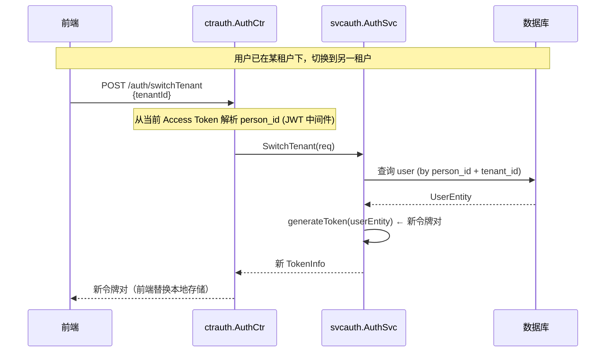

### 关键代码路径

| 步骤 | 代码位置 | 说明 |
|------|----------|------|
| identifier 识别 | `svcauth/auth.go:resolvePersonLogin` | 按 @/手机号/用户名分支查询 |
| 密码校验 | `svcauth/auth.go:authenticateResolvedPerson` | bcrypt 比对 |
| Person Token | `svcauth/auth.go:generatePersonToken` | `type=person` 的 JWT |
| 租户令牌 | `svcauth/auth.go:generateToken` | `type=access` + `type=refresh` |
| 令牌刷新 | `svcauth/auth.go:RefreshToken` | 校验 DB 存储 + 令牌轮换 |
| 登出黑名单 | `pkg/token/token.go` | Redis, 键前缀 `iam:token:blacklist:` |

### JWT 白名单（跳过鉴权的公共端点）

```
/v1/iam/auth/login          - 登录
/v1/iam/auth/register       - 注册
/v1/iam/auth/myTenants      - 我的租户（携带 PersonToken 或 query）
/v1/iam/auth/selectTenant   - 选择租户（携带 PersonToken）
/v1/iam/auth/refreshToken   - 刷新令牌（携带 RefreshToken）
/v1/iam/connector/callback  - 外部 IdP 回调
/oidc                - 整个 OIDC Provider 前缀
/v1/iam/org/getConfigsByDomain - 组织配置
```

### 数据流总结

```
Login:
  identifier → person (DB, username/email/phone 三路查询)
  password → bcrypt (DB password_encrypted)
  person_id → PersonToken JWT (type=person)

SelectTenant / SwitchTenant:
  personToken → person_id (JWT 解析)
  person_id + tenant_id → user (DB, uk_tenant_person)
  user_id + tenant_id → AccessToken JWT (type=access)
  refresh_token → DB 存 hash (type=refresh, 7d)

RefreshToken:
  refreshToken JWT → user_id + tenant_id (JWT 解析 + DB 比对)
  old refresh_token → DELETE (单次使用)
  new access_token + refresh_token → 签发

Logout:
  accessToken → Redis blacklist (key=iam:token:blacklist:{hash})
  refreshToken → Redis blacklist
```

### 错误路径

| 场景 | 错误码 | 说明 |
|------|--------|------|
| identifier 为空 | `AuthIdentifierRequiredError` | 未提供登录标识 |
| 用户不存在 | `UserNotExistError` | person 表未匹配 |
| 用户已挂起 | `UserSuspendedError` | person.is_suspended = 1 |
| 密码未设置 | `PasswordNotSetError` | 仅限外部账号 |
| 密码不匹配 | `PasswordMismatchError` | bcrypt 比对失败 |
| 租户不存在 | `TenantNotExistError` | selectTenant 时 tenant 无效 |
| RefreshToken 无效 | `RefreshTokenInvalidError` | JWT 解析失败 / DB 不存在 / 已撤销 / 已过期 |
| Token 在黑名单 | 401 | 登出后的请求被拒绝 |

---

## 二、注册与加入租户

### 自助注册

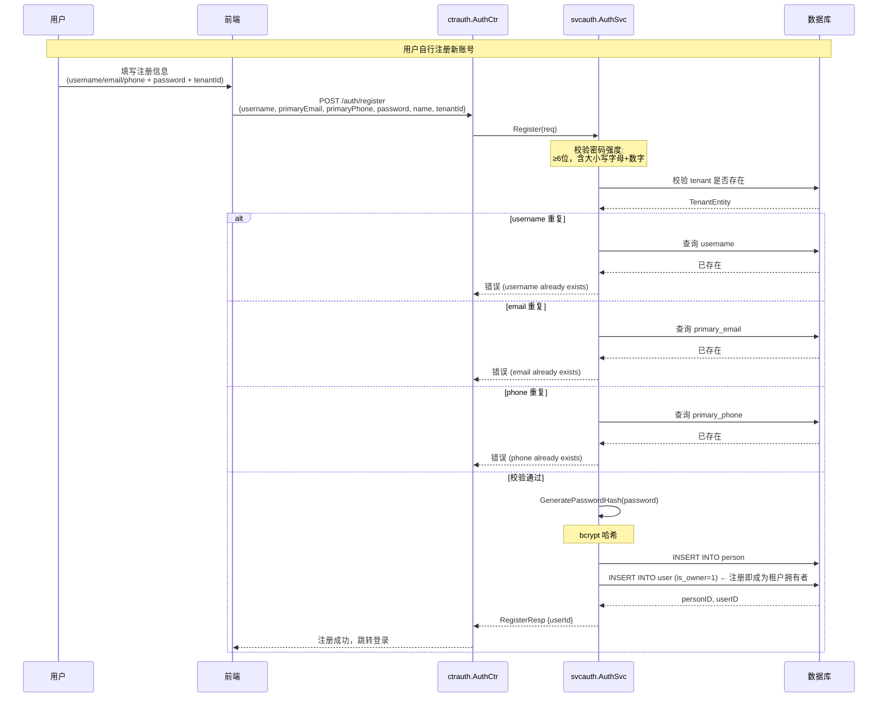

### 加入租户

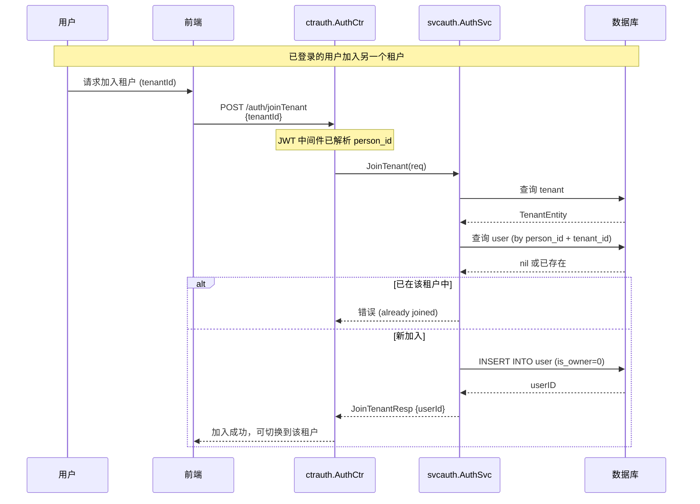

### 关键代码路径

| 步骤 | 代码位置 | 说明 |
|------|----------|------|
| 密码强度校验 | `svcauth/auth.go:validatePasswordStrength` | ≥6位 + 大小写 + 数字 |
| 注册事务 | `svcauth/auth.go:Register` | 插入 person + user |
| 加入租户 | `svcauth/auth.go:JoinTenant` | 插入 user (is_owner=0) |
| 唯一性校验 | `svcauth/auth.go:Register` | username/email/phone 三路唯一性约束 |

---

## 三、API Key 认证

### 角色定位

API Key 认证用于**机器对机器**场景（服务间调用、CI/CD、第三方集成），不涉及用户交互。

### 时序图

```mermaid
sequenceDiagram
    participant Client as 调用方 (服务/脚本)
    participant ApiKeyCtr as ctrapikey.ApiKeyCtr
    participant ApiKeySvc as svcapikey.ApiKeySvc
    participant ApiKeyMW as ApiKeyAuth 中间件
    participant DB as 数据库

    rect rgb(40, 60, 40)
        Note over Client,DB: Step 1: 创建 API Key
        Client->>ApiKeyCtr: POST /apiKey/create<br/>{name, expiredAt, scope}
        ApiKeyCtr->>ApiKeySvc: Create(req)
        ApiKeySvc->>ApiKeySvc: 生成 32 字节随机 hex (rawKey)
        ApiKeySvc->>ApiKeySvc: SHA256(rawKey) → keyHash
        ApiKeySvc->>DB: INSERT INTO api_key<br/>(key_hash, key_prefix, ...)
        DB-->>ApiKeySvc: id
        ApiKeySvc-->>ApiKeyCtr: {rawKey} ← 仅创建时返回一次!
        ApiKeyCtr-->>Client: 保存 rawKey（后续不再可查）
    end

    rect rgb(60, 40, 40)
        Note over Client,DB: Step 2: 携带 API Key 请求
        Client->>ApiKeyMW: GET /some/resource<br/>Authorization: Bearer {rawKey}
        ApiKeyMW->>ApiKeyMW: SHA256(rawKey) → keyHash
        ApiKeyMW->>DB: 查询 api_key (by key_hash)
        DB-->>ApiKeyMW: ApiKeyEntity
        Note over ApiKeyMW: 校验:<br/>1. revoked_at 为空<br/>2. expired_at > now<br/>3. key 存在
        ApiKeyMW->>DB: UPDATE last_used_at (异步 goroutine)
        ApiKeyMW->>ApiKeyMW: 设置 ctx tenant_id + user_id
        ApiKeyMW->>Client: 通过，继续业务逻辑
    end

    rect rgb(80, 20, 20)
        Note over Client,DB: 错误场景
        Client->>ApiKeyMW: Authorization: Bearer {invalidKey}
        ApiKeyMW->>ApiKeyMW: SHA256 → keyHash 查无记录
        ApiKeyMW-->>Client: 401 (invalid API key)

        Client->>ApiKeyMW: Authorization: Bearer {expiredKey}
        ApiKeyMW->>DB: 查到记录但 expired_at < now
        ApiKeyMW-->>Client: 401 (API key has expired)

        Client->>ApiKeyMW: Authorization: Bearer {revokedKey}
        ApiKeyMW->>DB: 查到记录但 revoked_at 不为空
        ApiKeyMW-->>Client: 401 (API key has been revoked)
    end
```

### 关键代码路径

| 步骤 | 代码位置 | 说明 |
|------|----------|------|
| 创建 API Key | `svcapikey/api_key.go` | 生成 32 字节随机 hex，存 SHA256 哈希 |
| 请求鉴权 | `middleware/apikey_auth.go` | Bearer 头 → SHA256 → 查 DB → 校验状态 |
| 撤销 | `svcapikey/api_key.go:Revoke` | 设置 revoked_at |
| 数据表 | `model/api_key.go` | key_hash, key_prefix, expired_at, revoked_at |

### 数据流总结

```
Create:
  rawKey = hex(random32)
  keyHash = SHA256(rawKey)           → DB (api_key.key_hash)
  keyPrefix = rawKey[:7]             → DB (api_key.key_prefix)
  rawKey 返回给创建者（仅一次）        → 创建者自行保存

Authenticate:
  Authorization: Bearer {rawKey}
  keyHash = SHA256(rawKey)           → 查询 DB api_key
  校验 revoked_at / expired_at       → 通过后设置 ctx 中的 tenant_id + user_id
```

---

## 四、Connector SSO 登录流程

### 角色定位

- **IAM Connector（RP）**：本系统作为 Relying Party，对接外部身份提供商（IdP）
- **外部 IdP**：Google（OIDC）、GitHub（OAuth2）、Microsoft Entra ID（OIDC）等
- **结果**：用户通过第三方账号登录 IAM，获得与密码登录相同的 Person Token

### OAuth2/OIDC 外部登录主流程

```mermaid
sequenceDiagram
    participant User as 用户
    participant Frontend as 前端
    participant ConnectorCtr as ctrauth.ConnectorCtr
    participant ConnectorSvc as svcauth.ConnectorSvc
    participant Driver as ConnectorDriver<br/>(OIDC / OAuth2)
    participant StateStore as ConnectorStateStore<br/>(Redis)
    participant IdP as 外部 IdP<br/>(Google/GitHub)
    participant IdentityMapper as identityMapper
    participant AuthSvc as svcauth.AuthSvc
    participant DB as 数据库

    rect rgb(20, 40, 80)
        Note over User,DB: Step 1: 发起授权（Authorize）
        User->>Frontend: 点击"使用 Google 登录"
        Frontend->>ConnectorCtr: POST /connector/:connectorId/authorize<br/>{redirectUri, state, loginHint}
        ConnectorCtr->>ConnectorSvc: Authorize(req, connectorId)
        ConnectorSvc->>DB: 查询 connector (by id + tenant)
        DB-->>ConnectorSvc: ConnectorEntity (含 protocol, config)
        Note over ConnectorSvc: 校验 status == enable
        ConnectorSvc->>Driver: BuildAuthorizationURL(input)
        Note over Driver: 根据 protocol 选择驱动:<br/>OIDCDriver / OAuth2Driver
        Driver->>StateStore: Store state + nonce + connectorId<br/>(Redis, TTL 10min)
        StateStore-->>Driver: ok
        Driver-->>ConnectorSvc: AuthorizeOutput {authorizationUrl}
        ConnectorSvc-->>ConnectorCtr: ConnectorAuthorizeResp
        ConnectorCtr-->>Frontend: {authorizationUrl}
        Frontend->>User: 302 Redirect 到外部 IdP
    end

    rect rgb(80, 40, 20)
        Note over User,DB: Step 2: 用户在外部门户授权
        User->>IdP: 登录 Google 账号<br/>同意授权
        IdP->>User: 302 Redirect<br/>到 /connector/callback?code=xxx&state=yyy
    end

    rect rgb(20, 60, 40)
        Note over User,DB: Step 3: 回调处理（Callback）
        User->>ConnectorCtr: GET /connector/callback<br/>?connectorId=7&code=xxx&state=yyy
        ConnectorCtr->>ConnectorSvc: Callback(req)
        ConnectorSvc->>StateStore: GetDel(state) ← 原子消费
        StateStore-->>ConnectorSvc: {initialConnectorId, nonce, ...}
        Note over ConnectorSvc: state 只允许消费一次<br/>防止重放攻击
        ConnectorSvc->>Driver: ExchangeCallback(input)
        Driver->>IdP: POST /token<br/>(exchange code for tokens)
        IdP-->>Driver: {id_token, access_token, userinfo}
        Note over Driver: OIDC: 验证 id_token 签名 + nonce<br/>OAuth2: 解析 userinfo 响应
        Driver-->>ConnectorSvc: CallbackOutput {iss, sub, profile, ...}
    end

    rect rgb(40, 60, 40)
        Note over User,DB: Step 4: 身份解析
        ConnectorSvc->>IdentityMapper: Resolve(ctx, input)
        IdentityMapper->>DB: 查询 user_identity<br/>(by issuer + external_subject)
        DB-->>IdentityMapper: UserIdentityEntity (或 nil)

        alt 已有身份关联 (已存在)
            IdentityMapper->>DB: 更新 last_used_at
            DB-->>IdentityMapper: ok
            IdentityMapper-->>ConnectorSvc: Person{id}

        else 无关联 + allowAutoCreate
            Note over IdentityMapper: 事务开始
            IdentityMapper->>DB: 创建 Person (username, email, name)
            DB-->>IdentityMapper: personID
            IdentityMapper->>DB: 创建 User (tenant 内)
            DB-->>IdentityMapper: userID
            IdentityMapper->>DB: 创建 UserIdentity<br/>(person_id, connector_id, iss, sub)
            DB-->>IdentityMapper: ok
            Note over IdentityMapper: 事务结束
            IdentityMapper-->>ConnectorSvc: Person{id}

        else 无关联 + allowAccountLink
            Note over IdentityMapper: 需要前端交互
            IdentityMapper-->>ConnectorSvc: 需要用户选择绑定方式
            Note over IdentityMapper: 进入账号关联流程
        end
    end

    rect rgb(60, 40, 60)
        Note over User,DB: Step 5: 登录完成（签发 JWT）
        ConnectorSvc->>AuthSvc: generatePersonToken(personID)
        AuthSvc->>DB: 查询 person + user + tenant
        DB-->>AuthSvc: 用户信息
        AuthSvc-->>ConnectorSvc: PersonToken (JWT) ← 与密码登录相同
        ConnectorSvc->>ConnectorSvc: 记录 login_log
        ConnectorSvc-->>ConnectorCtr: LoginResp {token, tenantList, ...}
        ConnectorCtr-->>User: 登录成功，前端跳转
    end
```

### 身份解析子流程

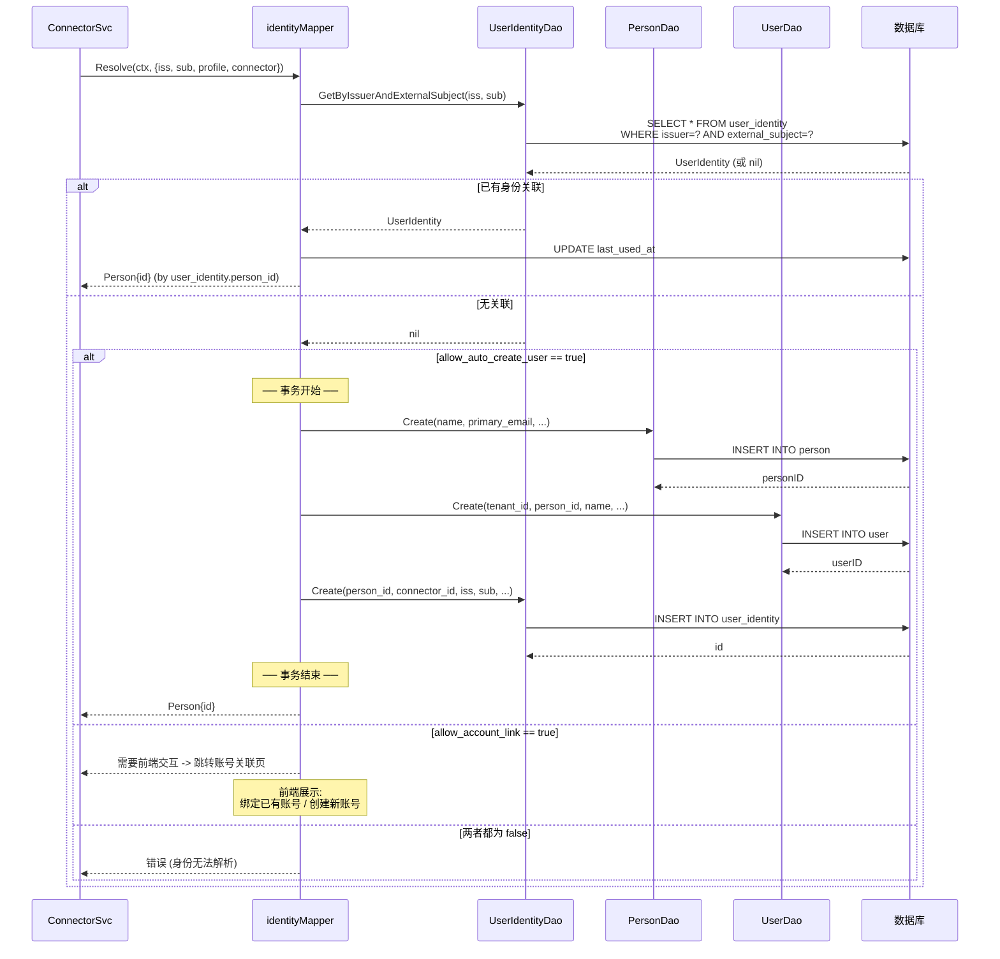

### 错误路径

```mermaid
sequenceDiagram
    participant User as 用户
    participant ConnectorSvc as ConnectorSvc
    participant StateStore as StateStore (Redis)
    participant IdP as 外部 IdP

    rect rgb(80, 20, 20)
        Note over User,IdP: 错误 1: 连接器不存在 / 已禁用
        User->>ConnectorSvc: POST /connector/:id/authorize
        ConnectorSvc->>DB: 查询 connector
        DB-->>ConnectorSvc: 未找到 / status != enable
        ConnectorSvc-->>User: 101005 (connector not exist)
    end

    rect rgb(50, 30, 20)
        Note over User,IdP: 错误 2: OAuth state 无效 / 已消费 / 过期
        User->>ConnectorSvc: GET /connector/callback?state=xxx
        ConnectorSvc->>StateStore: GetDel(state)
        StateStore-->>ConnectorSvc: nil (已消费/TTL 过期)
        ConnectorSvc-->>User: 错误 (invalid state)
    end

    rect rgb(40, 30, 40)
        Note over User,IdP: 错误 3: 外部 IdP 返回错误 / 用户拒绝授权
        IdP->>User: 302 Redirect /callback?error=access_denied
        User->>ConnectorSvc: GET /connector/callback?error=access_denied
        ConnectorSvc-->>User: 错误 (用户拒绝授权)
    end

    rect rgb(60, 30, 30)
        Note over User,IdP: 错误 4: Token 交换失败
        ConnectorSvc->>IdP: POST /token (exchange code)
        IdP-->>ConnectorSvc: 400 (code expired / wrong)
        ConnectorSvc-->>User: 错误 (IdP 配置错误或已过期)
    end

    rect rgb(70, 20, 30)
        Note over User,IdP: 错误 5: 身份解析失败（无匹配 + 不允许自动创建）
        IdentityMapper-->>ConnectorSvc: 无法解析身份
        ConnectorSvc-->>User: 错误 (无法关联账号)
    end

    rect rgb(40, 20, 50)
        Note over User,IdP: 错误 6: 域策略拒绝
        ConnectorSvc->>ConnectorSvc: domain_policy 校验
        Note over ConnectorSvc: 检查用户的 email 域名<br/>是否在白名单/黑名单内
        ConnectorSvc-->>User: 错误 (domain not allowed)
    end
```

### 关键代码路径

| 步骤 | 代码位置 | 说明 |
|------|----------|------|
| 构建授权 URL | `svcauth/connector_driver_oidc.go` | OIDCDriver: 基于 discovery + client config 构建 |
| 存储 state | `svcauth/connector_state_store.go` | Redis 实现，TTL 10 分钟 |
| 回调处理 | `svcauth/connector.go:Callback` | 原子消费 state，驱动交换 token |
| 身份解析 | `svcauth/connector_identity.go:Resolve` | 三种路径：已有绑定 / 自动创建 / 账号关联 |
| 签发 JWT | `svcauth/auth.go:generatePersonToken` | 复用密码登录的同套 JWT 逻辑 |
| 驱动注册表 | `svcauth/connector_driver.go` | 根据 protocol 字段选择 OIDC/OAuth2 驱动 |

### 数据流总结

```
Authorize:
  connectorId → connector (DB, 含 config + protocol)
  state + nonce → Redis (TTL 600s, GetDel 原子消费)

Callback:
  state → Redis GetDel → initialConnectorId + nonce
  code → IdP /token → {id_token, userinfo, access_token}
  iss + sub → user_identity (DB, uk_issuer_subject)
  person → user (DB, uk_tenant_person)

Resolver:
  existing → UPDATE last_used_at
  auto-create → INSERT person + user + user_identity (事务)
  account-link → 前端交互（待定）

Result:
  PersonToken (JWT) = LoginResp（与密码登录完全一致）
```

### Connector 预置工厂

| Factory | 协议 | 默认行为 | 备注 |
|---------|------|----------|------|
| `oidc-google` | OIDC | Authorize + Callback + ClaimMapping + DomainPolicy | 使用 `coreos/go-oidc/v3` |
| `oauth2-github` | OAuth2 | Authorize + Callback + ProfileSync | 带 GitHub 身份规范化 |
| `oidc-microsoft-entra` | OIDC | Authorize + Callback + ClaimMapping + DomainPolicy | Microsoft 目录身份 |

---

## 五、OIDC Provider 登录流程

### 角色定位

- **IAM OIDC Provider（OP）**：本系统作为身份提供商，对外提供标准 OIDC 认证服务
- **Relying Party（RP）**：第三方业务应用，通过 OIDC 协议接入 IAM，使用 IAM 账号体系认证用户

### Authorization Code Flow + PKCE

```mermaid
sequenceDiagram
    participant User as 用户
    participant RP as 外部应用 (RP)
    participant IAM_OP as IAM OIDC Provider<br/>(/oidc)
    participant Frontend as 前端登录页<br/>(frontendLoginURL)
    participant AuthSvc as svcauth.AuthSvc
    participant Storage as OIDCStorage<br/>(内存 + DB)
    participant DB as 数据库

    rect rgb(20, 40, 80)
        Note over User,DB: Step 1: 用户请求授权（浏览器重定向流）
        User->>RP: 点击"使用 IAM 登录"
        RP->>RP: 生成 state + nonce<br/>(可选: code_challenge + code_challenge_method)
        RP->>IAM_OP: GET /authorize<br/>?client_id=xxx<br/>&redirect_uri=yyy<br/>&response_type=code<br/>&scope=openid+profile<br/>&state=xyz<br/>&nonce=abc<br/>&code_challenge=...<br/>&code_challenge_method=S256
        IAM_OP->>Storage: CreateAuthRequest()
        Storage->>Storage: 生成 authRequestID (ar-{timestamp})
        Storage->>DB: 验证 client_id
        DB-->>Storage: oauth_client 记录
        Storage-->>IAM_OP: AuthRequest 对象
        Note over IAM_OP: 校验 redirect_uri 白名单<br/>校验 scope 合法性
        IAM_OP->>RP: 302 Redirect<br/>Location: {frontendLoginURL}?authRequestID=ar-xxx
        RP->>User: 302 重定向到前端登录页
    end

    rect rgb(20, 60, 40)
        Note over User,DB: Step 2: 用户提交凭据
        User->>Frontend: 输入用户名 + 密码
        Frontend->>IAM_OP: POST /oidc/login<br/>{authRequestID, identifier, password}
        IAM_OP->>AuthSvc: AuthenticatePassword(identifier, password)
        AuthSvc->>DB: 查询 person 表<br/>bcrypt 比对密码
        DB-->>AuthSvc: person 记录
        AuthSvc-->>IAM_OP: Person 对象
        Note over IAM_OP: 校验 is_suspended
        IAM_OP->>Storage: CompleteAuthRequest(authRequestID, personID)
        Storage-->>IAM_OP: Done
        IAM_OP-->>Frontend: {continueURL: "/oidc/authorize/callback?id=ar-xxx"}
        Frontend->>User: window.location.href = continueURL
    end

    rect rgb(40, 20, 60)
        Note over User,DB: Step 3: 授权码颁发
        User->>IAM_OP: GET /authorize/callback?id=ar-xxx
        IAM_OP->>Storage: AuthRequest.Done() == true
        Storage-->>IAM_OP: DoneFlag = true, Subject = person:{id}
        IAM_OP->>IAM_OP: 生成授权码 (authorization code)
        IAM_OP->>Storage: 存储 code → AuthRequest 映射
        IAM_OP->>User: 302 Redirect<br/>{redirect_uri}?code=xxx&state=yyy
    end

    rect rgb(60, 40, 40)
        Note over User,DB: Step 4: code 换 token（RP 服务端调用）
        RP->>IAM_OP: POST /oauth/token<br/>grant_type=authorization_code<br/>&code=xxx<br/>&redirect_uri=yyy<br/>&client_id=xxx<br/>&client_secret=yyy<br/>&code_verifier=...
        IAM_OP->>DB: 验证 client_id + client_secret<br/>(SHA256 比对)
        DB-->>IAM_OP: oauth_client + oauth_client_secret
        IAM_OP->>Storage: 验证授权码 + PKCE<br/>AuthRequestById(code)
        Storage-->>IAM_OP: AuthRequest (含 code_challenge)
        Note over IAM_OP: PKCE 校验:<br/>SHA256(code_verifier) == code_challenge
        IAM_OP->>Storage: CreateAccessAndRefreshTokens()
        Storage->>DB: 持久化 refresh_token
        DB-->>Storage: ok
        Storage-->>IAM_OP: access_token, refresh_token, id_token
        IAM_OP-->>RP: {access_token, refresh_token, id_token, token_type, expires_in}
    end

    rect rgb(30, 30, 50)
        Note over User,DB: Step 5: 携带 token 访问资源
        RP->>IAM_OP: GET /userinfo<br/>Authorization: Bearer {access_token}
        IAM_OP->>IAM_OP: 解析 access_token (JWT)
        IAM_OP->>DB: 查询 person (by subject)
        DB-->>IAM_OP: person 信息
        IAM_OP-->>RP: {sub, name, email, ...}
        RP->>User: 登录成功，展示内容
    end
```

### Refresh Token 子流程

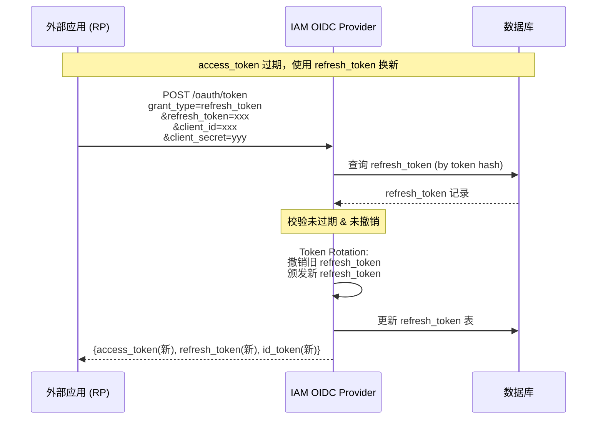

### 错误路径

```mermaid
sequenceDiagram
    participant RP as 外部应用 (RP)
    participant IAM_OP as IAM OIDC Provider
    participant Storage as OIDCStorage
    participant DB as 数据库

    rect rgb(80, 20, 20)
        Note over RP,DB: 错误 1: 无效的 client_id / redirect_uri
        RP->>IAM_OP: GET /authorize<br/>?client_id=invalid&redirect_uri=https://evil.com
        IAM_OP->>DB: 查询 client_id
        DB-->>IAM_OP: 未找到
        IAM_OP-->>RP: 400 / 重定向到错误页
    end

    rect rgb(50, 30, 20)
        Note over RP,DB: 错误 2: AuthRequest 过期 / 丢失
        IAM_OP->>Storage: AuthRequestById(non-existent-id)
        Storage-->>IAM_OP: 未找到 (内存丢失或已过期)
        RP->>IAM_OP: POST /oidc/login<br/>{authRequestID: "invalid"}
        IAM_OP-->>RP: 100799 (OIDC session not found)
    end

    rect rgb(40, 30, 40)
        Note over RP,DB: 错误 3: 授权码无效或已使用
        RP->>IAM_OP: POST /oauth/token<br/>grant_type=authorization_code&code=used-code
        IAM_OP->>Storage: 消费 code
        Storage-->>IAM_OP: 已消费 / 不存在
        IAM_OP-->>RP: 400 (invalid_grant)
    end

    rect rgb(60, 30, 30)
        Note over RP,DB: 错误 4: PKCE code_verifier 校验失败
        RP->>IAM_OP: POST /oauth/token<br/>grant_type=authorization_code&code=xxx&code_verifier=wrong
        IAM_OP->>IAM_OP: SHA256(code_verifier) != code_challenge
        IAM_OP-->>RP: 400 (invalid_grant)
    end

    rect rgb(70, 20, 30)
        Note over RP,DB: 错误 5: 用户名密码错误
        RP->>IAM_OP: POST /oidc/login<br/>{identifier, password: "wrong"}
        IAM_OP->>AuthSvc: AuthenticatePassword()
        AuthSvc-->>IAM_OP: bcrypt 比对失败
        IAM_OP-->>RP: 错误码 (密码错误)
    end

    rect rgb(40, 20, 50)
        Note over RP,DB: 错误 6: refresh_token 已撤销 / 过期
        RP->>IAM_OP: POST /oauth/token<br/>grant_type=refresh_token&refresh_token=revoked
        IAM_OP->>DB: 查询 refresh_token
        DB-->>IAM_OP: revoked_at 不为空 / expired_at < now
        IAM_OP-->>RP: 400 (invalid_grant)
    end

    rect rgb(50, 40, 20)
        Note over RP,DB: 错误 7: client_secret 校验失败
        RP->>IAM_OP: POST /oauth/token (with client_secret)
        IAM_OP->>DB: SHA256(secret) 比对 oauth_client_secret.value_hash
        DB-->>IAM_OP: 不匹配
        IAM_OP-->>RP: 401 (invalid_client)
    end
```

### 关键代码路径

| 步骤 | 代码位置 | 说明 |
|------|----------|------|
| 创建 AuthRequest | `svcoidc/storage.go` | 生成 `ar-{timestamp}` 格式 ID |
| 密码认证 | `svcauth/auth.go:AuthenticatePassword` | 复用密码登录逻辑 |
| CompleteAuth | `svcoidc/storage.go:CompleteAuthRequest` | 设置 subject + authTime + amr |
| Token 端点 | `svcoidc/storage.go:CreateAccessAndRefreshTokens` | 生成 JWT + 持久化 refresh_token |
| PKCE 校验 | zitadel/oidc 库内处理 | 验证 code_challenge + code_verifier |
| Refresh Token Rotation | `svcoidc/storage.go:CreateAccessAndRefreshTokens` | Token 轮换策略 |

### 数据流总结

```
Authorize + password grant:
  client_id → oauth_client (DB 验证)
  identifier + password → person (DB 验证)
  authRequestID → OIDCStorage (内存)
  code → OIDCStorage (内存)

Token exchange:
  authorization_code → code map (内存) → AuthRequest
  client_secret → oauth_client_secret.value_hash (DB, SHA256)
  refresh_token → refresh_token (DB, hash + 持久化)
  access_token → JWT 格式 (不持久化)
```
