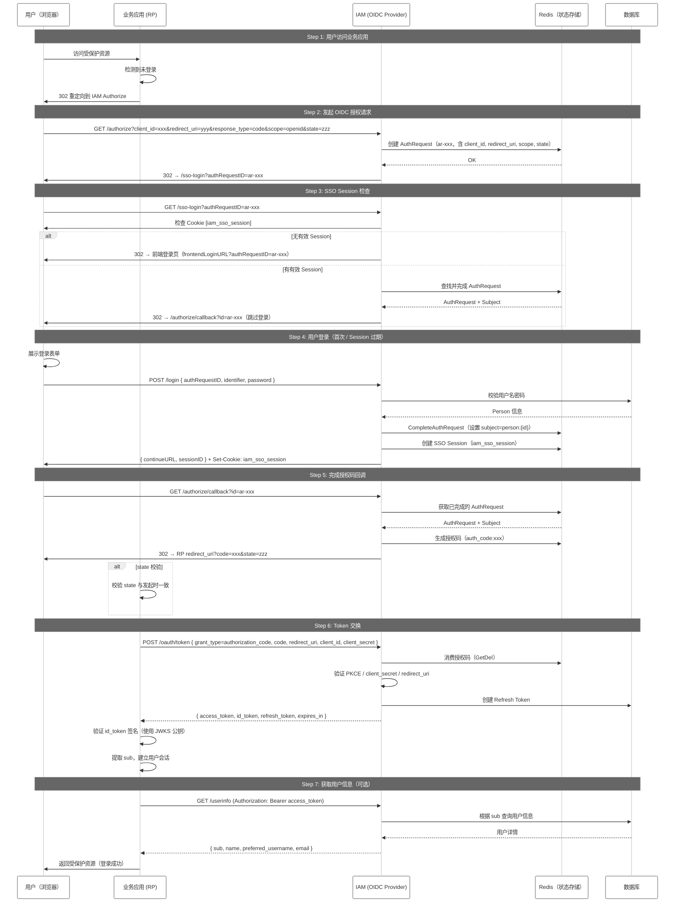
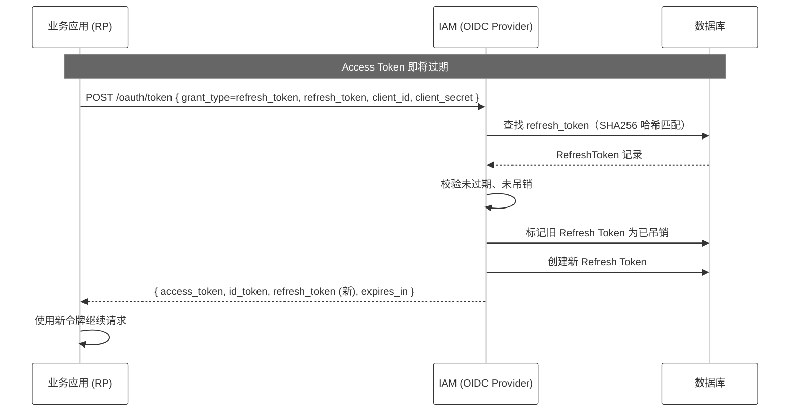
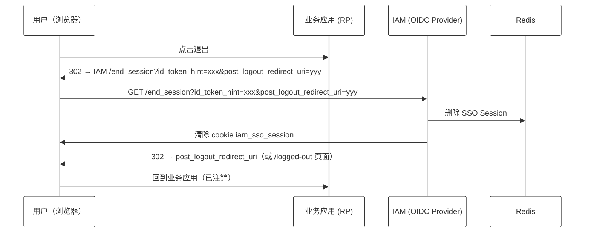

# OIDC SSO 集成指南

## 1. 什么是 SSO 登录

SSO（Single Sign-On，单点登录）允许用户 **一次认证，多处访问**。用户在身份提供者（IdP）登录一次后，即可无缝访问多个互信的业务系统（RP，Relying Party），无需重复输入密码。

**生活中的类比**：进入一个园区时，在门卫处出示一次证件（认证），之后园区内所有办公楼都可以自由出入，无需每栋楼都重新出示证件。

**关键角色：**
- **IdP (Identity Provider)**：身份提供者，负责认证用户。本系统中的 IAM 即充当 IdP。
- **RP (Relying Party)**：依赖方，即接入 SSO 的业务应用。RP 信任 IdP 的认证结果，不再自行管理密码。

---

## 2. 什么是 OIDC

OIDC（OpenID Connect）是构建在 OAuth 2.0 之上的身份认证协议。OAuth 2.0 解决"授权"问题（允许应用访问资源），OIDC 在其基础上解决"认证"问题（确认用户是谁）。

### 2.1 OAuth 2.0 与 OIDC 的关系

| | OAuth 2.0 | OIDC |
|---|---|---|
| 核心问题 | "App 可以访问我的什么数据？" | "你是谁？" |
| 输出产物 | Access Token | Access Token + **ID Token** |
| Token 格式 | 不透明 / JWT | JWT（ID Token 必须是 JWT） |
| 用户信息接口 | 无标准 | `/userinfo` 端点标准化 |

### 2.2 OIDC 核心概念

- **ID Token**：JWT 格式，包含用户身份信息。由 IdP 签名，RP 可验证其真实性。关键字段：`iss`（签发者）、`sub`（用户唯一标识）、`aud`（接收方）、`exp`（过期时间）。
- **Access Token**：调用 RP 自身 API 或资源服务器 API 的凭证。
- **Refresh Token**：用于在 Access Token 过期后静默换取新的 Access Token，实现长期会话。
- **Authorization Code Flow**：最常见的 OIDC 流程，适用于有后端的 Web 应用。
- **Discovery URL**：OIDC 的标准元数据端点，RP 可从此获取 IdP 的所有端点地址。

### 2.3 Authorization Code Flow 概要

```
User (浏览器)          RP (业务应用)            IdP (IAM)
    │                      │                      │
    │  访问业务资源          │                      │
    │─────────────────────>│                      │
    │                      │                      │
    │  重定向到 Authorize   │                      │
    │<─────────────────────│                      │
    │                      │                      │
    │─────────────────────────────────────────────>│  认证用户身份
    │                                              │
    │<─────────────────────────────────────────────│  返回授权码 (code)
    │                      │                      │
    │  提交授权码            │                      │
    │─────────────────────>│                      │
    │                      │  用 code 换 token     │
    │                      │─────────────────────>│
    │                      │<─────────────────────│  返回 id_token + access_token
    │                      │                      │
    │  返回业务资源          │                      │
    │<─────────────────────│                      │
```

---

## 3. IAM OIDC Provider 接口说明

### 3.1 OIDC 端点一览

| 端点 | 方法 | 说明 | 是否需要认证 |
|------|------|------|------------|
| `/.well-known/openid-configuration` | GET | OIDC Discovery 文档，**接入起点** | 否 |
| `/.well-known/jwks.json` | GET | 公钥列表，用于验证 ID Token 签名 | 否 |
| `/authorize` | GET/POST | 授权请求入口，**触发用户认证流程** | 否 |
| `/authorize/callback` | GET | 授权码回调，完成认证后获取 code | 否 |
| `/oauth/token` | POST | 用 code 换取 token | Client Secret |
| `/userinfo` | GET/POST | 获取已认证用户的信息 | Access Token |
| `/end_session` | GET/POST | 注销会话 | 否 |
| `/revoke` | POST | 吊销 token | Client Secret |
| `/sso-login` | GET | SSO Session 自动登录检查 | Cookie |
| `/login` | POST | 用户提交用户名密码（前端调用） | 否 |
| `/logged-out` | GET | 登出成功提示页 | 否 |

### 3.2 核心端点详情

#### POST `/v1/iam/oidc/login`（用户认证）

前端登录页面调用的接口，用户提交用户名密码后获得 `continueURL`，浏览器跳转此 URL 完成授权码颁发。

**请求：**
```json
{
    "authRequestID": "ar-1741234567890123000",
    "identifier": "user@example.com",
    "password": "YourPassword123"
}
```

**成功响应：**
```json
{
    "code": 0,
    "msg": "success",
    "data": {
        "continueURL": "http://iam.example.com/v1/iam/oidc/authorize/callback?id=ar-1741234567890123000"
    }
}
```

- `identifier` 支持：邮箱、用户名、手机号
- `continueURL` 由后端生成，前端收到后应立即跳转
- 成功后后端同时设置 `iam_sso_session` Cookie，后续同一浏览器访问时自动登录

#### GET `/v1/iam/oidc/sso-login`（SSO 自动登录检查）

当用户已有 SSO Session 时，此端点自动完成认证，用户无需再次输入密码。

- 有有效 `iam_sso_session` Cookie → 自动认证 → 302 到 continueURL
- 无 Cookie → 302 到前端登录页（`frontendLoginURL?authRequestID=xxx`）

#### POST `/v1/iam/oidc/oauth/token`（令牌交换）

**请求（application/x-www-form-urlencoded）：**

| 参数 | 必填 | 说明 |
|------|------|------|
| `grant_type` | 是 | `authorization_code` / `refresh_token` / `client_credentials` |
| `code` | 授权码时 | 上一步获取的 code |
| `redirect_uri` | 授权码时 | 必须与注册时一致 |
| `client_id` | 是 | 注册时获得的 Client ID |
| `client_secret` | 部分 | 取决于 token_endpoint_auth_method |
| `refresh_token` | 刷新时 | 前一次颁发的 refresh_token |

**成功响应：**
```json
{
    "access_token": "eyJhbGciOiJSUzI1NiIsImtpZCI6ImRldi1vaWRjLWtleSJ9...",
    "token_type": "Bearer",
    "expires_in": 3600,
    "id_token": "eyJhbGciOiJSUzI1NiIsImtpZCI6ImRldi1vaWRjLWtleSJ9...",
    "refresh_token": "rt-xxx"
}
```

#### GET `/v1/iam/oidc/userinfo`（用户信息）

**请求头：** `Authorization: Bearer {access_token}`

**响应：**
```json
{
    "sub": "person:42",
    "name": "张三",
    "preferred_username": "zhangsan",
    "email": "zhangsan@example.com",
    "email_verified": true
}
```

#### GET `/.well-known/openid-configuration`（Discovery）

IAM 支持 OIDC Discovery，RP 可从此端点自动获取所有协议端点地址，无需硬编码。

**响应片段：**
```json
{
    "issuer": "http://localhost:8099/v1/iam/oidc",
    "authorization_endpoint": "http://localhost:8099/v1/iam/oidc/authorize",
    "token_endpoint": "http://localhost:8099/v1/iam/oidc/oauth/token",
    "userinfo_endpoint": "http://localhost:8099/v1/iam/oidc/userinfo",
    "jwks_uri": "http://localhost:8099/v1/iam/oidc/.well-known/jwks.json",
    "end_session_endpoint": "http://localhost:8099/v1/iam/oidc/end_session",
    "response_types_supported": ["code"],
    "grant_types_supported": ["authorization_code", "refresh_token", "client_credentials"],
    "subject_types_supported": ["public"],
    "id_token_signing_alg_values_supported": ["RS256"]
}
```

---

### 3.3 完整授权码流程时序图



### 3.4 Refresh Token 流程



### 3.5 登出流程



---

## 4. 接入 IAM 方案

### 4.1 前置条件

在开始接入前，需要先向 IAM 管理员注册你的业务应用：

1. 管理员在 IAM 管理后台创建 OAuth Client 记录
2. 获取以下信息：
   - **Client ID**：应用的唯一标识
   - **Client Secret**：应用的密钥，用于 Token 端点认证
   - **Issuer**：IAM OIDC Provider 地址，如 `https://iam.example.com/v1/iam/oidc`

### 4.2 注册 OAuth Client 时的配置项

| 配置项 | 说明 | 示例值 |
|--------|------|--------|
| `redirect_uris` | 登录成功后允许重定向的 URL 白名单 | `["https://app.example.com/callback"]` |
| `grant_types` | 允许的授权类型 | `["authorization_code", "refresh_token"]` |
| `response_types` | 允许的响应类型 | `["code"]` |
| `token_endpoint_auth_method` | Token 端点认证方式 | `client_secret_basic` / `client_secret_post` |
| `require_pkce` | 是否强制 PKCE（SPA 建议开启） | `false` |
| `default_scopes` | 默认申请的范围 | `["openid", "profile", "email"]` |
| `access_token_ttl` | Access Token 有效期（秒） | `3600` |
| `refresh_token_ttl` | Refresh Token 有效期（秒） | `2592000`（30天） |

### 4.3 SP 应用接入步骤

#### Step 1: 发现端点配置

通过 Discovery URL 动态获取所有 OIDC 端点地址：

```
GET https://iam.example.com/v1/iam/oidc/.well-known/openid-configuration
```

大多数 OIDC 客户端库支持直接传入 Discovery URL 自动配置。

#### Step 2: 构造 Authorize URL

将用户重定向到 IAM 的 authorize 端点：

```
GET https://iam.example.com/v1/iam/oidc/authorize
  ?client_id=your-client-id
  &redirect_uri=https://app.example.com/callback
  &response_type=code
  &scope=openid+profile+email
  &state=random-state-string
  &nonce=random-nonce-string
```

**参数说明：**
- `client_id`：注册时获取的 Client ID
- `redirect_uri`：登录成功后的回调地址（必须在白名单中）
- `response_type`：固定为 `code`
- `scope`：至少包含 `openid`
- `state`：防止 CSRF 攻击，回调时会原样返回
- `nonce`：防止重放攻击，ID Token 中会包含

#### Step 3: 处理回调

用户在 IAM 完成认证后，浏览器被重定向到你的 `redirect_uri`：

```
GET https://app.example.com/callback?code=xxxxx&state=random-state-string
```

**关键校验：**
- `state` 必须与 Step 2 发起时的一致
- 验证后即可使用 `code` 换取 Token

#### Step 4: 用 Code 换取 Token

后端发起 POST 请求：

```bash
curl -X POST https://iam.example.com/v1/iam/oidc/oauth/token \
  -H 'Content-Type: application/x-www-form-urlencoded' \
  -d 'grant_type=authorization_code' \
  -d 'code=xxxxx' \
  -d 'redirect_uri=https://app.example.com/callback' \
  -d 'client_id=your-client-id' \
  -d 'client_secret=your-client-secret'
```

**成功响应包含：**
- `access_token`：调用资源服务器的凭证
- `id_token`：JWT 格式的用户身份信息
- `refresh_token`：用于续期
- `expires_in`：Access Token 有效期（秒）

#### Step 5: 验证 ID Token

验证 ID Token 的签名和声明（建议使用 OIDC 客户端库自动验证）：

```
1. 从 JWKS 端点获取公钥：GET /.well-known/jwks.json
2. 验证 RSA 签名（RS256）
3. 验证 iss（必须等于 Issuer）
4. 验证 aud（必须等于你的 Client ID）
5. 验证 exp（未过期）
6. 验证 nonce（与发起时一致）
```

#### Step 6: 获取用户信息（可选）

```bash
curl -H 'Authorization: Bearer {access_token}' \
  https://iam.example.com/v1/iam/oidc/userinfo
```

#### Step 7: 建立本地会话

验证 ID Token 通过后，从 `sub` 字段（格式 `person:{id}`）获取用户唯一标识，在本地建立用户会话（如 session cookie），后续请求不再需要经过 IAM。

### 4.4 Token 续期

当 Access Token 过期时，使用 Refresh Token 静默替换：

```bash
curl -X POST https://iam.example.com/v1/iam/oidc/oauth/token \
  -H 'Content-Type: application/x-www-form-urlencoded' \
  -d 'grant_type=refresh_token' \
  -d 'refresh_token=your-refresh-token' \
  -d 'client_id=your-client-id' \
  -d 'client_secret=your-client-secret'
```

**注意：** Refresh Token 默认单次使用，每次刷新会颁发新的 Refresh Token，旧 Refresh Token 立即失效。

### 4.5 登出

业务应用退出时，应将用户重定向到 IAM 的 end_session 端点：

```
GET https://iam.example.com/v1/iam/oidc/end_session
  ?id_token_hint=xxxx
  &post_logout_redirect_uri=https://app.example.com/logged-out
```

IAM 将清除 SSO Session，用户再次访问其他业务应用时需重新登录。

### 4.6 安全建议

| 场景 | 建议 |
|------|------|
| Web 应用（有后端） | 使用 Authorization Code Flow + Client Secret |
| SPA 单页应用 | 使用 Authorization Code Flow + PKCE（不需要 client_secret，推荐 `token_endpoint_auth_method=none`） |
| 移动 App | 使用 Authorization Code Flow + PKCE |
| 服务间调用 | 使用 Client Credentials Grant（无需用户交互） |
| ID Token 存储 | 后端验证后将 sub 映射为内部用户，不将 ID Token 暴露给前端 |
| state 参数 | 每次授权请求生成唯一随机值，在回调中严格校验 |

### 4.7 常见集成场景

#### 场景 1：使用标准 OIDC 客户端库

```javascript
// 前端示例（使用 oidc-client-ts）
import { UserManager } from 'oidc-client-ts';

const userManager = new UserManager({
  authority: 'https://iam.example.com/v1/iam/oidc',
  client_id: 'your-client-id',
  redirect_uri: 'https://app.example.com/callback',
  scope: 'openid profile email',
});

// 发起登录
userManager.signinRedirect();

// 处理回调
userManager.signinRedirectCallback().then(user => {
  console.log('登录成功', user.profile.sub);
});
```

```go
// Go 后端示例（使用 coreos/go-oidc）
import "github.com/coreos/go-oidc/v3/oidc"

provider, _ := oidc.NewProvider(ctx, "https://iam.example.com/v1/iam/oidc")
verifier := provider.Verifier(&oidc.Config{ClientID: "your-client-id"})

// 验证 id_token
idToken, err := verifier.Verify(ctx, idTokenString)
if err != nil {
    // 验证失败
}
var claims struct { Sub string `json:"sub"` }
idToken.Claims(&claims)
// claims.Sub = "person:42"
```

#### 场景 2：手动接入（无客户端库）

1. 构造 Authorize URL，重定向用户
2. 接收回调 → 提取 `code` 和 `state`
3. `POST /oauth/token` 换取令牌
4. 解析 JWT 格式的 ID Token → 用 JWKS 公钥验证签名
5. 读取 `sub` 字段建立本地会话

---

## 5. 附录

### A. ID Token 结构说明

```json
{
    "iss": "https://iam.example.com/v1/iam/oidc",
    "sub": "person:42",
    "aud": ["your-client-id"],
    "exp": 1718000000,
    "iat": 1717996400,
    "auth_time": 1717996400,
    "nonce": "random-nonce",
    "amr": ["pwd"]
}
```

| 字段 | 说明 |
|------|------|
| `iss` | Issuer，固定为 OIDC 配置的 issuer |
| `sub` | 用户唯一标识，格式 `person:{id}` |
| `aud` | Audience，为你的 Client ID |
| `exp` | 过期时间戳 |
| `iat` | 签发时间戳 |
| `auth_time` | 用户认证时间戳 |
| `nonce` | 发起 authorize 时传入的 nonce |
| `amr` | 认证方法引用，`pwd` 表示密码认证 |

### B. 错误码参考

| 错误码 | 说明 |
|--------|------|
| 100790 | OIDC 无效请求 |
| 100791 | 未授权的 Client |
| 100792 | 访问被拒绝 |
| 100793 | 不支持的 Response Type |
| 100794 | 无效的 Scope |
| 100795 | 无效的 Grant（如 code 已使用或过期） |
| 100796 | 无效的 Client |
| 100797 | 服务器内部错误 |
| 100799 | OIDC Session 未找到（authRequestID 无效或已过期） |
